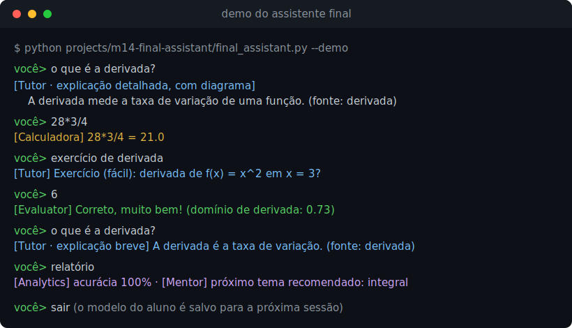
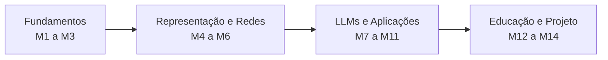

<div align="center">

# AI for Educational Assistants

**Aprenda, do zero ao avançado, a construir assistentes educacionais inteligentes.**

De tokenização e regressão a Transformers, LLMs, RAG e sistemas multi-agentes, com cada peça
implementada do zero em Python e reunida, no final, em um assistente educacional completo.




[Trilha](roadmap.md) · [Como estudar](docs/como-estudar.md) · [Instalação](docs/setup.md) · [Projetos](projects/) · [Projeto final](projects/m14-final-assistant/)

</div>

---

Material aberto e gratuito que percorre desde os fundamentos de Inteligência Artificial e
Processamento de Linguagem Natural até Large Language Models, Retrieval-Augmented Generation,
sistemas de agentes, Learning Analytics e modelagem de longo prazo do aluno. Ele serve ao mesmo
tempo como material de estudo, apoio à graduação, à iniciação científica e ao mestrado, como
portfólio profissional e como base para pesquisa em IA aplicada à educação.

## O que você vai construir

Cada módulo constrói uma peça, e todas se encontram no projeto final, o
[assistente educacional multi-agente](projects/m14-final-assistant/). Ao terminar, você terá um
assistente que conversa com o aluno, busca a explicação no material e cita a fonte com RAG, resolve
contas com uma ferramenta segura, propõe e corrige exercícios, acompanha o desempenho com Learning
Analytics e adapta a profundidade da explicação ao domínio de cada aluno, lembrando dele entre
sessões. E você vai entender cada peça por dentro, sem caixas-pretas.

O que torna este material diferente:

- **Do zero primeiro.** Cada algoritmo é implementado à mão, em Python puro ou numpy, antes de
  mostrar a biblioteca pronta. Você vê como a coisa funciona, não só como chamá-la.
- **Roda sem fricção.** Os exemplos e os projetos centrais rodam só com a biblioteca padrão. O
  caminho com Ollama, embeddings densos e bancos vetoriais é opcional e degrada com elegância.
- **Referências de verdade.** Toda referência científica é real e verificada no Google Scholar, no
  arXiv ou pelo DOI, nunca inventada.
- **Um fio condutor.** Tudo aponta para o mesmo objetivo, um assistente que ensina, avalia, orienta
  e se adapta ao aluno.
- **Pronto para usar.** São 14 módulos com aulas, notebooks e seis projetos com testes, do RAG ao
  assistente final.

## A trilha em um olhar



## Para quem é este material

- Estudantes de Engenharia de Computação, Ciência da Computação e Sistemas de Informação
- Pesquisadores em IA que querem uma base sólida e aplicada
- Professores que buscam material didático pronto para adaptar
- Desenvolvedores que querem entender e construir assistentes educacionais

## Como o material está organizado

Cada aula segue um padrão fixo, pensado para unir teoria e prática:

1. Objetivos
2. Teoria
3. Explicação Intuitiva
4. Explicação Matemática, quando necessário
5. Exemplo Prático
6. Código Comentado
7. Exercícios
8. Projeto da Aula
9. Leituras Recomendadas
10. Referências Científicas

Toda aula traz pelo menos um diagrama em Mermaid e exemplos em Python. Os exemplos rodam por padrão
com modelos locais via Ollama, e quase sempre há um caminho alternativo usando APIs comerciais para
quem preferir.

## Trilha de aprendizagem

A trilha completa, com pré-requisitos e dependências entre os módulos, está em
[roadmap.md](roadmap.md). Em resumo, são 14 módulos:

| Módulo | Tema | Projeto |
|---|---|---|
| 01 | [Introdução à IA](lessons/modulo-01-introducao-ia/) | |
| 02 | [Fundamentos de Machine Learning](lessons/modulo-02-fundamentos-ml/) | |
| 03 | [Fundamentos de NLP](lessons/modulo-03-fundamentos-nlp/) | |
| 04 | [Word Embeddings](lessons/modulo-04-word-embeddings/) | |
| 05 | [Deep Learning para NLP](lessons/modulo-05-deep-learning-nlp/) | |
| 06 | [Transformers](lessons/modulo-06-transformers/) | |
| 07 | [Large Language Models](lessons/modulo-07-llms/) | |
| 08 | [Prompt Engineering](lessons/modulo-08-prompt-engineering/) | |
| 09 | [Retrieval-Augmented Generation](lessons/modulo-09-rag/) | [Assistente sobre documentos](projects/m09-rag-assistant/) |
| 10 | [Agentes](lessons/modulo-10-agentes/) | [Agente tutor](projects/m10-tutor-agent/) |
| 11 | [Multi-Agentes](lessons/modulo-11-multi-agentes/) | [Tutor, Evaluator, Mentor e Analytics](projects/m11-multi-agent/) |
| 12 | [Learning Analytics](lessons/modulo-12-learning-analytics/) | [Dashboard de aprendizado](projects/m12-analytics-dashboard/) |
| 13 | [Long-Term Student Modeling](lessons/modulo-13-student-modeling/) | [Sistema adaptativo](projects/m13-student-modeling/) |
| 14 | [Projeto Final](lessons/modulo-14-projeto-final/) | [Assistente educacional multi-agente completo](projects/m14-final-assistant/) |

## Estrutura do repositório

```
assistentes-educacionais-com-ia/
├── README.md             este arquivo
├── roadmap.md            trilha detalhada de M1 a M14
├── docs/                 setup, glossário, notação e templates
├── lessons/              aulas em Markdown, uma pasta por módulo
├── notebooks/            notebooks Jupyter por módulo
├── projects/             projetos completos (M9 a M14)
├── references/           bibliografia em BibTeX
└── papers/               anotações e resumos de papers
```

## Começando

1. Leia o guia de instalação em [docs/setup.md](docs/setup.md), que cobre Python, Ollama e, quando
   necessário, Docker para o Qdrant.
2. Crie um ambiente virtual e instale as dependências:

```bash
python -m venv .venv
# Windows (PowerShell)
.venv\Scripts\Activate.ps1
# Linux ou macOS
source .venv/bin/activate

pip install -r requirements.txt
```

3. Se for usar APIs comerciais, copie `.env.example` para `.env` e preencha as chaves. Para o
   caminho local com Ollama isso não é necessário.
4. Siga a ordem dos módulos em [roadmap.md](roadmap.md), ou pule direto para o tema que precisa
   estudar.

Quer ver o resultado de cara? O projeto final roda do zero, só com a biblioteca padrão:

```bash
python projects/m14-final-assistant/final_assistant.py --demo
```

## Como estudar

Há sugestões de percurso, ritmo e pré-requisitos em [docs/como-estudar.md](docs/como-estudar.md). A
notação matemática usada nas aulas está reunida em
[docs/notacao-matematica.md](docs/notacao-matematica.md), e os termos técnicos em
[docs/glossario.md](docs/glossario.md).

## Contribuindo

Contribuições são bem-vindas. Veja [CONTRIBUTING.md](CONTRIBUTING.md) e o
[Código de Conduta](CODE_OF_CONDUCT.md). Uma regra importante do projeto é que toda referência
científica precisa ser real e verificada, nunca inventada.

## Licença

O código deste repositório está sob a licença MIT, descrita em [LICENSE](LICENSE). O conteúdo
didático, como textos, aulas e diagramas, está sob a licença Creative Commons Atribuição 4.0
Internacional, descrita em [LICENSE-CONTENT](LICENSE-CONTENT).
