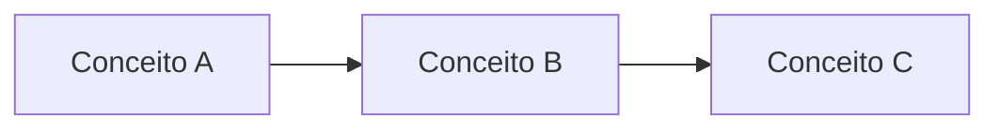

# Título da Aula

> Substitua este bloco por uma frase curta dizendo do que trata a aula e onde ela
> se encaixa na trilha. Mantenha as dez seções abaixo, na mesma ordem.

Quando a aula tiver notebook, cite o link clicável para ele na seção Exemplo
Prático, por exemplo:
[notebooks/modulo-XX/NN-tema.ipynb](../../notebooks/modulo-XX/NN-tema.ipynb).
Lembre de fazer a ligação nos dois sentidos, com o notebook apontando de volta
para a aula. Sempre que citar outro arquivo do repositório, use um link clicável
com caminho relativo, e não apenas o caminho em texto.

---

## Objetivos

Liste de três a cinco objetivos de aprendizagem, começando com um verbo de ação.
Ao final da aula, o aluno deve ser capaz de fazer cada um deles.

- Objetivo 1
- Objetivo 2
- Objetivo 3

## Teoria

Apresente os conceitos centrais da aula com rigor e clareza. Defina os termos,
mostre como eles se relacionam e situe o assunto dentro do que já foi visto. Use
ao menos um diagrama em Mermaid para organizar as ideias.



## Explicação Intuitiva

Explique a mesma ideia da seção anterior de um jeito acessível, com analogias e
exemplos do dia a dia. Esta seção serve para o aluno sentir o conceito antes da
formalização.

## Explicação Matemática

Quando o tema pedir, formalize com a matemática essencial. Apresente as fórmulas
principais e as derivações que realmente ajudam a entender, sem encher de
notação desnecessária. Defina cada símbolo usado.

Exemplo de fórmula em linha: a função custo é $J(\theta)$. E em bloco:

$$
J(\theta) = \frac{1}{m} \sum_{i=1}^{m} L\left(\hat{y}^{(i)}, y^{(i)}\right)
$$

Se a aula não exigir matemática, registre que esta seção não se aplica e siga em
frente.

## Exemplo Prático

Mostre um cenário concreto, de preferência ligado a um assistente educacional, em
que o conceito aparece. Descreva o problema, os dados e o resultado esperado
antes de partir para o código.

## Código Comentado

Traga o código que implementa o exemplo, comentado linha a linha quando ajudar no
entendimento. Prefira o caminho local com Ollama e, quando fizer sentido, mostre
a alternativa com API comercial.

```python
# Exemplo mínimo, substitua pelo código real da aula
def exemplo():
    """Explique o que a função faz e por quê."""
    return "olá, mundo"


if __name__ == "__main__":
    print(exemplo())
```

O notebook correspondente fica em `notebooks/modulo-XX/` e deve rodar de ponta a
ponta.

## Exercícios

Proponha exercícios em dificuldade crescente, separando os conceituais dos
práticos. Quando possível, descreva o resultado esperado para o aluno conferir. Use
o formato `N) Rótulo: enunciado`, com o número seguido de parêntese e o rótulo
seguido de dois-pontos.

1) Conceitual: enunciado do exercício.
2) Prático: enunciado do exercício.
3) Extensão: exercício mais aberto.

## Projeto da Aula

Descreva uma pequena entrega que consolida o que foi visto. Deixe claro o
objetivo, os passos sugeridos e o critério de pronto. O projeto da aula costuma
ser um degrau para o projeto maior do módulo.

## Leituras Recomendadas

Aponte materiais complementares, como capítulos de livros, tutoriais ou
documentação. Inclua o link quando houver.

- Leitura 1
- Leitura 2

## Referências Científicas

Liste apenas referências reais e verificadas, no padrão usado em
`references/referencias.bib`. Nunca invente citações. Cada item deve poder ser
encontrado pelo DOI, pelo arXiv ou pelo Google Scholar.

- Autor, A. (ano). Título do trabalho. Veículo. DOI ou link.
