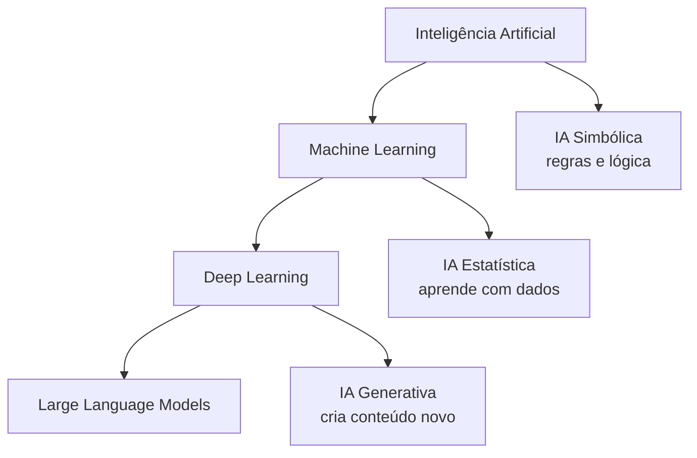

# Aula 1, O que é IA

> Esta aula abre a trilha definindo o que entendemos por Inteligência Artificial,
> separando o conceito de alguns mitos comuns e apresentando as três grandes
> abordagens que vamos usar no curso, a simbólica, a estatística e a generativa.
> Ela serve de base para tudo o que vem depois, então vale a pena ir com calma.

A expressão Inteligência Artificial está em todo lugar hoje, de filmes a
manchetes de jornal, e por isso mesmo costuma vir cercada de exageros e
mal-entendidos. Antes de construir qualquer assistente educacional, precisamos de
um chão firme, ou seja, de uma ideia clara do que a IA realmente é, do que ela
consegue fazer e de quais são os seus limites. Sem isso, fica fácil esperar
mágica de onde não há, ou desprezar recursos que poderiam ajudar muito o ensino.

Nesta aula a gente começa devagar, separando o conceito de IA de alguns mitos
comuns e organizando o vocabulário que vai aparecer ao longo de todo o curso, como
Machine Learning, Deep Learning e os grandes modelos de linguagem. Em seguida,
conhecemos as três abordagens que vão nos acompanhar, a simbólica, a estatística e
a generativa, e já colocamos a mão na massa com um exemplo pequeno mas
representativo, identificar o tema de uma pergunta de aluno. Esse exemplo é o
primeiro passo concreto rumo ao assistente que vamos construir até o final da
trilha.

---

## Objetivos

Ao final desta aula, você deve ser capaz de:

- Explicar com suas palavras o que é Inteligência Artificial e o que ela não é.
- Diferenciar IA, Machine Learning e Deep Learning, entendendo como um está
  contido no outro.
- Caracterizar as três abordagens de IA que usaremos na trilha, a simbólica, a
  estatística e a generativa.
- Reconhecer onde um assistente educacional inteligente se encaixa nesse mapa.

## Teoria

Inteligência Artificial é o campo que estuda como fazer máquinas realizarem
tarefas que, quando feitas por pessoas, associamos à inteligência, como perceber,
raciocinar, aprender, planejar e usar linguagem. Repare que a definição fala em
realizar tarefas, e não em imitar exatamente a mente humana. Essa diferença é
importante, porque boa parte da IA prática se preocupa em resolver problemas de
forma competente, não em reproduzir a biologia do cérebro.

Um ponto que costuma confundir é a relação entre três termos muito usados.
Inteligência Artificial é o conceito mais amplo. Dentro dela está o Machine
Learning, que é a parte da IA em que o sistema aprende padrões a partir de dados,
em vez de seguir apenas regras escritas à mão. E dentro do Machine Learning está o
Deep Learning, que usa redes neurais profundas e é a tecnologia por trás dos
modelos de linguagem modernos.



Ao longo da história, a área oscilou entre duas grandes filosofias. De um lado, a
abordagem simbólica, que representa o conhecimento de forma explícita, com regras e
lógica, e foi dominante nas primeiras décadas. De outro, a abordagem estatística,
que aprende padrões a partir de exemplos e ganhou força com a disponibilidade de
dados e de poder computacional. Mais recentemente, a IA generativa, construída
sobre Deep Learning, passou a criar texto, imagem e código de qualidade
surpreendente, e é o que torna possível um assistente educacional conversar de
forma natural.

Vale registrar que a expressão Inteligência Artificial nasceu em uma proposta de
1955 para um encontro de pesquisa em Dartmouth, redigida por McCarthy, Minsky,
Rochester e Shannon, que marca o início da área como disciplina. Antes disso, em
1950, Alan Turing já havia proposto a famosa pergunta sobre se máquinas podem
pensar, junto com o teste que leva seu nome.

## Explicação Intuitiva

Pense em três formas de ensinar um computador a dizer de que tema é uma pergunta
de aluno.

Na primeira, você senta e escreve regras à mão. Se a pergunta contém a palavra
derivada, então o tema é cálculo. É como dar a um estagiário um manual com uma
lista enorme de instruções do tipo se isto, faça aquilo. Funciona bem enquanto o
mundo se comporta como o manual previu, e quebra assim que aparece algo fora da
lista. Essa é a essência da IA simbólica.

Na segunda, em vez de escrever as regras, você mostra muitos exemplos já
classificados e deixa o computador descobrir sozinho os padrões. É como um
estagiário que aprende observando centenas de casos resolvidos, até pegar o jeito.
Ele generaliza para perguntas que nunca viu, desde que sejam parecidas com o que
aprendeu. Essa é a ideia da IA estatística, o coração do Machine Learning.

Na terceira, o computador não só classifica, ele produz algo novo, como uma
explicação inteira escrita na hora. É como um monitor que, além de saber o tema da
pergunta, consegue redigir uma resposta clara e original. Essa é a IA generativa,
e é ela que dá voz aos assistentes educacionais modernos.

## Explicação Matemática

Esta aula é mais conceitual, mas há uma formalização clássica que vale a pena
guardar, pois define com precisão o que significa um programa aprender. A
definição é de Tom Mitchell, em 1997.

> Diz-se que um programa de computador aprende com a experiência $E$, em relação a
> uma classe de tarefas $T$ e a uma medida de desempenho $P$, se o seu desempenho
> nas tarefas de $T$, medido por $P$, melhora com a experiência $E$.

Em símbolos, podemos pensar que o aprendizado busca um modelo, com parâmetros
$\theta$, que minimiza o erro médio sobre os exemplos. Se $L$ é uma função que
mede o erro de uma previsão $\hat{y}$ em relação ao valor correto $y$, e temos $m$
exemplos, o objetivo é reduzir a função de custo

$$
J(\theta) = \frac{1}{m} \sum_{i=1}^{m} L\left(\hat{y}^{(i)}, y^{(i)}\right).
$$

Não se preocupe em resolver isso agora. O ponto é perceber a diferença de fundo
entre as abordagens. Na IA simbólica, uma pessoa escreve as regras diretamente. Na
IA estatística, o sistema ajusta os parâmetros $\theta$ a partir dos dados, para
que $J(\theta)$ fique o menor possível. Vamos voltar a essa ideia com calma no
Módulo 2.

## Exemplo Prático

Imagine o primeiro tijolo de um assistente educacional. Quando um aluno faz uma
pergunta, o assistente precisa entender de que tema ela trata, para então buscar o
material certo ou acionar o especialista adequado. Vamos resolver essa pequena
tarefa de três formas, uma para cada abordagem, e comparar o que muda.

O cenário é simples. Temos perguntas curtas de alunos e queremos classificá-las em
temas como cálculo, álgebra linear e estatística. Em seguida, vamos pedir a um
modelo generativo que escreva uma explicação para o aluno. Esse mesmo exemplo
roda no notebook
[notebooks/modulo-01/01-o-que-e-ia.ipynb](../../notebooks/modulo-01/01-o-que-e-ia.ipynb),
então abra-o ao lado para acompanhar o código rodando.

## Código Comentado

### Abordagem 1, IA simbólica com regras escritas à mão

```python
# Um conjunto de regras que liga palavras-chave a temas.
# É o ser humano quem escreve o conhecimento, de forma explícita.
REGRAS = {
    "derivada": "cálculo",
    "integral": "cálculo",
    "limite": "cálculo",
    "vetor": "álgebra linear",
    "matriz": "álgebra linear",
    "probabilidade": "estatística",
    "média": "estatística",
}


def classificar_por_regras(pergunta: str) -> str:
    """Classifica a pergunta procurando palavras-chave conhecidas."""
    texto = pergunta.lower()
    for palavra, tema in REGRAS.items():
        if palavra in texto:
            return tema
    # Quando nenhuma regra casa, o sistema simplesmente não sabe responder.
    return "desconhecido"


print(classificar_por_regras("Como calculo a derivada de x ao quadrado?"))
# cálculo
print(classificar_por_regras("O que é desvio padrão?"))
# desconhecido, pois não há regra para 'desvio padrão'
```

Repare na fragilidade. A pergunta sobre desvio padrão é claramente de estatística,
mas, como não existe uma regra para essas palavras, o sistema falha. Cobrir todos
os casos na mão é inviável.

### Abordagem 2, IA estatística que aprende com exemplos

```python
from sklearn.feature_extraction.text import TfidfVectorizer
from sklearn.linear_model import LogisticRegression
from sklearn.pipeline import make_pipeline

# Em vez de regras, fornecemos exemplos já rotulados.
perguntas = [
    "como calculo a derivada de uma função",
    "qual a integral de x dx",
    "o que é um limite no cálculo",
    "como multiplico duas matrizes",
    "o que é um vetor unitário",
    "como calculo a média de uma amostra",
    "o que significa desvio padrão",
    "como interpreto uma probabilidade",
]
temas = [
    "cálculo", "cálculo", "cálculo",
    "álgebra linear", "álgebra linear",
    "estatística", "estatística", "estatística",
]

# O pipeline transforma o texto em números com TF-IDF e treina um classificador.
modelo = make_pipeline(TfidfVectorizer(), LogisticRegression(max_iter=1000))
modelo.fit(perguntas, temas)

# Agora testamos com uma frase que o modelo nunca viu exatamente assim.
print(modelo.predict(["como encontro o desvio padrão de uma série de notas"]))
# Espera-se algo como ['estatística'], mesmo sem uma regra explícita.
```

Aqui o sistema generaliza. Mesmo sem termos escrito uma regra para desvio padrão,
o modelo aprendeu, a partir dos exemplos, que esse tipo de frase tende a ser de
estatística. Essa capacidade de generalizar é o que torna o Machine Learning tão
útil.

### Abordagem 3, IA generativa com um modelo de linguagem local

```python
# A IA generativa não classifica apenas, ela produz texto novo.
# Usamos o Ollama, que roda um LLM localmente, sem precisar de chave de API.
# Se o Ollama não estiver disponível, o código avisa em vez de quebrar.
try:
    import ollama

    resposta = ollama.chat(
        model="llama3.1",
        messages=[
            {
                "role": "user",
                "content": "Explique, em duas frases e de forma simples, "
                "o que é desvio padrão para um estudante do primeiro ano.",
            }
        ],
    )
    print(resposta["message"]["content"])
except Exception as erro:
    print("Não foi possível usar o Ollama agora.")
    print("Verifique a instalação em docs/setup.md. Detalhe técnico:", erro)
```

Note o salto. As duas primeiras abordagens decidem um rótulo. A terceira escreve
uma explicação inteira, na hora, adaptada ao pedido. É exatamente esse tipo de
capacidade que vamos orquestrar, ao longo da trilha, para construir um assistente
que ensina de verdade.

## Exercícios

1) Conceitual: Com suas palavras, explique por que Deep Learning é um subconjunto
   de Machine Learning, e este, um subconjunto de IA. Dê um exemplo de cada nível.
2) Conceitual: A definição de aprendizado de Mitchell fala em tarefa $T$,
   desempenho $P$ e experiência $E$. Descreva esses três elementos para o problema
   de classificar perguntas de alunos por tema.
3) Prático: Acrescente pelo menos duas novas palavras-chave ao dicionário
   `REGRAS` e teste com frases que antes davam desconhecido. Comente até onde essa
   estratégia consegue ir.
4) Prático: Adicione mais exemplos ao conjunto de treino da abordagem estatística,
   incluindo um novo tema, como geometria. Reavalie se o modelo passa a acertar
   perguntas desse novo tema.
5) Extensão: Pesquise um exemplo real de IA simbólica famoso, como um sistema
   especialista, e escreva um parágrafo sobre por que ele teve sucesso na época e
   quais foram suas limitações.

## Projeto da Aula

Monte um pequeno comparador das três abordagens para o problema de identificar o
tema de uma pergunta de aluno. A entrega é um script ou um notebook que recebe uma
lista de perguntas e mostra, lado a lado, o tema previsto pela abordagem simbólica,
o tema previsto pela abordagem estatística e uma explicação curta gerada pela
abordagem generativa.

O objetivo é sentir, na prática, as diferenças entre escrever regras, aprender com
dados e gerar conteúdo. Considere o projeto pronto quando ele rodar de ponta a
ponta com pelo menos cinco perguntas de teste e quando você conseguir explicar, em
um parágrafo, em que situação cada abordagem se sai melhor. Esse comparador é a
primeira pedra do assistente que vamos construir até o final da trilha.

## Leituras Recomendadas

- Capítulo introdutório de Russell e Norvig, Artificial Intelligence: A Modern
  Approach, para uma visão ampla e cuidadosa do campo.
- Site do livro Deep Learning, de Goodfellow, Bengio e Courville, disponível de
  forma gratuita em https://www.deeplearningbook.org, para quem quer se aprofundar
  depois.
- Documentação do Ollama em https://ollama.com, para entender o que está rodando
  por trás dos exemplos generativos.

## Referências Científicas

As referências abaixo são reais e estão registradas em
[references/referencias.bib](../../references/referencias.bib). As chaves entre
parênteses são as do BibTeX.

- Turing, A. M. (1950). Computing Machinery and Intelligence. Mind, 59(236),
  433-460. (`turing1950computing`)
- McCarthy, J., Minsky, M. L., Rochester, N., e Shannon, C. E. (1955). A Proposal
  for the Dartmouth Summer Research Project on Artificial Intelligence. Reimpresso
  em AI Magazine, 2006. (`mccarthy1955dartmouth`)
- Mitchell, T. M. (1997). Machine Learning. McGraw-Hill. (`mitchell1997machine`)
- Russell, S., e Norvig, P. (2020). Artificial Intelligence: A Modern Approach, 4ª
  edição. Pearson. (`russell2020aima`)
- Goodfellow, I., Bengio, Y., e Courville, A. (2016). Deep Learning. MIT Press.
  (`goodfellow2016deep`)
- Goodfellow, I., et al. (2014). Generative Adversarial Nets. NeurIPS.
  (`goodfellow2014gan`)
