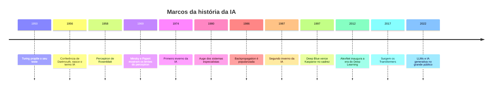

# Aula 2, História da IA

> Esta aula conta como a Inteligência Artificial nasceu e amadureceu, dos sonhos
> dos anos 1950 até os modelos de linguagem de hoje. Ao olhar para trás, a gente
> entende por que a área avançou em ondas, alternando entusiasmo e frustração, e
> por que as ideias de décadas atrás ainda moldam os assistentes que construímos
> agora.

Conhecer a história da IA não é só cultura geral. Cada ferramenta que vamos usar
na trilha carrega a marca de uma época, de uma aposta que deu certo ou de um
limite que precisou ser superado. Quando você entende que os grandes modelos de
linguagem são herdeiros de uma longa disputa entre fazer a máquina seguir regras e
deixá-la aprender com dados, fica muito mais fácil saber o que esperar de cada
abordagem e quando usar uma ou outra.

Nesta aula vamos percorrer os marcos principais, do batismo da área na conferência
de Dartmouth aos chamados invernos da IA, quando o dinheiro e o interesse secaram,
até a virada do aprendizado profundo e a explosão da IA generativa. No caminho,
vamos implementar o perceptron, um dos primeiros modelos que aprendem, e sentir na
prática a limitação histórica que quase enterrou a área e que só foi vencida anos
depois.

---

## Objetivos

Ao final desta aula, você deve ser capaz de:

- Situar no tempo os principais marcos da história da IA, de 1950 até hoje.
- Explicar o que foram os invernos da IA e por que eles aconteceram.
- Relacionar a alternância entre as abordagens simbólica e estatística com os
  avanços e recuos da área.
- Implementar um perceptron simples e entender, na prática, por que ele não
  resolve o problema do XOR.

## Teoria

A Inteligência Artificial como disciplina nasce oficialmente em 1956, na
conferência de Dartmouth, organizada por John McCarthy e colegas a partir de uma
proposta escrita no ano anterior. Foi ali que o termo Inteligência Artificial foi
cunhado e que se firmou a ambição de fazer máquinas raciocinarem. Mas a semente já
vinha de antes, com Alan Turing, que em 1950 havia proposto pensar se máquinas
podem exibir comportamento inteligente, junto com o teste que leva seu nome.

Os primeiros anos foram de otimismo intenso. Em 1958, Frank Rosenblatt apresentou o
perceptron, um modelo inspirado no neurônio que aprende a separar exemplos em duas
classes. As promessas eram grandes, e por um tempo pareceu que a inteligência
plena estava logo ali. O banho de água fria veio em 1969, quando Minsky e Papert
mostraram, com rigor matemático, que o perceptron simples não conseguia resolver
problemas tão básicos quanto o XOR. Esse resultado, somado a expectativas frustradas
em outras frentes, ajudou a provocar o primeiro inverno da IA, um período nos anos
1970 em que o financiamento e o entusiasmo despencaram.

Nos anos 1980, a área renasceu com os sistemas especialistas, programas que
codificavam o conhecimento de especialistas humanos em grandes conjuntos de
regras. Eles tiveram sucesso comercial, mas eram caros de manter e frágeis fora do
seu domínio estreito. Quando esse modelo de negócio desinflou, veio o segundo
inverno da IA, no fim dos anos 1980 e começo dos 1990.

A virada de longo prazo veio com a maré estatística. A retomada da
backpropagation, popularizada em 1986 por Rumelhart, Hinton e Williams, permitiu
treinar redes neurais com várias camadas, justamente o que faltava para superar a
limitação apontada por Minsky e Papert. Em 1997, o Deep Blue venceu o campeão
mundial de xadrez Garry Kasparov, um marco simbólico. O grande salto recente
aconteceu em 2012, quando a rede AlexNet venceu de forma esmagadora uma competição
de reconhecimento de imagens, inaugurando a era do aprendizado profundo. Em 2017,
a arquitetura Transformer abriu caminho para os grandes modelos de linguagem, e no
início dos anos 2020 a IA generativa chegou ao grande público.



## Explicação Intuitiva

Uma boa forma de entender a história da IA é pensar em um pêndulo que balança entre
duas filosofias. De um lado, a ideia de que basta escrever as regras certas para a
máquina ser inteligente, que é a abordagem simbólica. De outro, a ideia de que a
máquina deve aprender sozinha a partir de exemplos, que é a abordagem estatística.
A cada década, o pêndulo pendeu mais para um lado, conforme os resultados
apareciam ou frustravam.

Os invernos da IA são fáceis de entender se você já viu o ciclo de qualquer
tecnologia muito badalada. Primeiro vem o exagero, com promessas que vão muito além
do que a tecnologia entrega. Quando a realidade não acompanha o discurso, vem a
decepção, o dinheiro some e a área esfria. Foi assim duas vezes com a IA. A lição
que fica é a de manter os pés no chão, entender bem o que cada método consegue e o
que não consegue, e não confundir um avanço real com mágica.

## Explicação Matemática

Para sentir a limitação histórica de 1969, vale formalizar o perceptron. Ele
recebe uma entrada com $n$ números, $\mathbf{x} = (x_1, \dots, x_n)$, e calcula uma
soma ponderada mais um viés. Em seguida aplica uma função degrau, que devolve 1 se
a soma for não negativa e 0 caso contrário:

$$
\hat{y} = \text{degrau}\left(\mathbf{w} \cdot \mathbf{x} + b\right),
\qquad
\text{degrau}(z) =
\begin{cases}
1 & \text{se } z \ge 0 \\
0 & \text{se } z < 0
\end{cases}
$$

O aprendizado ajusta os pesos comparando a saída prevista com a correta. Para cada
exemplo, a regra de atualização é

$$
\mathbf{w} \leftarrow \mathbf{w} + \eta \,(y - \hat{y})\, \mathbf{x},
\qquad
b \leftarrow b + \eta \,(y - \hat{y}),
$$

em que $\eta$ é a taxa de aprendizado. O detalhe crucial é geométrico. O perceptron
só sabe separar as classes com uma reta, ou, em mais dimensões, com um hiperplano.
Problemas que precisam de uma fronteira mais complexa ficam fora do seu alcance. O
XOR é o exemplo clássico, pois não existe uma única reta que separe os pontos onde
o XOR vale 1 dos pontos onde ele vale 0. Foi exatamente isso que Minsky e Papert
demonstraram, e a solução, anos depois, foi empilhar camadas e treiná-las com
backpropagation.

## Exemplo Prático

Vamos reviver esse momento da história com código. A ideia é treinar um perceptron
em duas tarefas. A primeira é a função lógica AND, que é linearmente separável e o
perceptron resolve sem dificuldade. A segunda é o XOR, que ele não consegue
aprender, por mais épocas que treine. Ver o perceptron falhar no XOR é entender,
com as próprias mãos, o resultado que mudou o rumo da IA.

O código abaixo está no notebook
[notebooks/modulo-01/02-historia-da-ia.ipynb](../../notebooks/modulo-01/02-historia-da-ia.ipynb),
então abra-o ao lado para rodar e experimentar.

## Código Comentado

```python
import numpy as np


def degrau(z):
    """Função de ativação do perceptron: 1 se z >= 0, senão 0."""
    return np.where(z >= 0, 1, 0)


def treinar_perceptron(X, y, epocas=20, taxa=0.1):
    """Treina um perceptron simples com a regra clássica de atualização."""
    n_features = X.shape[1]
    w = np.zeros(n_features)  # pesos começam em zero
    b = 0.0                   # viés começa em zero
    for _ in range(epocas):
        for xi, yi in zip(X, y):
            z = np.dot(w, xi) + b
            y_previsto = degrau(z)
            erro = yi - y_previsto
            # Só ajusta quando erra. Se acertou, erro é zero e nada muda.
            w = w + taxa * erro * xi
            b = b + taxa * erro
    return w, b


# As quatro combinações possíveis de duas entradas binárias.
X = np.array([[0, 0], [0, 1], [1, 0], [1, 1]])

# Tarefa 1: AND, que é linearmente separável.
y_and = np.array([0, 0, 0, 1])
w, b = treinar_perceptron(X, y_and)
print("AND  previsto:", degrau(X @ w + b), "| esperado:", y_and)

# Tarefa 2: XOR, que não é linearmente separável.
y_xor = np.array([0, 1, 1, 0])
w, b = treinar_perceptron(X, y_xor)
print("XOR  previsto:", degrau(X @ w + b), "| esperado:", y_xor)
```

Ao rodar, o perceptron acerta o AND em cheio, mas erra o XOR e não melhora por mais
que você aumente as épocas. Esse fracasso não é um bug no código, é uma limitação
matemática real do modelo, a mesma que Minsky e Papert apontaram em 1969.

## Exercícios

1) Conceitual: Explique, com suas palavras, o que foi um inverno da IA e cite os
   dois principais. O que provocou cada um deles?
2) Conceitual: Por que a popularização da backpropagation em 1986 foi tão
   importante diante da limitação apontada em 1969?
3) Prático: Treine o perceptron também para as funções OR e NAND. Elas são
   linearmente separáveis? O perceptron consegue aprendê-las?
4) Prático: Aumente o número de épocas no treino do XOR para um valor bem alto, por
   exemplo mil. O resultado melhora? Explique por quê.
5) Extensão: Pesquise o que foi o relatório Lighthill, de 1973, e escreva um
   parágrafo sobre o papel dele no primeiro inverno da IA.

## Projeto da Aula

Mostre, na prática, como a história superou a limitação do perceptron. A entrega é
um notebook ou script que primeiro reproduz a falha do perceptron no XOR e depois
resolve o mesmo XOR com uma rede de múltiplas camadas, por exemplo usando o
`MLPClassifier` do scikit-learn com uma camada escondida. Compare as previsões dos
dois modelos lado a lado.

Considere o projeto pronto quando o perceptron falhar visivelmente no XOR, a rede
de múltiplas camadas acertar as quatro combinações, e você conseguir explicar, em
um parágrafo, o que a camada escondida acrescenta que o perceptron não tinha. Esse
contraste resume, em poucas linhas de código, uma das viradas mais importantes da
história da área.

## Leituras Recomendadas

- Capítulo histórico de Russell e Norvig, Artificial Intelligence: A Modern
  Approach, que traz uma cronologia detalhada e bem referenciada.
- Verbete sobre a conferência de Dartmouth e sobre os invernos da IA em
  enciclopédias acadêmicas de confiança, para complementar as datas e os nomes.
- Documentação do scikit-learn sobre o `MLPClassifier`, em
  https://scikit-learn.org, útil para o projeto da aula.

## Referências Científicas

As referências abaixo são reais e estão registradas em
[references/referencias.bib](../../references/referencias.bib). As chaves entre
parênteses são as do BibTeX.

- Turing, A. M. (1950). Computing Machinery and Intelligence. Mind, 59(236),
  433-460. (`turing1950computing`)
- McCarthy, J., Minsky, M. L., Rochester, N., e Shannon, C. E. (1955). A Proposal
  for the Dartmouth Summer Research Project on Artificial Intelligence. Reimpresso
  em AI Magazine, 2006. (`mccarthy1955dartmouth`)
- Rosenblatt, F. (1958). The Perceptron: A Probabilistic Model for Information
  Storage and Organization in the Brain. Psychological Review, 65(6), 386-408.
  (`rosenblatt1958perceptron`)
- Minsky, M., e Papert, S. (1969). Perceptrons: An Introduction to Computational
  Geometry. MIT Press. (`minsky1969perceptrons`)
- Rumelhart, D. E., Hinton, G. E., e Williams, R. J. (1986). Learning
  Representations by Back-Propagating Errors. Nature, 323(6088), 533-536.
  (`rumelhart1986backprop`)
- Krizhevsky, A., Sutskever, I., e Hinton, G. E. (2012). ImageNet Classification
  with Deep Convolutional Neural Networks. NeurIPS. (`krizhevsky2012imagenet`)
