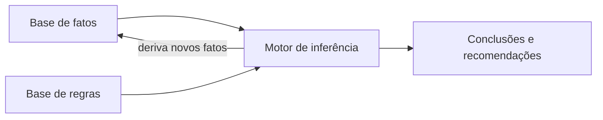

# Aula 3, IA simbólica

> Esta aula apresenta a primeira grande corrente da Inteligência Artificial, a
> simbólica, que representa o conhecimento de forma explícita, com símbolos, regras
> e lógica. É a abordagem que dominou as primeiras décadas da área e que ainda hoje
> aparece dentro de assistentes educacionais, sempre que precisamos de decisões
> claras e auditáveis.

Na aula anterior vimos a história da IA balançar como um pêndulo entre fazer a
máquina seguir regras e deixá-la aprender com dados. Agora vamos olhar com cuidado
para o primeiro lado desse pêndulo. A IA simbólica parte de uma ideia poderosa, a
de que pensar é manipular símbolos segundo regras, do mesmo jeito que a gente
resolve uma conta seguindo passos bem definidos.

Entender essa abordagem é importante por dois motivos. Primeiro, porque ela é
transparente, ou seja, conseguimos ler e justificar cada decisão, algo precioso na
educação, onde precisamos explicar ao aluno o porquê de uma recomendação. Segundo,
porque conhecer os limites dela é o que motiva tudo o que vem depois na trilha,
quando passamos a aprender padrões a partir de exemplos. Ao final, você terá
construído um pequeno motor de inferência, o coração de um sistema simbólico.

---

## Objetivos

Ao final desta aula, você deve ser capaz de:

- Explicar o que é a IA simbólica e em que ideia ela se apoia.
- Descrever como o conhecimento é representado por fatos e regras.
- Entender a inferência por modus ponens e o encadeamento para frente.
- Implementar um motor de inferência simples e reconhecer suas forças e limites.

## Teoria

A IA simbólica, às vezes chamada de IA clássica, trabalha com símbolos que
representam coisas do mundo, como conceitos, objetos e relações, e com regras que
dizem como combinar esses símbolos. A aposta de fundo foi formulada por Newell e
Simon, em 1976, na hipótese do sistema de símbolos físicos, segundo a qual um
sistema que manipula símbolos da maneira certa tem o necessário para exibir
inteligência. Foi nessa tradição que surgiram linguagens como o LISP, criado por
John McCarthy em 1960, pensadas justamente para manipular expressões simbólicas.

Um sistema simbólico costuma ter três partes. A base de fatos guarda o que se sabe
no momento, por exemplo que um aluno domina aritmética. A base de regras guarda o
conhecimento na forma se isto, então aquilo, por exemplo se o aluno domina
aritmética, então ele pode estudar álgebra. E o motor de inferência é o mecanismo
que aplica as regras aos fatos para derivar novos fatos e chegar a conclusões.



Há duas formas clássicas de raciocinar. No encadeamento para frente, partimos dos
fatos conhecidos e aplicamos regras para descobrir tudo o que se pode concluir,
útil quando queremos saber aonde os dados nos levam. No encadeamento para trás,
partimos de um objetivo, por exemplo o aluno pode estudar cálculo, e procuramos
para trás quais fatos e regras o sustentariam, útil quando queremos provar ou
justificar uma meta.

O auge prático dessa abordagem foram os sistemas especialistas dos anos 1980, como
o famoso MYCIN, documentado por Buchanan e Shortliffe, que sugeria diagnósticos
médicos a partir de centenas de regras. Eles mostraram tanto a força quanto a
fraqueza da IA simbólica. A força é a clareza, pois cada conclusão vem com a
cadeia de regras que a sustenta. A fraqueza é a fragilidade, pois alguém precisa
escrever todas as regras à mão, e o sistema quebra diante de situações que ninguém
previu, um problema conhecido como gargalo da aquisição de conhecimento.

## Explicação Intuitiva

Pense em um detetive clássico. Ele tem alguns fatos, como pegadas na lama e um
relógio parado em certa hora, e tem regras gerais sobre o mundo, como a de que
pegadas frescas indicam uma passagem recente. Combinando fatos e regras, ele deduz
conclusões novas, como a de que alguém passou ali pouco tempo atrás. A IA simbólica
funciona assim, ela deduz o que ainda não estava dito de forma explícita, a partir
do que já sabe e das regras que possui.

Outra imagem útil é a de um manual de procedimentos muito bem escrito. Enquanto a
situação está prevista no manual, o sistema responde com precisão e consegue
explicar cada passo. O problema aparece quando surge um caso que o manual não
cobre. O detetive humano improvisa, mas o sistema simbólico simplesmente não sabe o
que fazer, porque ninguém escreveu a regra para aquilo.

## Explicação Matemática

A base lógica da IA simbólica é a lógica proposicional. Uma regra é uma implicação,
em que um conjunto de condições leva a uma conclusão. Se $p_1, p_2, \dots, p_k$ são
as condições e $q$ é a conclusão, a regra é

$$
p_1 \wedge p_2 \wedge \dots \wedge p_k \;\rightarrow\; q.
$$

A inferência usa a regra clássica do modus ponens. Se sabemos que $p$ é verdadeiro
e que $p \rightarrow q$, então podemos concluir $q$:

$$
\frac{p, \quad p \rightarrow q}{q}.
$$

O encadeamento para frente nada mais é do que aplicar o modus ponens repetidamente.
Começamos com um conjunto de fatos $F$. A cada passada, procuramos uma regra cujas
condições estejam todas em $F$ e cuja conclusão ainda não esteja, e então
adicionamos essa conclusão a $F$. Repetimos até que nenhuma regra nova possa
disparar, um estado chamado de ponto fixo. Como cada passada só acrescenta fatos e
o número de fatos possíveis é finito, o processo sempre termina.

## Exemplo Prático

Vamos construir um pequeno tutor simbólico que recomenda o próximo passo de estudo.
A base de fatos descreve o que o aluno já domina e algumas preferências, e a base
de regras codifica a sequência pedagógica, por exemplo que dominar aritmética
libera o estudo de álgebra. O motor de inferência, por encadeamento para frente,
descobre tudo o que o aluno pode estudar e quais recomendações fazer.

Esse exemplo é proposital. Ele resolve bem um problema bem delimitado e explica
cada conclusão, o que é a marca da IA simbólica. Mais adiante na trilha, quando os
casos ficarem ambíguos e cheios de exceções, vamos sentir por que precisamos
também das abordagens que aprendem com dados. O código está no notebook
[notebooks/modulo-01/03-ia-simbolica.ipynb](../../notebooks/modulo-01/03-ia-simbolica.ipynb),
então abra-o ao lado para acompanhar.

## Código Comentado

```python
# Cada regra é um par (condições, conclusão).
# Todas as condições precisam estar nos fatos para a regra disparar.
regras = [
    (["domina aritmética"], "pode estudar álgebra"),
    (["domina álgebra"], "pode estudar funções"),
    (["domina funções"], "pode estudar cálculo"),
    (["dificuldade em frações"], "revisar aritmética"),
    (["pode estudar álgebra", "gosta de desafios"],
     "sugerir problemas avançados de álgebra"),
]


def encadeamento_para_frente(fatos_iniciais, regras):
    """Aplica as regras aos fatos até nenhuma nova conclusão surgir."""
    fatos = set(fatos_iniciais)
    houve_mudanca = True
    while houve_mudanca:
        houve_mudanca = False
        for condicoes, conclusao in regras:
            # A regra dispara se a conclusão ainda não é conhecida
            # e todas as suas condições já estão entre os fatos.
            if conclusao not in fatos and all(c in fatos for c in condicoes):
                fatos.add(conclusao)
                houve_mudanca = True
                print("Regra disparou, novo fato:", conclusao)
    return fatos


fatos_iniciais = ["domina aritmética", "gosta de desafios"]
resultado = encadeamento_para_frente(fatos_iniciais, regras)

print()
print("Fatos finais:")
for fato in sorted(resultado):
    print(" -", fato)
```

Repare que, a partir de apenas dois fatos iniciais, o motor deduz uma cadeia de
recomendações, inclusive a sugestão de problemas avançados, que só aparece porque o
aluno domina aritmética e gosta de desafios ao mesmo tempo. Cada novo fato vem
acompanhado da regra que o gerou, o que torna o raciocínio transparente.

## Exercícios

1) Conceitual: Explique a diferença entre encadeamento para frente e encadeamento
   para trás, e dê um exemplo de pergunta que se encaixa melhor em cada um.
2) Conceitual: O que é o gargalo da aquisição de conhecimento e por que ele limita
   os sistemas simbólicos?
3) Prático: Acrescente uma regra que recomende revisar álgebra quando o aluno tiver
   dificuldade em equações. Crie fatos iniciais que disparem essa nova regra.
4) Prático: Mude os fatos iniciais para incluir dificuldade em frações e veja como
   a recomendação muda. O motor sugere revisar antes de avançar?
5) Extensão: Pesquise como o sistema especialista MYCIN lidava com incerteza, com
   os chamados fatores de certeza, e escreva um parágrafo sobre isso.

## Projeto da Aula

Transforme o tutor simbólico em algo que também explica o porquê de cada
recomendação. A entrega é um programa que, além de derivar os fatos por
encadeamento para frente, guarda para cada conclusão qual regra a gerou, de modo
que o aluno possa perguntar por que deve estudar determinado tema e receber a
cadeia de justificativas.

Considere o projeto pronto quando o sistema, dado um objetivo já derivado, como
sugerir problemas avançados de álgebra, conseguir mostrar a sequência de regras e
fatos que leva até ele. Como desafio extra, ajuste os fatos iniciais para que o
aluno chegue a poder estudar cálculo e justifique também esse objetivo. Esse
recurso de explicação é uma das maiores vantagens da IA simbólica, e vai reaparecer
quando discutirmos transparência nos assistentes educacionais mais adiante.

## Leituras Recomendadas

- Capítulos sobre agentes lógicos e representação de conhecimento em Russell e
  Norvig, Artificial Intelligence: A Modern Approach.
- Material introdutório sobre sistemas especialistas e encadeamento de regras, para
  ver exemplos além do contexto educacional.
- Tutoriais sobre lógica proposicional, úteis para firmar a base da seção
  matemática.

## Referências Científicas

As referências abaixo são reais e estão registradas em
[references/referencias.bib](../../references/referencias.bib). As chaves entre
parênteses são as do BibTeX.

- Newell, A., e Simon, H. A. (1976). Computer Science as Empirical Inquiry: Symbols
  and Search. Communications of the ACM, 19(3), 113-126. (`newell1976symbols`)
- McCarthy, J. (1960). Recursive Functions of Symbolic Expressions and Their
  Computation by Machine, Part I. Communications of the ACM, 3(4), 184-195.
  (`mccarthy1960lisp`)
- Buchanan, B. G., e Shortliffe, E. H. (1984). Rule-Based Expert Systems: The MYCIN
  Experiments of the Stanford Heuristic Programming Project. Addison-Wesley.
  (`buchanan1984mycin`)
- Russell, S., e Norvig, P. (2020). Artificial Intelligence: A Modern Approach, 4ª
  edição. Pearson. (`russell2020aima`)
