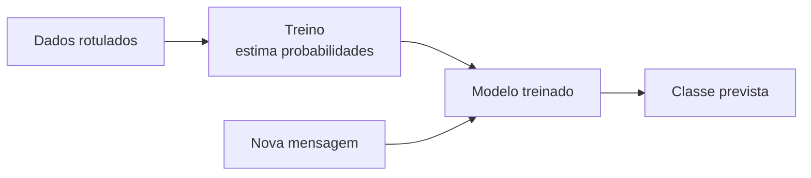

# Aula 4, IA estatística

> Esta aula apresenta a segunda grande corrente da Inteligência Artificial, a
> estatística, que em vez de receber regras prontas aprende padrões a partir de
> dados. É a abordagem que sustenta o Machine Learning e, mais adiante, os próprios
> modelos de linguagem, e é o outro lado do pêndulo que vimos balançar na história
> da área.

Na aula sobre IA simbólica, construímos um tutor que seguia regras escritas à mão.
Ele era transparente e exato dentro do seu domínio, mas frágil, porque alguém
precisava prever cada situação e escrever a regra correspondente. Quando a vida
real traz frases ambíguas, sinônimos e exceções, esse modelo começa a ranger.

A IA estatística vira a chave. Em vez de dizer à máquina o que fazer em cada caso,
mostramos muitos exemplos e deixamos que ela descubra os padrões sozinha. A palavra
estatística aparece porque o coração dessa abordagem é estimar probabilidades a
partir de frequências observadas nos dados. Nesta aula você vai entender essa ideia
e construir, do zero, um classificador de Naive Bayes, um método simples, elegante
e surpreendentemente eficaz, que separa mensagens de alunos por tipo aprendendo
apenas com exemplos.

---

## Objetivos

Ao final desta aula, você deve ser capaz de:

- Explicar o que diferencia a IA estatística da IA simbólica.
- Entender a ideia de aprender padrões a partir de dados e generalizar para casos
  novos.
- Aplicar o Teorema de Bayes e a suposição de independência do Naive Bayes.
- Implementar um classificador de Naive Bayes do zero e avaliá-lo.

## Teoria

A IA estatística parte de uma inversão simples e poderosa. Em vez de programar o
comportamento, programamos a capacidade de aprender. Damos ao sistema um conjunto
de dados, normalmente exemplos rotulados, e um procedimento que ajusta um modelo
para que ele acerte esses exemplos e, o mais importante, acerte também exemplos
novos que nunca viu. Essa capacidade de ir além dos dados de treino se chama
generalização, e é o que dá valor real ao método.

Essa ideia é antiga. Já em 1959, Arthur Samuel construiu um programa que aprendia a
jogar damas melhorando com a própria experiência, e foi ele quem popularizou a
expressão aprendizado de máquina. Décadas depois, com mais dados e mais poder
computacional, essa abordagem passou a dominar a área, como discute Pedro Domingos
em um artigo bastante didático sobre o que todo praticante deveria saber.

O fluxo típico de um sistema estatístico tem quatro etapas. Primeiro, reunimos
dados rotulados. Depois, na fase de treino, o algoritmo estima os parâmetros do
modelo a partir desses dados. Em seguida, temos um modelo treinado. Por fim,
usamos esse modelo para prever o rótulo de entradas novas.



Nesta aula usamos um representante clássico dessa família, o Naive Bayes. Ele é um
classificador probabilístico, ou seja, em vez de dar só um rótulo, ele estima a
probabilidade de cada classe e escolhe a mais provável. Apesar de simples, é uma
linha de base forte para classificação de texto, justamente o tipo de tarefa que um
assistente educacional encontra o tempo todo.

## Explicação Intuitiva

Lembre da analogia do estagiário que vimos na primeira aula. O estagiário simbólico
recebe um manual com regras. O estagiário estatístico, em vez disso, recebe uma
pilha de casos já resolvidos e aprende observando. Depois de ver muitas mensagens de
alunos rotuladas como dúvida de conteúdo ou como problema técnico, ele começa a
perceber que certas palavras puxam para um lado ou para o outro. Palavras como
derivada e integral sugerem conteúdo, enquanto travando e login sugerem problema
técnico.

A parte probabilística é só uma forma honesta de lidar com a incerteza. Nenhuma
palavra decide sozinha, mas cada uma inclina a balança. O Naive Bayes soma essas
inclinações de todas as palavras da mensagem e escolhe a classe que ficou mais
provável. É como um júri que pesa várias evidências antes de dar o veredito, em vez
de depender de uma única regra rígida.

## Explicação Matemática

O fundamento é o Teorema de Bayes. Queremos a probabilidade de uma classe $c$ dado
o que observamos na mensagem, representado pelas palavras $x_1, x_2, \dots, x_n$. O
teorema diz que

$$
P(c \mid x_1, \dots, x_n) =
\frac{P(c)\; P(x_1, \dots, x_n \mid c)}{P(x_1, \dots, x_n)}.
$$

Como o denominador é o mesmo para todas as classes, basta comparar o numerador. O
problema é que estimar $P(x_1, \dots, x_n \mid c)$ diretamente é inviável, pois
haveria combinações demais de palavras. Aqui entra a suposição ingênua, ou naive,
que dá nome ao método. Assumimos que, dada a classe, as palavras são independentes
entre si:

$$
P(x_1, \dots, x_n \mid c) \approx \prod_{i=1}^{n} P(x_i \mid c).
$$

A decisão final escolhe a classe que maximiza o produto do prior pela
verossimilhança:

$$
\hat{c} = \arg\max_{c} \; P(c) \prod_{i=1}^{n} P(x_i \mid c).
$$

Na prática, multiplicar muitas probabilidades pequenas leva a números minúsculos,
então trabalhamos com a soma dos logaritmos, que é equivalente e numericamente
estável. As probabilidades $P(x_i \mid c)$ são estimadas contando frequências nos
dados. Para não zerar tudo quando uma palavra nunca apareceu em uma classe, somamos
um pequeno valor a cada contagem, uma técnica chamada suavização de Laplace.

## Exemplo Prático

Vamos classificar mensagens de alunos em duas categorias, dúvida de conteúdo e
problema técnico. Essa é uma tarefa real para um assistente educacional, que precisa
encaminhar cada mensagem para o lugar certo, seja o material da disciplina, seja o
suporte técnico. Em vez de escrever regras, vamos treinar um Naive Bayes com alguns
exemplos rotulados e ver como ele generaliza para mensagens novas.

Para enxergar a estatística por dentro, vamos implementar o método do zero, apenas
contando palavras. Mais para frente na trilha usaremos bibliotecas prontas, como o
scikit-learn, mas entender o que acontece por baixo faz toda a diferença. O código
está no notebook
[notebooks/modulo-01/04-ia-estatistica.ipynb](../../notebooks/modulo-01/04-ia-estatistica.ipynb),
então abra-o ao lado para acompanhar.

## Código Comentado

```python
import math
from collections import defaultdict

# Pequeno conjunto de mensagens de alunos, cada uma com a sua classe.
dados_treino = [
    ("não entendi a derivada", "conteúdo"),
    ("como resolvo essa integral", "conteúdo"),
    ("qual a fórmula do limite", "conteúdo"),
    ("não consigo entender a matriz", "conteúdo"),
    ("o vídeo não carrega", "técnico"),
    ("a página está travando", "técnico"),
    ("não consigo fazer login", "técnico"),
    ("o site fica fora do ar", "técnico"),
]


def tokenizar(texto):
    """Quebra o texto em palavras simples, tudo em minúsculas."""
    return texto.lower().split()


def treinar_naive_bayes(dados):
    """Conta classes e palavras para estimar as probabilidades depois."""
    contagem_classe = defaultdict(int)
    contagem_palavra = defaultdict(lambda: defaultdict(int))
    vocabulario = set()
    for texto, classe in dados:
        contagem_classe[classe] += 1
        for palavra in tokenizar(texto):
            contagem_palavra[classe][palavra] += 1
            vocabulario.add(palavra)
    return contagem_classe, contagem_palavra, vocabulario


def prever(texto, modelo):
    """Escolhe a classe mais provável usando a soma dos logaritmos."""
    contagem_classe, contagem_palavra, vocabulario = modelo
    total_docs = sum(contagem_classe.values())
    melhor_classe, melhor_score = None, float("-inf")
    for classe in contagem_classe:
        # Logaritmo do prior P(classe).
        score = math.log(contagem_classe[classe] / total_docs)
        total_palavras = sum(contagem_palavra[classe].values())
        for palavra in tokenizar(texto):
            freq = contagem_palavra[classe][palavra]
            # Verossimilhança P(palavra | classe) com suavização de Laplace.
            prob = (freq + 1) / (total_palavras + len(vocabulario))
            score += math.log(prob)
        if score > melhor_score:
            melhor_score, melhor_classe = score, classe
    return melhor_classe


modelo = treinar_naive_bayes(dados_treino)

# Mensagens novas, que não estão no treino.
for mensagem in ["não entendi o limite", "o login não funciona", "a matriz travou"]:
    print(f"{mensagem!r} -> {prever(mensagem, modelo)}")
```

Repare que o modelo nunca viu exatamente essas frases, mas mesmo assim classifica
bem, porque aprendeu que certas palavras puxam para cada classe. Foi isso que a IA
simbólica não conseguia fazer sem uma regra explícita para cada caso. Note também o
exemplo proposital a matriz travou, que mistura uma palavra de conteúdo com uma de
problema técnico, e observe para que lado o modelo pende e por quê.

## Exercícios

1) Conceitual: Em uma frase, qual é a diferença central entre a IA simbólica e a IA
   estatística no jeito de obter o conhecimento?
2) Conceitual: O que é a suposição ingênua do Naive Bayes e por que ela é, ao mesmo
   tempo, falsa e útil?
3) Prático: Acrescente mais exemplos de treino, incluindo gírias e erros de
   digitação. O modelo melhora nas mensagens novas?
4) Prático: Crie uma terceira classe, como elogio ou agradecimento, com seus
   próprios exemplos, e teste mensagens que se encaixem nela.
5) Extensão: Explique, com base na fórmula, por que a suavização de Laplace é
   necessária. O que aconteceria com o score se uma palavra nova tivesse
   probabilidade zero em uma classe?

## Projeto da Aula

Coloque as duas abordagens da trilha frente a frente. A entrega é um experimento que
compara um classificador baseado em regras, no estilo da aula de IA simbólica, com o
Naive Bayes desta aula, ambos na mesma tarefa de classificar mensagens de alunos.
Separe alguns exemplos para teste, que nenhum dos dois viu, e meça quantos cada um
acerta.

Considere o projeto pronto quando você tiver uma pequena tabela comparando os
acertos das duas abordagens nos exemplos de teste e um parágrafo discutindo em que
situações cada uma se sai melhor. A expectativa é que o método estatístico
generalize melhor para frases novas, enquanto o método de regras seja mais previsível
quando a mensagem cai exatamente no que foi previsto. Esse contraste fecha o
panorama das abordagens clássicas e prepara o terreno para a IA generativa, tema da
próxima aula.

## Leituras Recomendadas

- Capítulos iniciais de Mitchell, Machine Learning, para a base conceitual do
  aprendizado a partir de dados.
- Artigo de Domingos, A Few Useful Things to Know about Machine Learning, leitura
  curta e cheia de conselhos práticos.
- Capítulos sobre classificadores probabilísticos em Bishop, Pattern Recognition
  and Machine Learning, para quem quiser se aprofundar na matemática.

## Referências Científicas

As referências abaixo são reais e estão registradas em
[references/referencias.bib](../../references/referencias.bib). As chaves entre
parênteses são as do BibTeX.

- Samuel, A. L. (1959). Some Studies in Machine Learning Using the Game of Checkers.
  IBM Journal of Research and Development, 3(3), 210-229. (`samuel1959checkers`)
- Mitchell, T. M. (1997). Machine Learning. McGraw-Hill. (`mitchell1997machine`)
- Bishop, C. M. (2006). Pattern Recognition and Machine Learning. Springer.
  (`bishop2006prml`)
- Hastie, T., Tibshirani, R., e Friedman, J. (2009). The Elements of Statistical
  Learning, 2ª edição. Springer. (`hastie2009esl`)
- Domingos, P. (2012). A Few Useful Things to Know about Machine Learning.
  Communications of the ACM, 55(10), 78-87. (`domingos2012useful`)
