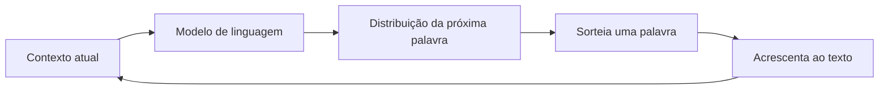

# Aula 5, IA generativa

> Esta aula apresenta a terceira grande corrente da Inteligência Artificial, a
> generativa, que não se limita a decidir ou classificar, ela cria conteúdo novo.
> É a abordagem por trás dos modelos de linguagem que vamos estudar a fundo no
> resto da trilha, e o motor que faz um assistente educacional conversar de forma
> natural.

Fechamos aqui o panorama das três abordagens do módulo. A IA simbólica decide
seguindo regras escritas à mão. A IA estatística aprende com dados e classifica ou
prevê. A IA generativa dá o passo seguinte, aprende a forma dos dados tão bem que
consegue produzir exemplos novos e plausíveis, como uma explicação inteira escrita
na hora.

Para sentir essa ideia sem mistério, vamos construir do zero um pequeno gerador de
texto baseado em probabilidades de palavras. Ele é primo distante dos grandes
modelos de linguagem, mas compartilha com eles a mesma intuição central, a de
prever a próxima palavra a partir do que veio antes. Depois, vamos comparar esse
brinquedo com um modelo de verdade rodando localmente via Ollama, para ver até onde
a mesma ideia pode chegar quando ganha escala.

---

## Objetivos

Ao final desta aula, você deve ser capaz de:

- Diferenciar modelos discriminativos de modelos generativos.
- Entender um modelo de linguagem como uma distribuição de probabilidade sobre
  sequências de palavras.
- Implementar um gerador de texto por n-gramas e gerar frases novas amostrando
  palavras.
- Conectar essa intuição aos grandes modelos de linguagem que veremos nos próximos
  módulos.

## Teoria

Para entender a IA generativa, ajuda contrastá-la com o que vimos antes. Um modelo
discriminativo, como o Naive Bayes da aula passada, aprende a fronteira entre
classes, ou seja, estima a probabilidade de um rótulo dada uma entrada,
$P(\text{classe} \mid \text{dados})$. Um modelo generativo vai além e aprende como
os próprios dados se distribuem, de modo que consegue gerar novos exemplos que
parecem ter saído da mesma fonte.

No caso do texto, o modelo generativo mais importante é o modelo de linguagem. A
sua tarefa é, dada uma sequência de palavras, prever qual vem a seguir. Essa ideia
tem raízes antigas, em Claude Shannon, que em 1948 já estudava a linguagem como uma
fonte estatística e estimava a probabilidade de letras e palavras. Décadas depois,
Bengio e colegas, em 2003, propuseram modelar essa mesma previsão com redes
neurais, e foi essa linha que, evoluindo muito, levou aos modelos de linguagem de
hoje.

A geração acontece em um laço. O modelo olha o contexto atual, prevê uma
distribuição para a próxima palavra, sorteia uma palavra dessa distribuição, anexa
ao texto e repete, agora com o contexto um pouco maior. Esse processo se chama
geração autorregressiva.



Vale lembrar que a IA generativa não se resume a texto. Há modelos que geram
imagens, como as redes adversárias de Goodfellow e colegas, de 2014, e os modelos
de difusão de Ho e colegas, de 2020. Mas, como o foco da trilha são assistentes
educacionais que conversam, vamos nos concentrar na geração de linguagem.

## Explicação Intuitiva

Pense no recurso de completar palavras do seu celular, que sugere a próxima palavra
enquanto você digita. Um modelo de linguagem é isso levado ao extremo. Em vez de
sugerir só a próxima palavra de uma mensagem curta, ele consegue continuar
parágrafos inteiros, porque aprendeu, com muito texto, quais sequências de palavras
são prováveis e quais soam estranhas.

A diferença entre o brinquedo desta aula e um modelo moderno é principalmente de
memória e de escala. O nosso gerador vai olhar apenas a palavra anterior para
decidir a próxima, então ele perde o fio do assunto rapidamente. Um modelo grande
olha um contexto enorme de uma vez e mantém a coerência por muito mais tempo. A
intuição, porém, é a mesma, e é por isso que vale a pena construir a versão simples
com as próprias mãos.

## Explicação Matemática

Um modelo de linguagem atribui uma probabilidade a uma sequência de palavras
$w_1, w_2, \dots, w_n$. Pela regra da cadeia da probabilidade, podemos escrever essa
probabilidade conjunta como um produto de probabilidades condicionais:

$$
P(w_1, w_2, \dots, w_n) = \prod_{i=1}^{n} P(w_i \mid w_1, \dots, w_{i-1}).
$$

Estimar $P(w_i \mid w_1, \dots, w_{i-1})$ com todo o histórico é difícil, então
fazemos uma aproximação de Markov, olhando apenas as últimas palavras. No caso mais
simples, o modelo de bigramas, olhamos só a palavra anterior:

$$
P(w_i \mid w_1, \dots, w_{i-1}) \approx P(w_i \mid w_{i-1}).
$$

Essas probabilidades são estimadas contando, no corpus de treino, quantas vezes
cada palavra segue cada outra. Para gerar texto, partimos de uma palavra inicial e
amostramos a próxima a partir de $P(\cdot \mid w_{i-1})$, repetindo o processo. Um
modelo de trigramas olha as duas palavras anteriores e costuma gerar texto mais
coerente, ao custo de precisar de mais dados.

## Exemplo Prático

Vamos treinar um gerador de bigramas em um pequeno corpus sobre o cotidiano de
estudo e usá-lo para criar frases novas. O resultado será simples e às vezes
engraçado, justamente porque o modelo só lembra da palavra anterior, mas já mostra a
mágica de produzir texto que não estava escrito em lugar nenhum.

Em seguida, no notebook, vamos pedir a um modelo de verdade, rodando localmente via
Ollama, que escreva uma explicação para um aluno, e comparar a diferença de
qualidade. Assim fica claro que a ideia é a mesma, mas a escala muda tudo. O código
está em
[notebooks/modulo-01/05-ia-generativa.ipynb](../../notebooks/modulo-01/05-ia-generativa.ipynb),
então abra-o ao lado para acompanhar e experimentar.

## Código Comentado

```python
import random
from collections import defaultdict

# Pequeno corpus de treino, em minúsculas e separado por espaços.
# O ponto final também é tratado como uma palavra.
corpus = (
    "o aluno estuda matemática todos os dias . "
    "o aluno resolve exercícios de matemática . "
    "a professora explica a matéria com calma . "
    "a professora corrige os exercícios do aluno . "
    "o aluno aprende matemática com a professora ."
).split()


def treinar_bigramas(tokens):
    """Para cada palavra, guarda a lista de palavras que a seguem no corpus."""
    modelo = defaultdict(list)
    for atual, proximo in zip(tokens, tokens[1:]):
        modelo[atual].append(proximo)
    return modelo


def gerar(modelo, inicio, tamanho=12):
    """Gera texto amostrando a próxima palavra a partir da anterior."""
    palavra = inicio
    saida = [palavra]
    for _ in range(tamanho):
        proximas = modelo.get(palavra)
        if not proximas:
            break  # não há continuação conhecida para esta palavra
        # random.choice já respeita a frequência, pois palavras mais
        # comuns aparecem mais vezes na lista de continuações.
        palavra = random.choice(proximas)
        saida.append(palavra)
    return " ".join(saida)


random.seed(0)  # deixa o resultado reproduzível
modelo = treinar_bigramas(corpus)

for _ in range(3):
    print(gerar(modelo, "o"))
```

Cada execução com uma semente diferente produz uma frase diferente, todas montadas a
partir das transições que o modelo observou. Repare que o texto faz algum sentido
local, de palavra para palavra, mas se perde no sentido global, porque o modelo só
enxerga a palavra anterior. Guardar essa limitação na cabeça vai ajudar a entender,
nos próximos módulos, por que os Transformers, que olham um contexto amplo de uma
vez, representaram um salto tão grande.

## Exercícios

1) Conceitual: Explique a diferença entre um modelo discriminativo e um modelo
   generativo, dando um exemplo de cada um visto na trilha.
2) Conceitual: O que diz a regra da cadeia da probabilidade aplicada a uma frase, e
   qual é a aproximação que o modelo de bigramas faz?
3) Prático: Aumente o corpus com mais frases sobre estudo e veja se o texto gerado
   fica mais variado e mais coerente.
4) Prático: Troque a palavra inicial da geração e observe como o começo muda o rumo
   da frase.
5) Extensão: Pesquise o conceito de temperatura na geração de texto e explique, em
   um parágrafo, como ele controla o equilíbrio entre texto mais previsível e mais
   criativo.

## Projeto da Aula

Construa e compare dois geradores, um de bigramas e um de trigramas, sobre o mesmo
corpus. No modelo de trigramas, a chave passa a ser o par das duas palavras
anteriores, e a previsão olha esse par para escolher a próxima palavra. Gere
algumas frases com cada um e avalie qual produz texto mais coerente.

Considere o projeto pronto quando você tiver exemplos lado a lado dos dois modelos e
um parágrafo explicando por que o trigrama tende a soar melhor, e também por que ele
precisa de mais dados para funcionar bem. Como extensão opcional, peça a um modelo
via Ollama que escreva a mesma explicação e compare com o texto dos n-gramas. Esse
exercício amarra o módulo e abre a porta para o Módulo 2, em que começamos a estudar
os fundamentos de Machine Learning com mais profundidade.

## Leituras Recomendadas

- Trechos introdutórios sobre modelos de linguagem em materiais de NLP, para ver
  n-gramas explicados com outros exemplos.
- O artigo clássico de Shannon, A Mathematical Theory of Communication, para quem
  quiser conhecer a origem da ideia de modelar linguagem com probabilidade.
- Documentação do Ollama em https://ollama.com, para entender o modelo que usamos na
  parte generativa moderna.

## Referências Científicas

As referências abaixo são reais e estão registradas em
[references/referencias.bib](../../references/referencias.bib). As chaves entre
parênteses são as do BibTeX.

- Shannon, C. E. (1948). A Mathematical Theory of Communication. The Bell System
  Technical Journal, 27(3), 379-423. (`shannon1948communication`)
- Bengio, Y., Ducharme, R., Vincent, P., e Janvin, C. (2003). A Neural Probabilistic
  Language Model. JMLR, 3, 1137-1155. (`bengio2003neural`)
- Goodfellow, I., et al. (2014). Generative Adversarial Nets. NeurIPS.
  (`goodfellow2014gan`)
- Ho, J., Jain, A., e Abbeel, P. (2020). Denoising Diffusion Probabilistic Models.
  NeurIPS. (`ho2020diffusion`)
- Brown, T. B., et al. (2020). Language Models are Few-Shot Learners. NeurIPS.
  (`brown2020gpt3`)
