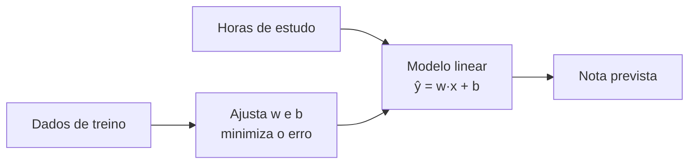

# Aula 1, Regressão

> Esta aula abre os fundamentos de Machine Learning pela regressão, a tarefa de
> prever um número a partir de outros. Vamos usar o exemplo de estimar a nota de
> um aluno com base nas horas de estudo, e construir, do zero, uma regressão linear
> treinada por gradiente descendente.

No Módulo 1 vimos, de longe, as três grandes abordagens de IA. Agora começamos a
mergulhar na que sustenta quase tudo o que vem adiante, o aprendizado a partir de
dados. E o ponto de partida natural é a regressão, porque ela mostra, no formato
mais simples possível, o ciclo completo do aprendizado supervisionado, ou seja,
partir de exemplos, ajustar um modelo e usá-lo para prever casos novos.

O exemplo que vai nos acompanhar por todo o módulo é o de prever o desempenho de
alunos. Nesta aula, queremos estimar a nota final a partir das horas de estudo. É
um problema de regressão porque a resposta é um número contínuo, não uma categoria.
Ao final, você terá implementado a regressão linear na mão, entendendo cada peça,
do modelo à função de custo e ao gradiente descendente.

---

## Objetivos

Ao final desta aula, você deve ser capaz de:

- Reconhecer quando um problema é de regressão.
- Descrever o modelo da regressão linear e o papel dos seus parâmetros.
- Entender a função de custo do erro quadrático médio e o gradiente descendente.
- Implementar uma regressão linear do zero e usá-la para prever.

## Teoria

No aprendizado supervisionado, temos um conjunto de exemplos em que cada entrada
$x$ vem acompanhada da resposta correta $y$. O objetivo é encontrar uma função que,
a partir de $x$, produza uma estimativa $\hat{y}$ próxima de $y$, e que continue
acertando para entradas novas. Quando a resposta $y$ é um número contínuo, como uma
nota, uma temperatura ou um preço, chamamos a tarefa de regressão.

A regressão linear é o modelo mais simples e um dos mais úteis. Ela supõe que a
resposta pode ser aproximada por uma reta, no caso de uma única variável de
entrada, ou por um plano, com mais variáveis. Para uma entrada, o modelo é

$$
\hat{y} = w \cdot x + b,
$$

em que $w$ é o coeficiente angular, que diz quanto a previsão muda quando $x$
aumenta uma unidade, e $b$ é o intercepto, o valor previsto quando $x$ é zero.
Treinar o modelo é justamente encontrar os valores de $w$ e $b$ que melhor ajustam
os dados.



O que significa melhor ajustar? Precisamos de uma medida de quão erradas estão as
previsões. Essa medida é a função de custo, e o procedimento que ajusta $w$ e $b$
para reduzi-la é o gradiente descendente. As próximas seções detalham essas duas
peças.

## Explicação Intuitiva

Imagine os dados como uma nuvem de pontos em um gráfico, em que o eixo horizontal é
horas de estudo e o vertical é a nota. A regressão linear procura a reta que passa
o mais perto possível de todos os pontos ao mesmo tempo. Não dá para passar por
todos, então buscamos a reta que, no conjunto, erra menos.

O gradiente descendente é a forma de achar essa reta sem adivinhação. Pense em
alguém descendo uma montanha no escuro, sentindo com o pé para que lado o chão
desce e dando um passo nessa direção, de novo e de novo, até chegar ao fundo do
vale. Aqui a montanha é o erro, e cada passo ajusta um pouco $w$ e $b$ na direção
que mais diminui esse erro. Com passos pequenos e pacientes, chegamos a uma reta
bem ajustada.

## Explicação Matemática

Para medir o erro, usamos o erro quadrático médio, conhecido pela sigla MSE. Com
$m$ exemplos, ele é a média dos quadrados das diferenças entre a previsão e o valor
real:

$$
J(w, b) = \frac{1}{m} \sum_{i=1}^{m} \left( \hat{y}^{(i)} - y^{(i)} \right)^2
        = \frac{1}{m} \sum_{i=1}^{m} \left( w x^{(i)} + b - y^{(i)} \right)^2.
$$

Elevamos ao quadrado por dois motivos, para que erros positivos e negativos não se
cancelem e para penalizar mais os erros grandes. Queremos os valores de $w$ e $b$
que tornam $J$ o menor possível.

O gradiente descendente faz isso usando as derivadas parciais de $J$, que apontam a
direção de maior crescimento do custo. Andando no sentido contrário, reduzimos o
custo. As derivadas são

$$
\frac{\partial J}{\partial w} = \frac{2}{m} \sum_{i=1}^{m}
\left( \hat{y}^{(i)} - y^{(i)} \right) x^{(i)},
\qquad
\frac{\partial J}{\partial b} = \frac{2}{m} \sum_{i=1}^{m}
\left( \hat{y}^{(i)} - y^{(i)} \right).
$$

A cada passo, atualizamos os parâmetros subtraindo o gradiente multiplicado por uma
taxa de aprendizado $\eta$, que controla o tamanho do passo:

$$
w \leftarrow w - \eta \frac{\partial J}{\partial w},
\qquad
b \leftarrow b - \eta \frac{\partial J}{\partial b}.
$$

Se $\eta$ for grande demais, os passos passam do ponto e o treino diverge. Se for
pequeno demais, o treino fica lento. Encontrar um bom valor faz parte do ofício.

## Exemplo Prático

Vamos prever a nota final de alunos a partir das horas semanais de estudo. Como não
temos um conjunto real em mãos, geramos dados sintéticos com uma tendência clara,
mais estudo tende a render nota mais alta, somada a um ruído que imita a variação
natural da vida real. Sobre esses dados, treinamos a regressão linear do zero e
observamos a reta aprendida.

A vantagem de implementar na mão é ver o gradiente descendente funcionando passo a
passo, com o custo caindo a cada iteração. O código está no notebook
[notebooks/modulo-02/01-regressao.ipynb](https://github.com/LucasSpinola/assistentes-educacionais-com-ia/blob/main/notebooks/modulo-02/01-regressao.ipynb),
então abra-o ao lado para rodar e experimentar com a taxa de aprendizado e o número
de iterações.

## Código Comentado

```python
import numpy as np

# Dados sintéticos: horas de estudo (x) e nota final (y), com ruído.
rng = np.random.default_rng(0)
horas = rng.uniform(0, 10, size=80)
# Relação verdadeira aproximada: nota = 1.2 * horas + 3, mais um ruído.
notas = 1.2 * horas + 3 + rng.normal(0, 1.0, size=80)


def treinar_regressao(x, y, taxa=0.01, iteracoes=2000):
    """Ajusta w e b por gradiente descendente, minimizando o MSE."""
    w, b = 0.0, 0.0
    m = len(x)
    for _ in range(iteracoes):
        y_prev = w * x + b
        erro = y_prev - y
        # Derivadas parciais do custo em relação a w e b.
        grad_w = (2 / m) * np.sum(erro * x)
        grad_b = (2 / m) * np.sum(erro)
        w -= taxa * grad_w
        b -= taxa * grad_b
    return w, b


w, b = treinar_regressao(horas, notas)
print(f"Modelo aprendido: nota = {w:.3f} * horas + {b:.3f}")

# Erro quadrático médio final.
mse = np.mean((w * horas + b - notas) ** 2)
print(f"MSE no treino: {mse:.3f}")

# Previsão para um aluno que estuda 6 horas por semana.
print(f"Nota prevista para 6 horas: {w * 6 + b:.2f}")
```

Ao rodar, os valores de $w$ e $b$ aprendidos ficam próximos da relação verdadeira
que usamos para gerar os dados, ainda que não idênticos, por causa do ruído. Isso é
exatamente o que esperamos de um bom modelo, capturar a tendência sem decorar o
ruído, tema que vamos aprofundar na aula sobre overfitting.

## Exercícios

1) Conceitual: Dê três exemplos de problemas de regressão no contexto educacional,
   diferentes do usado na aula.
2) Conceitual: Explique, com suas palavras, o papel da taxa de aprendizado no
   gradiente descendente. O que acontece se ela for alta demais?
3) Prático: Aumente o ruído na geração dos dados e observe o efeito sobre o MSE e
   sobre os parâmetros aprendidos.
4) Prático: Experimente diferentes taxas de aprendizado, como 0.001, 0.01 e 0.1, e
   registre quais convergem bem e quais falham.
5) Extensão: Modifique o código para usar duas variáveis de entrada, por exemplo
   horas de estudo e frequência às aulas, e ajuste o modelo para esse caso.

## Projeto da Aula

Construa um pequeno preditor de notas e avalie a sua qualidade. A entrega é um
programa que treina a regressão linear sobre os dados sintéticos, mostra a reta
aprendida e calcula o erro médio das previsões. Em seguida, gere um segundo
conjunto de dados, com a mesma regra, e meça o erro do modelo nesses dados novos,
que ele não viu no treino.

Considere o projeto pronto quando você conseguir comparar o erro nos dados de treino
com o erro nos dados novos e comentar, em um parágrafo, o que essa diferença diz
sobre a capacidade do modelo de generalizar. Essa comparação entre treino e dados
novos é a semente das aulas de overfitting e de validação, que vêm a seguir.

## Leituras Recomendadas

- Capítulo sobre regressão linear em James e colegas, An Introduction to
  Statistical Learning, uma das introduções mais acessíveis ao tema.
- Seções sobre gradiente descendente em Goodfellow e colegas, Deep Learning, para
  ligar a otimização ao resto do aprendizado de máquina.
- Documentação do scikit-learn sobre regressão linear, útil para comparar a sua
  implementação com a de uma biblioteca madura.

## Referências Científicas

As referências abaixo são reais e estão registradas em
[references/referencias.bib](../../references/referencias.bib). As chaves entre
parênteses são as do BibTeX.

- James, G., Witten, D., Hastie, T., e Tibshirani, R. (2013). An Introduction to
  Statistical Learning. Springer. (`james2013islr`)
- Hastie, T., Tibshirani, R., e Friedman, J. (2009). The Elements of Statistical
  Learning, 2ª edição. Springer. (`hastie2009esl`)
- Bishop, C. M. (2006). Pattern Recognition and Machine Learning. Springer.
  (`bishop2006prml`)
- Goodfellow, I., Bengio, Y., e Courville, A. (2016). Deep Learning. MIT Press.
  (`goodfellow2016deep`)
