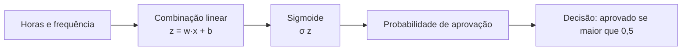

# Aula 2, Classificação

> Esta aula trata da classificação, a tarefa de prever a qual categoria algo
> pertence. Seguindo o fio do módulo, vamos prever se um aluno será aprovado ou
> reprovado, e construir do zero uma regressão logística, o classificador
> probabilístico mais clássico.

Na aula passada, previmos um número, a nota de um aluno. Muitas decisões, porém,
não são sobre um número e sim sobre uma categoria. O aluno vai ser aprovado ou não?
Esta mensagem é uma dúvida de conteúdo ou um problema técnico? Esse tipo de pergunta
define um problema de classificação, em que a resposta é uma entre algumas
possibilidades discretas.

A boa notícia é que a estrutura é a mesma da regressão. Continuamos partindo de
exemplos rotulados, ajustando um modelo e usando-o para prever. A diferença está na
saída, que agora é uma classe, e na forma de medir o erro. Nesta aula você vai
entender a regressão logística, que transforma uma combinação linear em uma
probabilidade, e vai implementá-la na mão para prever aprovação a partir de horas de
estudo e frequência.

---

## Objetivos

Ao final desta aula, você deve ser capaz de:

- Distinguir um problema de classificação de um de regressão.
- Entender como a função sigmoide transforma um valor em probabilidade.
- Descrever a regressão logística e a sua função de custo, a entropia cruzada.
- Implementar a regressão logística do zero e avaliar a sua acurácia.

## Teoria

Na classificação, cada exemplo pertence a uma categoria, e o modelo precisa prever
qual. No caso mais simples, a classificação binária, há apenas duas classes, que
costumamos representar por 0 e 1. No nosso exemplo, 1 significa aprovado e 0
significa reprovado.

Poderíamos pensar em usar a regressão linear direto, mas ela produz qualquer número
real, inclusive valores negativos ou acima de 1, que não fazem sentido como
probabilidade. A regressão logística resolve isso passando a combinação linear por
uma função que espreme o resultado para o intervalo entre 0 e 1, a função sigmoide.
O modelo estima a probabilidade de a classe ser 1:

$$
P(y = 1 \mid x) = \sigma(w \cdot x + b),
\qquad
\sigma(z) = \frac{1}{1 + e^{-z}}.
$$

Para decidir a classe, comparamos essa probabilidade com um limiar, em geral 0,5. Se
a probabilidade prevista for maior que o limiar, classificamos como 1, senão como
0. O ponto em que a probabilidade é exatamente 0,5 define a fronteira de decisão.



## Explicação Intuitiva

Pense na sigmoide como um amassador suave. Ela pega qualquer número, por mais alto
ou baixo que seja, e o devolve entre 0 e 1. Valores bem positivos viram
probabilidades perto de 1, valores bem negativos viram perto de 0, e o meio fica
numa transição suave. Assim, em vez de uma resposta seca de sim ou não, o modelo dá
um grau de confiança.

A fronteira de decisão é a linha imaginária que separa as duas classes. De um lado,
o modelo aposta em aprovado, do outro, em reprovado. Aprender o modelo é mover essa
linha para o lugar que melhor separa os exemplos que temos, do mesmo jeito que a
regressão movia a reta para perto dos pontos, só que agora o objetivo é separar, e
não passar perto.

## Explicação Matemática

Para treinar, precisamos de uma função de custo adequada à probabilidade. A escolha
natural é a entropia cruzada, também chamada de log loss. Para um exemplo com
rótulo $y$ e probabilidade prevista $\hat{y} = \sigma(w x + b)$, o custo é

$$
L(\hat{y}, y) = -\left[\, y \log(\hat{y}) + (1 - y)\log(1 - \hat{y}) \,\right].
$$

A intuição é elegante. Quando o rótulo é 1, só o primeiro termo conta, e o custo
cresce conforme $\hat{y}$ se afasta de 1. Quando o rótulo é 0, só o segundo termo
conta, penalizando previsões longe de 0. O custo total é a média sobre os $m$
exemplos:

$$
J(w, b) = \frac{1}{m} \sum_{i=1}^{m} L\left(\hat{y}^{(i)}, y^{(i)}\right).
$$

Um resultado conveniente é que, apesar de a entropia cruzada parecer complicada, as
suas derivadas em relação a $w$ e $b$ têm a mesma forma simples que vimos na
regressão linear:

$$
\frac{\partial J}{\partial w} = \frac{1}{m} \sum_{i=1}^{m}
\left( \hat{y}^{(i)} - y^{(i)} \right) x^{(i)},
\qquad
\frac{\partial J}{\partial b} = \frac{1}{m} \sum_{i=1}^{m}
\left( \hat{y}^{(i)} - y^{(i)} \right).
$$

Por isso o gradiente descendente funciona quase igual ao da aula anterior, só
trocando a previsão linear pela previsão com a sigmoide.

## Exemplo Prático

Vamos prever a aprovação de alunos a partir de duas informações, as horas de estudo
e a frequência às aulas. Geramos dados sintéticos em que alunos que estudam mais e
frequentam mais tendem a ser aprovados, com alguma sobreposição entre os grupos,
como acontece na realidade. Sobre esses dados, treinamos a regressão logística do
zero e medimos quantos exemplos ela acerta.

Implementar na mão deixa claro que a classificação não é tão diferente da regressão,
muda a função que produz a saída e a forma de medir o erro, mas o motor de
otimização é o mesmo. O código está no notebook
[notebooks/modulo-02/02-classificacao.ipynb](https://github.com/LucasSpinola/assistentes-educacionais-com-ia/blob/main/notebooks/modulo-02/02-classificacao.ipynb),
então abra-o ao lado para acompanhar.

## Código Comentado

```python
import numpy as np

rng = np.random.default_rng(1)

# Dados sintéticos com duas variáveis: horas de estudo e frequência (0 a 1).
n = 200
horas = rng.uniform(0, 10, size=n)
frequencia = rng.uniform(0, 1, size=n)

# Regra latente: estudar e frequentar empurram para a aprovação, com ruído.
score = 0.6 * horas + 4 * frequencia - 4 + rng.normal(0, 1, size=n)
aprovado = (score > 0).astype(int)

# Empilha as variáveis em uma matriz de formato (n, 2).
X = np.column_stack([horas, frequencia])


def sigmoide(z):
    return 1 / (1 + np.exp(-z))


def treinar_logistica(X, y, taxa=0.1, iteracoes=5000):
    """Ajusta os pesos por gradiente descendente, minimizando a entropia cruzada."""
    m, n_features = X.shape
    w = np.zeros(n_features)
    b = 0.0
    for _ in range(iteracoes):
        y_prev = sigmoide(X @ w + b)
        erro = y_prev - y
        grad_w = (X.T @ erro) / m
        grad_b = np.mean(erro)
        w -= taxa * grad_w
        b -= taxa * grad_b
    return w, b


w, b = treinar_logistica(X, aprovado)

# Acurácia: fração de exemplos classificados corretamente.
prob = sigmoide(X @ w + b)
previsto = (prob >= 0.5).astype(int)
acuracia = np.mean(previsto == aprovado)
print(f"Pesos aprendidos: {w}, viés: {b:.3f}")
print(f"Acurácia no treino: {acuracia:.2%}")

# Probabilidade de aprovação de um aluno com 7 horas e frequência 0,8.
novo = np.array([7, 0.8])
print(f"Probabilidade de aprovação: {sigmoide(novo @ w + b):.2%}")
```

A acurácia costuma ficar alta, mas não perfeita, porque há sobreposição entre os
grupos, o que é realista. Repare também que o modelo entrega uma probabilidade, e
não só um rótulo, o que é valioso em educação, pois permite distinguir um aluno no
limite da aprovação de outro com folga.

## Exercícios

1) Conceitual: Por que não usamos a regressão linear pura para prever uma
   probabilidade? O que a sigmoide resolve?
2) Conceitual: Explique em palavras o que a entropia cruzada penaliza quando o
   rótulo correto é 1.
3) Prático: Mude o limiar de decisão de 0,5 para 0,7 e observe o efeito sobre quem é
   classificado como aprovado. Em que situação isso seria desejável?
4) Prático: Treine usando apenas uma das variáveis e compare a acurácia com a do
   modelo que usa as duas.
5) Extensão: A acurácia pode enganar quando as classes são desbalanceadas. Pesquise
   o que são precisão e revocação e por que elas complementam a acurácia.

## Projeto da Aula

Monte um classificador de aprovação e analise os seus erros. A entrega é um programa
que treina a regressão logística sobre os dados sintéticos, calcula a acurácia e
constrói uma matriz de confusão simples, contando quantos aprovados e reprovados
foram classificados certo e errado.

Considere o projeto pronto quando você tiver a acurácia e a matriz de confusão, e um
parágrafo discutindo onde o modelo mais erra, por exemplo nos alunos perto da
fronteira de decisão. Esse olhar para os erros, e não só para o acerto total,
prepara o terreno para a aula de validação, em que vamos medir desempenho com mais
cuidado.

## Leituras Recomendadas

- Capítulo sobre regressão logística em James e colegas, An Introduction to
  Statistical Learning.
- Seções sobre classificação linear em Bishop, Pattern Recognition and Machine
  Learning, para um tratamento mais formal.
- Documentação do scikit-learn sobre `LogisticRegression`, para comparar a sua
  implementação com a da biblioteca.

## Referências Científicas

As referências abaixo são reais e estão registradas em
[references/referencias.bib](../../references/referencias.bib). As chaves entre
parênteses são as do BibTeX.

- James, G., Witten, D., Hastie, T., e Tibshirani, R. (2013). An Introduction to
  Statistical Learning. Springer. (`james2013islr`)
- Bishop, C. M. (2006). Pattern Recognition and Machine Learning. Springer.
  (`bishop2006prml`)
- Hastie, T., Tibshirani, R., e Friedman, J. (2009). The Elements of Statistical
  Learning, 2ª edição. Springer. (`hastie2009esl`)
- Mitchell, T. M. (1997). Machine Learning. McGraw-Hill. (`mitchell1997machine`)
