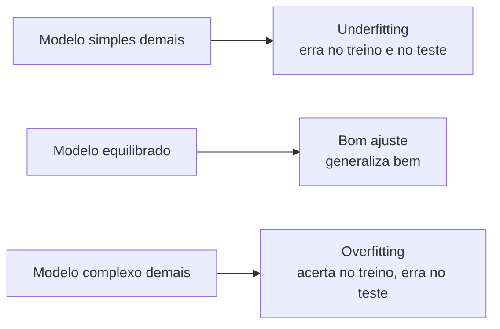

# Aula 3, Overfitting e underfitting

> Esta aula trata do equilíbrio mais importante do aprendizado de máquina, o que
> existe entre um modelo simples demais e um modelo complexo demais. Vamos ver, com
> dados de alunos, o que são underfitting e overfitting, e como a diferença entre o
> erro de treino e o erro em dados novos revela cada um deles.

Nas duas aulas anteriores, treinamos modelos e medimos o erro nos próprios dados de
treino. Mas há uma armadilha nisso. Um modelo pode ir muito bem nos dados que viu e,
ainda assim, fracassar diante de exemplos novos. O que de fato importa é a
generalização, o desempenho em dados que o modelo nunca encontrou. Esta aula é sobre
os dois jeitos de errar a generalização.

De um lado está o underfitting, quando o modelo é simples demais e não captura nem o
padrão dos dados de treino. Do outro está o overfitting, quando o modelo é complexo
demais e decora os dados de treino, ruído incluído, perdendo a capacidade de
generalizar. Entender esse equilíbrio é o que separa quem treina um modelo de quem
treina um modelo confiável, e é a base da aula de validação que vem a seguir.

---

## Objetivos

Ao final desta aula, você deve ser capaz de:

- Definir overfitting e underfitting e reconhecer cada um na prática.
- Relacionar a complexidade do modelo com os erros de treino e de teste.
- Entender a ideia de equilíbrio entre viés e variância.
- Usar a diferença entre erro de treino e erro de teste como diagnóstico.

## Teoria

Todo modelo tem uma capacidade, que é a sua liberdade para se ajustar aos dados. Uma
reta tem capacidade baixa, pois só consegue representar relações lineares. Um
polinômio de grau alto tem capacidade grande, pois consegue fazer curvas bem
complicadas. A capacidade certa depende do problema.

Quando a capacidade é baixa demais para o padrão real dos dados, temos
underfitting. O modelo erra muito já no treino, porque nem o padrão básico ele
consegue representar. Quando a capacidade é alta demais, temos overfitting. O modelo
acerta quase tudo no treino, mas porque memorizou detalhes e ruído que não se
repetem em dados novos, então erra ao generalizar.



A forma clássica de enxergar isso é acompanhar dois erros conforme a complexidade
cresce, o erro de treino e o erro de teste. O erro de treino quase sempre cai quando
aumentamos a complexidade. Já o erro de teste costuma desenhar um U, ele cai
enquanto o modelo aprende o padrão útil e volta a subir quando o modelo começa a
decorar ruído. O fundo desse U marca a complexidade ideal.

## Explicação Intuitiva

Pense em dois alunos se preparando para uma prova. O primeiro estudou de menos e mal
entendeu o assunto, então vai mal na prova inteira, tanto nas questões que já tinha
visto quanto nas novas. Esse é o underfitting. O segundo decorou as respostas da
lista de exercícios sem entender o raciocínio. Ele acerta exatamente aquelas
questões, mas trava em qualquer pergunta um pouco diferente. Esse é o overfitting.

O aluno ideal é o terceiro, que entendeu o método e resolve tanto as questões
conhecidas quanto as novas. Em aprendizado de máquina, queremos sempre esse terceiro
aluno, um modelo que captou o padrão geral sem se prender aos detalhes irrelevantes
do material de estudo.

## Explicação Matemática

Uma forma útil de pensar o erro é decompô-lo em duas fontes, o viés e a variância. O
viés mede o quanto o modelo erra por ser simples demais, por fazer suposições que
não dão conta do padrão real. A variância mede o quanto as previsões mudam quando
trocamos os dados de treino, ou seja, o quanto o modelo é sensível a detalhes
específicos da amostra.

Modelos simples têm viés alto e variância baixa, o que leva ao underfitting. Modelos
complexos têm viés baixo e variância alta, o que leva ao overfitting. O erro
esperado em dados novos pode ser entendido, de forma aproximada, como a soma dessas
parcelas mais um ruído irredutível:

$$
\text{Erro esperado} \approx \text{viés}^2 + \text{variância} + \text{ruído}.
$$

Esse é o dilema do viés e da variância, formalizado por Geman e colegas. Reduzir um
costuma aumentar o outro, e o objetivo é encontrar o ponto de menor erro total. Uma
ferramenta comum para conter a variância é a regularização, que adiciona ao custo
uma penalidade sobre o tamanho dos parâmetros, por exemplo $\lambda \lVert w
\rVert^2$, desencorajando ajustes exagerados.

## Exemplo Prático

Vamos ver o U do erro de teste com as próprias mãos. Geramos dados de alunos a
partir de uma relação suavemente curva entre horas de estudo e nota, com ruído.
Depois, ajustamos polinômios de grau crescente, de uma reta até curvas bem
flexíveis, e acompanhamos o erro no treino e em um conjunto de teste separado.

O grau baixo vai mostrar underfitting, com erro alto nos dois conjuntos. O grau alto
vai mostrar overfitting, com erro baixo no treino e alto no teste. Em algum grau
intermediário está o melhor equilíbrio. O código está no notebook
[notebooks/modulo-02/03-overfitting-underfitting.ipynb](../../notebooks/modulo-02/03-overfitting-underfitting.ipynb),
então abra-o ao lado para acompanhar.

## Código Comentado

```python
import numpy as np

rng = np.random.default_rng(2)

# Relação verdadeira levemente curva entre horas e nota, com ruído.
def relacao_real(x):
    return 4 + 1.5 * x - 0.08 * x**2


horas = rng.uniform(0, 10, size=60)
notas = relacao_real(horas) + rng.normal(0, 0.8, size=60)

# Separa em treino e teste, sem deixar o modelo ver o teste no ajuste.
indices = rng.permutation(len(horas))
treino, teste = indices[:40], indices[40:]
x_tr, y_tr = horas[treino], notas[treino]
x_te, y_te = horas[teste], notas[teste]


def mse(y_real, y_prev):
    return np.mean((y_real - y_prev) ** 2)


print(f"{'grau':>4} {'erro treino':>12} {'erro teste':>12}")
for grau in range(1, 11):
    # np.polyfit ajusta um polinômio do grau pedido pelos mínimos quadrados.
    coef = np.polyfit(x_tr, y_tr, grau)
    erro_tr = mse(y_tr, np.polyval(coef, x_tr))
    erro_te = mse(y_te, np.polyval(coef, x_te))
    print(f"{grau:>4} {erro_tr:>12.3f} {erro_te:>12.3f}")
```

Ao rodar, observe o padrão. O erro de treino cai de forma quase monótona conforme o
grau aumenta, porque o polinômio fica cada vez mais livre para passar perto dos
pontos de treino. Já o erro de teste cai no começo e, a partir de certo grau, volta
a subir, sinalizando o overfitting. O grau em que o erro de teste é menor é o que
melhor equilibra simplicidade e flexibilidade para estes dados.

## Exercícios

1) Conceitual: Descreva, com suas palavras, a diferença entre underfitting e
   overfitting, e como cada um aparece nos erros de treino e de teste.
2) Conceitual: O que é o dilema do viés e da variância? Por que não dá para zerar os
   dois ao mesmo tempo?
3) Prático: Aumente o tamanho do conjunto de dados e veja se os graus altos passam a
   sofrer menos overfitting. Por que isso acontece?
4) Prático: Aumente o ruído na geração das notas e observe como o grau ideal muda.
5) Extensão: Pesquise a regularização L2, conhecida como Ridge, e explique como a
   penalidade sobre os pesos ajuda a conter o overfitting.

## Projeto da Aula

Construa um diagnóstico visual de overfitting. A entrega é um experimento que ajusta
polinômios de vários graus aos dados de alunos, registra o erro de treino e o erro
de teste de cada grau e mostra os dois lado a lado, em uma tabela ou em um gráfico.

Considere o projeto pronto quando você conseguir apontar, a partir dos números, qual
grau sofre underfitting, qual sofre overfitting e qual oferece o melhor equilíbrio,
escrevendo um parágrafo que justifique a escolha. Saber ler esses sinais é uma
habilidade central, e é exatamente o que a aula de validação vai sistematizar com
técnicas mais robustas.

## Leituras Recomendadas

- Capítulo sobre o equilíbrio entre viés e variância em James e colegas, An
  Introduction to Statistical Learning.
- Artigo de Domingos, A Few Useful Things to Know about Machine Learning, que trata
  overfitting de forma muito clara.
- Seções sobre regularização em Hastie e colegas, The Elements of Statistical
  Learning.

## Referências Científicas

As referências abaixo são reais e estão registradas em
[references/referencias.bib](../../references/referencias.bib). As chaves entre
parênteses são as do BibTeX.

- Geman, S., Bienenstock, E., e Doursat, R. (1992). Neural Networks and the
  Bias/Variance Dilemma. Neural Computation, 4(1), 1-58. (`geman1992bias`)
- Domingos, P. (2012). A Few Useful Things to Know about Machine Learning.
  Communications of the ACM, 55(10), 78-87. (`domingos2012useful`)
- James, G., Witten, D., Hastie, T., e Tibshirani, R. (2013). An Introduction to
  Statistical Learning. Springer. (`james2013islr`)
- Hastie, T., Tibshirani, R., e Friedman, J. (2009). The Elements of Statistical
  Learning, 2ª edição. Springer. (`hastie2009esl`)
