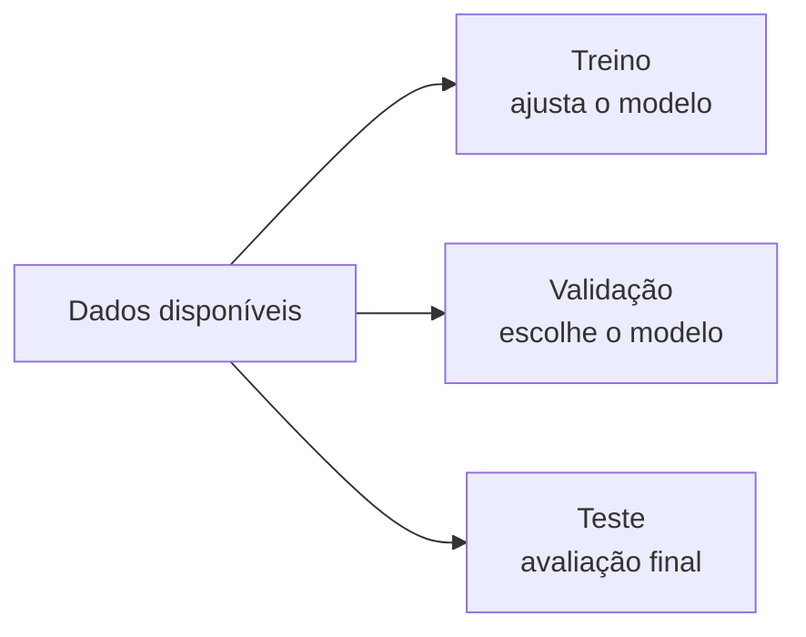

# Aula 4, Validação

> Esta aula encerra os fundamentos de Machine Learning com a pergunta mais
> prática de todas, como saber se um modelo é bom de verdade. Vamos separar dados
> com honestidade, conhecer a validação cruzada e implementá-la do zero para
> estimar, de forma confiável, o desempenho de um classificador de alunos.

A aula sobre overfitting deixou uma lição clara, o erro de treino engana. Um modelo
pode ir muito bem nos dados que viu e mal nos dados novos, que são os que importam.
A validação é o conjunto de boas práticas que nos protege desse engano, permitindo
estimar como o modelo se comportará no mundo real antes de colocá-lo para valer.

Sem validação, todo o resto fica em risco, porque podemos escolher o modelo errado
achando que escolhemos o certo. Nesta aula você vai entender por que separamos os
dados em partes distintas, como a validação cruzada aproveita melhor um conjunto
pequeno, e vai implementar a validação cruzada na mão para avaliar um classificador.
No fim, esse conhecimento se junta ao das aulas anteriores no projeto que fecha o
módulo.

---

## Objetivos

Ao final desta aula, você deve ser capaz de:

- Explicar o papel dos conjuntos de treino, validação e teste.
- Entender a validação cruzada por k dobras e quando usá-la.
- Implementar a validação cruzada do zero e interpretar o resultado.
- Reconhecer erros comuns, como o vazamento de dados.

## Teoria

A ideia central é simples, nunca avalie o modelo nos mesmos dados em que ele treinou.
Para isso, separamos os dados disponíveis. O conjunto de treino serve para ajustar o
modelo. O conjunto de teste, guardado e nunca usado no ajuste, serve para a
avaliação final e honesta. Quando também precisamos comparar modelos ou escolher
configurações, usamos um terceiro conjunto, o de validação, para não contaminar o
teste.



Quando os dados são poucos, separar uma fatia grande só para validar é um
desperdício. A validação cruzada por k dobras resolve isso. Dividimos os dados em k
partes iguais, as dobras. Treinamos o modelo k vezes, e em cada rodada usamos uma
dobra diferente como validação e as outras como treino. No final, a estimativa de
desempenho é a média dos k resultados. Assim, cada exemplo serve ora para treinar,
ora para validar, e aproveitamos melhor um conjunto pequeno.

Um cuidado constante é evitar o vazamento de dados, que acontece quando informação
do teste escapa para o treino, por exemplo ao calcular uma normalização usando o
conjunto inteiro antes de separar. O vazamento infla o desempenho aparente e
esconde o overfitting, então a regra é separar primeiro e só depois processar.

## Explicação Intuitiva

Pense na validação cruzada como estudar com vários simulados. Em vez de apostar tudo
em um único simulado, que pode calhar de ser fácil ou difícil, você faz vários, cada
um cobrindo uma parte diferente da matéria, e olha a média das notas. Essa média é
uma estimativa mais estável do seu preparo do que a nota de um simulado só.

A regra de ouro continua sendo não estudar pela prova real. O conjunto de teste é
como a prova final lacrada, que você só abre no fim. Se você espiar e ajustar o
estudo a ela, a sua nota deixa de medir o que você realmente aprendeu. Em
aprendizado de máquina, espiar o teste é uma das formas mais comuns de se enganar.

## Explicação Matemática

Na validação cruzada por k dobras, particionamos o conjunto de dados em k
subconjuntos disjuntos $D_1, D_2, \dots, D_k$ de tamanhos parecidos. Para cada dobra
$j$, treinamos o modelo nos dados sem essa dobra e medimos o erro na dobra que ficou
de fora. Chamando esse erro de $E_j$, a estimativa por validação cruzada é a média

$$
E_{\text{CV}} = \frac{1}{k} \sum_{j=1}^{k} E_j.
$$

Valores comuns de $k$ são 5 e 10, que equilibram custo e estabilidade da estimativa.
No extremo em que $k$ é igual ao número de exemplos, cada dobra tem um único exemplo,
e o método se chama leave-one-out. Além da média, costuma valer a pena olhar a
variação entre as dobras, pois uma variação grande indica que o desempenho depende
bastante de quais exemplos caíram no treino, um sinal a investigar. Essa abordagem
foi estudada em detalhe por Kohavi, que comparou a validação cruzada com outras
estratégias.

## Exemplo Prático

Vamos avaliar, com validação cruzada, um classificador que prevê a aprovação de
alunos. Reaproveitamos a regressão logística que construímos na aula de
classificação e a colocamos à prova com k dobras, em vez de confiar em uma única
divisão dos dados. O resultado é uma estimativa de acurácia mais confiável, com a
média e a variação entre as dobras.

Implementar a validação cruzada na mão deixa claro que não há mágica, apenas uma
forma disciplinada de reaproveitar os dados sem trapacear. O código está no notebook
[notebooks/modulo-02/04-validacao.ipynb](https://github.com/LucasSpinola/assistentes-educacionais-com-ia/blob/main/notebooks/modulo-02/04-validacao.ipynb),
então abra-o ao lado para acompanhar.

## Código Comentado

```python
import numpy as np

rng = np.random.default_rng(3)

# Mesmos dados de aprovação da aula de classificação.
n = 200
horas = rng.uniform(0, 10, size=n)
frequencia = rng.uniform(0, 1, size=n)
score = 0.6 * horas + 4 * frequencia - 4 + rng.normal(0, 1, size=n)
aprovado = (score > 0).astype(int)
X = np.column_stack([horas, frequencia])


def sigmoide(z):
    return 1 / (1 + np.exp(-z))


def treinar_logistica(X, y, taxa=0.1, iteracoes=3000):
    w = np.zeros(X.shape[1])
    b = 0.0
    for _ in range(iteracoes):
        erro = sigmoide(X @ w + b) - y
        w -= taxa * (X.T @ erro) / len(y)
        b -= taxa * np.mean(erro)
    return w, b


def acuracia(X, y, w, b):
    previsto = (sigmoide(X @ w + b) >= 0.5).astype(int)
    return np.mean(previsto == y)


def validacao_cruzada(X, y, k=5):
    """Estima a acurácia média por validação cruzada de k dobras."""
    indices = rng.permutation(len(y))
    dobras = np.array_split(indices, k)
    resultados = []
    for j in range(k):
        idx_val = dobras[j]
        idx_tr = np.concatenate([dobras[i] for i in range(k) if i != j])
        w, b = treinar_logistica(X[idx_tr], y[idx_tr])
        resultados.append(acuracia(X[idx_val], y[idx_val], w, b))
    return np.array(resultados)


resultados = validacao_cruzada(X, aprovado, k=5)
for j, acc in enumerate(resultados, start=1):
    print(f"Dobra {j}: acurácia {acc:.2%}")
print(f"\nMédia: {resultados.mean():.2%}  |  desvio: {resultados.std():.2%}")
```

A acurácia média das dobras é uma estimativa mais confiável do que a de uma única
divisão, e o desvio entre as dobras mostra o quanto esse número é estável. Se uma
dobra destoasse muito das demais, valeria investigar se há algo peculiar naqueles
exemplos.

## Exercícios

1) Conceitual: Por que não devemos avaliar o modelo nos mesmos dados em que ele
   treinou? O que essa avaliação tende a mostrar?
2) Conceitual: Explique a diferença entre o conjunto de validação e o de teste.
3) Prático: Mude o número de dobras de 5 para 10 e observe o efeito sobre a média e
   o desvio da acurácia.
4) Prático: Provoque um vazamento de dados de propósito, por exemplo normalizando
   `X` com todos os dados antes de separar as dobras, e veja se a acurácia estimada
   muda de forma enganosa.
5) Extensão: Pesquise a validação cruzada estratificada e explique por que ela é
   importante quando as classes estão desbalanceadas.

## Projeto da Aula e Projeto do Módulo

Este projeto fecha o módulo inteiro. A entrega é um experimento completo que treina
e avalia um classificador de aprovação de alunos comparando, de forma honesta, o
desempenho no treino com o desempenho em validação.

O roteiro sugerido é o seguinte. Gere o conjunto de alunos com horas de estudo e
frequência. Treine a regressão logística e meça a acurácia no próprio treino. Em
seguida, estime a acurácia por validação cruzada de cinco dobras. Por fim, compare os
dois números e discuta a diferença, ligando com o que você aprendeu sobre
overfitting. Como extensão, repita o experimento variando a complexidade, por
exemplo acrescentando termos polinomiais das variáveis, e veja se a acurácia de
validação melhora ou piora.

Considere o projeto pronto quando você tiver, em um mesmo relatório curto, a acurácia
de treino, a acurácia de validação cruzada com média e desvio, e um parágrafo que
interprete a diferença entre elas. Com isso, você terá percorrido o ciclo completo
do aprendizado supervisionado, do modelo à avaliação confiável, que é a base para
todos os módulos seguintes.

## Leituras Recomendadas

- Capítulo sobre reamostragem e validação cruzada em James e colegas, An
  Introduction to Statistical Learning.
- Artigo de Kohavi sobre validação cruzada, para entender as escolhas de projeto do
  método.
- Documentação do scikit-learn sobre validação cruzada e `cross_val_score`, para
  comparar a sua implementação com a da biblioteca.

## Referências Científicas

As referências abaixo são reais e estão registradas em
[references/referencias.bib](../../references/referencias.bib). As chaves entre
parênteses são as do BibTeX.

- Kohavi, R. (1995). A Study of Cross-Validation and Bootstrap for Accuracy
  Estimation and Model Selection. IJCAI. (`kohavi1995cv`)
- James, G., Witten, D., Hastie, T., e Tibshirani, R. (2013). An Introduction to
  Statistical Learning. Springer. (`james2013islr`)
- Hastie, T., Tibshirani, R., e Friedman, J. (2009). The Elements of Statistical
  Learning, 2ª edição. Springer. (`hastie2009esl`)
- Bishop, C. M. (2006). Pattern Recognition and Machine Learning. Springer.
  (`bishop2006prml`)
