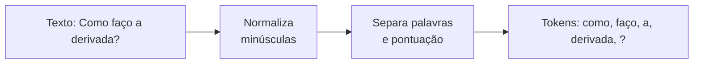

# Aula 1, Tokenização

> Esta aula abre os fundamentos de NLP pelo primeiro passo de qualquer
> processamento de texto, a tokenização, que é quebrar o texto em unidades
> menores. Vamos tokenizar perguntas de alunos e construir, do zero, um
> tokenizador que lida bem com pontuação.

Computadores não entendem texto do jeito que entendem números. Antes de qualquer
modelo de linguagem, de uma busca ou de um classificador, precisamos transformar
frases em pedaços manipuláveis. Esse primeiro recorte é a tokenização, e ela é tão
básica que costuma passar despercebida, mas decisões erradas aqui contaminam tudo o
que vem depois.

Este é o ponto de partida de um fio que vai atravessar o módulo inteiro. Vamos pegar
perguntas reais de alunos, do tipo que um assistente educacional recebe o tempo
todo, e prepará-las passo a passo até conseguir classificá-las por tema. Tudo começa
cortando o texto em tokens. Ao final desta aula, você terá um tokenizador próprio e
entenderá por que ele é mais sutil do que apenas separar por espaços.

---

## Objetivos

Ao final desta aula, você deve ser capaz de:

- Explicar o que é tokenização e por que ela é o primeiro passo do NLP.
- Reconhecer os problemas de tokenizar apenas pelos espaços.
- Implementar um tokenizador simples que trata pontuação e maiúsculas.
- Entender, em linhas gerais, o que é tokenização por subpalavras.

## Teoria

Tokenizar é dividir um texto em unidades chamadas tokens. Na maioria das vezes, um
token é uma palavra, mas pode ser também um sinal de pontuação, um número ou até um
pedaço de palavra. A escolha do que conta como token depende da tarefa e do idioma.

A abordagem mais ingênua é separar pelos espaços em branco. Ela funciona em parte,
mas tropeça em vários casos. A pontuação gruda nas palavras, então derivada? e
derivada viram tokens diferentes. Maiúsculas e minúsculas criam duplicatas, como
Função e função. Contrações e abreviações, comuns em português, complicam ainda
mais. Por isso, mesmo um tokenizador simples precisa de algumas regras além do
espaço.



Há também um nível mais fino, a tokenização por subpalavras, em que palavras raras
são quebradas em pedaços menores e reutilizáveis. Técnicas como o BPE, proposto para
tradução automática por Sennrich e colegas, são a base dos tokenizadores dos grandes
modelos de linguagem que veremos adiante. Por enquanto, ficamos no nível das
palavras, que é o suficiente para os métodos clássicos deste módulo.

## Explicação Intuitiva

Pense em tokenizar como preparar ingredientes antes de cozinhar. Você não joga uma
cebola inteira na panela, você corta em pedaços de tamanho útil. Com texto é igual,
o modelo não trabalha bem com a frase inteira de uma vez, ele precisa dos pedaços já
cortados e organizados.

A diferença entre um corte ruim e um bom aparece na contagem. Se a pontuação fica
grudada, o computador acha que derivada e derivada? são duas coisas distintas, e a
contagem de palavras se espalha à toa. Um bom tokenizador separa esses casos, de
modo que cada palavra seja contada como ela mesma, independentemente da pontuação ou
da caixa das letras.

## Explicação Matemática

A tokenização em si é mais uma operação de texto do que de matemática, mas ela
define duas quantidades que vão importar nas próximas aulas. A primeira é o número de
tokens de um documento, o seu tamanho em palavras. A segunda é o vocabulário, o
conjunto de tokens distintos que aparecem na coleção, cujo tamanho chamamos de $|V|$.

Vale distinguir tipos de ocorrências. Se a palavra função aparece cinco vezes, são
cinco tokens, mas um único tipo. A razão entre o número de tipos e o número de
tokens dá uma ideia da diversidade lexical de um texto. Essas noções simples
sustentam as representações vetoriais que vamos construir em Bag of Words e TF-IDF.

## Exemplo Prático

Vamos tokenizar um pequeno conjunto de perguntas de alunos sobre cálculo, álgebra e
programação. Primeiro com a separação ingênua por espaços, para ver os problemas, e
depois com um tokenizador que normaliza para minúsculas e separa a pontuação. A
comparação deixa claro por que o segundo é melhor.

Esse mesmo conjunto de perguntas vai reaparecer nas próximas aulas, ganhando uma
etapa de processamento de cada vez, até virar a entrada de um classificador de tema.
O código está no notebook
[notebooks/modulo-03/01-tokenizacao.ipynb](../../notebooks/modulo-03/01-tokenizacao.ipynb),
então abra-o ao lado para acompanhar.

## Código Comentado

```python
import re

perguntas = [
    "Como faço a derivada de uma função?",
    "Qual é a regra da cadeia na derivada?",
    "Como resolvo um sistema linear com matrizes?",
    "O que é um autovetor de uma matriz?",
    "Como declaro uma função em Python?",
    "O que é um laço de repetição em Python?",
]


def tokenizar_ingenuo(texto):
    """Separa apenas pelos espaços, sem tratar pontuação ou maiúsculas."""
    return texto.split()


def tokenizar(texto):
    """Normaliza para minúsculas e separa palavras e pontuação."""
    texto = texto.lower()
    # \w+ captura sequências de letras e números, [^\w\s] captura pontuação.
    return re.findall(r"\w+|[^\w\s]", texto, re.UNICODE)


print("Ingênuo:", tokenizar_ingenuo(perguntas[0]))
print("Melhor :", tokenizar(perguntas[0]))

# Vocabulário das duas abordagens, para comparar o tamanho.
vocab_ingenuo = set()
vocab_bom = set()
for p in perguntas:
    vocab_ingenuo.update(tokenizar_ingenuo(p))
    vocab_bom.update(tokenizar(p))

print("Tokens distintos, ingênuo:", len(vocab_ingenuo))
print("Tokens distintos, melhor :", len(vocab_bom))
```

Ao rodar, observe que no tokenizador ingênuo aparecem itens como `função?` e
`Python?`, com a pontuação grudada, e que `Como` e `como` contam separados. O
tokenizador melhor separa a pontuação e unifica a caixa, deixando o vocabulário mais
limpo e consistente, que é exatamente o que as próximas etapas precisam.

## Exercícios

1) Conceitual: Por que separar apenas pelos espaços é insuficiente? Dê dois exemplos
   de problemas que isso causa.
2) Conceitual: Explique a diferença entre tipo e token, usando uma frase como
   exemplo.
3) Prático: Acrescente perguntas com números e símbolos, como uma fórmula, e veja
   como o seu tokenizador se comporta. Ele faz o que você esperava?
4) Prático: Modifique o tokenizador para manter números decimais juntos, como 3.14,
   em vez de quebrá-los.
5) Extensão: Pesquise a tokenização por subpalavras com BPE e explique, em um
   parágrafo, por que ela ajuda os modelos a lidar com palavras raras.

## Projeto da Aula

Crie um tokenizador configurável e meça o seu efeito. A entrega é uma função de
tokenização com opções, por exemplo manter ou remover a pontuação e converter ou não
para minúsculas, aplicada ao conjunto de perguntas dos alunos.

Considere o projeto pronto quando você conseguir mostrar, em uma pequena tabela, como
o tamanho do vocabulário muda conforme liga e desliga cada opção, com um parágrafo
explicando por que normalizar reduz o vocabulário. Esse tokenizador será a base das
próximas aulas, então capriche, porque você vai reutilizá-lo.

## Leituras Recomendadas

- Capítulo introdutório sobre processamento de texto em Jurafsky e Martin, Speech
  and Language Processing.
- Seções sobre tokenização e normalização em Manning e colegas, Introduction to
  Information Retrieval, disponível gratuitamente.
- O livro Natural Language Processing with Python, de Bird e colegas, para exemplos
  práticos com a biblioteca NLTK.

## Referências Científicas

As referências abaixo são reais e estão registradas em
[references/referencias.bib](../../references/referencias.bib). As chaves entre
parênteses são as do BibTeX.

- Jurafsky, D., e Martin, J. H. (2009). Speech and Language Processing, 2ª edição.
  Pearson Prentice Hall. (`jurafsky2009slp`)
- Manning, C. D., Raghavan, P., e Schütze, H. (2008). Introduction to Information
  Retrieval. Cambridge University Press. (`manning2008ir`)
- Bird, S., Klein, E., e Loper, E. (2009). Natural Language Processing with Python.
  O'Reilly. (`bird2009nltk`)
- Sennrich, R., Haddow, B., e Birch, A. (2016). Neural Machine Translation of Rare
  Words with Subword Units. ACL. (`sennrich2016bpe`)
