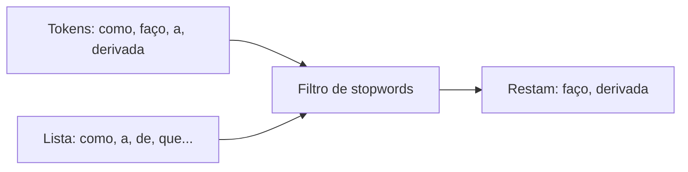

# Aula 2, Stopwords

> Esta aula trata das stopwords, as palavras muito frequentes e pouco
> informativas, como artigos e preposições. Vamos entender por que costuma valer a
> pena removê-las, observar a lei de Zipf nos dados e filtrar as perguntas dos
> alunos que tokenizamos na aula anterior.

Depois de quebrar o texto em tokens, surge uma pergunta natural, todas as palavras
têm o mesmo valor? A resposta é não. Em qualquer texto, um punhado de palavras como
o, a, de, que e em domina a contagem, mas diz muito pouco sobre o assunto. Essas são
as stopwords, e tratá-las bem é um passo simples que melhora muitas tarefas de NLP.

Seguindo o fio do módulo, vamos pegar os tokens das perguntas de alunos e remover
essas palavras de pouca substância, deixando à mostra os termos que de fato indicam o
tema, como derivada, matriz ou Python. No caminho, vamos esbarrar em um padrão
fascinante e universal da linguagem, a lei de Zipf, que explica por que tão poucas
palavras concentram tanta frequência.

---

## Objetivos

Ao final desta aula, você deve ser capaz de:

- Explicar o que são stopwords e por que elas têm baixo poder de discriminação.
- Remover stopwords de um texto tokenizado.
- Reconhecer a lei de Zipf na distribuição de frequências das palavras.
- Avaliar quando remover stopwords ajuda e quando pode atrapalhar.

## Teoria

Stopwords são palavras que aparecem com altíssima frequência e carregam pouca
informação sobre o conteúdo. Artigos, preposições, conjunções e pronomes são os
exemplos típicos. Como elas surgem em praticamente todos os documentos, não ajudam a
distinguir um assunto de outro, e por isso muitas tarefas as descartam para reduzir
ruído e tamanho.

A remoção é direta. Mantemos uma lista de stopwords do idioma e filtramos os tokens
que estão nela. O efeito é concentrar a representação nos termos de conteúdo. Vale
notar que a lista certa depende do idioma e, às vezes, do domínio, e que existem
listas prontas, por exemplo no NLTK, mas montar a sua própria ajuda a entender o que
está acontecendo.



Há um pano de fundo estatístico bonito aqui. A lei de Zipf, observada por George
Zipf, diz que a frequência de uma palavra é aproximadamente inversamente
proporcional à sua posição em um ranking de frequência. A palavra mais comum aparece
cerca do dobro da segunda, o triplo da terceira, e assim por diante. É por isso que
um número pequeno de stopwords responde por uma fatia enorme do total de palavras.

## Explicação Intuitiva

Imagine destacar as ideias principais de um texto com um marca-texto. Você não pinta
os artigos e as preposições, pinta os substantivos e verbos que carregam o sentido.
Remover stopwords é automatizar esse instinto, apagar o que é só liga entre as
ideias e manter o que aponta para o assunto.

Mas atenção, nem sempre as stopwords são descartáveis. Em uma frase como não entendi,
a palavra não é curtinha e comum, porém muda completamente o sentido. Por isso a
remoção de stopwords é uma ferramenta, não uma regra cega. Em tarefas como análise de
sentimento, jogar fora certas palavrinhas pode custar caro.

## Explicação Matemática

A lei de Zipf pode ser escrita de forma simples. Se ordenarmos as palavras da mais
para a menos frequente e chamarmos de $r$ a posição no ranking, a frequência $f$ de
uma palavra é aproximadamente

$$
f(r) \approx \frac{C}{r},
$$

em que $C$ é uma constante que depende do tamanho do texto. Em palavras, a frequência
cai rápido conforme descemos no ranking. Quando colocamos frequência e ranking em
escala logarítmica, essa relação vira aproximadamente uma reta descendente, uma
assinatura fácil de reconhecer.

A consequência prática é direta. Como poucas palavras no topo do ranking concentram
grande parte das ocorrências, e essas palavras são justamente as stopwords, removê-las
encolhe bastante o total de tokens com perda mínima de informação sobre o tema.

## Exemplo Prático

Vamos retomar as perguntas de alunos da aula passada, contar a frequência de cada
token e visualizar como poucas palavras dominam, exatamente como a lei de Zipf
prevê. Em seguida, removemos as stopwords e observamos o que sobra, que são os termos
realmente ligados a cálculo, álgebra e programação.

Esse texto filtrado é uma representação mais enxuta e mais informativa, e será a
entrada das aulas de Bag of Words e TF-IDF. O código está no notebook
[notebooks/modulo-03/02-stopwords.ipynb](../../notebooks/modulo-03/02-stopwords.ipynb),
então abra-o ao lado para acompanhar.

## Código Comentado

```python
import re
from collections import Counter

perguntas = [
    "Como faço a derivada de uma função?",
    "Qual é a regra da cadeia na derivada?",
    "Como resolvo um sistema linear com matrizes?",
    "O que é um autovetor de uma matriz?",
    "Como declaro uma função em Python?",
    "O que é um laço de repetição em Python?",
]

# Uma lista pequena de stopwords do português, só para o exemplo.
STOPWORDS = {
    "a", "o", "as", "os", "um", "uma", "de", "da", "do", "em", "na", "no",
    "que", "é", "e", "com", "qual", "como", "para", "por",
}


def tokenizar(texto):
    return re.findall(r"\w+|[^\w\s]", texto.lower(), re.UNICODE)


def remover_pontuacao(tokens):
    return [t for t in tokens if t.isalnum()]


# Conta a frequência de todas as palavras, antes de remover stopwords.
contagem = Counter()
for p in perguntas:
    contagem.update(remover_pontuacao(tokenizar(p)))

print("Palavras mais frequentes (lei de Zipf em ação):")
for palavra, freq in contagem.most_common(6):
    print(f"  {palavra:12} {freq}")


def remover_stopwords(tokens):
    return [t for t in tokens if t not in STOPWORDS]


print("\nAntes e depois de remover stopwords:")
for p in perguntas[:3]:
    tokens = remover_pontuacao(tokenizar(p))
    print("  original:", tokens)
    print("  filtrado:", remover_stopwords(tokens))
```

Ao rodar, repare que as palavras do topo da contagem são quase todas stopwords, o que
confirma a intuição de Zipf. Depois do filtro, cada pergunta fica reduzida aos seus
termos de conteúdo, e perguntas de temas diferentes passam a ter pouca ou nenhuma
palavra em comum, o que é ótimo para distinguir os assuntos mais adiante.

## Exercícios

1) Conceitual: O que torna uma palavra uma boa candidata a stopword? Por que ela
   ajuda pouco a distinguir assuntos?
2) Conceitual: Dê um exemplo de tarefa em que remover stopwords seria uma má ideia, e
   explique por quê.
3) Prático: Amplie a lista de stopwords e veja quantos tokens a mais são removidos do
   conjunto de perguntas.
4) Prático: Conte a frequência das palavras de um texto maior, à sua escolha, e
   verifique se o topo do ranking é dominado por stopwords.
5) Extensão: Pesquise a lei de Zipf e tente reproduzir, com um texto grande, o
   gráfico de frequência por ranking em escala logarítmica.

## Projeto da Aula

Investigue o efeito das stopwords sobre o vocabulário. A entrega é um experimento que
mede o tamanho do vocabulário e o total de tokens das perguntas antes e depois da
remoção de stopwords, e que lista as palavras mais frequentes nos dois casos.

Considere o projeto pronto quando você tiver os números de antes e depois e um
parágrafo comentando quanto a remoção encolheu o texto e por que isso quase não
afeta a capacidade de identificar o tema. Esse texto filtrado é o que vamos
transformar em vetores nas próximas aulas.

## Leituras Recomendadas

- Seções sobre stopwords e pré-processamento em Manning e colegas, Introduction to
  Information Retrieval.
- Capítulos sobre frequência de palavras em Jurafsky e Martin, Speech and Language
  Processing.
- Material do NLTK sobre listas de stopwords em diferentes idiomas, em Bird e
  colegas, Natural Language Processing with Python.

## Referências Científicas

As referências abaixo são reais e estão registradas em
[references/referencias.bib](../../references/referencias.bib). As chaves entre
parênteses são as do BibTeX.

- Zipf, G. K. (1949). Human Behavior and the Principle of Least Effort.
  Addison-Wesley. (`zipf1949effort`)
- Manning, C. D., Raghavan, P., e Schütze, H. (2008). Introduction to Information
  Retrieval. Cambridge University Press. (`manning2008ir`)
- Jurafsky, D., e Martin, J. H. (2009). Speech and Language Processing, 2ª edição.
  Pearson Prentice Hall. (`jurafsky2009slp`)
- Bird, S., Klein, E., e Loper, E. (2009). Natural Language Processing with Python.
  O'Reilly. (`bird2009nltk`)
