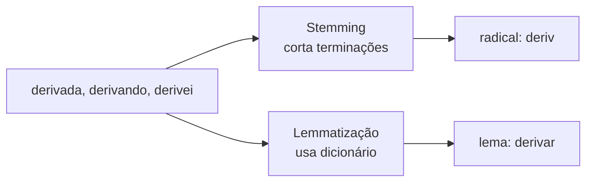

# Aula 3, Stemming e lemmatização

> Esta aula trata de reduzir palavras à sua forma básica, para que variações como
> estudar, estudando e estudei sejam tratadas como uma coisa só. Vamos ver a
> diferença entre stemming e lemmatização e construir um stemmer simples para o
> português.

Depois de tokenizar e remover stopwords, ainda há um problema sutil. A mesma ideia
aparece em muitas formas. Um aluno pode escrever derivar, derivada, derivadas ou
derivando, e para um computador ingênuo essas são quatro palavras distintas, o que
espalha a contagem e dificulta perceber que falam do mesmo assunto.

A solução é normalizar a morfologia, reduzindo cada palavra a uma forma comum.
Existem dois caminhos, o stemming, que corta as terminações de forma mais bruta, e a
lemmatização, que usa conhecimento linguístico para chegar à forma de dicionário.
Seguindo o fio do módulo, vamos aplicar essa normalização às perguntas dos alunos,
aproximando palavras que variam só na forma, e assim deixar a representação ainda
mais informativa para a classificação por tema.

---

## Objetivos

Ao final desta aula, você deve ser capaz de:

- Explicar por que normalizar a morfologia das palavras ajuda no NLP.
- Diferenciar stemming de lemmatização e conhecer os prós e contras de cada um.
- Implementar um stemmer simples baseado em regras para o português.
- Reconhecer as limitações de cortar terminações sem conhecimento linguístico.

## Teoria

As palavras de uma língua variam por flexão e derivação. Verbos se conjugam,
substantivos vão para o plural, adjetivos concordam em gênero. Para muitas tarefas,
queremos que essas variações contem como a mesma unidade, e há duas estratégias para
isso.

O stemming corta as terminações segundo regras fixas, chegando a um radical que pode
nem ser uma palavra de verdade. O stemmer de Porter, clássico para o inglês, e o
RSLP, desenvolvido por Orengo e Huyck para o português, seguem essa linha. É rápido e
simples, mas grosseiro, e às vezes corta demais ou de menos.

A lemmatização é mais sofisticada. Ela usa um dicionário e a classe gramatical da
palavra para devolver o lema, a forma canônica, como o infinitivo de um verbo ou o
singular de um substantivo. O resultado é mais correto, porém exige mais recursos,
como um analisador morfológico, oferecido por bibliotecas como o spaCy.



A escolha entre os dois depende do equilíbrio entre custo e precisão. Para os métodos
clássicos deste módulo, um stemming simples já aproxima bem as variações e melhora a
contagem de termos.

## Explicação Intuitiva

Pense em organizar uma estante de livros agrupando por autor. Você não cria uma
prateleira separada para cada livro de Machado de Assis, junta todos sob o mesmo
nome. Stemming e lemmatização fazem isso com palavras, colocam todas as formas de
uma mesma ideia sob um rótulo comum, para que sejam contadas juntas.

A diferença entre os dois é o capricho da arrumação. O stemming é o arrumador
apressado, que corta o sobrenome no susto e às vezes confunde dois autores
parecidos. A lemmatização é o bibliotecário cuidadoso, que consulta o catálogo e
acerta o nome certo, mas demora mais. Os dois servem, depende de quanto rigor a
tarefa exige.

## Explicação Matemática

Esta aula é mais linguística do que matemática, então não há fórmulas centrais. O que
vale registrar é o efeito sobre o vocabulário. Sem normalização, cada variação de uma
palavra ocupa uma posição distinta no vocabulário, inflando o seu tamanho $|V|$ e
espalhando as contagens entre formas que deveriam somar juntas.

Ao reduzir as formas a um radical ou lema comum, várias entradas do vocabulário se
fundem em uma só. Isso diminui $|V|$, concentra as contagens e tende a melhorar as
medidas de similaridade que veremos nas próximas aulas, pois dois textos que falam de
derivar e derivada passam a compartilhar o mesmo termo.

## Exemplo Prático

Vamos aplicar um stemmer simples às perguntas dos alunos, cortando terminações comuns
do português, como plurais e algumas desinências verbais. O objetivo não é um stemmer
perfeito, e sim entender o mecanismo e ver formas diferentes convergirem para o mesmo
radical.

Vamos comparar o vocabulário antes e depois do stemming, e observar casos em que o
corte funciona bem e casos em que exagera, o que motiva métodos mais cuidadosos. O
código está no notebook
[notebooks/modulo-03/03-stemming-lemmatizacao.ipynb](../../notebooks/modulo-03/03-stemming-lemmatizacao.ipynb),
então abra-o ao lado para acompanhar.

## Código Comentado

```python
import re

palavras = [
    "derivada", "derivadas", "derivar", "derivando",
    "matriz", "matrizes",
    "função", "funções",
    "linear", "lineares",
    "repetição", "repetições",
]

# Terminações comuns do português, da mais longa para a mais curta.
# A ordem importa, pois testamos primeiro os sufixos maiores.
SUFIXOS = ["ações", "ação", "antes", "ando", "ares", "adas", "ada", "es", "as", "os", "s"]


def stemmer_simples(palavra):
    """Remove um sufixo conhecido para aproximar o radical da palavra."""
    for sufixo in SUFIXOS:
        if palavra.endswith(sufixo) and len(palavra) - len(sufixo) >= 3:
            return palavra[: -len(sufixo)]
    return palavra


for p in palavras:
    print(f"{p:12} -> {stemmer_simples(p)}")

# Agrupa as palavras pelo radical, para ver as variações se juntando.
from collections import defaultdict

grupos = defaultdict(list)
for p in palavras:
    grupos[stemmer_simples(p)].append(p)

print("\nGrupos por radical:")
for radical, formas in grupos.items():
    print(f"  {radical:10} <- {formas}")
```

Ao rodar, veja palavras como derivada, derivadas e derivar se aproximarem de um
radical comum, enquanto matriz e matrizes se juntam pelo plural. Observe também algum
exagero, pois um stemmer de regras simples erra de vez em quando, cortando uma
terminação que não deveria. Esse comportamento ilustra por que existem stemmers mais
elaborados, como o RSLP, e por que, quando a precisão importa, a lemmatização com
spaCy costuma ser preferida.

## Exercícios

1) Conceitual: Explique a diferença entre stemming e lemmatização, com um exemplo em
   que os dois dariam resultados diferentes.
2) Conceitual: Por que reduzir as variações de uma palavra diminui o tamanho do
   vocabulário? Que vantagem isso traz?
3) Prático: Acrescente novos sufixos ao stemmer e teste com mais palavras. Algum
   corte passou a exagerar?
4) Prático: Encontre um par de palavras diferentes que o stemmer reduz, por engano,
   ao mesmo radical. Como isso poderia atrapalhar?
5) Extensão: Instale o spaCy com o modelo de português e compare a lemmatização dele
   com o seu stemmer em uma lista de palavras.

## Projeto da Aula

Compare stemming e ausência de normalização no vocabulário das perguntas. A entrega é
um experimento que monta o vocabulário do conjunto de perguntas dos alunos em dois
cenários, sem nenhuma normalização e com o seu stemmer, medindo o tamanho do
vocabulário em cada um.

Considere o projeto pronto quando você tiver os dois tamanhos de vocabulário, alguns
exemplos de palavras que foram unificadas pelo stemmer, e um parágrafo discutindo o
ganho de juntar variações e o risco de unir palavras que não deveriam se juntar. Esse
texto normalizado entra direto na construção das representações vetoriais a seguir.

## Leituras Recomendadas

- Capítulo sobre normalização morfológica em Jurafsky e Martin, Speech and Language
  Processing.
- Seções sobre stemming em Manning e colegas, Introduction to Information Retrieval.
- Documentação do spaCy sobre lemmatização em português, para comparar com o stemmer
  feito à mão.

## Referências Científicas

As referências abaixo são reais e estão registradas em
[references/referencias.bib](../../references/referencias.bib). As chaves entre
parênteses são as do BibTeX.

- Porter, M. F. (1980). An Algorithm for Suffix Stripping. Program, 14(3), 130-137.
  (`porter1980stemming`)
- Orengo, V. M., e Huyck, C. (2001). A Stemming Algorithm for the Portuguese
  Language. SPIRE. (`orengo2001rslp`)
- Manning, C. D., Raghavan, P., e Schütze, H. (2008). Introduction to Information
  Retrieval. Cambridge University Press. (`manning2008ir`)
- Jurafsky, D., e Martin, J. H. (2009). Speech and Language Processing, 2ª edição.
  Pearson Prentice Hall. (`jurafsky2009slp`)
