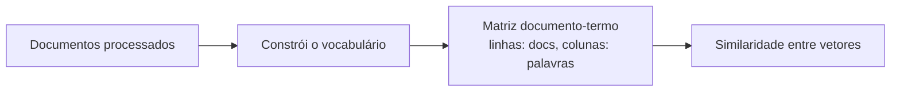

# Aula 4, Bag of Words

> Esta aula dá o salto do texto para os números. O Bag of Words representa cada
> documento como um vetor de contagens de palavras, e é a primeira forma de
> transformar perguntas de alunos em algo que um modelo consegue processar
> diretamente.

Até aqui, trabalhamos o texto como texto, tokenizando, filtrando stopwords e
normalizando formas. Mas modelos de Machine Learning, como os que vimos no Módulo 2,
trabalham com vetores de números. Falta a ponte entre as duas coisas, e o Bag of
Words é a ponte mais simples e mais antiga.

A ideia é representar cada documento por quantas vezes cada palavra do vocabulário
aparece nele, ignorando a ordem. É como esvaziar a frase dentro de uma sacola e
contar os pedaços. Seguindo o fio do módulo, vamos transformar as perguntas já
processadas dos alunos em vetores de contagem, e usar esses vetores para medir o
quanto duas perguntas se parecem, um primeiro passo rumo à classificação por tema.

---

## Objetivos

Ao final desta aula, você deve ser capaz de:

- Explicar o que é a representação Bag of Words e o que ela descarta.
- Construir o vocabulário e a matriz documento-termo de uma coleção.
- Medir a similaridade entre documentos com a similaridade do cosseno.
- Reconhecer as limitações do Bag of Words.

## Teoria

O Bag of Words parte de um vocabulário, a lista de todas as palavras distintas que
aparecem na coleção de documentos. Cada documento vira então um vetor com uma posição
para cada palavra do vocabulário, e o valor em cada posição é o número de vezes que
aquela palavra aparece no documento. Palavras ausentes ficam com zero.

Empilhando os vetores de todos os documentos, formamos a matriz documento-termo, com
uma linha por documento e uma coluna por palavra. Essa matriz é a base de muitas
tarefas clássicas de NLP. A ideia de representar significado pela coocorrência de
palavras tem raízes na hipótese distribucional de Zellig Harris, segundo a qual
palavras que aparecem em contextos parecidos tendem a ter sentidos parecidos.



O Bag of Words é poderoso pela simplicidade, mas tem limites claros. Ele ignora a
ordem das palavras, então estudar para passar e passar para estudar viram o mesmo
vetor. Ele não captura sinônimos, então carro e automóvel ficam em posições
totalmente separadas. E os vetores são esparsos e grandes, com muitas posições em
zero. Esses limites motivam as representações densas que veremos no Módulo 4, os
embeddings.

## Explicação Intuitiva

Imagine recortar todas as palavras de um texto e jogar dentro de uma sacola,
embaralhando. Você perde a sequência, mas ainda sabe quais palavras estavam lá e
quantas vezes cada uma apareceu. Surpreendentemente, só essa contagem já diz bastante
sobre o assunto. Um texto cheio de derivada, função e limite provavelmente fala de
cálculo, não importa a ordem.

A similaridade entre dois textos vira, então, uma questão geométrica. Cada documento é
uma seta em um espaço com uma dimensão por palavra. Dois textos que usam as mesmas
palavras apontam mais ou menos para a mesma direção, e dois textos sobre assuntos
diferentes apontam para direções distantes. Medir o ângulo entre as setas é medir o
quanto eles se parecem.

## Explicação Matemática

Seja um vocabulário com $|V|$ palavras. Um documento $d$ é representado por um vetor
$\mathbf{d} \in \mathbb{R}^{|V|}$, em que a posição $i$ guarda a contagem da palavra
$i$ no documento. A coleção inteira forma a matriz documento-termo, de dimensão
número de documentos por $|V|$.

Para comparar dois documentos $\mathbf{a}$ e $\mathbf{b}$, usamos a similaridade do
cosseno, que mede o cosseno do ângulo entre os dois vetores:

$$
\cos(\mathbf{a}, \mathbf{b}) =
\frac{\mathbf{a} \cdot \mathbf{b}}{\lVert \mathbf{a} \rVert \, \lVert \mathbf{b} \rVert}
= \frac{\sum_{i} a_i b_i}{\sqrt{\sum_i a_i^2}\,\sqrt{\sum_i b_i^2}}.
$$

O resultado vai de 0, quando os documentos não compartilham nenhuma palavra, a 1,
quando apontam exatamente na mesma direção. Usamos o cosseno, e não a distância
comum, porque ele ignora o tamanho dos documentos e foca na direção, ou seja, na
proporção das palavras, o que é mais justo ao comparar textos de comprimentos
diferentes.

## Exemplo Prático

Vamos construir, do zero, a matriz documento-termo das perguntas de alunos e medir a
similaridade do cosseno entre pares de perguntas. Você poderia esperar que duas
perguntas de cálculo ficassem mais próximas entre si do que de uma de programação,
mas vamos ver um resultado revelador, que mostra na prática a maior fraqueza do Bag
of Words com contagem crua.

Esse cálculo de similaridade é, na prática, um classificador embrionário, pois
poderíamos rotular uma pergunta nova pelo tema da pergunta conhecida mais parecida. O
código está no notebook
[notebooks/modulo-03/04-bag-of-words.ipynb](https://github.com/LucasSpinola/assistentes-educacionais-com-ia/blob/main/notebooks/modulo-03/04-bag-of-words.ipynb),
então abra-o ao lado para acompanhar.

## Código Comentado

```python
import re
import math

documentos = [
    "como faço a derivada de uma função",
    "qual a regra da cadeia na derivada",
    "como resolvo um sistema linear com matrizes",
    "como declaro uma função em python",
]


def tokenizar(texto):
    return re.findall(r"\w+", texto.lower(), re.UNICODE)


# 1. Constrói o vocabulário com todas as palavras distintas, em ordem fixa.
vocabulario = sorted({palavra for doc in documentos for palavra in tokenizar(doc)})
indice = {palavra: i for i, palavra in enumerate(vocabulario)}


def vetor_bow(texto):
    """Vetor de contagens do tamanho do vocabulário."""
    vetor = [0] * len(vocabulario)
    for palavra in tokenizar(texto):
        if palavra in indice:
            vetor[indice[palavra]] += 1
    return vetor


matriz = [vetor_bow(doc) for doc in documentos]
print("Tamanho do vocabulário:", len(vocabulario))


def cosseno(a, b):
    produto = sum(x * y for x, y in zip(a, b))
    norma_a = math.sqrt(sum(x * x for x in a))
    norma_b = math.sqrt(sum(y * y for y in b))
    if norma_a == 0 or norma_b == 0:
        return 0.0
    return produto / (norma_a * norma_b)


print("\nSimilaridade entre as perguntas:")
print("doc0 e doc1 (cálculo x cálculo):    ", round(cosseno(matriz[0], matriz[1]), 3))
print("doc0 e doc2 (cálculo x álgebra):    ", round(cosseno(matriz[0], matriz[2]), 3))
print("doc0 e doc3 (cálculo x programação):", round(cosseno(matriz[0], matriz[3]), 3))
```

Ao rodar, você encontra um resultado que surpreende. A pergunta de cálculo (doc0)
fica mais parecida com a de programação (doc3), com cosseno perto de 0,46, do que com
a outra pergunta de cálculo (doc1), com cosseno perto de 0,29. O motivo é instrutivo,
doc0 e doc3 compartilham várias palavras comuns, como como, uma e função, enquanto
doc0 e doc1 só têm em comum o termo derivada. Com a contagem crua, as palavras
genéricas e frequentes pesam tanto quanto as palavras de conteúdo, e acabam mandando
no resultado.

Esse é o calcanhar de aquiles do Bag of Words puro. Ele não distingue uma palavra que
diz muito sobre o tema de uma palavra que aparece em toda parte, e também não conhece
sinônimos nem proximidade de sentido. As duas próximas ideias da trilha atacam
justamente esses pontos, o TF-IDF, na aula seguinte, rebaixa as palavras comuns e
valoriza as raras, e os embeddings, no Módulo 4, capturam significado de verdade.

## Exercícios

1) Conceitual: O que o Bag of Words descarta do texto original? Dê um exemplo em que
   essa perda muda o sentido.
2) Conceitual: Por que usamos a similaridade do cosseno em vez da distância comum
   para comparar documentos?
3) Prático: Acrescente mais perguntas de cada tema e verifique se a similaridade
   dentro do mesmo tema continua maior que entre temas diferentes.
4) Prático: Aplique a remoção de stopwords e o stemming das aulas anteriores antes de
   montar os vetores. A separação entre os temas melhora?
5) Extensão: Implemente um classificador de vizinho mais próximo, que rotula uma
   pergunta nova com o tema da pergunta conhecida de maior similaridade.

## Projeto da Aula

Monte uma pequena máquina de similaridade de perguntas. A entrega é um programa que
recebe uma pergunta nova, calcula a sua similaridade do cosseno com um conjunto de
perguntas conhecidas, já tokenizadas e filtradas, e devolve a pergunta mais parecida.

Considere o projeto pronto quando, para algumas perguntas de teste, o sistema
retornar como mais parecida uma pergunta do mesmo tema, e quando você conseguir
apontar um caso em que ele erra por causa da falta de noção de sinônimos. Esse
exercício mostra a força e o limite do Bag of Words e prepara a próxima aula, em que
o TF-IDF dá pesos mais inteligentes às palavras.

## Leituras Recomendadas

- Seções sobre o modelo de espaço vetorial em Manning e colegas, Introduction to
  Information Retrieval.
- Capítulos sobre representação de texto em Jurafsky e Martin, Speech and Language
  Processing.
- Texto fundador de Harris sobre a hipótese distribucional, para a base conceitual da
  ideia de representar sentido por contexto.

## Referências Científicas

As referências abaixo são reais e estão registradas em
[references/referencias.bib](../../references/referencias.bib). As chaves entre
parênteses são as do BibTeX.

- Harris, Z. S. (1954). Distributional Structure. Word, 10(2-3), 146-162.
  (`harris1954distributional`)
- Manning, C. D., Raghavan, P., e Schütze, H. (2008). Introduction to Information
  Retrieval. Cambridge University Press. (`manning2008ir`)
- Jurafsky, D., e Martin, J. H. (2009). Speech and Language Processing, 2ª edição.
  Pearson Prentice Hall. (`jurafsky2009slp`)
