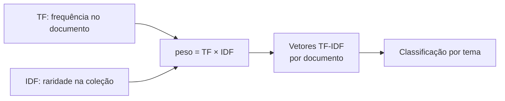

# Aula 5, TF-IDF

> Esta aula fecha os fundamentos de NLP refinando o Bag of Words. Em vez de contar
> palavras de forma crua, o TF-IDF dá mais peso aos termos que distinguem um
> documento dos demais. Com ele, vamos construir o classificador de perguntas de
> alunos por tema, o projeto que encerra o módulo.

O Bag of Words trata todas as palavras como iguais, mas elas não são. Em uma coleção
de perguntas, palavras como pergunta ou como aparecem em quase todos os documentos e
ajudam pouco a distinguir o tema. Já palavras como autovetor ou derivada aparecem em
poucos documentos e, por isso mesmo, são pistas fortes do assunto.

O TF-IDF captura essa intuição com um peso que combina duas ideias, o quanto uma
palavra é frequente em um documento e o quanto ela é rara na coleção. É uma das
técnicas mais usadas e mais eficazes do NLP clássico, e ainda hoje serve de linha de
base difícil de bater em muitas tarefas de texto. Vamos fechar o módulo usando o
TF-IDF para classificar perguntas de alunos por tema, juntando tudo o que
construímos.

---

## Objetivos

Ao final desta aula, você deve ser capaz de:

- Explicar as duas componentes do TF-IDF e por que elas se combinam.
- Calcular pesos TF-IDF a partir de uma coleção de documentos.
- Entender por que o TF-IDF melhora a contagem crua do Bag of Words.
- Construir um classificador de texto por tema usando TF-IDF e similaridade.

## Teoria

O TF-IDF dá a cada par de palavra e documento um peso, em vez de uma simples
contagem. Esse peso é o produto de dois fatores. O primeiro é a frequência do termo,
ou TF, que mede o quanto a palavra aparece naquele documento, sob a ideia de que
palavras mais frequentes no texto são mais importantes para ele. O segundo é a
frequência inversa nos documentos, ou IDF, que mede o quanto a palavra é rara na
coleção, sob a ideia de que palavras que aparecem em todo lugar discriminam pouco.

A ideia de pesar termos pela sua especificidade vem de Karen Spärck Jones, e o
esquema de pesos que usamos foi consolidado por Salton e Buckley. Multiplicar TF por
IDF equilibra os dois efeitos. Uma palavra ganha peso alto quando é frequente em um
documento e, ao mesmo tempo, rara na coleção, que é exatamente o perfil de um bom
termo de conteúdo.



Com os pesos TF-IDF, cada documento vira um vetor, como no Bag of Words, mas agora os
valores refletem importância, não só contagem. Sobre esses vetores podemos medir
similaridade do cosseno e classificar textos novos, que é o que faremos no projeto.

## Explicação Intuitiva

Pense em um detetive procurando o que torna cada depoimento único. Palavras que todos
falam, como ontem ou pessoa, não ajudam a diferenciar os relatos. Mas se só uma
testemunha menciona um carro vermelho, essa expressão vira uma pista valiosa. O
TF-IDF é esse detetive, ele rebaixa o que é comum a todos e destaca o que é
característico de cada documento.

É por isso que o TF-IDF costuma separar temas melhor que a contagem pura. Numa coleção
de perguntas, a palavra derivada, que aparece só nas de cálculo, recebe peso alto e
puxa essas perguntas para perto umas das outras, enquanto palavras espalhadas por
todos os temas quase não influenciam. O efeito é uma representação mais limpa e mais
fácil de classificar.

## Explicação Matemática

Para um termo $t$ em um documento $d$, dentro de uma coleção com $N$ documentos, uma
formulação comum do TF-IDF é a seguinte. A frequência do termo é a contagem de $t$ em
$d$, que podemos chamar de $\text{tf}(t, d)$. A frequência inversa nos documentos usa
$\text{df}(t)$, o número de documentos que contêm $t$, e é definida por

$$
\text{idf}(t) = \log \frac{N}{\text{df}(t)}.
$$

O peso final é o produto das duas partes:

$$
\text{tfidf}(t, d) = \text{tf}(t, d) \times \text{idf}(t).
$$

Quando um termo aparece em todos os documentos, $\text{df}(t) = N$, então
$\text{idf}(t) = \log 1 = 0$, e o seu peso zera, pois ele não distingue nada. Quando
um termo é raro, a razão $N / \text{df}(t)$ é grande, e o IDF eleva o seu peso.
Existem variações, como somar um ao denominador para evitar divisão por zero e
suavizar o logaritmo, mas a ideia central é sempre essa.

## Exemplo Prático

Vamos calcular os pesos TF-IDF, do zero, para a coleção de perguntas de alunos, e
inspecionar quais palavras recebem mais peso em cada documento. Em seguida, montamos o
classificador de tema que encerra o módulo. A estratégia é simples e eficaz,
representamos cada tema por um vetor médio das suas perguntas e classificamos uma
pergunta nova pelo tema cujo vetor é mais parecido com o dela, segundo o cosseno.

Esse classificador junta tudo o que vimos, tokenização, remoção de stopwords,
normalização e a representação vetorial com pesos inteligentes. O código está no
notebook
[notebooks/modulo-03/05-tf-idf.ipynb](../../notebooks/modulo-03/05-tf-idf.ipynb),
então abra-o ao lado para acompanhar.

## Código Comentado

```python
import re
import math
from collections import Counter

# Perguntas de treino, cada uma com o seu tema.
treino = [
    ("como faço a derivada de uma função", "cálculo"),
    ("qual a regra da cadeia na derivada", "cálculo"),
    ("o que é a integral de uma função", "cálculo"),
    ("como resolvo um sistema linear com matrizes", "álgebra"),
    ("o que é um autovetor de uma matriz", "álgebra"),
    ("como multiplico duas matrizes", "álgebra"),
    ("como declaro uma função em python", "programação"),
    ("o que é um laço de repetição em python", "programação"),
    ("como uso uma lista em python", "programação"),
]

documentos = [texto for texto, _ in treino]


def tokenizar(texto):
    return re.findall(r"\w+", texto.lower(), re.UNICODE)


# IDF: log(N / df) para cada termo do vocabulário.
N = len(documentos)
df = Counter()
for doc in documentos:
    for palavra in set(tokenizar(doc)):
        df[palavra] += 1
idf = {palavra: math.log(N / freq) for palavra, freq in df.items()}


def vetor_tfidf(texto):
    """Vetor TF-IDF como dicionário {palavra: peso}."""
    tf = Counter(tokenizar(texto))
    return {palavra: tf[palavra] * idf.get(palavra, 0.0) for palavra in tf}


def cosseno(a, b):
    produto = sum(a[p] * b.get(p, 0.0) for p in a)
    na = math.sqrt(sum(v * v for v in a.values()))
    nb = math.sqrt(sum(v * v for v in b.values()))
    return produto / (na * nb) if na and nb else 0.0


# Representa cada tema pela soma dos vetores TF-IDF das suas perguntas (centróide).
temas = {}
for texto, tema in treino:
    v = vetor_tfidf(texto)
    alvo = temas.setdefault(tema, {})
    for palavra, peso in v.items():
        alvo[palavra] = alvo.get(palavra, 0.0) + peso


def classificar(texto):
    """Atribui o tema cujo centróide é mais parecido com a pergunta."""
    v = vetor_tfidf(texto)
    return max(temas, key=lambda tema: cosseno(v, temas[tema]))


for pergunta in [
    "como calculo a derivada de x",
    "como inverto uma matriz",
    "como crio uma função em python",
]:
    print(f"{pergunta!r} -> {classificar(pergunta)}")
```

Ao rodar, as três perguntas novas costumam cair no tema certo, mesmo usando palavras
que não estão idênticas no treino, porque o TF-IDF dá peso aos termos certos, como
derivada, matriz e função em python. Esse é o pagamento de tudo o que construímos no
módulo, um classificador de texto simples, transparente e que funciona.

## Exercícios

1) Conceitual: Explique, em palavras, o que cada parte do TF-IDF mede e por que o
   produto das duas é útil.
2) Conceitual: Por que uma palavra que aparece em todos os documentos recebe peso
   zero pelo IDF?
3) Prático: Inspecione, para uma pergunta, quais palavras receberam os maiores pesos
   TF-IDF. Elas fazem sentido como termos de conteúdo?
4) Prático: Acrescente um novo tema, com algumas perguntas, e teste se o
   classificador passa a reconhecê-lo.
5) Extensão: Compare o seu classificador TF-IDF com o `TfidfVectorizer` do
   scikit-learn, conferindo se os pesos e as decisões são parecidos.

## Projeto da Aula e Projeto do Módulo

Este é o projeto que fecha o módulo. A entrega é um classificador de perguntas de
alunos por tema, construído de ponta a ponta com o que você aprendeu, tokenização,
remoção de stopwords, normalização opcional, vetores TF-IDF e classificação por
similaridade do cosseno.

O roteiro sugerido é o seguinte. Monte um conjunto de perguntas rotuladas por tema,
separando algumas para teste. Calcule o IDF na coleção de treino, represente cada tema
por um centróide TF-IDF e classifique as perguntas de teste pelo tema mais parecido.
Por fim, meça a acurácia e analise os erros.

Considere o projeto pronto quando você tiver a acurácia nas perguntas de teste, ao
menos um exemplo de acerto e um de erro comentados, e um parágrafo discutindo o que o
TF-IDF acrescentou em relação à contagem crua do Bag of Words. Com isso, você encerra
os fundamentos de NLP e fica pronto para o Módulo 4, em que trocamos essas
representações esparsas por embeddings densos, capazes de capturar significado.

## Leituras Recomendadas

- Capítulo sobre pesos de termos e o modelo vetorial em Manning e colegas,
  Introduction to Information Retrieval.
- Seções sobre TF-IDF em Jurafsky e Martin, Speech and Language Processing.
- Documentação do scikit-learn sobre `TfidfVectorizer`, para comparar com a
  implementação feita à mão.

## Referências Científicas

As referências abaixo são reais e estão registradas em
[references/referencias.bib](../../references/referencias.bib). As chaves entre
parênteses são as do BibTeX.

- Spärck Jones, K. (1972). A Statistical Interpretation of Term Specificity and Its
  Application in Retrieval. Journal of Documentation, 28(1), 11-21.
  (`sparckjones1972idf`)
- Salton, G., e Buckley, C. (1988). Term-Weighting Approaches in Automatic Text
  Retrieval. Information Processing and Management, 24(5), 513-523.
  (`salton1988tfidf`)
- Manning, C. D., Raghavan, P., e Schütze, H. (2008). Introduction to Information
  Retrieval. Cambridge University Press. (`manning2008ir`)
