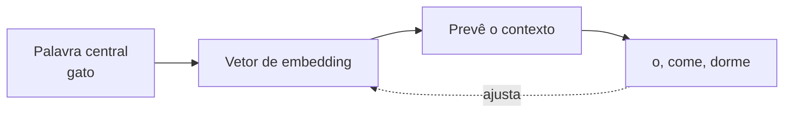

# Aula 1, Word2Vec

> Esta aula abre os Word Embeddings, as representações densas que finalmente
> capturam significado. Começamos pelo Word2Vec, que aprende vetores de palavras
> prevendo o contexto em que elas aparecem. Vamos implementar um skip-gram do zero
> e ver palavras de sentido próximo ganharem vetores próximos.

No Módulo 3, terminamos com uma frustração. O Bag of Words e o TF-IDF representam
texto, mas não entendem nada. Para eles, gato e cachorro são tão diferentes quanto
gato e parafuso, porque cada palavra ocupa a sua própria coluna, sem nenhuma relação
com as demais. Vimos isso doer na prática, quando uma pergunta de cálculo ficou mais
parecida com uma de programação por causa de palavras comuns.

Os embeddings resolvem esse problema. A ideia é representar cada palavra por um vetor
denso, com algumas dezenas ou centenas de números, posicionado de modo que palavras
de sentido parecido fiquem próximas no espaço. Nesta aula, você vai entender como o
Word2Vec aprende esses vetores a partir do contexto e vai construir uma versão
mínima, mas funcional, com as próprias mãos.

---

## Objetivos

Ao final desta aula, você deve ser capaz de:

- Explicar o que é um word embedding e por que ele supera as representações
  esparsas.
- Entender a hipótese distribucional e as arquiteturas CBOW e skip-gram.
- Implementar um skip-gram simples do zero e treinar embeddings.
- Medir similaridade semântica entre palavras com a similaridade do cosseno.

## Teoria

O Word2Vec, proposto por Mikolov e colegas em 2013, parte de uma ideia antiga, a
hipótese distribucional de Harris, segundo a qual palavras que aparecem em contextos
parecidos tendem a ter sentidos parecidos. Se gato e cachorro aparecem ambos depois
de o e antes de come e dorme, eles devem significar coisas próximas.

O Word2Vec transforma essa intuição em um problema de previsão. Há duas
arquiteturas. No CBOW, o modelo tenta prever a palavra central a partir das palavras
do contexto. No skip-gram, faz o contrário, prevê as palavras do contexto a partir
da palavra central. Em ambos, o aprendizado ajusta um vetor para cada palavra, e
esses vetores, que começam aleatórios, vão se organizando até refletir as relações
de sentido.



O resultado é notável. Os vetores aprendidos capturam não só similaridade, mas até
relações analógicas, como mostrou outro trabalho de Mikolov e colegas, em que o vetor
de rei menos o de homem mais o de mulher chega perto do vetor de rainha. Mais tarde,
Levy e Goldberg mostraram que, por baixo do pano, o Word2Vec está fatorando uma
matriz de coocorrências, o que conecta essa abordagem às técnicas baseadas em
contagem que veremos na aula de GloVe.

## Explicação Intuitiva

Imagine posicionar todas as palavras de um idioma em um grande mapa, com a regra de
que palavras de sentido parecido devem ficar perto. Gato e cachorro ficariam vizinhos
no bairro dos animais, longe do bairro dos verbos. Ninguém desenha esse mapa à mão, o
Word2Vec o constrói sozinho, só de observar quais palavras costumam aparecer juntas.

O truque é aprender com o contexto. Cada vez que o modelo vê gato cercado por o, come
e dorme, ele empurra o vetor de gato um pouquinho na direção que torna esse contexto
mais provável. Como cachorro vive nos mesmos contextos, ele recebe empurrões
parecidos, e os dois acabam parando perto um do outro no mapa. Repetido milhões de
vezes em um texto grande, esse processo cria representações ricas de significado.

## Explicação Matemática

No skip-gram, para cada palavra central $c$ queremos prever cada palavra de contexto
$o$ que aparece na sua janela. O modelo tem dois conjuntos de vetores, um para a
palavra quando ela é central e outro para quando é contexto, mas na versão simples
podemos pensar em uma matriz de embeddings de entrada $W$ e uma de saída.

A palavra central vira um vetor de embedding $h = W_c$. A partir dele, calculamos uma
pontuação para cada palavra do vocabulário e aplicamos a softmax para obter
probabilidades:

$$
P(o \mid c) = \frac{\exp(h \cdot v_o)}{\sum_{w} \exp(h \cdot v_w)},
$$

em que $v_w$ são os vetores de saída. O treino maximiza a probabilidade das palavras
de contexto que de fato aparecem, o que equivale a minimizar a entropia cruzada. O
gradiente empurra o embedding da palavra central na direção dos contextos corretos. Em
implementações de produção, a softmax sobre todo o vocabulário é cara, então usa-se
amostragem negativa, que aproxima o cálculo, mas a ideia essencial é esta.

## Exemplo Prático

Vamos treinar um skip-gram do zero sobre um pequeno corpus em que gato e cachorro
aparecem em contextos quase idênticos, comendo, bebendo e dormindo. A expectativa,
que vamos confirmar com números, é que os vetores de gato e cachorro terminem
próximos, enquanto gato e peixe, que não compartilham contexto, fiquem distantes.

É um corpus minúsculo e um modelo minúsculo, então não espere magia, mas o suficiente
para ver os embeddings emergirem de verdade. Mais adiante usaremos bibliotecas como o
gensim, que treinam Word2Vec em grandes corpora. O código está no notebook
[notebooks/modulo-04/01-word2vec.ipynb](../../notebooks/modulo-04/01-word2vec.ipynb),
então abra-o ao lado para acompanhar.

## Código Comentado

```python
import numpy as np
import re

frases = [
    "o gato come peixe", "o cachorro come carne",
    "o gato bebe leite", "o cachorro bebe agua",
    "o gato dorme no sofa", "o cachorro dorme no tapete",
    "a crianca gosta do gato", "a crianca gosta do cachorro",
]


def tokenizar(texto):
    return re.findall(r"\w+", texto.lower())


tokens_frases = [tokenizar(f) for f in frases]
vocab = sorted({w for fr in tokens_frases for w in fr})
vi = {w: i for i, w in enumerate(vocab)}
V = len(vocab)

# Gera pares (centro, contexto) dentro de uma janela de 2 palavras.
pares = []
for fr in tokens_frases:
    for i, centro in enumerate(fr):
        for j in range(max(0, i - 2), min(len(fr), i + 3)):
            if j != i:
                pares.append((vi[centro], vi[fr[j]]))

rng = np.random.default_rng(0)
D = 10                                  # dimensão dos embeddings
W1 = rng.normal(0, 0.1, (V, D))         # embeddings de entrada (o que nos interessa)
W2 = rng.normal(0, 0.1, (D, V))         # vetores de saída
taxa = 0.05

for epoca in range(300):
    rng.shuffle(pares)
    for centro, contexto in pares:
        h = W1[centro]                  # embedding da palavra central
        z = h @ W2                      # pontuações para todo o vocabulário
        z -= z.max()                    # estabiliza a exponencial
        p = np.exp(z); p /= p.sum()     # softmax
        p[contexto] -= 1                # gradiente da entropia cruzada
        grad_h = W2 @ p                 # gradiente do embedding, usando o W2 atual
        W2 -= taxa * np.outer(h, p)     # atualiza os vetores de saída
        W1[centro] -= taxa * grad_h     # atualiza o embedding central


def similaridade(a, b):
    va, vb = W1[vi[a]], W1[vi[b]]
    return float(va @ vb / (np.linalg.norm(va) * np.linalg.norm(vb)))


print("gato ~ cachorro:", round(similaridade("gato", "cachorro"), 3))
print("come ~ bebe    :", round(similaridade("come", "bebe"), 3))
print("gato ~ peixe   :", round(similaridade("gato", "peixe"), 3))
```

Ao rodar com essa semente, a similaridade entre gato e cachorro fica por volta de
0,55, e entre come e bebe também alta, enquanto gato e peixe ficam perto de zero ou
negativo. Se você trocar a semente ou os hiperparâmetros, como a dimensão e o número
de épocas, os números mudam, mas o padrão é robusto, palavras que vivem nos mesmos
contextos terminam com vetores parecidos. Foi exatamente isso que faltava ao Bag of
Words, que tratava cada palavra como uma ilha.

## Exercícios

1) Conceitual: Explique a hipótese distribucional e como o Word2Vec a transforma em
   um problema de previsão.
2) Conceitual: Qual a diferença entre as arquiteturas CBOW e skip-gram? Em que
   situação uma pode ser preferível à outra?
3) Prático: Aumente a dimensão `D` dos embeddings e o número de épocas, e observe se a
   similaridade entre gato e cachorro fica mais estável entre execuções.
4) Prático: Acrescente frases com um terceiro animal, por exemplo coelho, em contextos
   parecidos, e veja se ele também se aproxima de gato e cachorro.
5) Extensão: Pesquise a amostragem negativa e explique, em um parágrafo, por que ela
   deixa o treino do Word2Vec viável em vocabulários grandes.

## Projeto da Aula

Construa um explorador de vizinhos semânticos. A entrega é um programa que treina o
skip-gram sobre um corpus à sua escolha e, dada uma palavra, lista as palavras de
vetor mais próximo, ordenadas pela similaridade do cosseno.

Considere o projeto pronto quando, para algumas palavras de teste, os vizinhos mais
próximos fizerem sentido semântico, e quando você conseguir comentar um caso em que o
corpus pequeno levou a um resultado estranho. Esse explorador é a base intuitiva para
entender por que os embeddings melhoram tanto as buscas e as classificações, tema que
vamos aprofundar até a busca semântica do projeto do módulo.

## Leituras Recomendadas

- Os dois artigos originais de Mikolov e colegas sobre o Word2Vec, curtos e
  influentes, para ver as arquiteturas em detalhe.
- Documentação do gensim sobre `Word2Vec`, útil para treinar embeddings em corpora de
  verdade.
- O artigo de Levy e Goldberg, para entender a ligação entre Word2Vec e fatoração de
  matrizes.

## Referências Científicas

As referências abaixo são reais e estão registradas em
[references/referencias.bib](../../references/referencias.bib). As chaves entre
parênteses são as do BibTeX.

- Mikolov, T., Chen, K., Corrado, G., e Dean, J. (2013). Efficient Estimation of Word
  Representations in Vector Space. (`mikolov2013efficient`)
- Mikolov, T., Sutskever, I., Chen, K., Corrado, G., e Dean, J. (2013). Distributed
  Representations of Words and Phrases and their Compositionality. NeurIPS.
  (`mikolov2013distributed`)
- Mikolov, T., Yih, W., e Zweig, G. (2013). Linguistic Regularities in Continuous
  Space Word Representations. NAACL-HLT. (`mikolov2013linguistic`)
- Levy, O., e Goldberg, Y. (2014). Neural Word Embedding as Implicit Matrix
  Factorization. NeurIPS. (`levy2014implicit`)
- Harris, Z. S. (1954). Distributional Structure. Word, 10(2-3), 146-162.
  (`harris1954distributional`)
