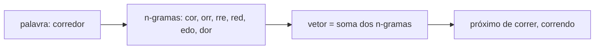

# Aula 2, FastText

> Esta aula trata do FastText, que melhora o Word2Vec ao olhar para dentro das
> palavras. Em vez de tratar cada palavra como um bloco indivisível, ele a quebra
> em pedaços de caracteres, o que dá a superpotência de representar palavras nunca
> vistas, como erros de digitação e flexões raras.

O Word2Vec tem um ponto cego. Ele aprende um vetor para cada palavra do vocabulário,
e só para essas. Se aparecer uma palavra que não estava no treino, por exemplo um erro
de digitação como corredor escrito corredr, ou uma flexão pouco comum, o modelo não
tem o que oferecer, ela é simplesmente desconhecida. Em português, com a sua
morfologia rica e tantas conjugações, esse problema é frequente.

O FastText, criado por Bojanowski e colegas na linha do Word2Vec, ataca isso
representando cada palavra pela soma dos seus pedaços, os n-gramas de caracteres.
Assim, mesmo uma palavra inédita ganha um vetor razoável, montado a partir das suas
partes conhecidas. Nesta aula você vai entender essa ideia e ver, na prática, uma
palavra fora do vocabulário receber um vetor próximo ao da sua forma correta.

---

## Objetivos

Ao final desta aula, você deve ser capaz de:

- Explicar a limitação do Word2Vec com palavras fora do vocabulário.
- Entender como o FastText representa palavras por n-gramas de caracteres.
- Calcular a similaridade entre palavras a partir dos seus subpedaços.
- Reconhecer por que isso ajuda especialmente idiomas de morfologia rica.

## Teoria

O FastText herda tudo do Word2Vec, as arquiteturas CBOW e skip-gram e o aprendizado
pelo contexto, mas muda a unidade básica. Em vez de associar um vetor a cada palavra
inteira, ele associa um vetor a cada n-grama de caracteres, e o vetor de uma palavra
passa a ser a soma dos vetores dos seus n-gramas.

Tomemos a palavra gato com n-gramas de tamanho 3. Adicionando marcadores de início e
fim, escrevemos `<gato>`, e os trigramas são `<ga`, `gat`, `ato`, `to>`. A palavra é
representada pela combinação desses pedaços. A consequência é poderosa. Palavras que
compartilham raízes e terminações compartilham n-gramas, então correr, corredor e
correndo ficam naturalmente próximas, porque dividem o pedaço corr. E uma palavra
nunca vista pode ser representada, desde que os seus n-gramas tenham aparecido em
outras palavras.



Esse desenho resolve o problema das palavras fora do vocabulário e melhora a
representação de palavras raras, que aproveitam os n-gramas de palavras comuns
parecidas. Por isso o FastText costuma brilhar em idiomas com muita flexão, como o
português.

## Explicação Intuitiva

Pense na diferença entre reconhecer uma pessoa só pelo nome completo ou também pelos
traços do rosto. O Word2Vec é como quem só conhece nomes, se aparece um nome novo,
fica perdido. O FastText também olha os traços, os pedaços da palavra, então mesmo
diante de um nome desconhecido ele percebe parecenças, este se parece com aquele que
eu já conheço.

É essa atenção aos pedaços que dá ao FastText a sua robustez. Um aluno que escreve
funçao sem o til, ou conjuga um verbo de um jeito incomum, ainda é compreendido,
porque os pedaços da palavra apontam para o lugar certo do mapa. Para um assistente
educacional, que recebe texto real, cheio de variações e erros, isso é precioso.

## Explicação Matemática

A mudança em relação ao Word2Vec é onde mora o vetor. No FastText, cada n-grama de
caracteres $g$ tem um vetor $z_g$. O vetor de uma palavra $w$ é a soma dos vetores
dos seus n-gramas:

$$
v_w = \sum_{g \in G_w} z_g,
$$

em que $G_w$ é o conjunto de n-gramas de $w$, incluindo a própria palavra com
marcadores de fronteira. O treino é igual ao do skip-gram, com o contexto sendo
previsto a partir de $v_w$, mas agora o gradiente atualiza os vetores dos n-gramas, e
não o de uma palavra inteira.

A grande vantagem aparece na inferência. Para uma palavra fora do vocabulário,
calculamos $v_w$ somando os vetores dos seus n-gramas conhecidos, e assim obtemos uma
representação útil sem nunca ter visto a palavra. Nesta aula, para enxergar o
princípio sem treinar um modelo inteiro, vamos medir similaridade direto pelos
n-gramas compartilhados entre palavras, o que já revela o comportamento essencial.

## Exemplo Prático

Vamos representar palavras pelos seus n-gramas de caracteres e medir a similaridade do
cosseno entre elas. A expectativa, que os números vão confirmar, é dupla. Primeiro,
palavras da mesma família, como correr, corredor e correndo, terão alta similaridade,
por compartilharem pedaços. Segundo, e mais importante, uma palavra fora do
vocabulário, como corredores, ficará muito próxima de corredor, mostrando o
tratamento de palavras novas que o Word2Vec não tinha.

Esse exemplo usa apenas as contagens de n-gramas, sem treinar embeddings, o que basta
para ver a ideia funcionando. Na prática, usaríamos o gensim com FastText. O código
está no notebook
[notebooks/modulo-04/02-fasttext.ipynb](https://github.com/LucasSpinola/assistentes-educacionais-com-ia/blob/main/notebooks/modulo-04/02-fasttext.ipynb),
então abra-o ao lado para acompanhar.

## Código Comentado

```python
from collections import Counter
import math


def ngramas(palavra, n=3):
    """N-gramas de caracteres da palavra, com marcadores de início e fim."""
    p = "<" + palavra + ">"
    return [p[i:i + n] for i in range(len(p) - n + 1)]


def vetor_ngram(palavra, n=3):
    """Representa a palavra como a contagem dos seus n-gramas."""
    return Counter(ngramas(palavra, n))


def cosseno(a, b):
    chaves = set(a) | set(b)
    produto = sum(a.get(k, 0) * b.get(k, 0) for k in chaves)
    na = math.sqrt(sum(v * v for v in a.values()))
    nb = math.sqrt(sum(v * v for v in b.values()))
    return produto / (na * nb) if na and nb else 0.0


def sim(p1, p2):
    return round(cosseno(vetor_ngram(p1), vetor_ngram(p2)), 3)


print("correr ~ corredor :", sim("correr", "corredor"))
print("correr ~ correndo :", sim("correr", "correndo"))
print("gato ~ gatinho    :", sim("gato", "gatinho"))
print("correr ~ gato     :", sim("correr", "gato"))
print("FORA DO VOCAB corredores ~ corredor:", sim("corredores", "corredor"))
```

Ao rodar, correr e corredor aparecem com similaridade alta, em torno de 0,58, porque
compartilham vários n-gramas. Palavras sem relação, como correr e gato, dão zero, pois
não dividem pedaços. E o ponto alto é a palavra corredores, que não estava no nosso
conjunto, ficar a cerca de 0,78 de corredor, a sua forma base. É essa capacidade de
representar o que nunca foi visto, compondo a partir dos pedaços, que torna o FastText
tão útil no mundo real.

## Exercícios

1) Conceitual: Por que o Word2Vec não consegue representar uma palavra fora do
   vocabulário, e como o FastText resolve isso?
2) Conceitual: Por que o FastText tende a ajudar mais em idiomas de morfologia rica,
   como o português, do que em idiomas com pouca flexão?
3) Prático: Mude o tamanho `n` dos n-gramas, por exemplo para 2 ou 4, e observe como
   as similaridades mudam.
4) Prático: Teste pares com erros de digitação, como função e funcao, e veja se eles
   ficam próximos.
5) Extensão: Pesquise como o FastText combina os n-gramas durante o treino real e
   compare com a soma simples que usamos aqui.

## Projeto da Aula

Construa um corretor de vocabulário por similaridade de n-gramas. A entrega é um
programa que, dada uma palavra possivelmente errada ou inédita, encontra, em uma lista
de palavras conhecidas, aquela de maior similaridade de n-gramas, sugerindo-a como a
forma mais provável.

Considere o projeto pronto quando o sistema sugerir corretamente a forma base para
algumas palavras com erros de digitação ou flexões inéditas, e quando você comentar um
caso em que a sugestão por n-gramas falha, por exemplo confundindo palavras que se
parecem na escrita mas diferem no sentido. Esse comportamento, de aproximar pela
forma, é a marca do FastText.

## Leituras Recomendadas

- O artigo de Bojanowski e colegas que introduziu o FastText, com a formulação por
  n-gramas de caracteres.
- Documentação do gensim sobre `FastText`, para treinar e usar embeddings de subpalavra
  em corpora reais.
- Comparações entre Word2Vec e FastText em tarefas de NLP, para ver quando cada um se
  sai melhor.

## Referências Científicas

As referências abaixo são reais e estão registradas em
[references/referencias.bib](../../references/referencias.bib). As chaves entre
parênteses são as do BibTeX.

- Bojanowski, P., Grave, E., Joulin, A., e Mikolov, T. (2017). Enriching Word Vectors
  with Subword Information. TACL, 5, 135-146. (`bojanowski2017enriching`)
- Mikolov, T., Chen, K., Corrado, G., e Dean, J. (2013). Efficient Estimation of Word
  Representations in Vector Space. (`mikolov2013efficient`)
- Sennrich, R., Haddow, B., e Birch, A. (2016). Neural Machine Translation of Rare
  Words with Subword Units. ACL. (`sennrich2016bpe`)
