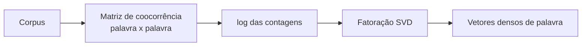

# Aula 3, GloVe

> Esta aula apresenta o GloVe, que chega aos embeddings por outro caminho. Em vez
> de prever contextos palavra a palavra, ele parte de uma tabela global de
> coocorrências e a fatora. Vamos construir essa intuição montando uma matriz de
> coocorrência e reduzindo-a com SVD.

O Word2Vec e o FastText aprendem prevendo o contexto, exemplo após exemplo. O GloVe,
criado por Pennington, Socher e Manning, segue uma filosofia diferente, baseada em
contagem. A ideia é olhar para as estatísticas globais do corpus, ou seja, com que
frequência cada par de palavras aparece junto, e extrair os vetores diretamente dessa
tabela.

Os dois caminhos chegam a lugares parecidos, e não por acaso. Como Levy e Goldberg
mostraram, prever contextos e fatorar uma matriz de coocorrências são, no fundo, duas
faces da mesma moeda. Nesta aula, você vai entender essa abordagem baseada em
contagem e construir uma versão simplificada, montando a matriz de coocorrência de um
corpus e fatorando com decomposição em valores singulares, o SVD.

---

## Objetivos

Ao final desta aula, você deve ser capaz de:

- Diferenciar embeddings baseados em previsão dos baseados em contagem.
- Entender o que é uma matriz de coocorrência e o que ela captura.
- Usar a fatoração por SVD para extrair vetores densos de palavra.
- Reconhecer a ligação entre GloVe, LSA e Word2Vec.

## Teoria

O GloVe parte de uma matriz de coocorrência, em que a entrada na linha $i$ e coluna
$j$ conta quantas vezes a palavra $j$ apareceu perto da palavra $i$, dentro de uma
janela. Essa matriz resume, em um único lugar, todo o comportamento de vizinhança das
palavras no corpus. Palavras de sentido próximo tendem a ter perfis de coocorrência
parecidos, ou seja, linhas parecidas na matriz.

A partir daí, o objetivo é encontrar vetores densos cujas relações reproduzam as
razões de coocorrência observadas. O GloVe faz isso com uma função de custo ponderada
sobre os logaritmos das contagens. A ideia de extrair sentido fatorando uma matriz de
coocorrências não é nova, ela aparece desde a Análise de Semântica Latente, a LSA, de
Deerwester e colegas, que aplicava SVD a uma matriz de termos e documentos.



Nesta aula usamos o SVD sobre o logaritmo das coocorrências como uma versão
simplificada e didática do espírito do GloVe. Não é o algoritmo exato do artigo, mas
captura o essencial, transformar contagens globais em vetores densos que aproximam
palavras de sentido próximo.

## Explicação Intuitiva

Imagine uma planilha gigante em que cada linha e cada coluna é uma palavra, e cada
célula diz quantas vezes aquelas duas palavras apareceram lado a lado. Essa planilha
guarda, de forma crua, todo o conhecimento de vizinhança do corpus. O problema é que
ela é enorme e cheia de zeros, difícil de usar diretamente.

A fatoração é como tirar um resumo inteligente dessa planilha. Em vez de milhares de
colunas, ficamos com algumas dezenas que capturam os padrões mais importantes. Cada
palavra ganha, nesse resumo, uma posição compacta, e palavras com perfis de
vizinhança parecidos acabam em posições próximas. É o mesmo destino do Word2Vec, mas
alcançado olhando o quadro completo de uma vez, em vez de exemplo por exemplo.

## Explicação Matemática

Seja $X$ a matriz de coocorrência, em que $X_{ij}$ é o número de vezes que a palavra
$j$ aparece na janela da palavra $i$. Para suavizar a grande variação das contagens,
trabalhamos com $\log(1 + X_{ij})$, o que reduz o peso esmagador das poucas palavras
muito frequentes.

A decomposição em valores singulares fatora essa matriz em $U \Sigma V^\top$, em que
$\Sigma$ é diagonal com os valores singulares em ordem decrescente. Mantendo apenas as
$k$ maiores componentes, obtemos uma aproximação de baixa dimensão, e os vetores de
palavra são as primeiras $k$ colunas de $U$ escaladas pelos valores singulares:

$$
E = U_{[:, :k]} \, \Sigma_{[:k]}.
$$

Cada linha de $E$ é o vetor denso de uma palavra. O GloVe propriamente dito usa uma
função de custo própria, com pesos que limitam a influência das contagens muito altas,
mas a mensagem central é a mesma, fatorar a coocorrência para obter representações
densas.

## Exemplo Prático

Vamos reaproveitar o pequeno corpus de gato e cachorro da aula de Word2Vec, montar a
matriz de coocorrência dentro de uma janela e fatorá-la com SVD. Como gato e cachorro
aparecem em contextos quase idênticos, as suas linhas na matriz são quase iguais, e
esperamos que os seus vetores fiquem praticamente colados.

De fato, neste corpus tão simétrico, a similaridade entre gato e cachorro chega perto
de 1, o que ilustra bem o princípio, ainda que num caso extremo causado pelo tamanho
do corpus. O código está no notebook
[notebooks/modulo-04/03-glove.ipynb](../../notebooks/modulo-04/03-glove.ipynb),
então abra-o ao lado para acompanhar.

## Código Comentado

```python
import numpy as np
import re

frases = [
    "o gato come peixe", "o cachorro come carne",
    "o gato bebe leite", "o cachorro bebe agua",
    "o gato dorme no sofa", "o cachorro dorme no tapete",
    "a crianca gosta do gato", "a crianca gosta do cachorro",
]


def tokenizar(texto):
    return re.findall(r"\w+", texto.lower())


tokens_frases = [tokenizar(f) for f in frases]
vocab = sorted({w for fr in tokens_frases for w in fr})
vi = {w: i for i, w in enumerate(vocab)}
V = len(vocab)

# Matriz de coocorrência dentro de uma janela de 2 palavras.
CO = np.zeros((V, V))
for fr in tokens_frases:
    ids = [vi[w] for w in fr]
    for i, centro in enumerate(ids):
        for j in range(max(0, i - 2), min(len(ids), i + 3)):
            if j != i:
                CO[centro, ids[j]] += 1

# Suaviza com log e fatora com SVD.
M = np.log1p(CO)
U, S, Vt = np.linalg.svd(M)
k = 5
E = U[:, :k] * S[:k]   # vetores densos de palavra


def similaridade(a, b):
    va, vb = E[vi[a]], E[vi[b]]
    return float(va @ vb / (np.linalg.norm(va) * np.linalg.norm(vb)))


print("gato ~ cachorro:", round(similaridade("gato", "cachorro"), 3))
print("come ~ bebe    :", round(similaridade("come", "bebe"), 3))
print("gato ~ peixe   :", round(similaridade("gato", "peixe"), 3))
```

Ao rodar, gato e cachorro aparecem com similaridade altíssima, perto de 1, assim como
come e bebe, enquanto gato e peixe ficam bem mais baixos. O resultado tão extremo vem
do corpus minúsculo e perfeitamente simétrico, em que gato e cachorro são quase
intercambiáveis. Em um corpus grande e variado, as similaridades seriam mais
matizadas, mas o mecanismo é o mesmo, e chega ao mesmo destino do Word2Vec por um
caminho de contagem.

## Exercícios

1) Conceitual: Explique a diferença entre embeddings baseados em previsão e baseados
   em contagem, citando um exemplo de cada.
2) Conceitual: O que a fatoração por SVD faz com a matriz de coocorrência, e por que
   reduzir a dimensão ajuda?
3) Prático: Mude o número `k` de componentes mantidas e observe como as similaridades
   se alteram.
4) Prático: Aumente o corpus com novas frases que quebrem a simetria entre gato e
   cachorro, e veja a similaridade entre eles deixar de ser tão perfeita.
5) Extensão: Pesquise a função de custo original do GloVe e explique por que ela pesa
   menos as coocorrências muito frequentes.

## Projeto da Aula

Compare os vetores de GloVe com os de Word2Vec no mesmo corpus. A entrega é um
experimento que treina as duas abordagens, a de contagem com SVD desta aula e a de
previsão com o skip-gram da Aula 1, sobre o mesmo conjunto de frases, e compara as
similaridades que cada uma produz para os mesmos pares de palavras.

Considere o projeto pronto quando você tiver uma pequena tabela com as similaridades
das duas abordagens lado a lado e um parágrafo discutindo onde elas concordam e onde
divergem. Essa comparação concretiza a ideia de Levy e Goldberg, de que previsão e
fatoração são dois caminhos para um destino parecido.

## Leituras Recomendadas

- O artigo original do GloVe, de Pennington, Socher e Manning, com a função de custo
  e os experimentos.
- O artigo da LSA, de Deerwester e colegas, para a origem da fatoração de matrizes em
  NLP.
- O artigo de Levy e Goldberg, que conecta de forma elegante previsão e fatoração.

## Referências Científicas

As referências abaixo são reais e estão registradas em
[references/referencias.bib](../../references/referencias.bib). As chaves entre
parênteses são as do BibTeX.

- Pennington, J., Socher, R., e Manning, C. D. (2014). GloVe: Global Vectors for Word
  Representation. EMNLP. (`pennington2014glove`)
- Deerwester, S., Dumais, S. T., Furnas, G. W., Landauer, T. K., e Harshman, R.
  (1990). Indexing by Latent Semantic Analysis. JASIS, 41(6), 391-407.
  (`deerwester1990lsa`)
- Levy, O., e Goldberg, Y. (2014). Neural Word Embedding as Implicit Matrix
  Factorization. NeurIPS. (`levy2014implicit`)
