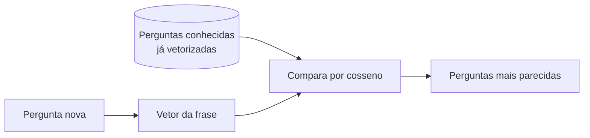

# Aula 4, Sentence Transformers

> Esta aula fecha os embeddings subindo do nível da palavra para o da frase. Os
> Sentence Transformers produzem um vetor para um texto inteiro, o que permite
> comparar e buscar por significado. Com isso, construímos a busca semântica de
> perguntas de alunos, o projeto que encerra o módulo.

Até agora aprendemos a representar palavras. Mas um assistente educacional não recebe
palavras soltas, e sim perguntas inteiras. Precisamos de um vetor por frase, não por
palavra, para conseguir comparar duas perguntas e dizer o quanto elas falam da mesma
coisa. Esse é o salto desta aula.

A forma mais simples de obter um vetor de frase é tirar a média dos vetores das suas
palavras, e já dá para fazer bastante coisa com isso. Mas os Sentence Transformers,
propostos por Reimers e Gurevych, fazem muito melhor, gerando embeddings de frase
pensados sob medida para comparação semântica. Nesta aula você vai construir uma busca
semântica que encontra perguntas parecidas pelo sentido, e não pelas palavras exatas,
resolvendo de vez a limitação que vimos no Bag of Words.

---

## Objetivos

Ao final desta aula, você deve ser capaz de:

- Explicar a diferença entre embeddings de palavra e de frase.
- Obter um vetor de frase pela média de vetores de palavra.
- Entender o que os Sentence Transformers acrescentam a essa ideia.
- Construir uma busca semântica sobre um conjunto de perguntas.

## Teoria

Um embedding de frase é um vetor único que representa o significado de um texto
inteiro. A receita mais direta é a média, somamos os vetores das palavras da frase e
dividimos pela quantidade, obtendo um ponto que fica no meio do caminho entre os
sentidos das palavras. É simples e surpreendentemente útil como linha de base.

O problema da média é que ela ignora a ordem e dá o mesmo peso a todas as palavras,
inclusive às vazias. Os Sentence Transformers vão além, usando uma rede da família dos
Transformers, que veremos no Módulo 6, ajustada especificamente para que frases de
sentido próximo gerem vetores próximos. O resultado são embeddings de frase de alta
qualidade, prontos para busca, agrupamento e comparação.



Com vetores de frase em mãos, a busca semântica é direta. Vetorizamos uma base de
perguntas, vetorizamos a consulta e devolvemos as perguntas de maior similaridade do
cosseno. Diferente da busca por palavra-chave, essa busca encontra perguntas
relacionadas mesmo quando elas usam palavras diferentes, porque a proximidade é de
sentido, não de forma.

## Explicação Intuitiva

Lembre da limitação que vimos no Módulo 3, em que uma busca por contagem de palavras
confundia temas por causa de palavras comuns. A busca semântica conserta isso porque
trabalha com significado. Se um aluno pergunta como calcular uma taxa de variação,
uma boa busca semântica traz perguntas sobre derivada, mesmo que a palavra derivada
nem apareça, porque os conceitos vivem perto no espaço dos vetores.

Pense nos vetores de frase como endereços em uma cidade do significado. Perguntas
sobre o mesmo assunto moram no mesmo bairro, ainda que tenham fachadas diferentes.
Buscar passa a ser ir até o endereço da consulta e olhar quem são os vizinhos. É essa
mudança, de comparar palavras para comparar sentidos, que torna os assistentes atuais
tão bons em entender o que o aluno quis dizer.

## Explicação Matemática

A média de vetores de palavra é a forma mais simples de embedding de frase. Para uma
frase com palavras $w_1, \dots, w_n$ e vetores $v_{w_1}, \dots, v_{w_n}$, o vetor da
frase é

$$
v_{\text{frase}} = \frac{1}{n} \sum_{i=1}^{n} v_{w_i}.
$$

A busca ordena as perguntas conhecidas pela similaridade do cosseno entre o vetor da
consulta e o vetor de cada pergunta, exatamente a mesma medida que usamos desde o Bag
of Words, agora aplicada a vetores densos e carregados de significado.

Os Sentence Transformers substituem essa média por uma função aprendida. A rede é
treinada com pares de frases rotulados como parecidos ou não, ajustando os vetores
para que a similaridade do cosseno reflita a similaridade de sentido. Por isso eles
superam de longe a média simples, embora a média já mostre o princípio e baste para o
nosso projeto rodar sem depender de um modelo pesado.

## Exemplo Prático

Vamos construir uma busca semântica sobre um conjunto de perguntas de alunos. Para que
o exemplo rode sem baixar modelos grandes, montamos vetores de palavra a partir das
coocorrências do próprio conjunto, com a fatoração da aula de GloVe, e representamos
cada pergunta pela média dos seus vetores. Em seguida, dada uma consulta, ordenamos as
perguntas pela similaridade.

Com a consulta como calculo a derivada, as duas perguntas de cálculo aparecem no topo
do ranking, à frente das de álgebra e programação, mostrando a busca por sentido
funcionando. O notebook também traz um caminho opcional com a biblioteca
sentence-transformers, que faz a mesma busca com um modelo de verdade, bem mais
poderoso. O código está no notebook
[notebooks/modulo-04/04-sentence-transformers.ipynb](https://github.com/LucasSpinola/assistentes-educacionais-com-ia/blob/main/notebooks/modulo-04/04-sentence-transformers.ipynb),
então abra-o ao lado para acompanhar.

## Código Comentado

```python
import numpy as np
import re

perguntas = [
    "como faço a derivada de uma função",
    "qual a regra da cadeia na derivada",
    "como resolvo um sistema linear com matrizes",
    "o que é um autovetor de uma matriz",
    "como declaro uma função em python",
    "o que é um laço de repetição em python",
]


def tokenizar(texto):
    return re.findall(r"\w+", texto.lower())


tokens = [tokenizar(p) for p in perguntas]
vocab = sorted({w for t in tokens for w in t})
vi = {w: i for i, w in enumerate(vocab)}
V = len(vocab)

# Vetores de palavra por coocorrência + SVD, no espírito do GloVe.
CO = np.zeros((V, V))
for t in tokens:
    ids = [vi[w] for w in t]
    for i, c in enumerate(ids):
        for j in range(max(0, i - 2), min(len(ids), i + 3)):
            if j != i:
                CO[c, ids[j]] += 1
U, S, _ = np.linalg.svd(np.log1p(CO))
E = U[:, :8] * S[:8]


def vetor_frase(texto):
    """Vetor da frase como média dos vetores das suas palavras."""
    vetores = [E[vi[w]] for w in tokenizar(texto) if w in vi]
    return np.mean(vetores, axis=0) if vetores else np.zeros(8)


def cosseno(a, b):
    na, nb = np.linalg.norm(a), np.linalg.norm(b)
    return float(a @ b / (na * nb)) if na and nb else 0.0


base = [vetor_frase(p) for p in perguntas]


def buscar(consulta):
    q = vetor_frase(consulta)
    ordenadas = sorted(perguntas, key=lambda p: -cosseno(q, base[perguntas.index(p)]))
    return [(round(cosseno(q, vetor_frase(p)), 3), p) for p in ordenadas]


for score, pergunta in buscar("como calculo a derivada"):
    print(f"{score:.3f}  {pergunta}")
```

Ao rodar, as perguntas sobre derivada encabeçam o ranking, com similaridade bem acima
das demais, mesmo a consulta não repetindo todas as palavras delas. É a busca por
sentido em ação. O resultado não é perfeito, pois a média de vetores é uma
aproximação simples e o conjunto é pequeno, mas já entrega o comportamento desejado, e
o caminho opcional com sentence-transformers eleva muito a qualidade.

## Exercícios

1) Conceitual: Qual a diferença entre um embedding de palavra e um de frase, e por que
   precisamos do segundo para buscar perguntas?
2) Conceitual: Quais são as limitações de representar uma frase pela média dos vetores
   das suas palavras?
3) Prático: Faça consultas que não repitam as palavras exatas das perguntas e veja se
   a busca ainda encontra o tema certo.
4) Prático: Acrescente novas perguntas de um quarto tema e teste se a busca passa a
   trazê-las quando a consulta é desse tema.
5) Extensão: Instale a biblioteca sentence-transformers, gere os embeddings com um
   modelo pré-treinado e compare o ranking com o da média de vetores.

## Projeto da Aula e Projeto do Módulo

Este projeto fecha o módulo. A entrega é um buscador semântico de perguntas de alunos,
que recebe uma consulta e devolve, ordenadas por similaridade, as perguntas mais
relacionadas de uma base, comparando o resultado com uma busca tradicional por
palavra-chave.

O roteiro sugerido é o seguinte. Monte uma base de perguntas de pelo menos três temas.
Implemente a busca semântica, pela média de vetores ou, se preferir, com
sentence-transformers. Implemente também uma busca por palavra-chave, que conta
palavras em comum. Faça consultas que usem sinônimos ou formas diferentes das
perguntas da base e compare os dois rankings.

Considere o projeto pronto quando você mostrar pelo menos um caso em que a busca
semântica encontra a pergunta certa e a busca por palavra-chave falha, com um parágrafo
explicando por quê. Esse contraste fecha o arco que começou no Bag of Words e prepara
o Módulo 5, em que entramos no Deep Learning que dá origem a embeddings tão poderosos.

## Leituras Recomendadas

- O artigo do Sentence-BERT, de Reimers e Gurevych, que introduziu os Sentence
  Transformers.
- Documentação da biblioteca sentence-transformers, com modelos prontos e exemplos de
  busca semântica.
- Materiais sobre busca vetorial e bancos de vetores, que retomaremos no módulo de
  RAG.

## Referências Científicas

As referências abaixo são reais e estão registradas em
[references/referencias.bib](../../references/referencias.bib). As chaves entre
parênteses são as do BibTeX.

- Reimers, N., e Gurevych, I. (2019). Sentence-BERT: Sentence Embeddings using Siamese
  BERT-Networks. EMNLP. (`reimers2019sbert`)
- Mikolov, T., Sutskever, I., Chen, K., Corrado, G., e Dean, J. (2013). Distributed
  Representations of Words and Phrases and their Compositionality. NeurIPS.
  (`mikolov2013distributed`)
- Harris, Z. S. (1954). Distributional Structure. Word, 10(2-3), 146-162.
  (`harris1954distributional`)
