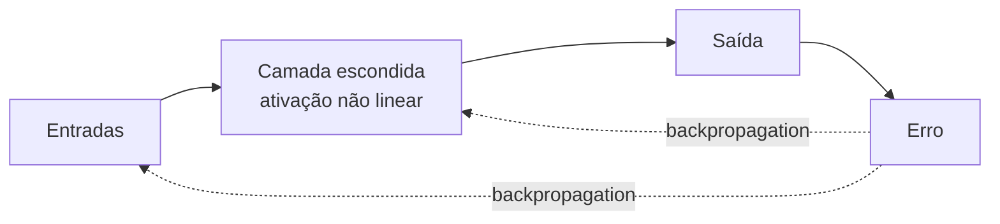

# Aula 1, Redes neurais

> Esta aula abre o Deep Learning aplicado ao NLP. Voltamos ao perceptron, que no
> Módulo 1 falhou no XOR, e o consertamos empilhando camadas e treinando com
> backpropagation. Vamos implementar uma rede neural do zero e vê-la resolver o
> XOR que o perceptron não conseguia.

No Módulo 1, vimos o perceptron tropeçar em um problema simples, o XOR, porque ele só
sabe traçar uma reta. Naquela hora, resolvemos o impasse com uma rede pronta do
scikit-learn, mas deixamos a mágica na caixa-preta. Agora vamos abrir a caixa. As
redes neurais que sustentam todo o Deep Learning moderno, dos modelos de linguagem
aos sistemas de visão, nascem de uma ideia simples, empilhar camadas de neurônios e
ajustá-las com o gradiente.

Esta aula é a fundação do módulo. Antes de chegar às redes recorrentes e, mais
adiante, aos Transformers, precisamos entender a peça básica, o neurônio artificial em
camadas, e o algoritmo que o treina, a backpropagation. Ao final, você terá construído
uma rede neural completa com as próprias mãos e a verá aprender a fronteira em X do
XOR.

---

## Objetivos

Ao final desta aula, você deve ser capaz de:

- Descrever a estrutura de uma rede neural com camada escondida.
- Entender o papel das funções de ativação não lineares.
- Explicar em linhas gerais a backpropagation.
- Implementar e treinar uma rede neural do zero para resolver o XOR.

## Teoria

Uma rede neural organiza neurônios em camadas. A camada de entrada recebe os dados, uma
ou mais camadas escondidas transformam essa informação, e a camada de saída produz a
resposta. Cada neurônio calcula uma combinação linear das suas entradas e passa o
resultado por uma função de ativação não linear, como a tangente hiperbólica ou a
sigmoide.

A não linearidade é o ponto crucial. Sem ela, empilhar camadas seria inútil, pois a
composição de funções lineares ainda é linear, e voltaríamos ao perceptron. É a
ativação não linear que permite à rede dobrar e curvar o espaço, criando fronteiras de
decisão complexas, como a do XOR, que exige separar os cantos opostos de um quadrado.



O treino usa a backpropagation, popularizada por Rumelhart, Hinton e Williams em
1986, o mesmo marco que reacendeu a área depois do primeiro inverno. A ideia é
calcular o erro na saída e propagá-lo de volta pela rede, camada por camada, usando a
regra da cadeia do cálculo para descobrir o quanto cada peso contribuiu para o erro.
Com esses gradientes, o gradiente descendente ajusta todos os pesos de uma vez. É o
mesmo motor de otimização do Módulo 2, agora aplicado a uma função bem mais rica.

## Explicação Intuitiva

Pense em uma linha de montagem de ideias. A camada de entrada recebe os dados crus. A
camada escondida combina e transforma esses dados, criando novas características que
não estavam óbvias na entrada. A camada de saída usa essas características já
trabalhadas para dar a resposta. Cada camada enxerga o problema de um jeito um pouco
mais abstrato que a anterior.

A backpropagation é como uma reunião de pós-jogo em que se reparte a responsabilidade
pelo resultado. Quando a resposta sai errada, a rede pergunta, de trás para frente,
quem contribuiu para esse erro e o quanto, e cada peso é ajustado na proporção da sua
culpa. Repetido muitas vezes, esse processo de atribuir responsabilidade e corrigir vai
afinando a rede até ela acertar.

## Explicação Matemática

Considere uma rede com uma camada escondida. A entrada $\mathbf{x}$ passa por uma
camada com pesos $W_1$ e viés $b_1$, seguida de uma ativação não linear, aqui a
tangente hiperbólica:

$$
\mathbf{a} = \tanh(\mathbf{x} W_1 + b_1).
$$

Em seguida, a saída aplica pesos $W_2$ e a sigmoide para produzir uma probabilidade:

$$
\hat{y} = \sigma(\mathbf{a} W_2 + b_2).
$$

O treino minimiza uma função de custo, como a entropia cruzada da aula de
classificação. A backpropagation calcula o gradiente do custo em relação a cada
parâmetro aplicando a regra da cadeia. O erro na saída, $\delta_2 = \hat{y} - y$,
propaga para a camada escondida como

$$
\delta_1 = (\delta_2 W_2^\top) \odot (1 - \mathbf{a}^2),
$$

em que o termo $(1 - \mathbf{a}^2)$ é a derivada da tangente hiperbólica e $\odot$ é o
produto elemento a elemento. Com $\delta_1$ e $\delta_2$, obtemos os gradientes de
$W_1$ e $W_2$ e atualizamos tudo por gradiente descendente. Esse vai e volta, para
frente para prever e para trás para corrigir, é o coração do Deep Learning.

## Exemplo Prático

Vamos fechar a conta que ficou aberta no Módulo 1. Lá, o perceptron errou o XOR.
Aqui, construímos uma rede com uma camada escondida de alguns neurônios, com ativação
não linear, e a treinamos com backpropagation feita à mão. A expectativa, que os
números vão confirmar, é que a rede acerte as quatro combinações do XOR.

Ver a rede funcionar do zero, sem bibliotecas, deixa claro que não há mágica, apenas
multiplicações de matrizes, uma não linearidade e o gradiente fazendo o seu trabalho.
O código está no notebook
[notebooks/modulo-05/01-redes-neurais.ipynb](https://github.com/LucasSpinola/assistentes-educacionais-com-ia/blob/main/notebooks/modulo-05/01-redes-neurais.ipynb),
então abra-o ao lado para acompanhar.

## Código Comentado

```python
import numpy as np


def sigmoide(z):
    return 1 / (1 + np.exp(-z))


# As quatro combinações do XOR.
X = np.array([[0, 0], [0, 1], [1, 0], [1, 1]], dtype=float)
y = np.array([[0], [1], [1], [0]], dtype=float)

rng = np.random.default_rng(0)
H = 8                                   # neurônios na camada escondida
W1 = rng.normal(0, 1, (2, H)); b1 = np.zeros((1, H))
W2 = rng.normal(0, 1, (H, 1)); b2 = np.zeros((1, 1))
taxa = 0.5

for epoca in range(20000):
    # Passo para frente.
    a1 = np.tanh(X @ W1 + b1)           # camada escondida com ativação não linear
    a2 = sigmoide(a1 @ W2 + b2)         # saída como probabilidade

    # Passo para trás (backpropagation).
    d2 = a2 - y                          # erro na saída
    d1 = (d2 @ W2.T) * (1 - a1**2)       # erro propagado, com a derivada do tanh

    # Atualiza todos os pesos por gradiente descendente.
    W2 -= taxa * a1.T @ d2 / len(X); b2 -= taxa * d2.sum(0, keepdims=True) / len(X)
    W1 -= taxa * X.T @ d1 / len(X); b1 -= taxa * d1.sum(0, keepdims=True) / len(X)

# Previsões finais.
saida = sigmoide(np.tanh(X @ W1 + b1) @ W2 + b2)
print("Previsto:", (saida > 0.5).astype(int).ravel())
print("Esperado:", y.astype(int).ravel())
```

Ao rodar, a rede prevê `[0 1 1 0]`, acertando as quatro combinações do XOR. A camada
escondida aprendeu a criar características intermediárias que tornam o problema
linearmente separável na saída, exatamente o que faltava ao perceptron. Acabamos de
construir, do zero, a engrenagem que move todo o Deep Learning, e nas próximas aulas a
adaptamos para lidar com sequências.

## Exercícios

1) Conceitual: Por que uma rede só com camadas lineares, sem ativação não linear, não
   consegue resolver o XOR?
2) Conceitual: Explique, com suas palavras, o que a backpropagation faz e por que ela
   usa a regra da cadeia.
3) Prático: Reduza o número de neurônios escondidos para 2 e veja se a rede ainda
   resolve o XOR de forma consistente entre sementes.
4) Prático: Troque a ativação escondida de tanh para a sigmoide e observe o efeito na
   velocidade de convergência.
5) Extensão: Acrescente uma segunda camada escondida e adapte a backpropagation para
   ela, verificando se o XOR continua sendo resolvido.

## Projeto da Aula

Construa um classificador neural para um problema não linear à sua escolha. A entrega é
uma rede com uma camada escondida, implementada do zero, treinada sobre um conjunto
pequeno em que as classes não sejam linearmente separáveis, por exemplo dois círculos
concêntricos ou o próprio XOR estendido.

Considere o projeto pronto quando a rede atingir alta acurácia no conjunto e quando
você conseguir mostrar, comparando com um modelo linear, que a camada escondida é o
que viabiliza a separação. Essa base de redes neurais com backpropagation é o que
vamos estender para sequências nas próximas aulas, primeiro com as RNN.

## Leituras Recomendadas

- Capítulos sobre redes neurais e backpropagation em Goodfellow e colegas, Deep
  Learning, disponível gratuitamente online.
- O artigo de Rumelhart, Hinton e Williams de 1986, marco histórico da
  backpropagation.
- Tutoriais introdutórios do PyTorch, que usaremos como ferramenta prática nos
  módulos seguintes.

## Referências Científicas

As referências abaixo são reais e estão registradas em
[references/referencias.bib](../../references/referencias.bib). As chaves entre
parênteses são as do BibTeX.

- Rumelhart, D. E., Hinton, G. E., e Williams, R. J. (1986). Learning Representations
  by Back-Propagating Errors. Nature, 323(6088), 533-536. (`rumelhart1986backprop`)
- Goodfellow, I., Bengio, Y., e Courville, A. (2016). Deep Learning. MIT Press.
  (`goodfellow2016deep`)
- Minsky, M., e Papert, S. (1969). Perceptrons. MIT Press. (`minsky1969perceptrons`)
