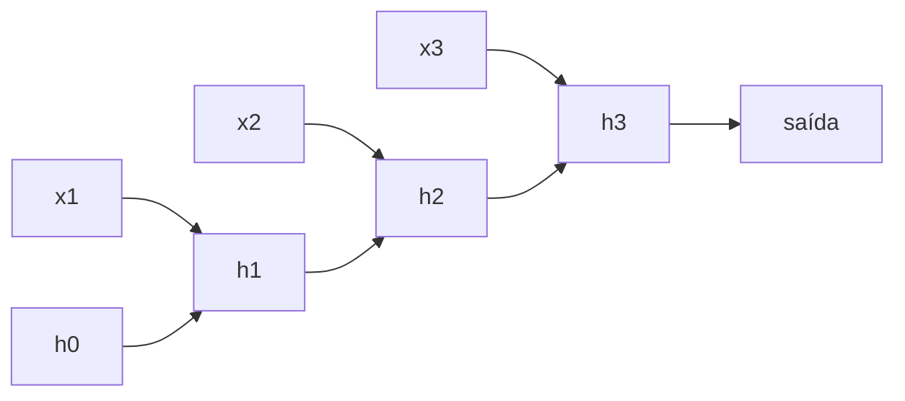

# Aula 2, RNN

> Esta aula apresenta as redes neurais recorrentes, as RNN, feitas para processar
> sequências como o texto. Vamos implementar uma RNN do zero e descobrir, com um
> experimento, a sua grande limitação, a dificuldade de lembrar informações
> distantes no tempo.

A rede da aula anterior recebe entradas de tamanho fixo e as processa de uma vez. Mas o
texto não é assim, ele é uma sequência que se desenrola, palavra após palavra, e o
sentido de cada parte depende do que veio antes. Para processar sequências, precisamos
de uma rede com memória, que carregue informação de um passo para o seguinte. Essa é a
rede neural recorrente.

A RNN, na forma estudada por Elman em 1990, processa a sequência mantendo um estado
escondido que é atualizado a cada novo elemento. Esse estado funciona como uma memória
do que já foi visto. Nesta aula você vai construir uma RNN do zero, treiná-la em uma
tarefa que exige memória e, no caminho, esbarrar na limitação que motivou as células
mais sofisticadas das próximas aulas.

---

## Objetivos

Ao final desta aula, você deve ser capaz de:

- Explicar como uma RNN processa sequências mantendo um estado escondido.
- Implementar a passagem para frente de uma RNN do zero.
- Treinar uma RNN simples em uma tarefa de memória.
- Reconhecer o problema do gradiente que some em sequências longas.

## Teoria

Uma RNN lê a sequência um elemento por vez. A cada passo $t$, ela combina o elemento
atual $x_t$ com o estado escondido anterior $h_{t-1}$ para produzir um novo estado
$h_t$. Esse estado é a memória da rede, ele resume tudo o que foi visto até ali e é
passado adiante. No final da sequência, o estado pode ser usado para uma classificação,
ou um estado pode ser produzido a cada passo, conforme a tarefa.

A mesma operação, com os mesmos pesos, é aplicada em todos os passos. É isso que torna
a RNN capaz de lidar com sequências de qualquer tamanho, ela apenas repete a célula
recorrente o número de vezes necessário. Treinamos a RNN com uma versão da
backpropagation chamada backpropagation no tempo, que desenrola a sequência e propaga o
erro de volta por todos os passos.



Aqui mora a fragilidade. Quando a sequência é longa, o erro precisa voltar por muitos
passos, e o gradiente tende a encolher exponencialmente a cada um, até praticamente
sumir. Esse é o problema do gradiente que some, descrito por Bengio, Simard e Frasconi
em 1994. Na prática, a RNN aprende bem dependências curtas, mas tem muita dificuldade
com dependências longas, esquecendo o começo de uma sequência grande.

## Explicação Intuitiva

Imagine ler um texto cobrindo todas as palavras com a mão e revelando uma por vez,
mantendo na cabeça um resumo do que já leu. Esse resumo é o estado escondido. A cada
palavra nova, você atualiza o resumo. É assim que a RNN processa uma frase, sempre
carregando uma memória compacta do passado.

O problema é que essa memória é frágil para coisas distantes. É como tentar lembrar a
primeira palavra de um parágrafo muito longo quando você chega ao fim, a informação foi
sendo sobrescrita e diluída a cada passo. A RNN sofre do mesmo mal, o que aconteceu há
muitos passos vai perdendo força até desaparecer. Vamos ver esse efeito acontecer com
um experimento simples.

## Explicação Matemática

A atualização do estado escondido de uma RNN é dada por

$$
h_t = \tanh\left(W_x x_t + W_h h_{t-1} + b\right),
$$

em que $W_x$ pondera a entrada atual, $W_h$ pondera o estado anterior e $b$ é o viés. A
tangente hiperbólica mantém o estado em uma faixa limitada. Para uma classificação ao
final, aplicamos uma camada de saída sobre o último estado, $\hat{y} = \sigma(W_y h_T +
b_y)$.

O problema do gradiente aparece na backpropagation no tempo. O gradiente que volta do
passo $T$ até o passo $1$ passa por um produto de muitos fatores, ligados a $W_h$ e à
derivada do tanh. Se esses fatores forem menores que 1, o produto encolhe
exponencialmente com a distância, e o gradiente some. Se forem maiores que 1, ele
explode. Esse comportamento é o que limita o alcance da memória de uma RNN simples, e é
o ponto exato que a LSTM, na próxima aula, vai atacar.

## Exemplo Prático

Vamos treinar uma RNN do zero em uma tarefa que isola a questão da memória, lembrar o
primeiro bit de uma sequência binária. A rede lê a sequência inteira e, no final, deve
dizer qual era o primeiro elemento. Para acertar, ela precisa carregar essa informação
do início ao fim.

O experimento revela o problema de forma contundente. Com uma sequência curta, de três
elementos, a RNN acerta praticamente sempre. Com uma sequência longa, de vinte e cinco
elementos, a acurácia despenca para perto de 50 por cento, ou seja, o puro acaso, pois
o gradiente sumiu e a rede não conseguiu aprender a carregar o primeiro bit por tanto
tempo. O código está no notebook
[notebooks/modulo-05/02-rnn.ipynb](../../notebooks/modulo-05/02-rnn.ipynb), então
abra-o ao lado para acompanhar.

## Código Comentado

```python
import numpy as np


def sigmoide(z):
    return 1 / (1 + np.exp(-z))


def treinar_rnn(T, n_amostras=600, H=12, epocas=120, taxa=0.1, seed=1):
    """Treina uma RNN para lembrar o primeiro bit de uma sequência de tamanho T."""
    rng = np.random.default_rng(seed)
    dados = rng.integers(0, 2, size=(n_amostras, T)).astype(float)
    alvo = dados[:, 0].copy()           # o alvo é o primeiro bit

    Wx = rng.normal(0, 0.3, H); Wh = rng.normal(0, 0.3, (H, H))
    bh = np.zeros(H); Wy = rng.normal(0, 0.3, H); by = 0.0

    for _ in range(epocas):
        for i in rng.permutation(n_amostras):
            seq = dados[i]
            hs = [np.zeros(H)]
            for t in range(T):          # passo para frente, guardando os estados
                hs.append(np.tanh(seq[t] * Wx + hs[-1] @ Wh + bh))
            yhat = sigmoide(hs[-1] @ Wy + by)

            dy = yhat - alvo[i]         # backpropagation no tempo
            Wy -= taxa * dy * hs[-1]; by -= taxa * dy
            dh = dy * Wy
            gWx = np.zeros(H); gWh = np.zeros((H, H)); gbh = np.zeros(H)
            for t in reversed(range(T)):
                draw = dh * (1 - hs[t + 1] ** 2)   # derivada do tanh
                gWx += seq[t] * draw
                gWh += np.outer(hs[t], draw)
                gbh += draw
                dh = draw @ Wh.T        # propaga para o passo anterior
            Wx -= taxa * gWx; Wh -= taxa * gWh; bh -= taxa * gbh

    # Avalia em sequências novas.
    teste = rng.integers(0, 2, size=(300, T)).astype(float)
    acertos = 0
    for i in range(300):
        h = np.zeros(H)
        for t in range(T):
            h = np.tanh(teste[i, t] * Wx + h @ Wh + bh)
        pred = 1 if sigmoide(h @ Wy + by) > 0.5 else 0
        acertos += int(pred == int(teste[i, 0]))
    return acertos / 300


print("Sequência curta (T=3) :", round(treinar_rnn(3), 3))
print("Sequência longa (T=25):", round(treinar_rnn(25), 3))
```

Ao rodar, a sequência curta atinge acurácia próxima de 1,0, enquanto a longa fica em
torno de 0,5, que é o mesmo que chutar. Não é falta de capacidade da rede, é o gradiente
que some ao voltar por vinte e cinco passos, impedindo a RNN de aprender a dependência
longa. Esse resultado, simples e claro, é a motivação direta para as células com portões
que veremos a seguir.

## Exercícios

1) Conceitual: Explique o papel do estado escondido em uma RNN e por que os mesmos
   pesos são usados em todos os passos.
2) Conceitual: O que é o problema do gradiente que some, e por que ele aparece em
   sequências longas?
3) Prático: Teste tamanhos intermediários de sequência, como 8 e 15, e observe a partir
   de quando a acurácia começa a cair.
4) Prático: Aumente o número de neurônios escondidos e de épocas e veja se a RNN
   melhora um pouco na sequência longa.
5) Extensão: Pesquise o recorte de gradiente, o gradient clipping, e explique como ele
   ajuda com o problema do gradiente que explode.

## Projeto da Aula

Investigue, de forma sistemática, o alcance da memória de uma RNN. A entrega é um
experimento que treina a RNN da aula para vários tamanhos de sequência e registra a
acurácia em cada um, montando uma tabela ou um gráfico de acurácia por tamanho.

Considere o projeto pronto quando você conseguir mostrar a curva de desempenho caindo
conforme a sequência cresce e escrever um parágrafo relacionando essa queda com o
problema do gradiente que some. Esse diagnóstico é a ponte perfeita para a próxima aula,
em que a LSTM resolve exatamente esse problema.

## Leituras Recomendadas

- O artigo de Elman, Finding Structure in Time, que apresentou a RNN simples.
- O artigo de Bengio, Simard e Frasconi sobre a dificuldade de aprender dependências
  longas.
- Capítulos sobre redes recorrentes em Goodfellow e colegas, Deep Learning.

## Referências Científicas

As referências abaixo são reais e estão registradas em
[references/referencias.bib](../../references/referencias.bib). As chaves entre
parênteses são as do BibTeX.

- Elman, J. L. (1990). Finding Structure in Time. Cognitive Science, 14(2), 179-211.
  (`elman1990finding`)
- Bengio, Y., Simard, P., e Frasconi, P. (1994). Learning Long-Term Dependencies with
  Gradient Descent is Difficult. IEEE Transactions on Neural Networks, 5(2), 157-166.
  (`bengio1994longterm`)
- Goodfellow, I., Bengio, Y., e Courville, A. (2016). Deep Learning. MIT Press.
  (`goodfellow2016deep`)
