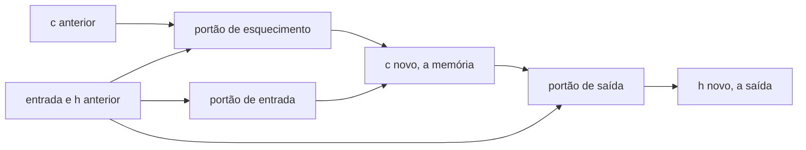

# Aula 3, LSTM

> Esta aula apresenta a LSTM, a célula recorrente que resolveu o problema da memória
> longa. A sua ideia central é uma esteira de memória, o estado da célula, controlada
> por portões. Vamos ver, com uma demonstração direta, a LSTM segurar uma informação
> por muitos passos enquanto a RNN simples a esquece.

A aula anterior terminou com um diagnóstico claro, a RNN simples esquece o que está
distante, porque o gradiente some ao voltar por muitos passos. A LSTM, proposta por
Hochreiter e Schmidhuber em 1997, foi criada justamente para curar esse mal, e por
décadas foi a arquitetura dominante para sequências, de tradução a reconhecimento de
fala.

A sacada da LSTM é separar a memória do fluxo principal. Além do estado escondido, ela
mantém um estado de célula, uma espécie de esteira por onde a informação pode viajar
quase sem alteração, passo após passo. Portões aprendem o que apagar, o que escrever e
o que ler dessa esteira. Nesta aula você vai entender esses portões e ver, na prática, a
esteira de memória preservando um valor por vinte e cinco passos.

---

## Objetivos

Ao final desta aula, você deve ser capaz de:

- Explicar a ideia do estado de célula como uma esteira de memória.
- Descrever a função dos portões de esquecimento, de entrada e de saída.
- Implementar a passagem para frente de uma célula LSTM.
- Mostrar por que a LSTM preserva memória onde a RNN simples falha.

## Teoria

A LSTM acrescenta à RNN um segundo estado, o estado de célula $c_t$, que carrega a
memória de longo prazo. O fluxo de informação por esse estado é regulado por três
portões, cada um uma pequena rede com ativação sigmoide que produz valores entre 0 e 1,
funcionando como válvulas.

O portão de esquecimento decide quanto da memória anterior manter. O portão de entrada
decide quanto da nova informação escrever na memória. E o portão de saída decide quanto
da memória revelar no estado escondido, que é o que sai da célula. O ponto crucial é que
a memória anterior pode passar quase intacta quando o portão de esquecimento fica perto
de 1, criando um caminho por onde o gradiente flui sem encolher. É isso que evita o
gradiente que some.



Comparada à RNN simples, a LSTM tem mais parâmetros e é mais cara de treinar, mas a
recompensa é a capacidade de aprender dependências longas. Essa troca valeu tanto a pena
que a LSTM se tornou, por muito tempo, sinônimo de modelagem de sequências.

## Explicação Intuitiva

Pense no estado de célula como uma esteira transportadora correndo ao longo de toda a
sequência. A informação colocada na esteira pode seguir até o fim quase sem mudança, a
não ser que algum portão decida alterá-la. Os portões são operários ao lado da esteira,
um pode jogar fora o que está passando, outro pode adicionar algo novo, e um terceiro
escolhe o que mostrar para fora naquele instante.

Essa é a diferença para a RNN simples, que reescreve toda a sua memória a cada passo,
diluindo o passado. A LSTM, ao contrário, pode optar por não mexer na esteira,
preservando uma informação importante por quanto tempo for preciso. É como a diferença
entre tentar guardar um número de cabeça enquanto faz outras contas, e anotá-lo em um
papel que fica ali, intacto, até você precisar.

## Explicação Matemática

A cada passo, a LSTM combina a entrada $x_t$ com o estado escondido anterior $h_{t-1}$
para calcular os três portões e uma candidata a nova memória. Usando $\sigma$ para a
sigmoide e concatenando entrada e estado, as equações são

$$
f_t = \sigma(W_f [x_t, h_{t-1}] + b_f), \quad
i_t = \sigma(W_i [x_t, h_{t-1}] + b_i), \quad
o_t = \sigma(W_o [x_t, h_{t-1}] + b_o),
$$

$$
\tilde{c}_t = \tanh(W_g [x_t, h_{t-1}] + b_g).
$$

A memória é então atualizada combinando o que se mantém e o que se escreve, e o estado
escondido é a parte revelada dessa memória:

$$
c_t = f_t \odot c_{t-1} + i_t \odot \tilde{c}_t, \qquad
h_t = o_t \odot \tanh(c_t).
$$

A primeira equação é o coração do método. Quando $f_t \approx 1$ e $i_t \approx 0$,
temos $c_t \approx c_{t-1}$, ou seja, a memória atravessa o passo sem alteração. Esse
caminho aditivo, e não multiplicativo como na RNN, é o que mantém o gradiente vivo ao
longo de muitos passos.

## Exemplo Prático

Em vez de treinar uma LSTM, que é mais custoso, vamos demonstrar diretamente por que ela
funciona, ajustando os portões à mão. Colocamos um valor na memória, configuramos o
portão de esquecimento perto de 1 e o de entrada perto de 0, e alimentamos a célula com
zeros por vinte e cinco passos, observando o que acontece com a memória.

O contraste com a RNN simples é gritante. Na RNN, um sinal inicial de valor 1 decai para
cerca de 0,03 em cinco passos e chega a praticamente 0 em vinte e cinco. Na LSTM, a
mesma memória inicial de valor 1 ainda vale cerca de 0,94 após vinte e cinco passos. A
esteira preservou a informação. O código está no notebook
[notebooks/modulo-05/03-lstm.ipynb](../../notebooks/modulo-05/03-lstm.ipynb), então
abra-o ao lado para acompanhar.

## Código Comentado

```python
import numpy as np


def sigmoide(z):
    return 1 / (1 + np.exp(-z))


# Demonstração 1: a RNN simples esquece.
# Com peso recorrente contrativo e entrada zero, o estado decai a cada passo.
Wh = 0.5
h = 1.0                                 # sinal inicial na memória
print("RNN simples (entrada zero após o início):")
for t in [0, 5, 25]:
    valor = 1.0
    for _ in range(t):
        valor = np.tanh(Wh * valor)
    print(f"  passo {t:2d}: h = {valor:.4f}")


# Demonstração 2: a LSTM preserva.
# Portão de esquecimento alto (f ~ 1) e de entrada baixo (i ~ 0) seguram a memória.
def lstm_passo(x, h, c, bf=6.0, bi=-6.0, bo=2.0):
    f = sigmoide(bf)                    # esquecimento perto de 1
    i = sigmoide(bi)                    # entrada perto de 0
    o = sigmoide(bo)                    # saída moderada
    g = np.tanh(x)
    c = f * c + i * g                   # memória quase intacta
    h = o * np.tanh(c)
    return h, c


c = 1.0; h = 0.0                        # memória inicial guardada na célula
print("\nLSTM (mesma situação, entrada zero):")
for passo in range(26):
    if passo in (0, 5, 25):
        print(f"  passo {passo:2d}: c = {c:.4f}")
    h, c = lstm_passo(0.0, h, c)
```

Ao rodar, a RNN mostra o seu estado caindo de 1,0 para 0,03 e depois para 0, enquanto a
LSTM mantém a memória em cerca de 0,94 mesmo após vinte e cinco passos. Essa é a tradução
concreta da esteira de memória, e explica por que a LSTM aprende dependências que a RNN
simples não alcança. Na prática, claro, os portões são aprendidos pelo treino, e não
fixados à mão, mas a demonstração revela o mecanismo que torna esse aprendizado possível.

## Exercícios

1) Conceitual: Descreva a função de cada um dos três portões da LSTM, com suas
   palavras.
2) Conceitual: Por que a atualização aditiva do estado de célula ajuda contra o
   gradiente que some, em comparação com a atualização da RNN simples?
3) Prático: Mude o viés do portão de esquecimento para um valor que o deixe perto de
   0,5 e observe como a memória passa a decair.
4) Prático: Faça a célula escrever algo no meio da sequência, ajustando o portão de
   entrada em um passo, e veja a memória mudar.
5) Extensão: Pesquise a variante da LSTM com conexões de espiar, as peephole
   connections, e descreva o que elas acrescentam.

## Projeto da Aula

Mostre, lado a lado, a memória de uma RNN simples e a de uma LSTM. A entrega é um
experimento que injeta uma informação no início de uma sequência longa e acompanha,
passo a passo, quanto dessa informação sobrevive em cada arquitetura, apresentando o
resultado em uma tabela ou em um gráfico.

Considere o projeto pronto quando você tiver a curva de retenção das duas arquiteturas e
um parágrafo explicando, a partir das equações, por que a LSTM preserva e a RNN esquece.
Se quiser ir além, treine uma LSTM de verdade com PyTorch na tarefa de lembrar o primeiro
bit em sequências longas, e confirme que ela supera a RNN da aula anterior.

## Leituras Recomendadas

- O artigo original da LSTM, de Hochreiter e Schmidhuber, de 1997.
- O texto Understanding LSTM Networks, de Christopher Olah, com diagramas muito
  didáticos dos portões.
- Capítulos sobre LSTM em Goodfellow e colegas, Deep Learning.

## Referências Científicas

As referências abaixo são reais e estão registradas em
[references/referencias.bib](../../references/referencias.bib). As chaves entre
parênteses são as do BibTeX.

- Hochreiter, S., e Schmidhuber, J. (1997). Long Short-Term Memory. Neural Computation,
  9(8), 1735-1780. (`hochreiter1997lstm`)
- Bengio, Y., Simard, P., e Frasconi, P. (1994). Learning Long-Term Dependencies with
  Gradient Descent is Difficult. IEEE TNN, 5(2), 157-166. (`bengio1994longterm`)
- Goodfellow, I., Bengio, Y., e Courville, A. (2016). Deep Learning. MIT Press.
  (`goodfellow2016deep`)
