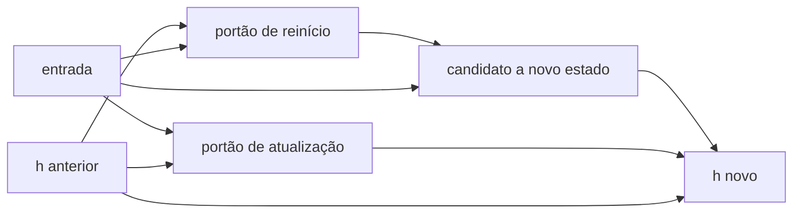

# Aula 4, GRU

> Esta aula apresenta a GRU, uma célula recorrente com portões mais enxuta que a
> LSTM, e fecha o módulo com o projeto integrador, um classificador neural de
> intenção de mensagens curtas. Vamos ver os portões da GRU e treinar um
> classificador de texto do zero.

A LSTM resolveu o problema da memória longa, mas com um custo, são três portões e dois
estados, o que significa muitos parâmetros e treino mais pesado. Surge então uma
pergunta natural, dá para ter os benefícios dos portões com menos peças? A GRU,
proposta por Cho e colegas em 2014, responde que sim.

A GRU simplifica a ideia da LSTM. Ela usa apenas dois portões e um único estado, e ainda
assim aprende dependências longas muito bem. Em muitas tarefas, GRU e LSTM têm
desempenho parecido, como comparou o estudo de Chung e colegas, e a GRU costuma ser
preferida quando se quer um modelo mais leve. Nesta aula você vai entender os portões da
GRU e, no projeto que fecha o módulo, construir um classificador neural de intenção,
juntando o que aprendeu sobre redes e texto.

---

## Objetivos

Ao final desta aula, você deve ser capaz de:

- Explicar os portões de atualização e de reinício da GRU.
- Comparar a GRU com a LSTM em estrutura e custo.
- Implementar a passagem para frente de uma célula GRU.
- Construir um classificador neural de intenção de mensagens curtas.

## Teoria

A GRU funde algumas ideias da LSTM em uma estrutura mais simples. Ela tem um único
estado escondido, sem o estado de célula separado, e usa dois portões. O portão de
atualização decide quanto do estado anterior manter e quanto do novo candidato
incorporar, juntando em uma só válvula os papéis que na LSTM eram do esquecimento e da
entrada. O portão de reinício decide quanto do passado considerar ao calcular o novo
candidato.



Com menos portões e um só estado, a GRU tem menos parâmetros que a LSTM, treina um
pouco mais rápido e ocupa menos memória. Em troca, abre mão de parte da flexibilidade da
LSTM. Na prática, a escolha entre as duas costuma ser empírica, testa-se as duas e
fica-se com a que vai melhor na tarefa, embora a GRU seja uma ótima primeira escolha
pela simplicidade.

## Explicação Intuitiva

Se a LSTM é uma esteira de memória com três operários cuidando dela, a GRU é uma versão
enxuta com dois. O portão de atualização é o operário principal, ele decide, em uma
única alavanca, o quanto da memória antiga fica e o quanto da nova entra, fazendo o
trabalho que na LSTM era dividido entre dois portões. O portão de reinício é um ajudante
que, quando conveniente, manda ignorar parte do passado para formar a nova ideia.

O efeito prático é parecido com o da LSTM, a GRU também consegue segurar informações por
muitos passos quando o portão de atualização escolhe preservar o estado. Ela faz isso com
menos maquinaria, o que costuma render um modelo mais leve e quase tão capaz, uma troca
muito atraente na maioria das aplicações.

## Explicação Matemática

A GRU calcula, a cada passo, o portão de reinício $r_t$ e o de atualização $u_t$, ambos
com a sigmoide, a partir da entrada $x_t$ e do estado anterior $h_{t-1}$:

$$
r_t = \sigma(W_r [x_t, h_{t-1}] + b_r), \qquad
u_t = \sigma(W_u [x_t, h_{t-1}] + b_u).
$$

Em seguida, calcula um candidato a novo estado, usando o portão de reinício para modular
o quanto do passado entra nessa conta:

$$
\tilde{h}_t = \tanh\left(W_h [x_t, r_t \odot h_{t-1}] + b_h\right).
$$

Por fim, o portão de atualização combina o estado anterior com o candidato:

$$
h_t = (1 - u_t) \odot h_{t-1} + u_t \odot \tilde{h}_t.
$$

Repare na última equação. Quando $u_t \approx 0$, o estado quase não muda, $h_t \approx
h_{t-1}$, preservando a memória, exatamente o mecanismo aditivo que dá à GRU a
capacidade de lembrar por longos períodos, com uma equação a menos que a LSTM.

## Exemplo Prático

Esta aula tem duas partes práticas. Primeiro, implementamos a passagem para frente de uma
célula GRU, para ver os dois portões em ação e confirmar que a célula processa uma
sequência. Depois, no projeto que fecha o módulo, construímos um classificador neural de
intenção, que decide se uma mensagem curta de aluno é uma dúvida, um elogio ou um
problema técnico.

Para o classificador, juntamos o que vimos no curso, representamos a mensagem com Bag of
Words, do Módulo 3, e classificamos com a rede neural da primeira aula deste módulo. O
código está no notebook
[notebooks/modulo-05/04-gru.ipynb](https://github.com/LucasSpinola/assistentes-educacionais-com-ia/blob/main/notebooks/modulo-05/04-gru.ipynb), então abra-o
ao lado para acompanhar, inclusive a versão opcional do classificador com uma GRU de
verdade em PyTorch.

## Código Comentado

```python
import numpy as np


def sigmoide(z):
    return 1 / (1 + np.exp(-z))


def gru_passo(x, h, P):
    """Uma passagem da célula GRU, com portões de reinício e atualização."""
    z = np.concatenate([x, h])
    r = sigmoide(P["Wr"] @ z + P["br"])             # portão de reinício
    u = sigmoide(P["Wu"] @ z + P["bu"])             # portão de atualização
    candidato = np.tanh(P["Wh"] @ np.concatenate([x, r * h]) + P["bh"])
    h_novo = (1 - u) * h + u * candidato            # combina passado e candidato
    return h_novo


# Inicializa os parâmetros de uma GRU pequena e processa uma sequência.
H, Dx = 5, 1
rng = np.random.default_rng(2)
P = {k: rng.normal(0, 0.3, (H, H + Dx)) for k in ["Wr", "Wu", "Wh"]}
P.update({k: np.zeros(H) for k in ["br", "bu", "bh"]})

h = np.zeros(H)
for x in [0.0, 1.0, 0.0, 1.0]:
    h = gru_passo(np.array([x]), h, P)

print("estado final da GRU após a sequência:")
print(np.round(h, 3))
```

Ao rodar, a célula GRU processa a sequência e produz um estado final, mostrando que os
dois portões funcionam como esperado. Com menos parâmetros que a LSTM, ela chega a um
mecanismo de memória semelhante. No notebook, o projeto usa esses conceitos para treinar
um classificador de intenção de verdade, fechando o módulo.

## Exercícios

1) Conceitual: Quais são os dois portões da GRU e o que cada um controla?
2) Conceitual: Como o portão de atualização da GRU reúne, em uma só alavanca, os papéis
   do esquecimento e da entrada da LSTM?
3) Prático: No classificador de intenção do notebook, acrescente exemplos de uma nova
   intenção e veja se a rede passa a reconhecê-la.
4) Prático: Compare o número de parâmetros de uma GRU e de uma LSTM com a mesma dimensão
   de estado, e comente a diferença.
5) Extensão: Leia o estudo de Chung e colegas e resuma em um parágrafo as conclusões
   sobre quando GRU e LSTM se equivalem.

## Projeto da Aula e Projeto do Módulo

Este é o projeto que fecha o módulo. A entrega é um classificador neural de intenção de
mensagens curtas de alunos, que separa, por exemplo, dúvidas de conteúdo, elogios e
problemas técnicos. A versão principal, que roda do zero, representa cada mensagem com
Bag of Words e a classifica com a rede neural da primeira aula. A versão avançada,
opcional, usa uma GRU em PyTorch sobre a sequência de palavras.

O roteiro sugerido é o seguinte. Monte um conjunto de mensagens rotuladas por intenção,
separando algumas para teste. Treine a rede neural sobre os vetores Bag of Words e meça a
acurácia. Em seguida, se quiser, implemente a versão com GRU em PyTorch e compare.

Considere o projeto pronto quando você tiver a acurácia do classificador nas mensagens de
teste e um parágrafo discutindo os acertos e os erros, e o que uma versão recorrente
poderia capturar que a Bag of Words ignora, como a ordem das palavras. Com isso, você
fecha o módulo de Deep Learning para NLP e fica pronto para o Módulo 6, em que os
Transformers substituem a recorrência pela atenção.

## Leituras Recomendadas

- O artigo de Cho e colegas que introduziu a GRU, no contexto de tradução automática.
- O estudo de Chung e colegas comparando GRU e LSTM em modelagem de sequências.
- Tutoriais do PyTorch sobre módulos recorrentes, úteis para a versão avançada do
  projeto.

## Referências Científicas

As referências abaixo são reais e estão registradas em
[references/referencias.bib](../../references/referencias.bib). As chaves entre
parênteses são as do BibTeX.

- Cho, K., et al. (2014). Learning Phrase Representations using RNN Encoder-Decoder for
  Statistical Machine Translation. EMNLP. (`cho2014gru`)
- Chung, J., Gulcehre, C., Cho, K., e Bengio, Y. (2014). Empirical Evaluation of Gated
  Recurrent Neural Networks on Sequence Modeling. (`chung2014empirical`)
- Hochreiter, S., e Schmidhuber, J. (1997). Long Short-Term Memory. Neural Computation,
  9(8), 1735-1780. (`hochreiter1997lstm`)
