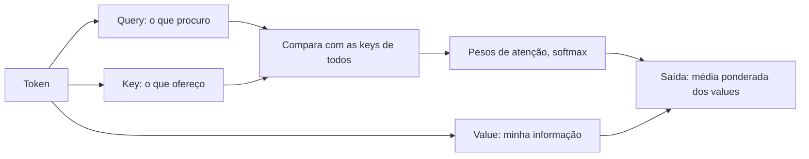

# Aula 1, Self-attention

> Esta aula abre os Transformers pela peça que mudou tudo, a self-attention. Em vez
> de processar a sequência passo a passo como as RNN, a atenção deixa cada palavra
> olhar para todas as outras de uma vez. Vamos implementar a atenção do zero e ver a
> matriz de atenção em ação.

O Módulo 5 terminou com dois limites das redes recorrentes. O primeiro é a memória, que
some em sequências longas, e o segundo é a velocidade, pois a RNN precisa processar uma
palavra por vez, sem poder paralelizar. Os Transformers, apresentados por Vaswani e
colegas em 2017 no artigo Attention Is All You Need, resolvem os dois de uma só vez, e
fazem isso jogando fora a recorrência.

No lugar dela entra a self-attention, um mecanismo em que cada posição da sequência
calcula o quanto deve prestar atenção a cada outra posição, e monta a sua nova
representação como uma média ponderada por essas atenções. Tudo acontece em paralelo, e
qualquer palavra pode influenciar qualquer outra diretamente, não importa a distância.
Nesta aula você vai entender e implementar essa ideia, que é a base de todos os módulos
seguintes.

---

## Objetivos

Ao final desta aula, você deve ser capaz de:

- Explicar a ideia de query, key e value na atenção.
- Entender a fórmula da atenção por produto escalar escalado.
- Implementar a self-attention do zero e ler a matriz de atenção.
- Relacionar a atenção com a busca por similaridade que já conhecemos.

## Teoria

A self-attention representa cada token por três vetores derivados do seu embedding, a
query, a key e o value. A query é o que o token procura, a key é o que ele oferece, e o
value é a informação que ele carrega. Para decidir o quanto um token deve atender a
outro, comparamos a query do primeiro com a key do segundo por um produto escalar.
Quanto mais alinhadas, maior a atenção.

Essas pontuações passam por uma softmax, virando pesos que somam 1, e a nova
representação de cada token é a média dos values de todos os tokens, ponderada por esses
pesos. Em outras palavras, cada palavra se reescreve como uma mistura das informações de
todas as outras, dando mais peso às que considera relevantes. A ideia de alinhar e pesar
vem dos trabalhos de atenção em tradução, como o de Bahdanau e colegas, que os
Transformers levaram ao centro da arquitetura.



Repare que isso generaliza a busca por similaridade que vimos nos embeddings. Lá,
comparávamos vetores pelo cosseno. Aqui, comparamos queries e keys por produto escalar e
usamos o resultado para combinar informação. A grande diferença é que a atenção faz isso
dentro da própria sequência, e de forma aprendível, com projeções treinadas para query,
key e value.

## Explicação Intuitiva

Imagine uma roda de conversa em que cada pessoa quer completar a sua ideia ouvindo as
demais. Cada uma faz uma pergunta ao grupo, que é a sua query. Cada pessoa também tem um
crachá dizendo sobre o que sabe falar, que é a sua key. Quem pergunta presta mais
atenção em quem tem o crachá mais relacionado à sua pergunta, e absorve o que essa
pessoa tem a dizer, que é o seu value. No fim, cada um sai da roda com a ideia
enriquecida pelo que era mais relevante.

A beleza é que todos fazem isso ao mesmo tempo, sem fila. É por isso que o Transformer é
tão mais rápido de treinar que a RNN, ele processa a sequência inteira de uma vez. E
como qualquer um pode ouvir qualquer um diretamente, a distância entre as palavras deixa
de ser um problema, resolvendo de quebra a questão da memória longa.

## Explicação Matemática

Sejam $Q$, $K$ e $V$ as matrizes de queries, keys e values, com uma linha por token. A
atenção por produto escalar escalado é

$$
\text{Attention}(Q, K, V) = \text{softmax}\left(\frac{Q K^\top}{\sqrt{d_k}}\right) V.
$$

O produto $Q K^\top$ gera uma matriz de pontuações, em que a entrada na linha $i$ e
coluna $j$ mede o quanto o token $i$ se alinha ao token $j$. A divisão por $\sqrt{d_k}$,
em que $d_k$ é a dimensão das keys, evita que os produtos fiquem grandes demais quando a
dimensão cresce, o que deixaria a softmax saturada. A softmax, aplicada linha a linha,
transforma as pontuações em pesos que somam 1.

Por fim, multiplicar esses pesos por $V$ produz, para cada token, a média ponderada dos
values. Cada linha da saída é a nova representação do token correspondente, já
contaminada pela informação de toda a sequência, na proporção da atenção.

## Exemplo Prático

Vamos implementar a self-attention do zero e observar a matriz de atenção em uma frase
curta. Para tornar o resultado interpretável, construímos embeddings em que duas
palavras, gato e felino, são propositalmente parecidas, enquanto as outras são
distintas. A expectativa é que gato e felino atendam mais um ao outro do que às demais,
porque a atenção, no fundo, mede similaridade.

Não vamos treinar nada, apenas aplicar a fórmula sobre embeddings escolhidos a dedo, o
que já revela o mecanismo. O código está no notebook
[notebooks/modulo-06/01-self-attention.ipynb](../../notebooks/modulo-06/01-self-attention.ipynb),
então abra-o ao lado para acompanhar.

## Código Comentado

```python
import numpy as np


def softmax(z, eixo=-1):
    z = z - z.max(axis=eixo, keepdims=True)
    e = np.exp(z)
    return e / e.sum(axis=eixo, keepdims=True)


tokens = ["gato", "felino", "pulou", "alto"]
# Embeddings escolhidos: gato e felino são parecidos; pulou e alto, distintos.
E = np.array([
    [1.0, 0.0, 0.0, 0.0],   # gato
    [0.9, 0.1, 0.0, 0.0],   # felino (parecido com gato)
    [0.0, 0.0, 1.0, 0.0],   # pulou
    [0.0, 0.0, 0.0, 1.0],   # alto
])


def self_attention(X):
    """Self-attention sem projeções, para focar no mecanismo."""
    d = X.shape[1]
    scores = X @ X.T / np.sqrt(d)       # alinhamento entre todos os pares
    A = softmax(scores, eixo=-1)        # pesos de atenção, somam 1 por linha
    return A @ X, A                     # saída e matriz de atenção


saida, A = self_attention(E)
print("Matriz de atenção (linha = quem olha, coluna = para quem):")
for i, t in enumerate(tokens):
    print(f"  {t:7} {np.round(A[i], 2)}  soma = {A[i].sum():.2f}")
```

Ao rodar, cada linha da matriz de atenção soma 1, como esperado de uma distribuição de
pesos. E o padrão aparece, a linha de gato dá os maiores pesos a gato e a felino, e a de
felino faz o mesmo, porque os dois embeddings são parecidos. Já pulou e alto, distintos
de tudo, concentram a atenção em si mesmos. Isso confirma a intuição central, a atenção
é uma média ponderada por similaridade, agora computada dentro da própria sequência. No
Transformer de verdade, projeções treinadas para query, key e value tornam esse
mecanismo muito mais expressivo.

## Exercícios

1) Conceitual: Explique, com suas palavras, o papel de query, key e value na atenção.
2) Conceitual: Por que dividimos as pontuações por raiz de d_k antes da softmax?
3) Prático: Mude os embeddings para tornar pulou e alto parecidos e veja a matriz de
   atenção refletir essa nova similaridade.
4) Prático: Acrescente projeções aleatórias para Q, K e V e observe como a matriz de
   atenção muda.
5) Extensão: Pesquise a atenção de Bahdanau, anterior aos Transformers, e descreva em um
   parágrafo a diferença para a self-attention.

## Projeto da Aula

Construa um visualizador de atenção. A entrega é um programa que recebe uma frase com
embeddings simples, calcula a self-attention e mostra a matriz de atenção de forma
legível, por exemplo destacando, para cada token, qual outro recebe o maior peso.

Considere o projeto pronto quando você conseguir interpretar a matriz para algumas
frases, apontando casos em que a atenção se concentra em palavras relacionadas. Esse
entendimento da atenção é o tijolo de todos os Transformers, e nas próximas aulas o
empilhamos em múltiplas cabeças e em blocos completos.

## Leituras Recomendadas

- O artigo Attention Is All You Need, de Vaswani e colegas, que introduziu os
  Transformers.
- O texto The Illustrated Transformer, de Jay Alammar, com diagramas excelentes da
  atenção.
- O artigo de Bahdanau e colegas, para a origem da atenção em tradução automática.

## Referências Científicas

As referências abaixo são reais e estão registradas em
[references/referencias.bib](../../references/referencias.bib). As chaves entre
parênteses são as do BibTeX.

- Vaswani, A., et al. (2017). Attention Is All You Need. NeurIPS.
  (`vaswani2017attention`)
- Bahdanau, D., Cho, K., e Bengio, Y. (2015). Neural Machine Translation by Jointly
  Learning to Align and Translate. ICLR. (`bahdanau2015attention`)
- Mikolov, T., Sutskever, I., Chen, K., Corrado, G., e Dean, J. (2013). Distributed
  Representations of Words and Phrases and their Compositionality. NeurIPS.
  (`mikolov2013distributed`)
