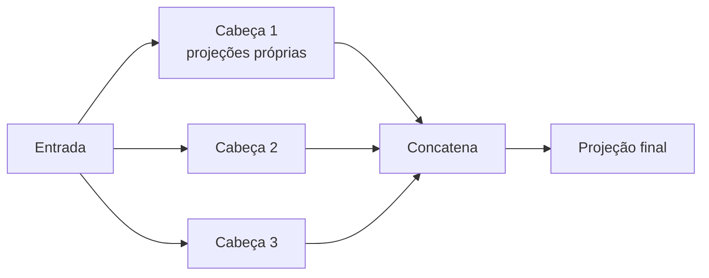

# Aula 2, Multi-head attention

> Esta aula multiplica a self-attention por várias cabeças. Em vez de uma única
> atenção, o Transformer usa várias em paralelo, cada uma livre para aprender um tipo
> diferente de relação entre as palavras. Vamos implementar a atenção de múltiplas
> cabeças e ver cada uma olhar a frase de um jeito.

A self-attention da aula anterior tem uma limitação sutil. Com uma única atenção, cada
token produz um único conjunto de pesos, e precisa resumir nele todos os tipos de
relação que importam. Mas as relações em uma frase são muitas. Uma palavra pode se ligar
a outra por concordância, outra por sentido, outra por posição. Espremer tudo em uma
atenção só é pedir demais.

A solução dos Transformers é elegante, usar várias atenções em paralelo, chamadas
cabeças. Cada cabeça tem as suas próprias projeções de query, key e value, e por isso
aprende a olhar a frase sob um ângulo diferente. Depois, as saídas das cabeças são
combinadas. Nesta aula você vai entender por que isso ajuda e implementar a multi-head
attention do zero.

---

## Objetivos

Ao final desta aula, você deve ser capaz de:

- Explicar por que múltiplas cabeças de atenção são úteis.
- Descrever como uma cabeça divide as dimensões e projeta query, key e value.
- Implementar a multi-head attention do zero.
- Entender como as saídas das cabeças são concatenadas e combinadas.

## Teoria

Na atenção de múltiplas cabeças, o modelo divide a dimensão dos vetores em partes, uma
para cada cabeça. Cada cabeça recebe projeções próprias para query, key e value, calcula
a sua self-attention de forma independente e produz a sua saída. As saídas de todas as
cabeças são então concatenadas e passadas por uma última projeção, que mistura o que
cada cabeça descobriu.

A vantagem é a diversidade. Como as cabeças têm projeções diferentes, elas tendem a se
especializar. Uma pode aprender a ligar verbos aos seus sujeitos, outra a aproximar
palavras de sentido parecido, outra a olhar a vizinhança imediata. Em vez de uma visão
única da frase, o modelo ganha várias visões complementares, e a projeção final decide
como combiná-las.



O custo é pequeno, pois dividir as dimensões entre as cabeças mantém o total de
parâmetros parecido com o de uma atenção única de dimensão cheia. Em troca, ganha-se
muita expressividade. Não por acaso, a multi-head attention é o bloco que se repete,
camada após camada, em todos os Transformers.

## Explicação Intuitiva

Volte à roda de conversa da aula anterior, mas agora imagine que cada pessoa tem vários
pares de ouvidos, cada um sintonizado em um aspecto diferente. Um par presta atenção em
quem fala do mesmo assunto, outro em quem está logo ao lado, outro em quem tem a
autoridade no tema. No fim, a pessoa junta tudo o que ouviu pelos diferentes ouvidos
para formar a sua ideia.

É isso que as cabeças fazem. Cada uma é um par de ouvidos especializado, e juntas
capturam uma riqueza de relações que uma atenção sozinha não daria conta. Quando os
pesquisadores inspecionam Transformers treinados, costumam encontrar cabeças com papéis
surpreendentemente claros, o que confirma que a especialização realmente acontece.

## Explicação Matemática

Seja o modelo de dimensão $d_{\text{model}}$ e um número $h$ de cabeças. Cada cabeça
trabalha com dimensão $d_k = d_{\text{model}} / h$. Para a cabeça $i$, projetamos a
entrada com matrizes próprias e aplicamos a atenção:

$$
\text{head}_i = \text{Attention}(X W_i^Q, X W_i^K, X W_i^V).
$$

As saídas das $h$ cabeças são concatenadas e passadas por uma projeção de saída
$W^O$:

$$
\text{MultiHead}(X) = \text{Concat}(\text{head}_1, \dots, \text{head}_h)\, W^O.
$$

Cada $\text{head}_i$ é a atenção por produto escalar escalado da aula anterior, só que
operando em um subespaço de dimensão $d_k$. Por dividir as dimensões, o custo total fica
próximo ao de uma única atenção de dimensão $d_{\text{model}}$, mas com a vantagem de
várias projeções independentes trabalhando em paralelo.

## Exemplo Prático

Vamos implementar a multi-head attention do zero, com duas cabeças, sobre a mesma frase
da aula anterior. Cada cabeça recebe projeções aleatórias diferentes para query, key e
value, calcula a sua própria atenção e produz a sua saída, que depois concatenamos.

O objetivo é ver, concretamente, que cabeças diferentes geram matrizes de atenção
diferentes, ou seja, olham a frase de jeitos distintos, e que a concatenação produz uma
representação da dimensão original. O código está no notebook
[notebooks/modulo-06/02-multi-head-attention.ipynb](../../notebooks/modulo-06/02-multi-head-attention.ipynb),
então abra-o ao lado para acompanhar.

## Código Comentado

```python
import numpy as np


def softmax(z, eixo=-1):
    z = z - z.max(axis=eixo, keepdims=True)
    e = np.exp(z)
    return e / e.sum(axis=eixo, keepdims=True)


E = np.array([
    [1.0, 0.0, 0.0, 0.0],
    [0.9, 0.1, 0.0, 0.0],
    [0.0, 0.0, 1.0, 0.0],
    [0.0, 0.0, 0.0, 1.0],
])

rng = np.random.default_rng(0)
d_model, n_heads = 4, 2
d_head = d_model // n_heads

# Projeções para query, key e value, compartilhadas e depois fatiadas por cabeça.
Wq = rng.normal(0, 1, (d_model, d_model))
Wk = rng.normal(0, 1, (d_model, d_model))
Wv = rng.normal(0, 1, (d_model, d_model))
Q, K, V = E @ Wq, E @ Wk, E @ Wv

saidas = []
for h in range(n_heads):
    fatia = slice(h * d_head, (h + 1) * d_head)     # dimensões desta cabeça
    scores = Q[:, fatia] @ K[:, fatia].T / np.sqrt(d_head)
    A = softmax(scores, eixo=-1)
    saidas.append(A @ V[:, fatia])
    print(f"Cabeça {h}, matriz de atenção:")
    print(np.round(A, 2))

multi = np.concatenate(saidas, axis=1)              # concatena as cabeças
print("\nSaída multi-head, shape:", multi.shape)
```

Ao rodar, as duas cabeças mostram matrizes de atenção diferentes, cada uma fruto das
suas próprias projeções, o que confirma que elas olham a frase de ângulos distintos. A
concatenação devolve uma representação com a dimensão original, pronta para seguir pelo
resto do bloco do Transformer. Empilhar essa diversidade de cabeças, camada sobre camada,
é o que dá aos Transformers a sua enorme capacidade de modelar linguagem.

## Exercícios

1) Conceitual: Por que uma única cabeça de atenção pode ser insuficiente para capturar
   todas as relações de uma frase?
2) Conceitual: Como a divisão das dimensões entre as cabeças mantém o custo parecido com
   o de uma atenção única?
3) Prático: Aumente o número de cabeças para 4, ajustando as dimensões, e compare as
   matrizes de atenção.
4) Prático: Use a mesma projeção para todas as cabeças e verifique que elas passam a
   produzir a mesma atenção, perdendo a diversidade.
5) Extensão: Pesquise estudos que interpretam o papel de cabeças específicas em
   Transformers treinados e resuma um exemplo.

## Projeto da Aula

Compare uma cabeça única com várias cabeças na mesma frase. A entrega é um experimento
que aplica a atenção de uma cabeça e a de múltiplas cabeças sobre os mesmos embeddings, e
mostra as matrizes de atenção lado a lado, evidenciando a diferença de comportamento.

Considere o projeto pronto quando você conseguir apontar, nas matrizes, que as cabeças
capturam relações distintas, e escrever um parágrafo sobre por que essa diversidade
ajuda o modelo. Com a atenção de múltiplas cabeças entendida, a próxima aula a coloca
dentro do bloco completo do Transformer, com encoder e decoder.

## Leituras Recomendadas

- O artigo Attention Is All You Need, de Vaswani e colegas, com a formulação da
  multi-head attention.
- O texto The Illustrated Transformer, de Jay Alammar, que ilustra muito bem as
  cabeças.
- Materiais sobre interpretabilidade de Transformers, que analisam o papel das cabeças.

## Referências Científicas

As referências abaixo são reais e estão registradas em
[references/referencias.bib](../../references/referencias.bib). As chaves entre
parênteses são as do BibTeX.

- Vaswani, A., et al. (2017). Attention Is All You Need. NeurIPS.
  (`vaswani2017attention`)
- Bahdanau, D., Cho, K., e Bengio, Y. (2015). Neural Machine Translation by Jointly
  Learning to Align and Translate. ICLR. (`bahdanau2015attention`)
