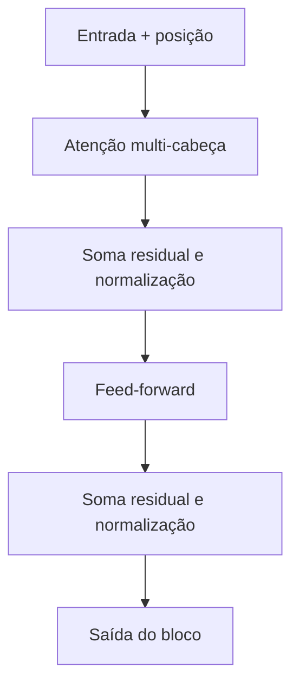

# Aula 3, Encoder e decoder

> Esta aula monta o bloco completo do Transformer ao redor da atenção. Vamos
> acrescentar o codificador de posição, a rede feed-forward, as conexões residuais e
> a normalização, e entender a divisão entre encoder e decoder que organiza toda a
> família de modelos.

Nas duas aulas anteriores, construímos o coração do Transformer, a atenção de múltiplas
cabeças. Mas a atenção sozinha não é um modelo, ela é uma peça. Para virar um
Transformer de verdade, precisamos de algumas peças complementares e de uma forma de
organizá-las em camadas. É isso que esta aula faz.

Vamos ver que o Transformer original tem duas pilhas, um encoder, que lê e entende uma
sequência, e um decoder, que gera uma nova sequência olhando para a do encoder. Dessa
divisão nascem as três grandes famílias de modelos que dominam o NLP, as só de encoder,
como o BERT, as só de decoder, como o GPT, e as de encoder mais decoder, como os modelos
de tradução. Entender essa estrutura é o mapa para os módulos seguintes.

---

## Objetivos

Ao final desta aula, você deve ser capaz de:

- Explicar o papel do codificador de posição em um Transformer.
- Descrever as peças de um bloco, atenção, feed-forward, residual e normalização.
- Diferenciar encoder, decoder e a atenção mascarada.
- Implementar um bloco de encoder do zero.

## Teoria

A atenção, por si só, não sabe a ordem das palavras, pois trata a sequência como um
conjunto. Como a ordem importa muito na linguagem, o Transformer soma a cada token um
codificador de posição, um vetor que depende da posição e que informa onde a palavra
está. O artigo original usa funções seno e cosseno de frequências variadas, de modo que
cada posição recebe uma assinatura única.

Cada bloco do Transformer tem duas subcamadas. A primeira é a atenção de múltiplas
cabeças. A segunda é uma pequena rede feed-forward, aplicada a cada posição
separadamente, que dá capacidade de transformação não linear. Ao redor de cada
subcamada há uma conexão residual, que soma a entrada à saída, e uma normalização de
camada, proposta por Ba e colegas, que estabiliza o treino. Essas duas ideias são o que
permite empilhar muitos blocos sem que o sinal se perca.



A diferença entre encoder e decoder está em como cada um usa a atenção. O encoder usa
atenção plena, em que cada token vê todos os outros, ideal para entender uma sequência. O
decoder usa atenção mascarada, em que cada token só pode ver os anteriores, necessária
para gerar texto da esquerda para a direita sem trapacear olhando o futuro. O decoder
ainda tem uma atenção extra que olha para a saída do encoder, ligando as duas pilhas.

## Explicação Intuitiva

Pense no bloco do Transformer como uma estação de refinamento. A informação entra, passa
pela atenção, onde cada palavra conversa com as outras, e em seguida pela feed-forward,
onde cada palavra é processada individualmente. As conexões residuais funcionam como
atalhos que garantem que a informação original não se perca no caminho, e a normalização
mantém os números em uma faixa saudável. Empilhando muitas dessas estações, a
representação vai ficando cada vez mais rica.

A distinção entre encoder e decoder é como a diferença entre ler e escrever. Para ler e
entender, você pode olhar a frase inteira, de uma vez, para frente e para trás, e é isso
que o encoder faz. Para escrever, você produz uma palavra de cada vez e não pode olhar o
que ainda não escreveu, e é isso que a atenção mascarada do decoder garante.

## Explicação Matemática

O codificador de posição usa, para a posição $pos$ e a dimensão $i$,

$$
PE_{(pos, 2i)} = \sin\left(\frac{pos}{10000^{2i/d}}\right), \qquad
PE_{(pos, 2i+1)} = \cos\left(\frac{pos}{10000^{2i/d}}\right).
$$

Frequências diferentes em dimensões diferentes dão a cada posição uma assinatura única,
que é somada ao embedding do token.

Um bloco de encoder pode ser escrito, com a entrada $X$, como

$$
Z = \text{LayerNorm}\big(X + \text{MultiHead}(X)\big),
$$
$$
\text{saída} = \text{LayerNorm}\big(Z + \text{FFN}(Z)\big),
$$

em que $\text{FFN}(z) = \max(0, z W_1 + b_1) W_2 + b_2$ é a rede feed-forward com
ativação ReLU. A atenção mascarada do decoder é igual à atenção comum, mas com as
pontuações das posições futuras zeradas antes da softmax, o que veremos em detalhe na
aula sobre o GPT.

## Exemplo Prático

Vamos montar um bloco de encoder completo do zero. Primeiro construímos o codificador de
posição e o somamos aos embeddings. Depois aplicamos a atenção, a conexão residual e a
normalização, em seguida a feed-forward com nova residual e normalização. O resultado é
uma representação refinada da sequência, com a dimensão preservada.

Ver o bloco inteiro funcionando deixa claro que um Transformer é, no fundo, a repetição
disciplinada dessas peças simples. O código está no notebook
[notebooks/modulo-06/03-encoder-decoder.ipynb](../../notebooks/modulo-06/03-encoder-decoder.ipynb),
então abra-o ao lado para acompanhar.

## Código Comentado

```python
import numpy as np


def softmax(z, eixo=-1):
    z = z - z.max(axis=eixo, keepdims=True)
    e = np.exp(z)
    return e / e.sum(axis=eixo, keepdims=True)


def positional_encoding(seq_len, d):
    """Assinatura de posição com senos e cossenos de frequências variadas."""
    pos = np.arange(seq_len)[:, None]
    i = np.arange(d)[None, :]
    ang = pos / np.power(10000, (2 * (i // 2)) / d)
    pe = np.zeros((seq_len, d))
    pe[:, 0::2] = np.sin(ang[:, 0::2])
    pe[:, 1::2] = np.cos(ang[:, 1::2])
    return pe


def layernorm(x, eps=1e-5):
    mu = x.mean(-1, keepdims=True)
    var = x.var(-1, keepdims=True)
    return (x - mu) / np.sqrt(var + eps)


def atencao(X, Wq, Wk, Wv):
    d = X.shape[1]
    Q, K, V = X @ Wq, X @ Wk, X @ Wv
    A = softmax(Q @ K.T / np.sqrt(d), eixo=-1)
    return A @ V


def encoder_block(X, Wq, Wk, Wv, W1, W2):
    att = atencao(X, Wq, Wk, Wv)
    x = layernorm(X + att)                  # residual + normalização
    ff = np.maximum(0, x @ W1) @ W2          # feed-forward com ReLU
    return layernorm(x + ff)                 # residual + normalização


E = np.array([
    [1.0, 0.0, 0.0, 0.0],
    [0.9, 0.1, 0.0, 0.0],
    [0.0, 0.0, 1.0, 0.0],
    [0.0, 0.0, 0.0, 1.0],
])

rng = np.random.default_rng(0)
pe = positional_encoding(4, 4)
X = E + pe                                    # soma a posição aos embeddings
Wq = rng.normal(0, 1, (4, 4)); Wk = rng.normal(0, 1, (4, 4)); Wv = rng.normal(0, 1, (4, 4))
W1 = rng.normal(0, 0.5, (4, 8)); W2 = rng.normal(0, 0.5, (8, 4))

saida = encoder_block(X, Wq, Wk, Wv, W1, W2)
print("Codificação de posição da primeira posição:", np.round(pe[0], 2))
print("Saída do bloco de encoder, shape:", saida.shape)
```

Ao rodar, a primeira posição recebe a assinatura `[0, 1, 0, 1]`, que vem de seno de zero
igual a zero e cosseno de zero igual a um, e o bloco produz uma saída com a mesma
dimensão da entrada, pronta para alimentar o próximo bloco. Empilhando vários desses
blocos, temos um encoder, a base do BERT, que veremos na próxima aula. Trocando a atenção
plena pela mascarada, temos um decoder, a base do GPT.

## Exercícios

1) Conceitual: Por que a atenção, sozinha, não sabe a ordem das palavras, e como o
   codificador de posição resolve isso?
2) Conceitual: Qual a função das conexões residuais e da normalização de camada em um
   bloco do Transformer?
3) Prático: Aumente a sequência para mais posições e visualize como o codificador de
   posição muda de uma posição para outra.
4) Prático: Empilhe dois blocos de encoder e verifique que a saída continua com a
   dimensão correta.
5) Extensão: Pesquise a diferença entre normalização antes e depois da subcamada, o
   pre-norm e o post-norm, e descreva o efeito no treino.

## Projeto da Aula

Construa um mini encoder de duas camadas. A entrega é um programa que soma o codificador
de posição aos embeddings e aplica dois blocos de encoder em sequência, mostrando a forma
da saída e como a representação muda de um bloco para o outro.

Considere o projeto pronto quando você conseguir empilhar os blocos sem erros de dimensão
e escrever um parágrafo explicando o papel de cada peça do bloco. Com o bloco do
Transformer montado, estamos prontos para conhecer os dois grandes modelos que nascem
dele, o BERT, só de encoder, e o GPT, só de decoder.

## Leituras Recomendadas

- O artigo Attention Is All You Need, que descreve o bloco completo e o codificador de
  posição.
- O artigo de Ba, Kiros e Hinton sobre a normalização de camada.
- O texto The Annotated Transformer, de Harvard NLP, que implementa o bloco passo a
  passo.

## Referências Científicas

As referências abaixo são reais e estão registradas em
[references/referencias.bib](../../references/referencias.bib). As chaves entre
parênteses são as do BibTeX.

- Vaswani, A., et al. (2017). Attention Is All You Need. NeurIPS.
  (`vaswani2017attention`)
- Ba, J. L., Kiros, J. R., e Hinton, G. E. (2016). Layer Normalization.
  (`ba2016layernorm`)
- Bahdanau, D., Cho, K., e Bengio, Y. (2015). Neural Machine Translation by Jointly
  Learning to Align and Translate. ICLR. (`bahdanau2015attention`)
