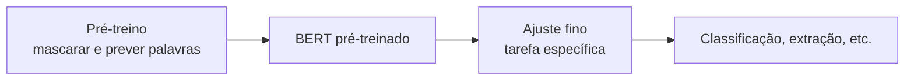

# Aula 4, BERT

> Esta aula apresenta o BERT, o Transformer só de encoder que revolucionou as tarefas
> de compreensão de texto. A sua marca é ler a frase nos dois sentidos ao mesmo tempo
> e aprender preenchendo lacunas. Vamos ver, com um experimento, por que esse contexto
> bidirecional é tão poderoso.

A aula anterior mostrou que, empilhando blocos de encoder, temos uma máquina de entender
sequências. O BERT, apresentado por Devlin e colegas em 2019, é exatamente isso, uma
pilha de encoders treinada de um jeito muito esperto. Ele virou a base de inúmeras
aplicações de NLP, da classificação de texto à extração de informação, justamente o tipo
de tarefa que um assistente educacional precisa para entender o aluno.

A grande sacada do BERT é a forma de treinar. Em vez de prever a próxima palavra, ele
esconde algumas palavras da frase e tenta adivinhá-las olhando o contexto inteiro, à
esquerda e à direita. Esse treino, chamado modelagem de linguagem mascarada, força o
modelo a entender a frase como um todo. Nesta aula você vai entender essa ideia e ver,
na prática, por que olhar os dois lados ajuda tanto.

---

## Objetivos

Ao final desta aula, você deve ser capaz de:

- Explicar o que é um modelo só de encoder e para que ele serve.
- Entender a modelagem de linguagem mascarada e o contexto bidirecional.
- Demonstrar por que olhar os dois lados melhora a previsão de uma palavra.
- Reconhecer o fluxo de pré-treino e ajuste fino do BERT.

## Teoria

O BERT é uma pilha de blocos de encoder, como os que montamos na aula anterior. Por usar
atenção plena, cada palavra enxerga todas as outras, dos dois lados, o que dá a ele uma
compreensão bidirecional do contexto. Essa é a diferença central para os modelos só de
decoder, que só olham para trás.

O treino tem duas tarefas. A principal é a modelagem de linguagem mascarada, em que cerca
de 15 por cento das palavras são escondidas e o modelo precisa reconstruí-las a partir do
restante da frase. A segunda, no BERT original, é prever se uma frase segue logicamente a
outra. Esse pré-treino é feito uma vez, em um corpus gigantesco e sem rótulos. Depois,
para uma tarefa específica, faz-se o ajuste fino, treinando um pouco mais o modelo já
pronto sobre dados rotulados da tarefa, o que costuma exigir poucos exemplos.



Esse esquema de pré-treinar uma vez e ajustar muitas foi uma virada de chave. Antes,
cada tarefa exigia treinar um modelo do zero, com muitos dados rotulados. Com o BERT,
parte-se de um modelo que já entende a língua e adapta-se com pouco esforço, o que
democratizou o NLP de alta qualidade.

## Explicação Intuitiva

Pense em um exercício de completar lacunas. Para preencher a palavra que falta em uma
frase, você não olha só o que vem antes, você usa também o que vem depois. Na frase o
gato ____ leite, a palavra leite, que está à direita, é decisiva para você escolher bebe,
e não come. Quem só olhasse para a esquerda ficaria em dúvida.

O BERT aprende exatamente esse jogo, em escala. Ao esconder palavras e pedir para
reconstruí-las usando o contexto dos dois lados, ele é obrigado a entender como as
palavras se encaixam, quem combina com quem, o que cada uma sugere sobre as vizinhas.
Esse entendimento profundo é o que torna o BERT tão bom em tarefas que dependem de
compreender o sentido, e não de gerar texto.

## Explicação Matemática

Na modelagem de linguagem mascarada, escolhemos um conjunto de posições $\mathcal{M}$
para mascarar. Para cada posição mascarada $t$, o modelo produz uma distribuição sobre o
vocabulário e é treinado para maximizar a probabilidade da palavra verdadeira, usando o
contexto completo, à esquerda e à direita:

$$
\mathcal{L} = - \sum_{t \in \mathcal{M}} \log P\big(w_t \mid w_{\setminus \mathcal{M}}\big),
$$

em que $w_{\setminus \mathcal{M}}$ é a frase com as posições mascaradas escondidas. A
chave está no condicionamento. Diferente de um modelo da esquerda para a direita, que
estima $P(w_t \mid w_1, \dots, w_{t-1})$, o BERT usa também as palavras à direita de $t$.
Esse contexto extra reduz a ambiguidade e leva a previsões muito melhores, como vamos
medir a seguir.

## Exemplo Prático

Vamos demonstrar, com um modelo bem simples, por que o contexto bidirecional do BERT
ajuda. A partir de um pequeno conjunto de frases, montamos contagens de quais palavras
seguem quais. Depois, mascaramos a palavra do meio em o gato ____ leite e a prevemos de
duas formas, usando só a palavra à esquerda, como faria um modelo da esquerda para a
direita, e usando as palavras dos dois lados, como o BERT.

O resultado é claro. Olhando só para gato, tanto bebe quanto come parecem possíveis.
Olhando também para leite, à direita, bebe vence com folga, porque come leite nunca
aparece no corpus. O notebook também traz um caminho opcional que usa um BERT de verdade
para preencher a lacuna. O código está no notebook
[notebooks/modulo-06/04-bert.ipynb](https://github.com/LucasSpinola/assistentes-educacionais-com-ia/blob/main/notebooks/modulo-06/04-bert.ipynb), então
abra-o ao lado para acompanhar.

## Código Comentado

```python
from collections import Counter

corpus = [
    "o gato bebe leite", "o cachorro bebe agua",
    "o gato come racao", "o cachorro come osso",
    "o gato bebe agua", "o cachorro come racao",
]
tokens = [s.split() for s in corpus]

# Conta os pares (palavra, próxima palavra) do corpus.
prox = Counter()
vocab = set()
for t in tokens:
    vocab.update(t)
    for a, b in zip(t, t[1:]):
        prox[(a, b)] += 1

# Frase com lacuna: "o gato ____ leite". Esquerda = gato, direita = leite.
esquerda, direita = "gato", "leite"

# Previsão só com a esquerda: qual palavra costuma seguir 'gato'.
def score_esquerda(w):
    return prox[(esquerda, w)]

# Previsão bidirecional: a palavra deve seguir 'gato' e ser seguida por 'leite'.
def score_bidirecional(w):
    return prox[(esquerda, w)] * prox[(w, direita)]

print("Só esquerda (estilo esquerda-para-direita):")
for w in sorted(vocab, key=score_esquerda, reverse=True)[:3]:
    print(f"  {w:8} {score_esquerda(w)}")

print("\nBidirecional (estilo BERT):")
for w in sorted(vocab, key=score_bidirecional, reverse=True)[:3]:
    print(f"  {w:8} {score_bidirecional(w)}")
```

Ao rodar, a previsão só com a esquerda lista bebe e come como candidatos, ambos plausíveis
após gato, deixando a escolha ambígua. Já a previsão bidirecional elimina come, pois a
sequência come leite nunca ocorre, e crava bebe. Esse é, em miniatura, o motivo de o BERT
ser tão forte, ao usar o contexto dos dois lados, ele desfaz ambiguidades que um modelo de
sentido único não consegue resolver.

## Exercícios

1) Conceitual: O que diferencia um modelo só de encoder, como o BERT, de um só de
   decoder, quanto ao contexto que cada palavra enxerga?
2) Conceitual: Explique a tarefa de modelagem de linguagem mascarada e por que ela força
   o modelo a entender a frase.
3) Prático: Mude a lacuna de posição na frase e veja se o contexto bidirecional continua
   ajudando a desambiguar.
4) Prático: Amplie o corpus com novas frases e observe como as contagens mudam as
   previsões.
5) Extensão: Pesquise a diferença entre pré-treino e ajuste fino e descreva uma tarefa
   educacional que se beneficiaria de ajustar um BERT.

## Projeto da Aula

Construa um preenchedor de lacunas bidirecional simples. A entrega é um programa que, dado
um corpus pequeno e uma frase com uma palavra mascarada, sugere as palavras mais
prováveis usando o contexto dos dois lados, e compara com a sugestão usando só a esquerda.

Considere o projeto pronto quando você mostrar pelo menos um caso em que o contexto
bidirecional acerta e o contexto só da esquerda fica ambíguo, com um parágrafo explicando
por quê. Se quiser ir além, use a biblioteca transformers com um BERT pré-treinado em
português e compare as sugestões. Com o BERT entendido, a próxima aula vê o outro lado da
moeda, o GPT, que gera texto olhando só para trás.

## Leituras Recomendadas

- O artigo do BERT, de Devlin e colegas, que introduziu a modelagem de linguagem
  mascarada.
- A documentação da biblioteca transformers, da Hugging Face, com modelos BERT prontos,
  inclusive em português.
- O texto The Illustrated BERT, de Jay Alammar, com ótimos diagramas.

## Referências Científicas

As referências abaixo são reais e estão registradas em
[references/referencias.bib](../../references/referencias.bib). As chaves entre
parênteses são as do BibTeX.

- Devlin, J., Chang, M.-W., Lee, K., e Toutanova, K. (2019). BERT: Pre-training of Deep
  Bidirectional Transformers for Language Understanding. NAACL. (`devlin2019bert`)
- Vaswani, A., et al. (2017). Attention Is All You Need. NeurIPS.
  (`vaswani2017attention`)
- Peters, M. E., et al. (2018). Deep Contextualized Word Representations. NAACL.
  (`peters2018elmo`)
