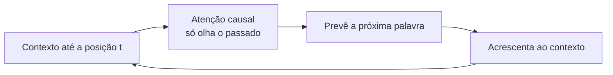

# Aula 5, GPT

> Esta aula fecha os Transformers com o GPT, o modelo só de decoder que gera texto
> uma palavra por vez. A sua marca é a atenção causal, que impede cada posição de
> olhar para o futuro. Vamos implementar essa máscara do zero e ligar o GPT ao gerador
> de n-gramas do começo da trilha.

O BERT, da aula anterior, é um leitor, ele entende a frase inteira de uma vez. O GPT é um
escritor, ele produz texto da esquerda para a direita, uma palavra de cada vez. Essa
diferença de propósito se traduz em uma diferença técnica simples e profunda, o GPT usa
atenção causal, em que cada posição só pode atender às anteriores, nunca às futuras.

Essa restrição é o que torna possível gerar texto de forma honesta. Para prever a próxima
palavra, o modelo não pode espiar a resposta, ele só dispõe do que veio antes. É a mesma
ideia do gerador de n-gramas que construímos lá no Módulo 1, prever a próxima palavra a
partir do contexto, só que agora com toda a potência da atenção. Nesta aula você vai
entender a atenção causal, implementá-la e ver a linha que liga aquele brinquedo aos
modelos que conversam com a gente hoje.

---

## Objetivos

Ao final desta aula, você deve ser capaz de:

- Explicar o que é um modelo só de decoder e a geração autorregressiva.
- Entender a atenção causal e o papel da máscara.
- Implementar a atenção mascarada do zero.
- Relacionar o GPT com o gerador de n-gramas e com os LLMs atuais.

## Teoria

O GPT, cuja linhagem foi descrita por Radford e colegas e escalada por Brown e colegas no
GPT-3, é uma pilha de blocos de decoder. Cada bloco é parecido com o de encoder da aula
três, com atenção, feed-forward, conexões residuais e normalização, mas com uma diferença
crucial, a atenção é mascarada. A máscara zera as pontuações das posições futuras antes da
softmax, de modo que a palavra na posição $t$ só pode atender às posições de 1 até $t$.

O treino é a previsão da próxima palavra, a mesma tarefa do modelo de linguagem do Módulo
1, só que aprendida por uma rede muito mais poderosa, sobre um corpus imenso. Uma vez
treinado, o GPT gera texto de forma autorregressiva, ele prevê a próxima palavra, a
acrescenta ao contexto, e repete, exatamente o laço de geração que já conhecemos.



É essa simplicidade conceitual, prever a próxima palavra, levada a uma escala enorme de
dados e de parâmetros, que produz os comportamentos surpreendentes dos LLMs atuais. Tudo
o que veremos no Módulo 7 sobre LLMs se apoia nesta arquitetura de decoder com atenção
causal.

## Explicação Intuitiva

Pense em escrever uma história palavra por palavra, sem poder apagar nem ler o que ainda
não escreveu. A cada momento, você decide a próxima palavra olhando apenas o que já está
no papel. A atenção causal é a regra que garante esse jogo limpo, ela venda os olhos do
modelo para o futuro, deixando-o ver só o passado.

Essa é a diferença essencial para o BERT, que podia olhar os dois lados porque a sua
tarefa era entender, não gerar. Para gerar, é preciso a venda, senão o modelo trapacearia,
prevendo uma palavra que ele já estaria vendo. O notável é que, com essa regra simples e
muita escala, o GPT aprende a continuar textos de um jeito coerente, criativo e útil.

## Explicação Matemática

A atenção causal é a atenção comum com uma máscara. Calculamos as pontuações $Q K^\top /
\sqrt{d_k}$ e, antes da softmax, atribuímos menos infinito a toda entrada acima da
diagonal, ou seja, a todo par em que a coluna $j$ é maior que a linha $i$:

$$
\text{scores}_{ij} =
\begin{cases}
\dfrac{q_i \cdot k_j}{\sqrt{d_k}} & \text{se } j \le i \\[2mm]
-\infty & \text{se } j > i
\end{cases}
$$

Ao passar pela softmax, as entradas com menos infinito viram zero, então a posição $i$ não
distribui nenhum peso para as posições futuras. A matriz de atenção resultante é
triangular inferior. A geração autorregressiva estima, a cada passo, $P(w_t \mid w_1,
\dots, w_{t-1})$, amostra a próxima palavra e a realimenta, repetindo o processo, como no
gerador de n-gramas, mas com um modelo incomparavelmente mais capaz.

## Exemplo Prático

Vamos implementar a atenção causal do zero e confirmar que ela é triangular inferior, ou
seja, que cada posição só atende a si mesma e às anteriores. Aplicada à mesma frase das
aulas anteriores, a primeira palavra atende só a si, a segunda às duas primeiras, e assim
por diante, exatamente o que esperamos de um modelo que gera da esquerda para a direita.

Em seguida, o notebook traz um caminho que usa um modelo de verdade rodando localmente via
Ollama, para ver a geração autorregressiva em ação, fechando o arco que começou no gerador
de n-gramas. O código está no notebook
[notebooks/modulo-06/05-gpt.ipynb](https://github.com/LucasSpinola/assistentes-educacionais-com-ia/blob/main/notebooks/modulo-06/05-gpt.ipynb), então abra-o ao
lado para acompanhar.

## Código Comentado

```python
import numpy as np


def softmax(z, eixo=-1):
    z = z - z.max(axis=eixo, keepdims=True)
    e = np.exp(z)
    return e / e.sum(axis=eixo, keepdims=True)


tokens = ["gato", "felino", "pulou", "alto"]
E = np.array([
    [1.0, 0.0, 0.0, 0.0],
    [0.9, 0.1, 0.0, 0.0],
    [0.0, 0.0, 1.0, 0.0],
    [0.0, 0.0, 0.0, 1.0],
])


def atencao_causal(X):
    """Atenção que impede cada posição de olhar para as futuras."""
    n, d = X.shape
    scores = X @ X.T / np.sqrt(d)
    # Máscara: tudo acima da diagonal vira menos infinito.
    mascara = np.triu(np.ones((n, n)), k=1).astype(bool)
    scores[mascara] = -np.inf
    return softmax(scores, eixo=-1)


A = atencao_causal(E)
print("Matriz de atenção causal (triangular inferior):")
for i, t in enumerate(tokens):
    print(f"  {t:7} {np.round(A[i], 2)}")
print("\nNenhum peso vai para o futuro:", np.allclose(np.triu(A, 1), 0))
```

Ao rodar, a matriz de atenção é triangular inferior, com a parte de cima zerada. A palavra
gato, na primeira posição, só atende a si mesma. Felino atende a gato e a si. E assim por
diante, cada palavra enxergando apenas o passado. Essa máscara, simples de implementar, é o
que separa um gerador de um leitor, e é a base de toda a família GPT. Da próxima vez que um
assistente completar a sua frase, lembre que, no fundo, é esta mesma ideia, prever a
próxima palavra olhando só para trás, rodando em uma escala gigantesca.

## Exercícios

1) Conceitual: O que é a atenção causal e por que ela é necessária para gerar texto?
2) Conceitual: Qual a relação entre a geração autorregressiva do GPT e o gerador de
   n-gramas do Módulo 1?
3) Prático: Aumente a sequência e confirme que a matriz de atenção causal continua
   triangular inferior.
4) Prático: Remova a máscara e verifique que a atenção passa a distribuir peso para o
   futuro, o que invalidaria a geração.
5) Extensão: Pesquise a diferença entre amostragem gulosa e amostragem com temperatura na
   geração de texto, e descreva o efeito de cada uma.

## Projeto da Aula e Projeto do Módulo

Este projeto fecha o módulo. A entrega é uma implementação mínima de atenção, comparada com
uma referência de biblioteca. Implemente a self-attention e a atenção causal do zero, como
nas aulas, e confirme as suas propriedades, as linhas somam 1 e a versão causal é
triangular inferior. Em seguida, compare o seu resultado com o de uma biblioteca madura, ou
gere texto com um modelo de verdade via Ollama para ver a arquitetura em ação.

Considere o projeto pronto quando você tiver a sua atenção funcionando e verificada, e um
parágrafo conectando a atenção causal à geração autorregressiva e aos LLMs. Com isso, você
encerra o módulo de Transformers, dominando a arquitetura que sustenta tudo o que vem a
seguir, dos LLMs aos agentes do final da trilha.

## Leituras Recomendadas

- O relatório do GPT-2, de Radford e colegas, e o artigo do GPT-3, de Brown e colegas.
- O texto The Illustrated GPT-2, de Jay Alammar, com diagramas da geração.
- O repositório minGPT, de Andrej Karpathy, uma implementação enxuta e didática do GPT.

## Referências Científicas

As referências abaixo são reais e estão registradas em
[references/referencias.bib](../../references/referencias.bib). As chaves entre
parênteses são as do BibTeX.

- Radford, A., Wu, J., Child, R., Luan, D., Amodei, D., e Sutskever, I. (2019). Language
  Models are Unsupervised Multitask Learners. OpenAI. (`radford2019gpt2`)
- Brown, T. B., et al. (2020). Language Models are Few-Shot Learners. NeurIPS.
  (`brown2020gpt3`)
- Vaswani, A., et al. (2017). Attention Is All You Need. NeurIPS.
  (`vaswani2017attention`)
