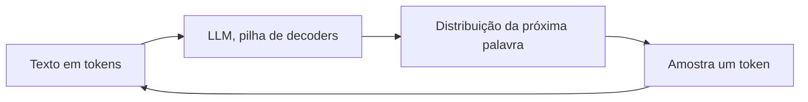

# Aula 1, Como LLMs funcionam

> Esta aula abre o módulo sobre Large Language Models juntando as peças dos módulos
> anteriores. Um LLM é, no fundo, um Transformer decoder gigante que prevê a próxima
> palavra. Vamos entender essa máquina, ver a amostragem por temperatura e gerar texto
> com um modelo de verdade.

Chegamos ao destino para onde toda a primeira metade da trilha apontava. Vimos
representar palavras com embeddings, processar sequências com redes recorrentes e, no
módulo anterior, a arquitetura Transformer com a sua atenção. Um Large Language Model
junta tudo isso em uma escala enorme. Ele é uma pilha profunda de blocos de decoder,
treinada para prever a próxima palavra, com bilhões de parâmetros e um corpus que abrange
boa parte do texto disponível.

O surpreendente é que, dessa tarefa simples, prever a próxima palavra, emergem
capacidades que ninguém programou diretamente, como responder perguntas, resumir, traduzir
e raciocinar passo a passo. Nesta aula você vai entender o que é um LLM por dentro, como
ele gera texto e como a temperatura controla a criatividade da geração, e vai conversar
com um modelo local para ver tudo isso na prática.

---

## Objetivos

Ao final desta aula, você deve ser capaz de:

- Explicar que um LLM é um Transformer decoder treinado para prever a próxima palavra.
- Entender a geração autorregressiva e o papel do contexto.
- Compreender como a temperatura controla a aleatoriedade da geração.
- Reconhecer noções de tokens, janela de contexto e capacidades emergentes.

## Teoria

Um LLM recebe um texto, quebrado em tokens, e produz uma distribuição de probabilidade
sobre qual token vem a seguir. Para gerar, ele amostra um token dessa distribuição, o
acrescenta ao contexto e repete, exatamente a geração autorregressiva que vimos no GPT. O
modelo nunca planeja a frase inteira de antemão, ele a constrói uma peça por vez, e mesmo
assim o resultado costuma ser coerente, porque cada previsão leva em conta todo o contexto
anterior.

Três conceitos ajudam a entender o comportamento. Os tokens são as unidades em que o texto
é dividido, em geral pedaços de palavras, como vimos na ideia de subpalavras. A janela de
contexto é o número máximo de tokens que o modelo consegue considerar de uma vez, e limita
o quanto ele lembra. E as capacidades emergentes, descritas por Wei e colegas, são
habilidades que aparecem só a partir de certa escala, ausentes em modelos menores.



A amostragem é onde mora boa parte do controle. Em vez de sempre pegar o token mais
provável, o que tornaria o texto repetitivo, usamos a temperatura para ajustar o quanto a
escolha é arriscada. Temperatura baixa deixa a escolha quase determinística, focada nos
tokens mais prováveis. Temperatura alta achata a distribuição, dando chance a tokens menos
prováveis e gerando texto mais variado e criativo, ao custo de mais erros.

## Explicação Intuitiva

Pense em um LLM como um autocompletar absurdamente bom, treinado em quase tudo o que já se
escreveu. Você dá um começo, e ele continua, palavra por palavra, sempre apostando na
continuação mais plausível dado tudo o que veio antes. Não há um roteiro guardado, só uma
sequência de apostas muito bem informadas.

A temperatura é como um botão de ousadia nessa aposta. No mínimo, o modelo joga seguro,
escolhendo sempre a palavra mais óbvia, o que é bom para tarefas que exigem precisão, como
responder um fato. No máximo, ele arrisca palavras inesperadas, o que ajuda em tarefas
criativas, como escrever uma história, mas aumenta a chance de bobagem. Saber girar esse
botão conforme a tarefa é parte da arte de usar LLMs.

## Explicação Matemática

Dado o contexto $w_1, \dots, w_{t-1}$, o modelo produz, para cada token possível, uma
pontuação chamada logit. A temperatura $T$ entra na conversão dos logits em probabilidades
pela softmax com temperatura:

$$
P(w_t = k) = \frac{\exp(z_k / T)}{\sum_j \exp(z_j / T)}.
$$

Quando $T \to 0$, a distribuição concentra quase toda a massa no token de maior logit, o
que equivale a escolher sempre o mais provável, a amostragem gulosa. Quando $T = 1$, usamos
a distribuição original do modelo. Quando $T > 1$, as diferenças entre os logits encolhem,
e a distribuição fica mais uniforme, aumentando a diversidade. É um único parâmetro com um
efeito muito visível no texto gerado.

## Exemplo Prático

Vamos fazer duas coisas. Primeiro, sem precisar de um modelo gigante, demonstramos a
amostragem por temperatura sobre uma pequena lista de logits, observando a distribuição da
próxima palavra mudar conforme giramos a temperatura. Esse exemplo isola, em poucas linhas,
um dos controles mais importantes da geração.

Depois, no notebook, conversamos com um LLM de verdade rodando localmente via Ollama,
gerando texto e variando a temperatura para sentir o efeito na criatividade das respostas.
O código está no notebook
[notebooks/modulo-07/01-como-llms-funcionam.ipynb](https://github.com/LucasSpinola/assistentes-educacionais-com-ia/blob/main/notebooks/modulo-07/01-como-llms-funcionam.ipynb),
então abra-o ao lado para acompanhar.

## Código Comentado

```python
import numpy as np


def softmax_temperatura(logits, T):
    """Converte logits em probabilidades, com temperatura T."""
    z = np.array(logits) / T
    z -= z.max()                       # estabiliza a exponencial
    e = np.exp(z)
    return e / e.sum()


# Logits de quatro candidatos a próxima palavra, do mais ao menos provável.
logits = [2.0, 1.0, 0.5, 0.1]

print("Distribuição da próxima palavra conforme a temperatura:")
for T in [0.2, 1.0, 2.0]:
    p = softmax_temperatura(logits, T)
    print(f"  T = {T}:  {np.round(p, 3)}   prob do mais provável = {p.max():.3f}")
```

Ao rodar, com temperatura 0,2 a probabilidade do token mais provável chega a cerca de
0,99, ou seja, a geração fica quase determinística, sempre escolhendo o favorito. Com
temperatura 1,0 a distribuição é a do modelo, e o favorito fica em torno de 0,57. Com
temperatura 2,0 a distribuição se achata, e o favorito cai para cerca de 0,41, abrindo
espaço para escolhas mais variadas. Esse único parâmetro é o que, na prática, separa uma
resposta sóbria de uma resposta criativa.

## Exercícios

1) Conceitual: Por que dizemos que um LLM gera texto de forma autorregressiva? O que isso
   significa palavra a palavra?
2) Conceitual: O que é a janela de contexto e como ela limita o que o modelo consegue
   levar em conta?
3) Prático: Experimente outros valores de temperatura, como 0,5 e 5,0, e descreva o efeito
   na distribuição.
4) Prático: No notebook, gere a mesma resposta com temperaturas diferentes via Ollama e
   compare a criatividade e a precisão.
5) Extensão: Pesquise as estratégias de amostragem top-k e top-p, e explique como elas se
   combinam com a temperatura.

## Projeto da Aula

Construa um explorador de temperatura. A entrega é um programa que gera respostas para uma
mesma pergunta educacional em três temperaturas diferentes, usando o Ollama, e apresenta
as três lado a lado para comparação.

Considere o projeto pronto quando você conseguir mostrar, com exemplos reais, como a
temperatura baixa produz respostas mais previsíveis e a alta, respostas mais variadas, e
escrever um parágrafo sobre qual faixa usaria para um assistente educacional e por quê.
Essa intuição sobre a geração é a base para os módulos de prompt engineering e de agentes.

## Leituras Recomendadas

- O artigo do GPT-3, de Brown e colegas, que popularizou a ideia de LLMs como aprendizes
  de poucas amostras.
- O artigo de Wei e colegas sobre as capacidades emergentes dos LLMs.
- A documentação do Ollama, para entender os parâmetros de geração na prática.

## Referências Científicas

As referências abaixo são reais e estão registradas em
[references/referencias.bib](../../references/referencias.bib). As chaves entre
parênteses são as do BibTeX.

- Brown, T. B., et al. (2020). Language Models are Few-Shot Learners. NeurIPS.
  (`brown2020gpt3`)
- Wei, J., et al. (2022). Emergent Abilities of Large Language Models. TMLR.
  (`wei2022emergent`)
- Vaswani, A., et al. (2017). Attention Is All You Need. NeurIPS.
  (`vaswani2017attention`)
