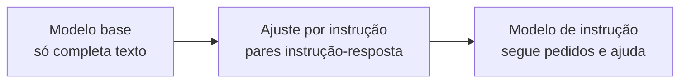

# Aula 3, Fine-tuning e instrução

> Esta aula trata do que transforma um modelo base, que apenas completa texto, em um
> assistente que segue instruções. Vamos entender o fine-tuning e o ajuste por
> instrução, e no projeto do módulo comparar, lado a lado, as respostas de um modelo
> base e de um modelo de instrução.

O pré-treino entrega um modelo base, que sabe muito sobre a língua e o mundo, mas que tem
um comportamento curioso, ele só sabe continuar texto. Se você pergunta a um modelo base
qual é a capital da França, ele pode responder com outra pergunta, ou com uma lista de
exercícios, porque está apenas prevendo uma continuação plausível, não tentando ajudar. O
modelo base é poderoso, mas cru.

Para virar um assistente útil, ele precisa de mais uma etapa de treino. O fine-tuning ajusta
um modelo já pré-treinado para uma tarefa ou comportamento específico, usando dados
adicionais. O caso mais importante é o ajuste por instrução, em que o modelo aprende, a
partir de muitos exemplos de instrução e resposta, a fazer o que é pedido. É essa etapa que
separa um modelo que completa texto de um que conversa e ajuda, e nesta aula você vai vê-la
em ação comparando os dois.

---

## Objetivos

Ao final desta aula, você deve ser capaz de:

- Diferenciar um modelo base de um modelo ajustado por instrução.
- Explicar o que é fine-tuning e por que ele aproveita o pré-treino.
- Entender o ajuste por instrução e o seu efeito no comportamento.
- Conhecer, em linhas gerais, o ajuste eficiente com LoRA.

## Teoria

O fine-tuning parte de um modelo pré-treinado e continua o treino sobre um conjunto de dados
específico, ajustando os pesos para uma tarefa ou estilo. Como o modelo já entende a língua,
ele aprende a nova tarefa com muito menos dados do que precisaria do zero, aproveitando tudo
o que absorveu no pré-treino. É o mesmo princípio de pré-treinar uma vez e adaptar muitas que
vimos no BERT.

O ajuste por instrução é um fine-tuning com um tipo especial de dado, pares de instrução e
resposta desejada, cobrindo muitas tarefas. Ao ver milhares de exemplos do tipo resuma este
texto seguido de um bom resumo, ou explique este conceito seguido de uma boa explicação, o
modelo generaliza e passa a seguir instruções novas. O trabalho do FLAN, de Wei e colegas,
mostrou que isso melhora muito a capacidade do modelo de resolver tarefas que nunca viu no
ajuste.



Ajustar todos os bilhões de pesos é caro. Por isso surgiram técnicas de ajuste eficiente,
como o LoRA, de Hu e colegas, que congela o modelo original e treina apenas um pequeno
conjunto de matrizes de baixa dimensão adicionadas a ele. Com uma fração dos parâmetros e da
memória, o LoRA alcança resultados próximos aos do fine-tuning completo, o que tornou a
adaptação de LLMs acessível mesmo com poucos recursos.

## Explicação Intuitiva

Pense no modelo base como um erudito que leu tudo, mas que tem a mania de, quando você fala
algo, continuar o seu pensamento em vez de responder. Ele sabe a resposta, só não entendeu
que era para respondê-la. O ajuste por instrução é como um treinamento de atendimento, em
que esse erudito pratica, milhares de vezes, receber um pedido e atendê-lo, até que isso vire
natural.

O LoRA, por sua vez, é como ensinar um truque novo a um especialista sem mandá-lo refazer
toda a formação. Em vez de remodelar o cérebro inteiro, você anexa algumas anotações de
margem que ajustam o comportamento para a tarefa nova. É barato, rápido, e você pode ter
várias dessas anotações, uma para cada tarefa, sem duplicar o modelo inteiro.

## Explicação Matemática

No ajuste por instrução, o objetivo continua sendo a previsão da próxima palavra, mas sobre
dados formatados como instrução seguida de resposta. O modelo é treinado para maximizar a
probabilidade da resposta desejada dado o comando, ou seja, para que a resposta certa seja a
continuação mais provável da instrução.

O LoRA muda a forma de ajustar os pesos. Em vez de atualizar uma matriz de pesos $W$
diretamente, ele a mantém congelada e aprende uma correção de baixa dimensão, escrita como o
produto de duas matrizes pequenas:

$$
W' = W + \Delta W, \qquad \Delta W = A B,
$$

em que $A$ e $B$ têm uma dimensão interna $r$ bem pequena. Como só $A$ e $B$ são treinadas, o
número de parâmetros ajustados cai drasticamente, mas a expressividade é suficiente para
adaptar o comportamento do modelo.

## Exemplo Prático

Esta aula tem o projeto que dá sentido a todo o módulo, comparar um modelo base com um modelo
de instrução nas mesmas perguntas. Para um conjunto de perguntas educacionais, vamos enviar
cada uma aos dois modelos via Ollama e observar a diferença de comportamento. A expectativa é
que o modelo base tenda a continuar ou divagar, enquanto o de instrução responda de forma
direta e útil.

Como isso depende de ter os dois modelos disponíveis, o notebook lida com a ausência de
qualquer um deles de forma graciosa, explicando como obtê-los. O código está no notebook
[notebooks/modulo-07/03-fine-tuning-instrucao.ipynb](../../notebooks/modulo-07/03-fine-tuning-instrucao.ipynb),
então abra-o ao lado para acompanhar.

## Código Comentado

```python
import ollama

# Ajuste os nomes conforme os modelos que você tem no Ollama.
# Um modelo base completa texto; um de instrução segue pedidos.
MODELO_BASE = "llama3.1:text"        # variante base (completa texto)
MODELO_INSTRUCAO = "llama3.1"        # variante de instrução (segue pedidos)

perguntas = [
    "Explique o que é uma função matemática.",
    "Dê um exemplo de uso de derivada no dia a dia.",
]


def responder(modelo, pergunta):
    try:
        r = ollama.chat(model=modelo, messages=[{"role": "user", "content": pergunta}])
        return r["message"]["content"].strip()
    except Exception as erro:
        return f"(modelo {modelo} indisponível: {erro})"


for p in perguntas:
    print("Pergunta:", p)
    print("  Base      :", responder(MODELO_BASE, p)[:200])
    print("  Instrução :", responder(MODELO_INSTRUCAO, p)[:200])
    print()
```

Ao rodar, com os dois modelos disponíveis, a diferença costuma ser nítida. O modelo de
instrução vai direto ao ponto, com uma explicação clara e adequada a um aluno. O modelo base,
sem o ajuste por instrução, tende a continuar o texto de forma menos útil, às vezes repetindo
a pergunta, listando tópicos soltos ou divagando. É esse contraste que mostra, na prática, o
valor do ajuste por instrução, a mesma capacidade bruta, organizada para ajudar.

## Exercícios

1) Conceitual: Qual a diferença de comportamento entre um modelo base e um modelo ajustado por
   instrução diante da mesma pergunta?
2) Conceitual: Por que o fine-tuning precisa de muito menos dados do que treinar um modelo do
   zero?
3) Prático: Acrescente perguntas de outros tipos, como pedir um resumo ou uma lista, e observe
   onde a diferença entre os modelos é maior.
4) Prático: Para o modelo de instrução, varie a forma de pedir, mais ou menos detalhada, e veja
   como a resposta muda.
5) Extensão: Pesquise o LoRA com mais profundidade e explique por que ele é tão usado para
   adaptar LLMs com pouca memória.

## Projeto da Aula e Projeto do Módulo

Este é o projeto que fecha o módulo. A entrega é uma comparação sistemática entre um modelo
base e um modelo de instrução, sobre um conjunto de perguntas educacionais. Para cada
pergunta, registre as respostas dos dois modelos e classifique a diferença, por exemplo se o
modelo de instrução foi mais direto, mais claro ou mais adequado ao aluno.

Considere o projeto pronto quando você tiver uma pequena tabela com as respostas dos dois
modelos para algumas perguntas e um parágrafo discutindo o que o ajuste por instrução
mudou no comportamento. Se não tiver os dois modelos, descreva o que esperaria de cada um e
demonstre ao menos o de instrução. Esse contraste prepara a última aula, sobre o RLHF, que
refina ainda mais o alinhamento do modelo com o que as pessoas querem.

## Leituras Recomendadas

- O artigo do FLAN, de Wei e colegas, sobre ajuste por instrução e generalização para tarefas
  novas.
- O artigo do LoRA, de Hu e colegas, sobre adaptação eficiente de LLMs.
- A documentação do Ollama sobre os modelos disponíveis, incluindo variantes base e de
  instrução.

## Referências Científicas

As referências abaixo são reais e estão registradas em
[references/referencias.bib](../../references/referencias.bib). As chaves entre
parênteses são as do BibTeX.

- Wei, J., et al. (2022). Finetuned Language Models Are Zero-Shot Learners. ICLR.
  (`wei2022flan`)
- Hu, E. J., et al. (2022). LoRA: Low-Rank Adaptation of Large Language Models. ICLR.
  (`hu2021lora`)
- Ouyang, L., et al. (2022). Training Language Models to Follow Instructions with Human
  Feedback. NeurIPS. (`ouyang2022instructgpt`)
