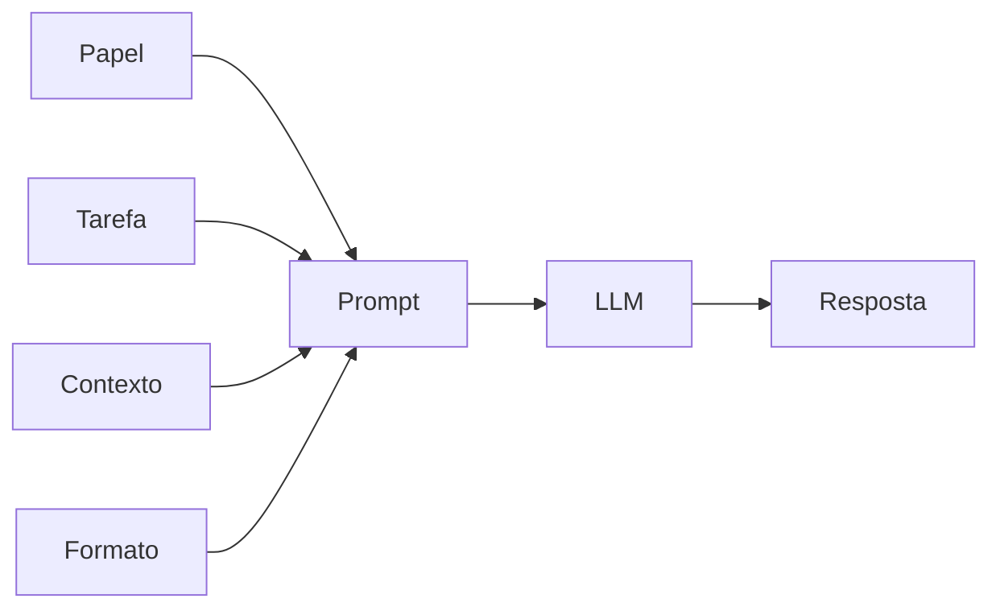

# Aula 1, Zero-shot

> Esta aula abre o prompt engineering pela forma mais direta de usar um LLM, o
> zero-shot, em que pedimos uma tarefa sem dar nenhum exemplo. Vamos ver como a forma
> de pedir muda o resultado e construir prompts zero-shot bem estruturados para um
> tutor.

No módulo anterior, entendemos como um LLM funciona por dentro. Agora começamos a aprender
a conversar com ele de forma eficaz, que é o que chamamos de prompt engineering. Um modelo
ajustado por instrução já sabe seguir pedidos, mas a qualidade da resposta depende muito de
como o pedido é feito. Pequenas mudanças na formulação podem transformar uma resposta vaga
em uma resposta excelente.

O ponto de partida é o zero-shot, que significa pedir uma tarefa diretamente, sem fornecer
exemplos de como fazê-la. É o modo mais comum de uso no dia a dia, e funciona porque o
modelo aprendeu, no ajuste por instrução, a generalizar para tarefas novas. Nesta aula você
vai entender o que torna um prompt zero-shot bom, e vai montar prompts claros e bem
estruturados para um tutor educacional.

---

## Objetivos

Ao final desta aula, você deve ser capaz de:

- Explicar o que é um prompt zero-shot e por que ele funciona.
- Reconhecer os elementos de um bom prompt, papel, tarefa, contexto e formato.
- Comparar prompts vagos com prompts bem estruturados.
- Montar prompts zero-shot para um tutor educacional.

## Teoria

Zero-shot quer dizer zero exemplos. Damos ao modelo apenas a instrução da tarefa e
esperamos que ele a execute. Isso é possível porque, no ajuste por instrução visto no
Módulo 7, o modelo aprendeu a seguir comandos variados, então generaliza para comandos que
nunca viu exatamente assim. O artigo do FLAN mostrou que esse ajuste melhora muito a
capacidade zero-shot.

A qualidade da resposta, porém, depende da qualidade do prompt. Um bom prompt zero-shot
costuma deixar claros alguns elementos. O papel diz quem o modelo deve ser, por exemplo um
tutor paciente. A tarefa diz o que fazer, de forma específica. O contexto dá as informações
necessárias, como o nível do aluno. E o formato indica como a resposta deve ser
apresentada, por exemplo em três frases ou em uma lista.



Quanto mais vago o pedido, mais o modelo precisa adivinhar a sua intenção, e mais provável
que erre o alvo. Quanto mais claro e específico, mais a resposta tende a se ajustar ao que
você queria. Dominar essa clareza é a base de todas as técnicas mais avançadas que veremos
nas próximas aulas.

## Explicação Intuitiva

Pense em pedir ajuda a um assistente muito capaz, mas que faz exatamente o que você diz, nem
mais nem menos. Se você pede explique isso, ele não sabe para quem, em que profundidade, em
que formato, e entrega algo genérico. Se você pede explique a derivada para um aluno do
primeiro ano, em duas frases e com uma analogia, ele tem tudo o que precisa para acertar.

A diferença não está na inteligência do modelo, e sim na clareza do pedido. Prompt
engineering é, em boa parte, a habilidade de comunicar com precisão o que você quer. E
começa pelo básico, dizer o papel, a tarefa, o contexto e o formato, em vez de soltar uma
instrução solta e torcer pelo melhor.

## Explicação Matemática

Esta aula é mais prática do que matemática, mas vale conectar com o que vimos. Um prompt nada
mais é do que o contexto inicial sobre o qual o modelo calcula a probabilidade da próxima
palavra. Lembre que o modelo gera maximizando, a cada passo, $P(w_t \mid \text{prompt}, w_1,
\dots, w_{t-1})$. Mudar o prompt muda esse condicionamento, e portanto muda toda a
distribuição das continuações possíveis.

Por isso um prompt específico funciona. Ao incluir explicitamente o papel, o nível e o
formato, você desloca a distribuição para a região das respostas que têm essas
características, tornando-as muito mais prováveis do que com um prompt vago. Não há mágica,
apenas um condicionamento melhor da mesma máquina de prever palavras.

## Exemplo Prático

Vamos montar dois prompts para a mesma tarefa, explicar um conceito, um vago e um bem
estruturado, e comparar as respostas de um LLM via Ollama. A expectativa é que o prompt
estruturado, com papel, nível e formato, produza uma explicação muito mais adequada a um
aluno do que o prompt solto.

Construir o prompt é só montar uma string com os elementos certos, algo determinístico que
podemos testar sem o modelo. O envio ao LLM vai no notebook, com degradação graciosa caso o
Ollama não esteja disponível. O código está no notebook
[notebooks/modulo-08/01-zero-shot.ipynb](https://github.com/LucasSpinola/assistentes-educacionais-com-ia/blob/main/notebooks/modulo-08/01-zero-shot.ipynb),
então abra-o ao lado para acompanhar.

## Código Comentado

```python
def prompt_vago(conceito):
    """Um pedido solto, sem papel, nível ou formato."""
    return f"Explique {conceito}."


def prompt_estruturado(conceito, nivel, formato):
    """Um prompt zero-shot com papel, tarefa, contexto e formato bem definidos."""
    return (
        "Você é um tutor paciente e didático.\n"
        f"Tarefa: explique o conceito de {conceito}.\n"
        f"Contexto: o aluno está no nível {nivel}.\n"
        f"Formato: {formato}.\n"
        "Use linguagem simples e um exemplo do dia a dia."
    )


print("PROMPT VAGO:\n", prompt_vago("derivada"))
print("\nPROMPT ESTRUTURADO:\n",
      prompt_estruturado("derivada", "iniciante", "no máximo três frases"))
```

Ao rodar, fica visível a diferença entre os dois prompts. O vago dá ao modelo total
liberdade, e a resposta costuma ser genérica, sem saber para quem nem em que profundidade. O
estruturado guia o modelo, dizendo o papel a assumir, o nível do aluno e o formato esperado,
e a resposta tende a ser muito mais útil. No notebook, ao enviar os dois ao Ollama, esse
contraste aparece nas respostas de verdade. Essa clareza é o alicerce, e nas próximas aulas
acrescentamos exemplos, raciocínio e estrutura.

## Exercícios

1) Conceitual: O que significa zero-shot, e por que um modelo ajustado por instrução
   consegue fazer tarefas sem exemplos?
2) Conceitual: Cite os quatro elementos de um bom prompt e explique o papel de cada um.
3) Prático: Reescreva um prompt vago seu em um prompt estruturado e compare as respostas no
   Ollama.
4) Prático: Mude apenas o nível do aluno no prompt estruturado, de iniciante para avançado, e
   observe como a resposta muda.
5) Extensão: Pesquise o conceito de persona em prompts e descreva como definir o papel do
   modelo afeta o tom da resposta.

## Projeto da Aula

Construa uma biblioteca de prompts zero-shot para um tutor. A entrega é um conjunto de
funções que montam prompts bem estruturados para tarefas comuns de um tutor, como explicar um
conceito, dar um exemplo ou propor um exercício, cada uma com papel, contexto e formato.

Considere o projeto pronto quando você tiver pelo menos três prompts estruturados, testados no
Ollama, e um parágrafo comparando as respostas deles com as de versões vagas das mesmas
tarefas. Essa biblioteca será a base para as técnicas das próximas aulas, em que adicionamos
exemplos e raciocínio aos prompts.

## Leituras Recomendadas

- O artigo do GPT-3, de Brown e colegas, que cunhou a ideia de aprendizado zero-shot e
  few-shot.
- O survey de prompting de Liu e colegas, para um panorama das técnicas.
- Guias práticos de prompt engineering, como o da OpenAI e o da Anthropic.

## Referências Científicas

As referências abaixo são reais e estão registradas em
[references/referencias.bib](../../references/referencias.bib). As chaves entre
parênteses são as do BibTeX.

- Brown, T. B., et al. (2020). Language Models are Few-Shot Learners. NeurIPS.
  (`brown2020gpt3`)
- Wei, J., et al. (2022). Finetuned Language Models Are Zero-Shot Learners. ICLR.
  (`wei2022flan`)
- Liu, P., et al. (2023). Pre-train, Prompt, and Predict. ACM Computing Surveys.
  (`liu2023prompt`)
