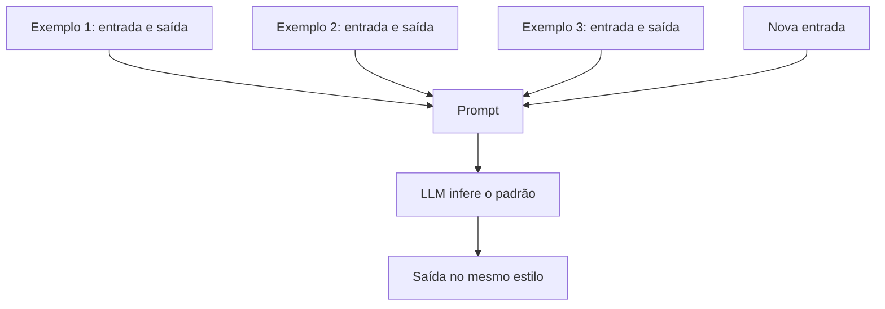

# Aula 2, Few-shot

> Esta aula acrescenta exemplos ao prompt. No few-shot, mostramos ao modelo alguns
> casos resolvidos antes de pedir a tarefa, e ele aprende o padrão na hora, sem treino.
> Vamos montar prompts few-shot e ver como os exemplos guiam o formato e o estilo da
> resposta.

A aula anterior mostrou como pedir uma tarefa de forma clara, sem exemplos. Mas às vezes
descrever o que queremos é difícil, e é muito mais fácil mostrar. Quando você quer que o
modelo siga um formato específico, ou um estilo particular, ou resolva uma tarefa de um jeito
incomum, dar exemplos costuma funcionar melhor do que explicar.

Essa é a ideia do few-shot, incluir no prompt alguns exemplos de entrada e saída antes de
apresentar o caso real. O modelo percebe o padrão dos exemplos e o aplica ao novo caso, tudo
dentro do mesmo prompt, sem nenhum treino adicional. Esse fenômeno, chamado aprendizado em
contexto, foi um dos grandes destaques do GPT-3. Nesta aula você vai entender e montar
prompts few-shot eficazes.

---

## Objetivos

Ao final desta aula, você deve ser capaz de:

- Explicar o que é few-shot e o aprendizado em contexto.
- Montar um prompt com exemplos de entrada e saída.
- Reconhecer quando few-shot é melhor que zero-shot.
- Entender como a escolha dos exemplos afeta a resposta.

## Teoria

No few-shot, o prompt traz uma pequena demonstração, alguns pares de entrada e saída que
ilustram a tarefa, seguidos da nova entrada para a qual queremos a saída. O modelo, ao
processar esse contexto, infere a regra implícita nos exemplos e a aplica ao caso final. Não
há ajuste de pesos, todo o aprendizado acontece na passagem para frente, lendo o prompt.

A grande vantagem é o controle do formato e do estilo. Se os seus exemplos respondem em uma
frase curta, o modelo tende a responder em uma frase curta. Se eles seguem uma estrutura
específica, o modelo segue. Isso torna o few-shot especialmente útil para tarefas de
classificação, extração e formatação, em que descrever o formato em palavras seria mais
trabalhoso do que mostrá-lo.



A escolha dos exemplos importa muito. Exemplos representativos e variados ajudam o modelo a
captar a regra geral. Exemplos enviesados ou ambíguos podem induzir o modelo ao erro. Em
geral, poucos exemplos bem escolhidos, de dois a cinco, já fazem grande diferença, e
acrescentar exemplos demais raramente compensa o custo de um prompt mais longo.

## Explicação Intuitiva

Imagine ensinar uma tarefa a alguém mostrando, em vez de explicando. Você resolve dois ou três
casos na frente da pessoa, e então entrega um novo, dizendo agora você. Mesmo sem você
verbalizar a regra, a pessoa capta o padrão pelos exemplos e o reproduz. O few-shot faz
exatamente isso com o modelo.

É por isso que o few-shot brilha quando o formato é difícil de descrever, mas fácil de
demonstrar. Querer que cada resposta venha como uma única palavra, ou em um formato de
ficha, é mais simples de mostrar com dois exemplos do que de explicar em prosa. O modelo
imita o padrão que vê, e a consistência das respostas aumenta bastante.

## Explicação Matemática

A explicação segue a mesma lógica do condicionamento. Ao colocar exemplos no prompt, mudamos
o contexto sobre o qual o modelo calcula $P(w_t \mid \text{contexto})$. Os exemplos tornam
muito mais provável a continuação que segue o mesmo padrão, porque o modelo, ao prever a
próxima palavra, foi treinado a dar coerência ao texto, e a coerência com os exemplos puxa a
saída para o mesmo formato.

Vale notar que esse aprendizado em contexto é temporário, ele vale só para aquele prompt.
Diferente do fine-tuning, que altera os pesos de forma permanente, o few-shot não muda o
modelo, apenas o orienta naquela interação. É um aprendizado que vive na janela de contexto e
desaparece quando o prompt acaba.

## Exemplo Prático

Vamos montar um prompt few-shot para uma tarefa de classificação, decidir se a mensagem de um
aluno é uma dúvida ou um elogio. Damos alguns exemplos rotulados e, em seguida, uma mensagem
nova. A expectativa é que o modelo siga o padrão dos exemplos e classifique a nova mensagem no
mesmo formato curto.

A montagem do prompt a partir dos exemplos é determinística e podemos testá-la sem o modelo. O
envio ao LLM vai no notebook, com degradação graciosa. O código está no notebook
[notebooks/modulo-08/02-few-shot.ipynb](../../notebooks/modulo-08/02-few-shot.ipynb), então
abra-o ao lado para acompanhar.

## Código Comentado

```python
def montar_few_shot(exemplos, nova_entrada):
    """Monta um prompt few-shot a partir de pares (entrada, saída)."""
    linhas = ["Classifique a mensagem do aluno como 'duvida' ou 'elogio'.\n"]
    for entrada, saida in exemplos:
        linhas.append(f"Mensagem: {entrada}\nClasse: {saida}\n")
    linhas.append(f"Mensagem: {nova_entrada}\nClasse:")
    return "\n".join(linhas)


exemplos = [
    ("não entendi a derivada", "duvida"),
    ("adorei a explicação, muito obrigado", "elogio"),
    ("como resolvo essa integral?", "duvida"),
]

prompt = montar_few_shot(exemplos, "a aula de hoje foi excelente")
print(prompt)
```

Ao rodar, o prompt mostra os três exemplos rotulados seguidos da nova mensagem com o campo de
classe em aberto, convidando o modelo a completá-lo. Como os exemplos estabelecem o formato,
uma classe em uma palavra, o modelo tende a responder elogio, no mesmo padrão, em vez de
escrever um parágrafo. No notebook, ao enviar ao Ollama, vemos essa imitação do padrão
acontecer. É a forma mais simples de obter respostas consistentes sem treinar nada.

## Exercícios

1) Conceitual: O que é aprendizado em contexto, e por que ele não altera os pesos do modelo?
2) Conceitual: Em que situações o few-shot tende a ser melhor que o zero-shot?
3) Prático: Acrescente um terceiro rótulo, como 'problema técnico', com exemplos, e teste se o
   modelo passa a usá-lo.
4) Prático: Troque os exemplos por outros mal escolhidos, ambíguos, e veja se a qualidade da
   classificação cai.
5) Extensão: Pesquise como a ordem dos exemplos em um prompt few-shot pode afetar o resultado.

## Projeto da Aula

Construa um classificador few-shot de mensagens de alunos. A entrega é um programa que monta
um prompt few-shot com bons exemplos e classifica novas mensagens em categorias úteis para um
assistente, como dúvida, elogio e problema técnico, usando o Ollama.

Considere o projeto pronto quando o classificador acertar a maioria de um pequeno conjunto de
mensagens de teste e quando você conseguir mostrar um caso em que melhorar os exemplos melhora
a classificação. Esse uso de exemplos para guiar o modelo é uma ferramenta que você levará
para todas as tarefas seguintes, inclusive os agentes.

## Leituras Recomendadas

- O artigo do GPT-3, de Brown e colegas, que demonstrou o aprendizado few-shot em escala.
- O survey de prompting de Liu e colegas, com a taxonomia das técnicas.
- Estudos sobre a sensibilidade do few-shot à escolha e à ordem dos exemplos.

## Referências Científicas

As referências abaixo são reais e estão registradas em
[references/referencias.bib](../../references/referencias.bib). As chaves entre
parênteses são as do BibTeX.

- Brown, T. B., et al. (2020). Language Models are Few-Shot Learners. NeurIPS.
  (`brown2020gpt3`)
- Liu, P., et al. (2023). Pre-train, Prompt, and Predict. ACM Computing Surveys.
  (`liu2023prompt`)
- Wei, J., et al. (2022). Finetuned Language Models Are Zero-Shot Learners. ICLR.
  (`wei2022flan`)
