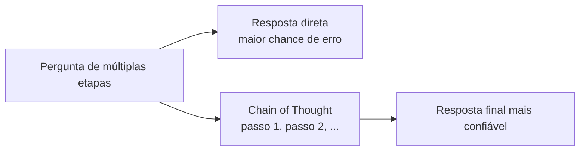

# Aula 3, Chain of Thought

> Esta aula apresenta o Chain of Thought, a técnica de pedir ao modelo que raciocine
> passo a passo antes de responder. Para problemas que exigem várias etapas, mostrar o
> raciocínio melhora muito as respostas. Vamos construir prompts de raciocínio e
> compará-los com respostas diretas.

As aulas anteriores trataram de como pedir e de como mostrar exemplos. Esta trata de como
fazer o modelo pensar. Para perguntas simples, pedir a resposta direta funciona bem. Mas para
problemas que exigem várias etapas, como um cálculo com vários passos ou um raciocínio lógico,
pedir a resposta de uma vez costuma dar erro, porque o modelo tenta adivinhar o resultado sem
desenvolver o caminho.

O Chain of Thought, apresentado por Wei e colegas, resolve isso de um jeito quase óbvio em
retrospecto, pedir ao modelo que mostre o raciocínio passo a passo antes de dar a resposta
final. Ao escrever os passos, o modelo distribui o problema em pedaços menores, cada um mais
fácil de acertar, e a resposta final melhora muito. Nesta aula você vai entender por que isso
funciona e como aplicar.

---

## Objetivos

Ao final desta aula, você deve ser capaz de:

- Explicar o que é Chain of Thought e por que ele ajuda.
- Diferenciar o Chain of Thought com exemplos do zero-shot com a frase mágica.
- Construir prompts que induzem o raciocínio passo a passo.
- Reconhecer as tarefas que mais se beneficiam dessa técnica.

## Teoria

O Chain of Thought instrui o modelo a externalizar o raciocínio, escrevendo os passos
intermediários antes da resposta. Em vez de pular direto para o resultado, o modelo produz uma
cadeia de pensamento, e só então conclui. Para problemas de múltiplas etapas, isso muda o jogo,
porque cada passo se apoia no anterior, e o modelo não precisa carregar tudo de uma vez.

Há duas formas principais. Na versão com exemplos, o prompt few-shot mostra não só a resposta,
mas o raciocínio que levou a ela, ensinando o modelo a fazer o mesmo. Na versão zero-shot,
descoberta por Kojima e colegas, basta acrescentar uma frase como vamos pensar passo a passo
para que o modelo comece a desenvolver o raciocínio sozinho, sem nenhum exemplo. É notável que
uma única frase tenha tanto efeito.



Vale lembrar do custo e do escopo. O Chain of Thought gera respostas mais longas, o que
consome mais tokens e tempo. E ele ajuda principalmente em tarefas que de fato exigem várias
etapas, como aritmética, lógica e planejamento. Para perguntas factuais simples, pedir o
raciocínio costuma ser desnecessário.

## Explicação Intuitiva

Pense na diferença entre resolver uma conta de cabeça e resolvê-la no papel. De cabeça, em um
problema com vários passos, é fácil se perder e errar. No papel, você escreve cada etapa, e ao
final só precisa juntar os pedaços, com muito menos chance de tropeçar. O Chain of Thought é
dar papel ao modelo, deixá-lo escrever o caminho em vez de adivinhar o destino.

Isso conecta com o que vimos sobre a geração. O modelo prevê uma palavra por vez, sem planejar
a resposta inteira. Ao pedir que ele escreva o raciocínio, damos a ele um rascunho onde cada
passo já escrito ajuda a prever o próximo. É como se o ato de pensar em voz alta criasse, no
próprio texto, o apoio que o modelo precisa para chegar à resposta certa.

## Explicação Matemática

A intuição matemática é elegante. Sem o raciocínio, o modelo precisa estimar diretamente
$P(\text{resposta} \mid \text{pergunta})$, o que, para problemas complexos, é uma distribuição
muito difícil de acertar de uma vez. Com o Chain of Thought, ele decompõe o problema, gerando
primeiro os passos $s_1, s_2, \dots, s_k$ e depois a resposta:

$$
P(\text{resposta} \mid \text{pergunta}) = \sum_{\text{passos}}
P(\text{resposta} \mid \text{passos}, \text{pergunta})\, P(\text{passos} \mid \text{pergunta}).
$$

Na prática, o modelo gera uma cadeia de passos plausível e condiciona a resposta a ela. Cada
passo é uma previsão mais simples que a resposta final direta, e a resposta condicionada aos
passos corretos fica muito mais fácil. É a mesma ideia de dividir para conquistar, agora dentro
da geração de texto.

## Exemplo Prático

Vamos comparar duas formas de pedir a solução de um pequeno problema de várias etapas, uma
pedindo a resposta direta e outra pedindo o raciocínio passo a passo com a frase mágica. A
expectativa, bem documentada na literatura, é que a versão com raciocínio acerte com mais
frequência os problemas que exigem mais de um passo.

A construção dos dois prompts é determinística e fácil de testar. A comparação real, com as
respostas do modelo, vai no notebook via Ollama, com degradação graciosa. O código está no
notebook
[notebooks/modulo-08/03-chain-of-thought.ipynb](https://github.com/LucasSpinola/assistentes-educacionais-com-ia/blob/main/notebooks/modulo-08/03-chain-of-thought.ipynb),
então abra-o ao lado para acompanhar.

## Código Comentado

```python
def prompt_direto(problema):
    """Pede a resposta final diretamente."""
    return f"{problema}\nResponda apenas com o número final."


def prompt_cot(problema):
    """Pede o raciocínio passo a passo antes da resposta (zero-shot CoT)."""
    return f"{problema}\nVamos pensar passo a passo e só então dar a resposta final."


problema = (
    "Uma turma tem 28 alunos. Cada aluno precisa de 3 cadernos, e cada pacote traz "
    "4 cadernos. Quantos pacotes a turma precisa comprar?"
)

print("PROMPT DIRETO:\n", prompt_direto(problema))
print("\nPROMPT CHAIN OF THOUGHT:\n", prompt_cot(problema))
```

Ao rodar, os dois prompts pedem a mesma coisa, mas de formas diferentes. O direto cobra logo o
número, e o modelo precisa acertar de uma vez, o que para este problema de três etapas, mais
de uma multiplicação e uma divisão com arredondamento, é arriscado. O Chain of Thought pede o
desenvolvimento, e o modelo costuma escrever que são 28 vezes 3 igual a 84 cadernos, depois 84
dividido por 4 igual a 21, chegando a 21 pacotes. No notebook, enviando ao Ollama, vemos que a
versão com raciocínio erra bem menos nesse tipo de problema.

## Exercícios

1) Conceitual: Por que pedir o raciocínio passo a passo melhora as respostas em problemas de
   múltiplas etapas?
2) Conceitual: Qual a diferença entre o Chain of Thought com exemplos e o zero-shot com a
   frase mágica?
3) Prático: Crie um problema de três etapas e compare a taxa de acerto do prompt direto e do
   prompt com raciocínio no Ollama.
4) Prático: Aplique o Chain of Thought a um problema simples de uma etapa e observe se ele
   ajuda ou apenas alonga a resposta.
5) Extensão: Pesquise a técnica de autoconsistência, que amostra vários raciocínios e vota na
   resposta mais comum, e descreva como ela melhora o Chain of Thought.

## Projeto da Aula

Avalie o ganho do Chain of Thought em problemas educacionais. A entrega é um experimento que
aplica o prompt direto e o prompt com raciocínio a um conjunto de problemas de matemática de
várias etapas, e compara a taxa de acerto das duas abordagens.

Considere o projeto pronto quando você tiver as taxas de acerto das duas formas em alguns
problemas e um parágrafo discutindo em que tipos de problema o raciocínio mais ajudou. Essa
capacidade de fazer o modelo pensar antes de responder é decisiva para os agentes, que
precisam planejar antes de agir.

## Leituras Recomendadas

- O artigo de Wei e colegas que introduziu o Chain of Thought com exemplos.
- O artigo de Kojima e colegas sobre o Chain of Thought zero-shot, a frase mágica.
- Materiais sobre autoconsistência e outras melhorias do raciocínio em LLMs.

## Referências Científicas

As referências abaixo são reais e estão registradas em
[references/referencias.bib](../../references/referencias.bib). As chaves entre
parênteses são as do BibTeX.

- Wei, J., et al. (2022). Chain-of-Thought Prompting Elicits Reasoning in Large Language
  Models. NeurIPS. (`wei2022cot`)
- Kojima, T., et al. (2022). Large Language Models are Zero-Shot Reasoners. NeurIPS.
  (`kojima2022zeroshot`)
- Liu, P., et al. (2023). Pre-train, Prompt, and Predict. ACM Computing Surveys.
  (`liu2023prompt`)
