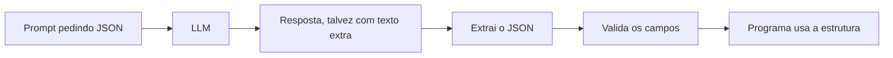

# Aula 4, Structured output

> Esta aula fecha o módulo ensinando o modelo a responder em formato estruturado, como
> JSON, para que outros programas usem a saída. É a ponte entre o LLM e o código, e a
> base dos agentes. No projeto, montamos um tutor que explica em níveis e devolve
> respostas estruturadas.

Até aqui, tratamos a saída do modelo como texto para humanos lerem. Mas quando o LLM faz
parte de um sistema maior, outra peça do programa precisa usar a resposta, e texto livre é
difícil de processar. Precisamos que o modelo responda em um formato previsível e legível por
máquina, como JSON, com campos bem definidos.

Conseguir saída estruturada confiável é uma habilidade central, especialmente para os agentes
que veremos no Módulo 10, que dependem de respostas em formato fixo para decidir ações. Nesta
aula você vai aprender a pedir JSON ao modelo, a extrair e validar essa estrutura no código, e
a lidar com o fato de que o modelo nem sempre obedece perfeitamente. No projeto, juntamos tudo
em um tutor que explica conceitos em diferentes níveis de profundidade.

---

## Objetivos

Ao final desta aula, você deve ser capaz de:

- Explicar por que a saída estruturada é necessária para integrar LLMs a sistemas.
- Pedir ao modelo uma resposta em JSON com campos definidos.
- Extrair e validar a estrutura no código, lidando com respostas imperfeitas.
- Construir um tutor que devolve explicações em níveis, de forma estruturada.

## Teoria

Saída estruturada é fazer o modelo responder seguindo um formato fixo, em geral JSON, com
campos que o seu programa espera. Em vez de um parágrafo livre, o modelo devolve algo como um
objeto com os campos tema, nível e explicação. Assim, o restante do sistema consegue ler cada
campo e agir sobre ele, em vez de tentar interpretar texto solto.

Há três cuidados. O primeiro é pedir o formato com clareza no prompt, descrevendo os campos
desejados e, idealmente, mostrando um exemplo. O segundo é extrair a estrutura da resposta,
pois o modelo às vezes embrulha o JSON em texto extra ou em cercas de código. O terceiro é
validar, conferindo se os campos esperados estão presentes, porque o modelo pode errar o
formato. Um sistema robusto sempre valida a saída e tem um plano para quando ela vem errada.



Modelos modernos lidam bem com isso, e muitos oferecem um modo de saída estruturada que
garante JSON válido. Mas entender como extrair e validar na mão é importante, porque deixa
você preparado para qualquer modelo e para os casos em que a saída não vem perfeita.

## Explicação Intuitiva

Pense na diferença entre receber uma resposta por e-mail em texto corrido e recebê-la em um
formulário preenchido. O texto corrido um humano lê bem, mas um programa se atrapalha para
achar cada informação. O formulário, com campos rotulados, é trivial de processar, basta ler
o campo que interessa. Saída estruturada é pedir ao modelo que preencha o formulário, em vez
de escrever uma carta.

A parte de extrair e validar é como conferir o formulário antes de usá-lo. Às vezes o modelo
preenche tudo certo, às vezes esquece um campo ou escreve fora das linhas. Um sistema
cuidadoso não confia cegamente, ele extrai o que dá, verifica se está completo, e decide o
que fazer se faltar algo. Essa desconfiança saudável é o que torna a integração com LLMs
confiável.

## Explicação Matemática

Esta aula é mais de engenharia do que de matemática. O ponto a registrar é que pedir um
formato é, mais uma vez, condicionar a geração. Ao incluir no prompt a instrução de responder
em JSON e um exemplo do formato, tornamos as continuações em JSON muito mais prováveis, pela
mesma lógica de condicionamento das aulas anteriores.

A parte de código segue uma lógica simples de extração e validação. Procuramos, na resposta,
o trecho que parece um objeto, da primeira chave de abertura à última de fechamento, tentamos
interpretá-lo como JSON, e conferimos se os campos esperados estão presentes. Se qualquer
etapa falhar, tratamos como uma resposta inválida, em vez de quebrar o programa.

## Exemplo Prático

Vamos construir as duas peças que tornam a saída estruturada confiável, um extrator que
recupera o JSON de uma resposta, mesmo com texto em volta, e um validador que confere os
campos esperados. Testamos com respostas simuladas do modelo, incluindo casos imperfeitos,
sem precisar do LLM, para garantir que o código é robusto.

Depois, no notebook, pedimos JSON a um LLM de verdade via Ollama e passamos a resposta pelo
extrator e pelo validador, fechando o ciclo. O código está no notebook
[notebooks/modulo-08/04-structured-output.ipynb](../../notebooks/modulo-08/04-structured-output.ipynb),
então abra-o ao lado para acompanhar.

## Código Comentado

```python
import re
import json


def extrair_json(texto):
    """Recupera o primeiro objeto JSON do texto, mesmo com texto em volta."""
    m = re.search(r"\{.*\}", texto, re.DOTALL)   # do primeiro { ao último }
    if not m:
        return None
    try:
        return json.loads(m.group(0))
    except json.JSONDecodeError:
        return None


def validar(dados, campos):
    """Confere se o JSON tem todos os campos esperados."""
    if dados is None:
        return False, "não é JSON válido"
    faltando = [c for c in campos if c not in dados]
    if faltando:
        return False, "faltam campos: " + ", ".join(faltando)
    return True, "ok"


# Respostas simuladas do modelo, incluindo casos imperfeitos.
respostas = [
    'Claro! {"tema": "derivada", "nivel": "basico", "explicacao": "..."}',
    '{"tema": "matriz"}',                       # falta nível e explicação
    "desculpe, não consegui responder",         # sem JSON
]
campos = ["tema", "nivel", "explicacao"]

for r in respostas:
    dados = extrair_json(r)
    ok, msg = validar(dados, campos)
    print(f"válido: {ok!s:5} | {msg}  ->  {dados}")
```

Ao rodar, o extrator recupera o JSON mesmo quando ele vem precedido de texto, como no primeiro
caso. O validador aprova a resposta completa, reprova a que tem campos faltando, apontando
quais, e reprova a que não traz JSON nenhum. É essa dupla, extrair e validar, que permite usar
a saída do modelo com segurança no resto do programa. Sem ela, uma resposta fora do formato
quebraria o sistema, com ela, tratamos o erro com elegância.

## Exercícios

1) Conceitual: Por que a saída estruturada é importante quando o LLM faz parte de um sistema
   maior?
2) Conceitual: Quais são os três cuidados ao trabalhar com saída estruturada, do prompt à
   validação?
3) Prático: Acrescente um campo novo ao formato, como exemplo, e ajuste o prompt e a
   validação para incluí-lo.
4) Prático: Provoque o modelo a errar o formato, pedindo algo ambíguo, e veja o validador
   tratar o erro.
5) Extensão: Pesquise o modo de saída estruturada com esquema, oferecido por alguns modelos, e
   compare com a extração manual.

## Projeto da Aula e Projeto do Módulo

Este é o projeto que fecha o módulo. A entrega é um tutor que explica um conceito em diferentes
níveis de profundidade e devolve a resposta de forma estruturada. Para um mesmo conceito, peça
ao modelo uma explicação para nível iniciante, intermediário e avançado, exigindo a resposta em
JSON com campos como nível, explicação e exemplo, e use o extrator e o validador para processar
cada uma.

O roteiro reúne tudo do módulo. Use um prompt zero-shot bem estruturado, acrescente exemplos do
formato com few-shot, peça o raciocínio quando fizer sentido, e exija a saída estruturada.
Compare as explicações nos três níveis e avalie se cada uma se ajusta ao público.

Considere o projeto pronto quando o tutor gerar explicações válidas nos três níveis, com a
estrutura conferida pelo validador, e quando você escrever um parágrafo comparando como a
profundidade muda de um nível para outro. Com isso, você fecha o prompt engineering e fica
pronto para o Módulo 9, em que damos memória externa ao modelo com RAG.

## Leituras Recomendadas

- O survey de prompting de Liu e colegas, para situar a saída estruturada entre as técnicas.
- A documentação de saída estruturada e modo JSON de provedores de LLM.
- Materiais sobre validação de dados em Python, como a biblioteca pydantic.

## Referências Científicas

As referências abaixo são reais e estão registradas em
[references/referencias.bib](../../references/referencias.bib). As chaves entre
parênteses são as do BibTeX.

- Liu, P., et al. (2023). Pre-train, Prompt, and Predict. ACM Computing Surveys.
  (`liu2023prompt`)
- Brown, T. B., et al. (2020). Language Models are Few-Shot Learners. NeurIPS.
  (`brown2020gpt3`)
- Wei, J., et al. (2022). Finetuned Language Models Are Zero-Shot Learners. ICLR.
  (`wei2022flan`)
