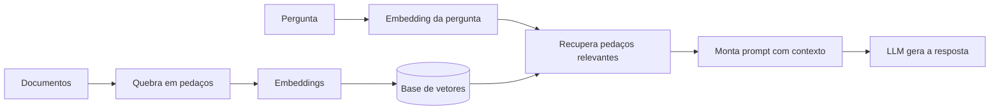

# Aula 1, Pipeline de RAG

> Esta aula abre o módulo de RAG, a técnica que dá ao LLM uma memória externa de
> documentos. Em vez de confiar só no que o modelo aprendeu, recuperamos trechos
> relevantes e os entregamos a ele para responder. Vamos montar um pipeline de RAG
> mínimo, de ponta a ponta.

Os módulos anteriores nos deram um LLM e a habilidade de conversar com ele por prompts.
Mas um LLM tem dois problemas sérios para um assistente educacional. Primeiro, ele só sabe o
que viu no treino, e pode estar desatualizado ou não conhecer o material específico da sua
disciplina. Segundo, ele às vezes inventa, produzindo respostas que soam confiantes mas estão
erradas, o que chamamos de alucinação.

O RAG, Retrieval-Augmented Generation, ataca os dois problemas. A ideia, formalizada por Lewis
e colegas, é simples e poderosa, antes de responder, buscamos em uma base de documentos os
trechos mais relevantes para a pergunta, e os fornecemos ao modelo junto com o pedido. Assim, o
modelo responde com base no material certo, não só na memória, reduzindo alucinações e
trazendo conhecimento atualizado e privado. Este é o primeiro módulo com um projeto de
assistente completo, e nesta aula montamos o esqueleto dele.

---

## Objetivos

Ao final desta aula, você deve ser capaz de:

- Explicar o que é RAG e quais problemas do LLM ele resolve.
- Descrever as duas fases do pipeline, indexação e consulta.
- Implementar um RAG mínimo de ponta a ponta.
- Reconhecer o papel de cada etapa, do trecho recuperado à resposta gerada.

## Teoria

Um sistema de RAG tem duas fases. A primeira é a indexação, feita uma vez sobre os documentos.
Quebramos cada documento em pedaços, os chunks, transformamos cada pedaço em um vetor por meio
de um modelo de embeddings, e guardamos esses vetores em uma base, em geral um banco vetorial.
A segunda é a consulta, feita a cada pergunta. Transformamos a pergunta em um vetor,
recuperamos os pedaços de vetor mais parecido, montamos um prompt que junta esses pedaços à
pergunta, e pedimos ao LLM que responda com base neles.



Cada etapa reaproveita algo da trilha. Os embeddings vêm do Módulo 4. A busca por similaridade
do cosseno também. A montagem do prompt vem do Módulo 8. O LLM, do Módulo 7. O RAG é, em boa
medida, a costura inteligente de peças que você já conhece, com o acréscimo de uma base de
vetores para guardar e buscar o conhecimento.

## Explicação Intuitiva

Pense na diferença entre fazer uma prova de cabeça e fazer uma prova com consulta. De cabeça,
você depende só do que lembra, e pode errar ou inventar. Com consulta, você procura no material
o trecho certo e responde com base nele. O RAG transforma o LLM em um aluno que faz prova com
consulta, ele primeiro encontra a página relevante e só então responde.

A parte da busca é como ter um índice remissivo muito bom. Em vez de folhear o livro inteiro,
você vai direto aos trechos que falam do assunto da pergunta. E como a busca é por significado,
e não por palavra exata, ela encontra o trecho certo mesmo quando a pergunta usa outras
palavras. É essa combinação, achar o material certo e responder com base nele, que torna o RAG
tão útil para assistentes que precisam ser confiáveis.

## Explicação Matemática

O coração da recuperação é a similaridade entre a pergunta e cada pedaço. Representamos a
pergunta por um vetor $\mathbf{q}$ e cada pedaço por um vetor $\mathbf{d}_i$, e medimos a
proximidade pela similaridade do cosseno,

$$
\text{sim}(\mathbf{q}, \mathbf{d}_i) =
\frac{\mathbf{q} \cdot \mathbf{d}_i}{\lVert \mathbf{q} \rVert \, \lVert \mathbf{d}_i \rVert}.
$$

Recuperamos os $k$ pedaços de maior similaridade, os top-k, e os concatenamos no prompt. A
qualidade do RAG depende de dois fatores, a qualidade dos vetores, que determina se a busca
acha o pedaço certo, e a montagem do prompt, que determina se o modelo usa bem o que foi
recuperado. A geração em si segue a previsão da próxima palavra de sempre, agora condicionada
ao contexto recuperado.

## Exemplo Prático

Vamos montar um RAG mínimo de ponta a ponta, sem nenhuma biblioteca pesada. Usamos uma pequena
base de notas de aula, vetores TF-IDF como embeddings simples, e a busca por cosseno para
recuperar o trecho mais relevante de uma pergunta. Ao final, montamos o prompt que entregaria
esse trecho a um LLM.

Esse esqueleto, propositalmente simples, deixa claras todas as etapas do pipeline antes de
trocarmos as peças por versões mais poderosas nas próximas aulas. O código está no notebook
[notebooks/modulo-09/01-pipeline-de-rag.ipynb](https://github.com/LucasSpinola/assistentes-educacionais-com-ia/blob/main/notebooks/modulo-09/01-pipeline-de-rag.ipynb),
então abra-o ao lado para acompanhar.

## Código Comentado

```python
import re
import math
from collections import Counter

# Base de conhecimento: pequenos trechos de notas de aula.
documentos = [
    "A derivada mede a taxa de variação instantânea de uma função em um ponto.",
    "A regra da cadeia permite derivar funções compostas multiplicando as derivadas.",
    "Uma matriz é uma tabela de números organizada em linhas e colunas.",
    "Em Python, uma função é definida com a palavra-chave def.",
]


def tokenizar(texto):
    return re.findall(r"\w+", texto.lower())


# Indexação: TF-IDF como embedding simples de cada documento.
N = len(documentos)
df = Counter()
for d in documentos:
    for w in set(tokenizar(d)):
        df[w] += 1
idf = {w: math.log(N / f) for w, f in df.items()}


def vetor(texto):
    tf = Counter(tokenizar(texto))
    return {w: tf[w] * idf.get(w, 0.0) for w in tf}


def cosseno(a, b):
    prod = sum(a[w] * b.get(w, 0.0) for w in a)
    na = math.sqrt(sum(v * v for v in a.values()))
    nb = math.sqrt(sum(v * v for v in b.values()))
    return prod / (na * nb) if na and nb else 0.0


base = [vetor(d) for d in documentos]


def recuperar(pergunta, k=1):
    q = vetor(pergunta)
    ranking = sorted(((cosseno(q, base[i]), i) for i in range(N)), reverse=True)
    return [documentos[i] for _, i in ranking[:k]]


def montar_prompt(pergunta, trechos):
    contexto = "\n".join(f"- {t}" for t in trechos)
    return (
        "Use apenas o contexto abaixo para responder.\n"
        f"Contexto:\n{contexto}\n\n"
        f"Pergunta: {pergunta}\nResposta:"
    )


pergunta = "O que é a derivada de uma função?"
trechos = recuperar(pergunta, k=1)
print("Trecho recuperado:", trechos[0])
print("\nPrompt para o LLM:\n", montar_prompt(pergunta, trechos))
```

Ao rodar, a busca recupera o trecho sobre a derivada, o mais relevante para a pergunta, e o
prompt resultante entrega esse trecho ao modelo com a instrução de responder apenas com base
nele. Esse é o RAG inteiro em miniatura, indexar, recuperar e aumentar o prompt. Tudo o que
faremos a seguir é melhorar cada peça, embeddings melhores, um banco vetorial de verdade, e uma
montagem de contexto mais cuidadosa.

## Exercícios

1) Conceitual: Quais dois problemas do LLM o RAG resolve, e como?
2) Conceitual: Descreva as duas fases do pipeline de RAG e o que acontece em cada uma.
3) Prático: Acrescente novos documentos à base e teste perguntas que dependam deles.
4) Prático: Aumente o k para recuperar mais de um trecho e veja como o prompt muda.
5) Extensão: Pesquise o Dense Passage Retrieval e explique como ele difere da recuperação por
   TF-IDF que usamos aqui.

## Projeto da Aula

Construa um RAG mínimo funcional. A entrega é um programa que indexa uma pequena base de notas
de aula, recupera o trecho mais relevante para uma pergunta e monta o prompt com contexto,
opcionalmente enviando ao Ollama para gerar a resposta final.

Considere o projeto pronto quando, para algumas perguntas, o sistema recuperar o trecho certo e
montar um prompt coerente, e quando você escrever um parágrafo sobre o que melhoraria na busca.
Este esqueleto cresce ao longo do módulo até virar o assistente educacional completo do projeto
final.

## Leituras Recomendadas

- O artigo de Lewis e colegas que introduziu o RAG.
- O artigo do Dense Passage Retrieval, de Karpukhin e colegas, sobre recuperação densa.
- Tutoriais de RAG com LangChain e LlamaIndex, para ver implementações de produção.

## Referências Científicas

As referências abaixo são reais e estão registradas em
[references/referencias.bib](../../references/referencias.bib). As chaves entre
parênteses são as do BibTeX.

- Lewis, P., et al. (2020). Retrieval-Augmented Generation for Knowledge-Intensive NLP Tasks.
  NeurIPS. (`lewis2020rag`)
- Karpukhin, V., et al. (2020). Dense Passage Retrieval for Open-Domain Question Answering.
  EMNLP. (`karpukhin2020dpr`)
- Manning, C. D., Raghavan, P., e Schütze, H. (2008). Introduction to Information Retrieval.
  Cambridge University Press. (`manning2008ir`)
