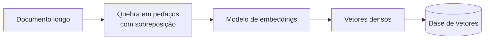

# Aula 2, Embeddings e vetores

> Esta aula aprofunda a peça que faz a busca do RAG funcionar, os embeddings dos
> documentos. Vamos ver como escolher e gerar bons vetores, como quebrar os documentos
> em pedaços, e por que a qualidade do embedding decide a qualidade de todo o sistema.

No RAG mínimo da aula anterior, usamos TF-IDF como embedding, e funcionou para um exemplo
pequeno. Mas o TF-IDF tem o limite que conhecemos desde o Módulo 3, ele compara palavras, não
significados. Se a pergunta usa taxa de variação e o documento fala em derivada, o TF-IDF não
percebe a relação, e a busca falha. Para um assistente de verdade, precisamos de embeddings que
capturem sentido.

É aqui que voltam os Sentence Transformers do Módulo 4. Eles geram vetores densos em que frases
de significado parecido ficam próximas, mesmo com palavras diferentes. Nesta aula você vai
entender como escolher um modelo de embeddings, como quebrar os documentos em pedaços do tamanho
certo, e como a soma dessas escolhas define a precisão da recuperação.

---

## Objetivos

Ao final desta aula, você deve ser capaz de:

- Explicar por que embeddings densos superam o TF-IDF na recuperação.
- Escolher um modelo de embeddings adequado a um sistema de RAG.
- Quebrar documentos em pedaços de forma sensata.
- Entender o impacto do tamanho dos pedaços na qualidade da busca.

## Teoria

Em um sistema de RAG, cada pedaço de documento e cada pergunta viram vetores, e a busca compara
esses vetores. A qualidade desses vetores é o fator mais decisivo. Vetores esparsos como o
TF-IDF capturam coincidência de palavras, enquanto vetores densos de um Sentence Transformer
capturam proximidade de sentido, o que torna a busca muito mais robusta a sinônimos e a
paráfrases.

Antes de gerar os vetores, é preciso decidir como quebrar os documentos, o chunking. Pedaços
muito grandes diluem o assunto, misturando vários temas em um vetor só, o que prejudica a
precisão. Pedaços muito pequenos perdem contexto, deixando o trecho sem sentido próprio. O bom
tamanho depende do material, e uma prática comum é usar pedaços de alguns parágrafos com uma
pequena sobreposição entre eles, para não cortar uma ideia ao meio.



A escolha do modelo de embeddings também importa. Modelos menores são rápidos e leves, bons para
rodar localmente. Modelos maiores capturam mais nuance, ao custo de mais recursos. Para
português, vale escolher um modelo treinado ou ajustado na língua, ou um modelo multilíngue, para
que a proximidade de sentido funcione bem.

## Explicação Intuitiva

Imagine organizar uma biblioteca para que livros sobre o mesmo assunto fiquem próximos. Se você
os organizar pela capa, dois livros de cálculo com capas diferentes ficariam longe, e isso é o
TF-IDF, que olha a superfície. Se organizar pelo conteúdo, eles ficariam vizinhos, e isso são os
embeddings densos, que olham o sentido. Numa biblioteca bem organizada pelo conteúdo, achar o
livro certo é fácil, mesmo que você descreva o assunto com outras palavras.

O chunking é como decidir o tamanho das fichas de cada livro. Uma ficha que resume o livro
inteiro é vaga demais para localizar um tema específico. Uma ficha por frase é detalhada demais e
perde o contexto. O ideal é uma ficha por seção, que tem assunto próprio e é específica o
suficiente para a busca encontrar. Acertar esse tamanho é parte da arte de montar um bom RAG.

## Explicação Matemática

Os embeddings densos vivem em um espaço $\mathbb{R}^n$, em que cada documento ou pergunta é um
ponto. A busca usa a similaridade do cosseno, a mesma de sempre, mas agora sobre vetores que
codificam sentido, e não contagem de palavras. A vantagem aparece quando pergunta e documento
não compartilham palavras, mas têm sentido próximo, situação em que o cosseno entre os vetores
densos continua alto, enquanto o do TF-IDF seria zero.

O chunking afeta a geometria do espaço. Cada pedaço é um ponto, e queremos que pontos do mesmo
assunto fiquem juntos e bem localizados. Pedaços grandes geram pontos que são médias de vários
assuntos, mal posicionados. Pedaços pequenos geram muitos pontos próximos e ralos de contexto.
Há um equilíbrio, análogo ao que vimos em overfitting, entre granularidade e contexto.

## Exemplo Prático

Vamos comparar a recuperação com TF-IDF e com embeddings densos em uma pergunta que usa palavras
diferentes das do documento. A expectativa é que o TF-IDF tropece quando não há palavras em
comum, enquanto o embedding denso ainda encontre o trecho certo pela proximidade de sentido.

Como os Sentence Transformers exigem uma biblioteca pesada, o notebook traz a versão densa como
caminho opcional, e demonstra o conceito com o TF-IDF e um pequeno exemplo de chunking que roda
sem dependências. O código está no notebook
[notebooks/modulo-09/02-embeddings-e-vetores.ipynb](https://github.com/LucasSpinola/assistentes-educacionais-com-ia/blob/main/notebooks/modulo-09/02-embeddings-e-vetores.ipynb),
então abra-o ao lado para acompanhar.

## Código Comentado

```python
def chunk_por_sentencas(texto, tamanho=2, sobreposicao=1):
    """Quebra o texto em pedaços de algumas sentenças, com sobreposição."""
    import re
    sentencas = [s.strip() for s in re.split(r"(?<=[.!?])\s+", texto) if s.strip()]
    pedacos = []
    passo = max(1, tamanho - sobreposicao)
    for i in range(0, len(sentencas), passo):
        pedaco = " ".join(sentencas[i:i + tamanho])
        if pedaco:
            pedacos.append(pedaco)
        if i + tamanho >= len(sentencas):
            break
    return pedacos


documento = (
    "A derivada mede a taxa de variação de uma função. "
    "Ela é a inclinação da reta tangente ao gráfico em um ponto. "
    "A regra da cadeia serve para derivar funções compostas. "
    "Já a integral acumula valores e é a operação inversa da derivada."
)

for i, p in enumerate(chunk_por_sentencas(documento, tamanho=2, sobreposicao=1)):
    print(f"Pedaço {i}: {p}")
```

Ao rodar, o documento é quebrado em pedaços de duas sentenças com uma sentença de sobreposição,
de modo que ideias vizinhas não fiquem isoladas e nenhuma transição se perca entre pedaços. Cada
pedaço, com o seu assunto próprio, será vetorizado e indexado. No notebook, a parte opcional com
Sentence Transformers mostra a recuperação por sentido superando o TF-IDF quando a pergunta usa
sinônimos, confirmando por que embeddings densos são o padrão em RAG de verdade.

## Exercícios

1) Conceitual: Por que embeddings densos recuperam melhor que o TF-IDF quando a pergunta usa
   sinônimos?
2) Conceitual: Quais os riscos de pedaços grandes demais e de pedaços pequenos demais?
3) Prático: Mude o tamanho e a sobreposição do chunking e observe como os pedaços mudam.
4) Prático: Instale o sentence-transformers e compare a recuperação densa com a do TF-IDF em uma
   pergunta com sinônimos.
5) Extensão: Pesquise estratégias de chunking que respeitam a estrutura do documento, como
   quebrar por seções ou títulos.

## Projeto da Aula

Construa um indexador com chunking configurável. A entrega é um programa que recebe documentos,
os quebra em pedaços com tamanho e sobreposição ajustáveis, e gera os vetores de cada pedaço,
pronto para a busca.

Considere o projeto pronto quando você conseguir indexar uma base de notas de aula com diferentes
configurações de chunking e comparar, em algumas perguntas, qual configuração recupera melhor.
Esse indexador é a porta de entrada do assistente, e a qualidade dele define o teto do sistema.

## Leituras Recomendadas

- O artigo do Sentence-BERT, de Reimers e Gurevych, sobre embeddings de frase.
- Documentação da biblioteca sentence-transformers, com modelos multilíngues e em português.
- Materiais sobre estratégias de chunking em sistemas de RAG.

## Referências Científicas

As referências abaixo são reais e estão registradas em
[references/referencias.bib](../../references/referencias.bib). As chaves entre
parênteses são as do BibTeX.

- Reimers, N., e Gurevych, I. (2019). Sentence-BERT: Sentence Embeddings using Siamese
  BERT-Networks. EMNLP. (`reimers2019sbert`)
- Karpukhin, V., et al. (2020). Dense Passage Retrieval for Open-Domain Question Answering.
  EMNLP. (`karpukhin2020dpr`)
- Mikolov, T., et al. (2013). Distributed Representations of Words and Phrases and their
  Compositionality. NeurIPS. (`mikolov2013distributed`)
