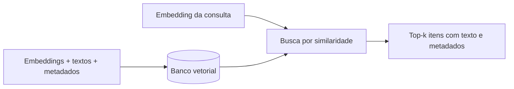

# Aula 3, ChromaDB na prática

> Esta aula apresenta os bancos vetoriais, as bases especializadas em guardar e buscar
> vetores, com foco no ChromaDB, leve e local. Vamos entender o que eles fazem,
> construir um banco vetorial mínimo do zero, e ver como o ChromaDB de verdade simplifica
> tudo.

Nas aulas anteriores, guardamos os vetores em uma lista e comparamos um a um com a pergunta.
Para um exemplo pequeno isso funciona, mas imagine uma base com milhões de pedaços. Comparar a
pergunta com todos, um por um, ficaria lento demais. É para resolver isso que existem os bancos
vetoriais, bases de dados especializadas em armazenar muitos vetores e encontrar os mais
parecidos com uma consulta de forma eficiente.

O ChromaDB é um banco vetorial leve, que roda embutido no seu programa, sem precisar de servidor,
o que o torna ideal para aprender e para projetos locais. Ele cuida de guardar os vetores, os
textos e os metadados, e de fazer a busca por similaridade com uma única chamada. Nesta aula
você vai entender o que um banco vetorial faz por dentro, construindo um mínimo do zero, e depois
ver como o ChromaDB entrega tudo isso pronto.

---

## Objetivos

Ao final desta aula, você deve ser capaz de:

- Explicar o papel de um banco vetorial em um sistema de RAG.
- Entender, em linhas gerais, a busca aproximada de vizinhos mais próximos.
- Construir um banco vetorial mínimo, em memória, do zero.
- Usar o ChromaDB para indexar e consultar documentos.

## Teoria

Um banco vetorial guarda vetores junto com os textos e metadados associados, e oferece uma
operação central, dada uma consulta, devolver os itens de vetor mais parecido. Para coleções
pequenas, ele faz a busca exata, comparando com todos. Para coleções grandes, usa busca
aproximada de vizinhos mais próximos, que troca um pouco de precisão por muita velocidade,
usando estruturas de índice que evitam comparar com todos os vetores. Técnicas como as do FAISS,
de Johnson e colegas, viabilizam busca em bilhões de vetores.



O ChromaDB encapsula tudo isso em uma API simples. Você cria uma coleção, adiciona documentos
com seus identificadores e metadados, e consulta passando uma pergunta, recebendo de volta os
pedaços mais relevantes. Ele pode até gerar os embeddings por você, com um modelo padrão, ou
aceitar vetores que você mesmo calculou. Por rodar embutido e salvar em disco, é perfeito para o
nosso assistente.

## Explicação Intuitiva

Pense em um banco vetorial como uma biblioteca com um bibliotecário extraordinário. Você não
precisa percorrer as estantes, basta descrever o que procura, e ele traz na hora os livros mais
relacionados. Para uma biblioteca pequena, ele realmente olha tudo. Para uma gigantesca, ele usa
um sistema de fichários inteligente que o leva quase direto à prateleira certa, sem perder tempo
com o resto.

Construir um banco vetorial mínimo, como faremos, é como ser esse bibliotecário em uma sala
pequena, dá para olhar todos os livros. O ChromaDB é contratar um bibliotecário profissional, que
faz o mesmo trabalho, mas organizado, persistente e pronto para crescer. Entender a versão
caseira ajuda a confiar na versão profissional, porque você sabe o que ela faz por baixo.

## Explicação Matemática

A busca exata é direta. Dada a consulta $\mathbf{q}$ e os vetores armazenados $\mathbf{d}_1,
\dots, \mathbf{d}_m$, calculamos a similaridade do cosseno de $\mathbf{q}$ com cada um e
devolvemos os $k$ maiores. O custo cresce com o número de vetores, pois comparamos com todos.

A busca aproximada evita esse custo construindo um índice que agrupa vetores parecidos, de modo
que a consulta visite só uma fração dos vetores. Há um compromisso, a busca fica muito mais
rápida, mas pode, raramente, deixar de fora um vizinho verdadeiro. Para a maioria das aplicações
de RAG, essa troca vale muito a pena, e é o que permite escalar a bases enormes.

## Exemplo Prático

Vamos construir um banco vetorial mínimo em memória, com uma API parecida com a do ChromaDB,
adicionar e consultar. Ele guarda os textos e os seus vetores TF-IDF, e a consulta devolve os
top-k por cosseno. Isso deixa claro o que um banco vetorial faz, sem nenhuma dependência.

Em seguida, o notebook mostra o ChromaDB de verdade fazendo o mesmo trabalho com muito menos
código, como caminho opcional. O código está no notebook
[notebooks/modulo-09/03-chromadb-na-pratica.ipynb](../../notebooks/modulo-09/03-chromadb-na-pratica.ipynb),
então abra-o ao lado para acompanhar.

## Código Comentado

```python
import re
import math
from collections import Counter


class BancoVetorialMinimo:
    """Um banco vetorial em memória, com TF-IDF e busca por cosseno."""

    def __init__(self):
        self.textos = []
        self.vetores = []
        self.idf = {}

    def indexar(self, documentos):
        self.textos = list(documentos)
        n = len(documentos)
        df = Counter()
        for d in documentos:
            for w in set(self._tok(d)):
                df[w] += 1
        self.idf = {w: math.log(n / f) for w, f in df.items()}
        self.vetores = [self._vetor(d) for d in documentos]

    def consultar(self, pergunta, k=2):
        q = self._vetor(pergunta)
        ranking = sorted(
            ((self._cos(q, self.vetores[i]), i) for i in range(len(self.textos))),
            reverse=True,
        )
        return [(round(s, 3), self.textos[i]) for s, i in ranking[:k]]

    def _tok(self, texto):
        return re.findall(r"\w+", texto.lower())

    def _vetor(self, texto):
        tf = Counter(self._tok(texto))
        return {w: tf[w] * self.idf.get(w, 0.0) for w in tf}

    def _cos(self, a, b):
        prod = sum(a[w] * b.get(w, 0.0) for w in a)
        na = math.sqrt(sum(v * v for v in a.values()))
        nb = math.sqrt(sum(v * v for v in b.values()))
        return prod / (na * nb) if na and nb else 0.0


banco = BancoVetorialMinimo()
banco.indexar([
    "A derivada mede a taxa de variação de uma função.",
    "Uma matriz organiza números em linhas e colunas.",
    "Em Python, def serve para definir uma função.",
])
for score, texto in banco.consultar("o que é a derivada?", k=2):
    print(score, texto)
```

Ao rodar, o banco recupera primeiro o trecho sobre a derivada, mostrando que a busca por
similaridade funciona com uma API limpa de indexar e consultar. É exatamente esse contrato que o
ChromaDB oferece, só que com persistência em disco, embeddings densos prontos e busca eficiente
para grandes volumes. No notebook, a versão com ChromaDB faz o mesmo em poucas linhas, e você
percebe que o conceito é o que você acabou de construir.

## Exercícios

1) Conceitual: Por que comparar a consulta com todos os vetores se torna inviável em bases
   grandes?
2) Conceitual: O que a busca aproximada de vizinhos mais próximos troca para ganhar velocidade?
3) Prático: Acrescente metadados a cada documento no banco mínimo, como o tema, e devolva-os na
   consulta.
4) Prático: Instale o ChromaDB e reproduza a indexação e a consulta com a API dele.
5) Extensão: Pesquise a estrutura HNSW, usada por muitos bancos vetoriais, e descreva a ideia
   geral.

## Projeto da Aula

Evolua o seu RAG para usar um banco vetorial. A entrega é uma versão do indexador e da busca que
encapsula o armazenamento e a consulta em uma classe de banco vetorial, com a opção de usar o
banco mínimo desta aula ou o ChromaDB.

Considere o projeto pronto quando o seu assistente conseguir indexar uma base de notas de aula em
um banco vetorial e responder consultas recuperando os trechos certos, e quando você comparar a
experiência de usar o banco caseiro e o ChromaDB. Esse banco é o componente que sustenta a busca
do assistente final.

## Leituras Recomendadas

- A documentação do ChromaDB, com exemplos de coleções, indexação e consulta.
- O artigo do FAISS, de Johnson e colegas, sobre busca de similaridade em larga escala.
- Materiais comparativos de bancos vetoriais, para conhecer as opções do ecossistema.

## Referências Científicas

As referências abaixo são reais e estão registradas em
[references/referencias.bib](../../references/referencias.bib). As chaves entre
parênteses são as do BibTeX.

- Johnson, J., Douze, M., e Jégou, H. (2021). Billion-Scale Similarity Search with GPUs. IEEE
  Transactions on Big Data. (`johnson2019faiss`)
- Lewis, P., et al. (2020). Retrieval-Augmented Generation for Knowledge-Intensive NLP Tasks.
  NeurIPS. (`lewis2020rag`)
- Manning, C. D., Raghavan, P., e Schütze, H. (2008). Introduction to Information Retrieval.
  Cambridge University Press. (`manning2008ir`)
