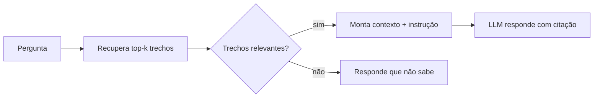

# Aula 4, Busca semântica e montagem de contexto

> Esta aula junta as peças do RAG em um fluxo de resposta completo. Vamos recuperar os
> trechos relevantes, montar com cuidado o contexto que vai ao modelo, e gerar a
> resposta citando as fontes. É aqui que o assistente começa a responder de verdade.

Já temos os embeddings e o banco vetorial. Falta a parte que transforma a busca em uma resposta
útil, e ela é mais sutil do que parece. Recuperar os trechos certos é metade do trabalho. A outra
metade é montar o contexto de um jeito que o modelo use bem, respeitando o limite de tamanho,
deixando claro o que é fonte e o que é pergunta, e instruindo o modelo a responder apenas com
base no que foi fornecido.

Uma montagem descuidada estraga uma boa busca. Se o contexto é confuso, ou se o prompt não deixa
claro que o modelo deve se ater às fontes, ele pode ignorar os trechos e voltar a inventar.
Nesta aula você vai aprender a montar o contexto com cuidado, a controlar o tamanho, a pedir
respostas fundamentadas com citação das fontes, e a lidar com o caso em que nada relevante é
encontrado.

---

## Objetivos

Ao final desta aula, você deve ser capaz de:

- Recuperar os top-k trechos e montar um contexto bem estruturado.
- Instruir o modelo a responder apenas com base no contexto.
- Pedir respostas com citação das fontes recuperadas.
- Tratar o caso em que nenhum trecho relevante é encontrado.

## Teoria

A montagem do contexto é a ponte entre a busca e a geração. Recuperados os top-k trechos, nós os
organizamos no prompt, em geral numerados ou marcados como fontes, seguidos da pergunta e de uma
instrução clara. A instrução é decisiva. Pedir responda apenas com base no contexto e, se a
resposta não estiver no contexto, diga que não sabe reduz drasticamente as alucinações, porque
orienta o modelo a não extrapolar.

Três cuidados melhoram muito o resultado. O primeiro é o limite de tamanho, pois o contexto mais
a resposta precisam caber na janela do modelo, então selecionamos só os trechos mais relevantes.
O segundo é a citação das fontes, pedindo ao modelo que indique de qual trecho tirou cada
afirmação, o que torna a resposta verificável. O terceiro é o tratamento da ausência, decidir o
que fazer quando a busca não encontra nada suficientemente relevante, em vez de forçar uma
resposta.



Repare que tudo isso é prompt engineering aplicado, do Módulo 8. A diferença é que parte do
prompt agora vem da busca, e não de você. O RAG é, em essência, prompt engineering com um
contexto recuperado dinamicamente.

## Explicação Intuitiva

Pense em um assistente de pesquisa que você instrui assim, aqui estão três trechos do material,
responda à minha pergunta usando apenas eles, e diga de qual trecho tirou cada informação. Se ele
seguir a instrução, você ganha uma resposta confiável e verificável, porque pode conferir cada
afirmação na fonte. Se você não der essa instrução, ele pode misturar o que leu com o que acha
que sabe, e aí a confiança cai.

O cuidado com a ausência é o que separa um assistente honesto de um que inventa. Um bom
assistente, ao não encontrar nada relevante, diz que não sabe, em vez de chutar. Para a educação,
isso é essencial, é melhor o assistente admitir que aquela dúvida não está coberta pelo material
do que dar ao aluno uma resposta errada com cara de certa.

## Explicação Matemática

A seleção dos trechos é um problema de top-k sobre as similaridades. Calculamos a similaridade do
cosseno da pergunta com cada pedaço e escolhemos os $k$ maiores. Um refinamento comum é aplicar
um limiar, só incluir trechos com similaridade acima de um valor mínimo, o que ajuda a tratar a
ausência, se nenhum trecho passa do limiar, consideramos que a base não cobre a pergunta.

O limite de tamanho transforma a seleção em um pequeno problema de orçamento. Cada trecho ocupa
um número de tokens, e há um teto, a janela de contexto menos o espaço reservado para a pergunta
e a resposta. Escolhemos os trechos de maior similaridade que cabem nesse orçamento, priorizando
relevância. É uma versão simples de seleção sob restrição, sempre favorecendo o mais relevante.

## Exemplo Prático

Vamos montar o fluxo completo de resposta sobre o banco vetorial, recuperar os top-k trechos,
verificar se algum é relevante o bastante, e montar um prompt que peça uma resposta fundamentada
com citação das fontes, ou que reconheça quando a base não cobre a pergunta. Geramos a resposta
com o Ollama quando disponível.

A montagem do contexto e o tratamento da ausência são determinísticos e rodam sem o modelo. O
código está no notebook
[notebooks/modulo-09/04-busca-semantica-contexto.ipynb](https://github.com/LucasSpinola/assistentes-educacionais-com-ia/blob/main/notebooks/modulo-09/04-busca-semantica-contexto.ipynb),
então abra-o ao lado para acompanhar.

## Código Comentado

```python
def montar_contexto(trechos_pontuados, limiar=0.05):
    """Seleciona trechos acima do limiar e os numera como fontes."""
    relevantes = [(s, t) for s, t in trechos_pontuados if s >= limiar]
    if not relevantes:
        return None
    linhas = [f"[{i+1}] {t}" for i, (s, t) in enumerate(relevantes)]
    return "\n".join(linhas)


def montar_prompt(pergunta, contexto):
    if contexto is None:
        # Nada relevante encontrado: instruímos o modelo a admitir.
        return (
            f"Não há material sobre a pergunta a seguir. Responda exatamente: "
            f"'Não encontrei isso no material disponível.'\nPergunta: {pergunta}"
        )
    return (
        "Responda à pergunta usando APENAS o contexto numerado abaixo. "
        "Cite as fontes entre colchetes, como [1]. Se a resposta não estiver no "
        "contexto, diga que não encontrou.\n\n"
        f"Contexto:\n{contexto}\n\n"
        f"Pergunta: {pergunta}\nResposta:"
    )


# Exemplo de trechos já recuperados, com as suas similaridades.
recuperados = [
    (0.39, "A derivada mede a taxa de variação de uma função."),
    (0.21, "A regra da cadeia deriva funções compostas."),
]
contexto = montar_contexto(recuperados)
print(montar_prompt("O que é a derivada?", contexto))

print("\n--- Caso sem material relevante ---")
print(montar_prompt("Qual a capital da Mongólia?", montar_contexto([(0.01, "trecho irrelevante")])))
```

Ao rodar, o primeiro caso monta um prompt com as duas fontes numeradas e instrui o modelo a
responder citando-as, o que produz uma resposta fundamentada e verificável. O segundo caso, em
que nada passou do limiar, gera um prompt que orienta o modelo a admitir que não encontrou,
evitando a alucinação. Esse tratamento honesto da ausência é o que dá ao assistente a confiança
necessária para a educação.

## Exercícios

1) Conceitual: Por que a instrução de responder apenas com base no contexto reduz as alucinações?
2) Conceitual: Como o limiar de similaridade ajuda a tratar perguntas que a base não cobre?
3) Prático: Mude o limiar e observe a partir de quando perguntas fora do tema passam a ser
   recusadas.
4) Prático: Peça ao modelo, via Ollama, uma resposta com citação das fontes e verifique se ela é
   conferível nos trechos.
5) Extensão: Pesquise técnicas de reordenação dos trechos recuperados, o re-ranking, e explique
   o que elas melhoram.

## Projeto da Aula

Implemente o fluxo de resposta completo do assistente. A entrega é a parte do sistema que recebe
uma pergunta, recupera os trechos, monta o contexto com citação e trata a ausência, gerando a
resposta com o LLM.

Considere o projeto pronto quando o assistente responder perguntas cobertas pela base citando as
fontes, e recusar de forma honesta perguntas fora do material, e quando você escrever um parágrafo
sobre como o tratamento da ausência aumenta a confiança do sistema. Com isso, o assistente está
quase completo, faltando apenas escalar para produção, tema da próxima aula.

## Leituras Recomendadas

- O artigo de Lewis e colegas sobre RAG, para a fundamentação da geração com recuperação.
- Guias de RAG com LangChain, sobre montagem de contexto e citação de fontes.
- Materiais sobre avaliação de RAG, como fidelidade da resposta às fontes.

## Referências Científicas

As referências abaixo são reais e estão registradas em
[references/referencias.bib](../../references/referencias.bib). As chaves entre
parênteses são as do BibTeX.

- Lewis, P., et al. (2020). Retrieval-Augmented Generation for Knowledge-Intensive NLP Tasks.
  NeurIPS. (`lewis2020rag`)
- Karpukhin, V., et al. (2020). Dense Passage Retrieval for Open-Domain Question Answering.
  EMNLP. (`karpukhin2020dpr`)
- Liu, P., et al. (2023). Pre-train, Prompt, and Predict. ACM Computing Surveys.
  (`liu2023prompt`)
