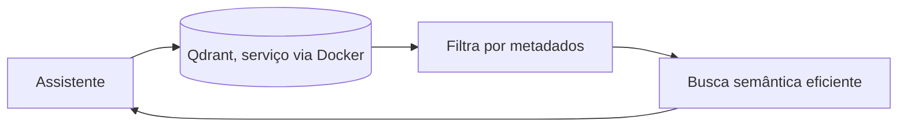

# Aula 5, Qdrant para produção

> Esta aula fecha o módulo olhando para a produção. O ChromaDB é ótimo para aprender e
> para projetos locais, mas sistemas maiores pedem um banco vetorial mais robusto, como
> o Qdrant. Vamos comparar os dois e ver os recursos que importam quando o assistente
> sai do notebook.

Construímos um assistente de RAG que funciona, com banco vetorial, busca semântica e respostas
fundamentadas. Para aprender e para projetos pessoais, o ChromaDB embutido dá conta com folga.
Mas quando o assistente precisa servir muitos usuários, lidar com milhões de documentos, filtrar
por metadados e rodar de forma confiável em um servidor, vale conhecer uma ferramenta pensada
para produção.

O Qdrant é um banco vetorial robusto, que roda como serviço, em geral em um contêiner Docker, e
oferece busca eficiente em larga escala, filtragem por metadados, persistência e uma API de rede.
Nesta aula você vai entender quando migrar do ChromaDB para o Qdrant, conhecer os recursos que
importam em produção, e ver como a mesma lógica de RAG se adapta a um banco vetorial servidor.
Aqui também vive o projeto que fecha o módulo, o assistente educacional completo.

---

## Objetivos

Ao final desta aula, você deve ser capaz de:

- Diferenciar um banco vetorial embutido de um servidor.
- Reconhecer os recursos de produção, como filtragem por metadados e persistência.
- Entender quando migrar do ChromaDB para o Qdrant.
- Integrar o assistente de RAG a um banco vetorial de produção.

## Teoria

A diferença central entre ChromaDB e Qdrant, no uso típico, é o modelo de execução. O ChromaDB
roda embutido no seu programa, o que é simples e ótimo para começar. O Qdrant roda como um
serviço separado, que o seu programa acessa pela rede, em geral subido com Docker. Esse modelo de
serviço é o que permite escalar, várias aplicações acessam o mesmo banco, e ele pode ser
dimensionado de forma independente.

Em produção, alguns recursos passam a importar muito. A filtragem por metadados permite restringir
a busca, por exemplo só nos documentos de uma disciplina ou de um período, combinando a busca
semântica com filtros exatos. A persistência confiável garante que os dados sobrevivem a
reinícios. E a busca aproximada eficiente, com índices como o HNSW, mantém a resposta rápida mesmo
com milhões de vetores.



A boa notícia é que a lógica de RAG não muda. Continuamos indexando vetores, recuperando os top-k
e montando o contexto. Só trocamos o componente de armazenamento e busca. Por isso vale a pena ter
isolado o banco vetorial atrás de uma interface clara, como fizemos, trocar de ChromaDB para
Qdrant vira uma questão de implementar a mesma interface com o novo backend.

## Explicação Intuitiva

Pense na diferença entre uma estante na sua sala e uma biblioteca pública. A estante, que é o
ChromaDB, é perfeita para a sua coleção pessoal, prática e sempre à mão. A biblioteca pública, que
é o Qdrant, é uma instituição preparada para muitos usuários, com catálogo robusto, controle de
acesso e capacidade de crescer. Você não monta uma biblioteca pública para guardar dez livros, e
nem cabe a sua cidade inteira em uma estante de sala.

A filtragem por metadados é como poder dizer à biblioteca, quero livros sobre cálculo, mas só os
publicados depois de tal ano. Você combina a busca por assunto com filtros precisos. Essa
capacidade, que parece pequena, é decisiva em sistemas reais, onde quase sempre queremos buscar
dentro de um recorte específico do acervo.

## Explicação Matemática

A matemática da busca é a mesma das aulas anteriores, similaridade do cosseno e seleção dos top-k,
com índices aproximados para escalar. O que o Qdrant acrescenta é a combinação com filtros. A
busca passa a ser condicionada, primeiro restringimos o conjunto candidato aos vetores cujos
metadados satisfazem o filtro, e então buscamos os mais similares dentro desse subconjunto.

Formalmente, em vez de buscar os top-k sobre todos os vetores, buscamos os top-k sobre o
subconjunto $\{\mathbf{d}_i : \text{metadados}(i) \text{ satisfazem o filtro}\}$. Isso melhora
tanto a precisão, ao excluir o que não interessa, quanto o desempenho, ao reduzir o espaço de
busca. Implementar isso de forma eficiente, sem percorrer tudo, é parte do valor de um banco
vetorial de produção.

## Exemplo Prático

Vamos mostrar como a filtragem por metadados muda a busca, estendendo o nosso banco mínimo para
guardar um metadado por documento, como a disciplina, e permitir consultar só dentro de uma
disciplina. Isso ilustra, sem depender de servidor, o recurso mais característico da produção.

Em seguida, o notebook traz o caminho com o Qdrant de verdade, via Docker, como referência. O
código está no notebook
[notebooks/modulo-09/05-qdrant-producao.ipynb](../../notebooks/modulo-09/05-qdrant-producao.ipynb),
então abra-o ao lado para acompanhar.

## Código Comentado

```python
import re
import math
from collections import Counter


def tok(texto):
    return re.findall(r"\w+", texto.lower())


# Documentos com metadados (a disciplina de cada um).
itens = [
    {"texto": "A derivada mede a taxa de variação de uma função.", "disciplina": "calculo"},
    {"texto": "A integral acumula valores ao longo de um intervalo.", "disciplina": "calculo"},
    {"texto": "Uma matriz organiza números em linhas e colunas.", "disciplina": "algebra"},
    {"texto": "O determinante indica se uma matriz é invertível.", "disciplina": "algebra"},
]

N = len(itens)
df = Counter()
for it in itens:
    for w in set(tok(it["texto"])):
        df[w] += 1
idf = {w: math.log(N / f) for w, f in df.items()}


def vetor(texto):
    tf = Counter(tok(texto))
    return {w: tf[w] * idf.get(w, 0.0) for w in tf}


def cos(a, b):
    p = sum(a[w] * b.get(w, 0.0) for w in a)
    na = math.sqrt(sum(v * v for v in a.values()))
    nb = math.sqrt(sum(v * v for v in b.values()))
    return p / (na * nb) if na and nb else 0.0


def buscar(pergunta, filtro_disciplina=None, k=2):
    """Busca semântica com filtro opcional por metadado."""
    q = vetor(pergunta)
    candidatos = [it for it in itens
                  if filtro_disciplina is None or it["disciplina"] == filtro_disciplina]
    ranking = sorted(((cos(q, vetor(it["texto"])), it) for it in candidatos), reverse=True,
                     key=lambda par: par[0])
    return [(round(s, 3), it["texto"]) for s, it in ranking[:k]]


print("Sem filtro:")
for s, t in buscar("o que é uma matriz?"):
    print("  ", s, t)

print("\nFiltrando só álgebra:")
for s, t in buscar("o que é uma matriz?", filtro_disciplina="algebra"):
    print("  ", s, t)
```

Ao rodar, a busca sem filtro percorre toda a base, enquanto a busca filtrada por álgebra ignora os
documentos de cálculo, retornando apenas os relevantes daquela disciplina. Esse recurso, que aqui
implementamos de forma simples, é nativo e eficiente no Qdrant, e é o que permite, em um sistema
real, buscar exatamente no recorte certo do acervo. A lógica de RAG continua a mesma, só o
componente de armazenamento ficou mais poderoso.

## Exercícios

1) Conceitual: Qual a diferença principal entre um banco vetorial embutido e um servidor?
2) Conceitual: Por que a filtragem por metadados é tão importante em produção?
3) Prático: Acrescente um segundo metadado, como o nível de dificuldade, e filtre por ele.
4) Prático: Suba o Qdrant via Docker e reproduza a indexação e a busca filtrada.
5) Extensão: Pesquise como o Qdrant lida com persistência e atualização de coleções em produção.

## Projeto da Aula e Projeto do Módulo

Este é o projeto que fecha o módulo, o assistente educacional de RAG completo, na pasta
`projects/m09-rag-assistant/`. A entrega reúne tudo, um indexador com chunking, um banco vetorial
com a opção de ChromaDB, a busca semântica com montagem de contexto e citação, o tratamento da
ausência, e a geração com o LLM, com filtragem por metadados como recurso adicional.

O roteiro sugerido é o seguinte. Monte uma base de notas de aula de pelo menos duas disciplinas,
com metadados. Indexe tudo no banco vetorial. Implemente o fluxo de resposta com citação e
tratamento da ausência. Permita filtrar a busca por disciplina. Teste com perguntas cobertas e
não cobertas pela base.

Considere o projeto pronto quando o assistente responder perguntas citando as fontes corretas,
recusar de forma honesta o que não está no material, e respeitar o filtro de disciplina. Com isso,
você terá construído o seu primeiro assistente educacional de verdade, e estará pronto para o
Módulo 10, em que o assistente ganha a capacidade de agir, virando um agente.

## Leituras Recomendadas

- A documentação do Qdrant, com guias de instalação via Docker e de filtragem por metadados.
- Comparações entre ChromaDB, Qdrant e outros bancos vetoriais.
- O artigo do FAISS, de Johnson e colegas, sobre a busca eficiente que sustenta esses bancos.

## Referências Científicas

As referências abaixo são reais e estão registradas em
[references/referencias.bib](../../references/referencias.bib). As chaves entre
parênteses são as do BibTeX.

- Johnson, J., Douze, M., e Jégou, H. (2021). Billion-Scale Similarity Search with GPUs. IEEE
  Transactions on Big Data. (`johnson2019faiss`)
- Lewis, P., et al. (2020). Retrieval-Augmented Generation for Knowledge-Intensive NLP Tasks.
  NeurIPS. (`lewis2020rag`)
- Karpukhin, V., et al. (2020). Dense Passage Retrieval for Open-Domain Question Answering.
  EMNLP. (`karpukhin2020dpr`)
