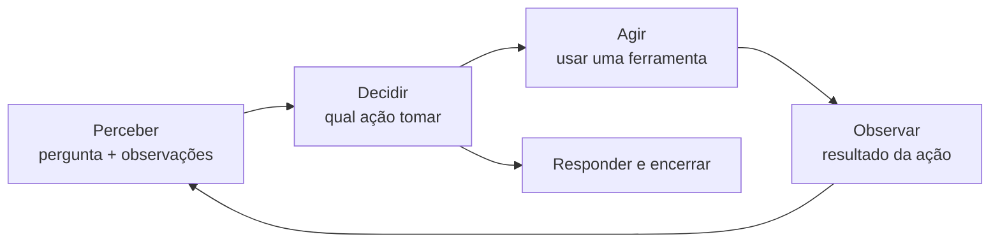

# Aula 1, O que é um agente e o agent loop

> Esta aula abre o módulo de agentes. Um agente é um LLM que não apenas responde,
> mas decide e age, usando ferramentas em um ciclo de perceber, decidir e agir.
> Vamos entender esse ciclo, o agent loop, e construir um agente mínimo do zero.

Até o módulo anterior, usamos o LLM como alguém que responde. Você pergunta, ele responde, fim.
Mas muitas tarefas de um assistente educacional não se resolvem em uma resposta. Calcular um
resultado, buscar no material, resolver um exercício em etapas, tudo isso exige fazer coisas,
não só falar. É aqui que entram os agentes.

Um agente é um LLM colocado dentro de um ciclo, em que ele pode decidir usar ferramentas,
observar o resultado e continuar, até concluir a tarefa. Em vez de uma única passada
pergunta-resposta, o agente perceber, decide a próxima ação, age, observa, e repete. Esse ciclo,
o agent loop, é o que transforma um modelo de linguagem em algo que resolve problemas de várias
etapas. Nesta aula você vai entender o agent loop e construir um agente mínimo que escolhe entre
uma calculadora e uma busca.

---

## Objetivos

Ao final desta aula, você deve ser capaz de:

- Explicar o que distingue um agente de um LLM que apenas responde.
- Descrever o ciclo perceber, decidir, agir e observar.
- Implementar um agent loop mínimo do zero.
- Entender o papel das ferramentas e do controlador no agente.

## Teoria

Um agente combina três ingredientes. O primeiro é o modelo, o LLM que raciocina e decide. O
segundo são as ferramentas, funções que o agente pode chamar para fazer coisas que o modelo
sozinho não faz bem, como contas exatas ou busca em documentos. O terceiro é o loop, a estrutura
que liga tudo, deixando o agente agir em várias etapas.

O agent loop tem quatro momentos que se repetem. No perceber, o agente recebe a situação atual,
a pergunta e o que já foi observado. No decidir, ele escolhe a próxima ação, que pode ser usar
uma ferramenta ou dar a resposta final. No agir, a ação é executada. No observar, o resultado da
ação volta para o agente, que então percebe de novo e segue. O loop termina quando o agente
decide que tem a resposta.



A peça que decide a ação é o controlador. No agente de verdade, o controlador é o próprio LLM,
que lê a situação e escolhe a ferramenta. Para entender o mecanismo sem depender do modelo,
vamos começar com um controlador simples baseado em regras, e depois, nas próximas aulas, deixar
o LLM assumir essa decisão. A ideia de intercalar raciocínio e ação foi sistematizada no
trabalho ReAct, de Yao e colegas.

## Explicação Intuitiva

Pense na diferença entre alguém que responde de cabeça e alguém que resolve um problema na mesa
de trabalho. O primeiro dá a melhor resposta que consegue na hora. O segundo pega a
calculadora quando precisa de uma conta, consulta um livro quando precisa de um dado, faz uma
etapa, vê o resultado, decide a próxima. O agente é esse segundo tipo, um solucionador que usa
ferramentas e trabalha em etapas.

O agent loop é a rotina de trabalho dessa pessoa. Ela olha o que tem, decide o próximo passo,
executa, vê o que deu, e repete até terminar. Cada volta do loop aproxima a solução. É essa
capacidade de agir, observar e ajustar que dá aos agentes o poder de resolver tarefas que uma
única resposta não resolveria.

## Explicação Matemática

Esta aula é mais de arquitetura do que de matemática, mas vale formalizar o loop. O estado do
agente no passo $t$ é o histórico de observações $h_t$. O controlador é uma função $\pi$ que,
dado o estado, escolhe uma ação, $a_t = \pi(h_t)$. A ação é executada por uma ferramenta, que
produz uma observação $o_t$, e o estado é atualizado, $h_{t+1} = h_t \cup \{a_t, o_t\}$.

O loop continua até a ação ser responder, momento em que o agente emite a resposta final. Essa
estrutura é a de um agente que age em um ambiente, conceito clássico da IA, agora com o LLM no
papel do controlador $\pi$ e com ferramentas no papel das ações. A diferença para um modelo
puro é justamente o loop, que permite várias ações antes da resposta.

## Exemplo Prático

Vamos construir um agente mínimo que decide entre duas ferramentas, uma calculadora para contas
e uma busca para perguntas de conteúdo. O controlador é uma regra simples, se a pergunta tem
números e operadores, usa a calculadora, senão, usa a busca. É um agente de uma etapa, suficiente
para ver o ciclo perceber, decidir, agir e observar funcionando.

A calculadora é implementada com segurança, sem usar a função eval, para não executar código
arbitrário. Nas próximas aulas, o controlador vira o LLM e o loop ganha várias etapas. O código
está no notebook
[notebooks/modulo-10/01-agente-e-agent-loop.ipynb](../../notebooks/modulo-10/01-agente-e-agent-loop.ipynb),
então abra-o ao lado para acompanhar.

## Código Comentado

```python
import re
import ast
import operator

# Operadores permitidos na calculadora segura.
OPS = {
    ast.Add: operator.add, ast.Sub: operator.sub, ast.Mult: operator.mul,
    ast.Div: operator.truediv, ast.Pow: operator.pow, ast.USub: operator.neg,
}


def calcular(expr):
    """Avalia uma expressão aritmética com segurança, sem usar eval."""
    def ev(no):
        if isinstance(no, ast.Constant) and isinstance(no.value, (int, float)):
            return no.value
        if isinstance(no, ast.BinOp) and type(no.op) in OPS:
            return OPS[type(no.op)](ev(no.left), ev(no.right))
        if isinstance(no, ast.UnaryOp) and type(no.op) in OPS:
            return OPS[type(no.op)](ev(no.operand))
        raise ValueError("expressão não permitida")
    return ev(ast.parse(expr, mode="eval").body)


def buscar(consulta):
    """Ferramenta de busca simples em uma base de conhecimento."""
    base = {
        "derivada": "A derivada mede a taxa de variação de uma função.",
        "matriz": "Uma matriz organiza números em linhas e colunas.",
    }
    for chave, texto in base.items():
        if chave in consulta.lower():
            return texto
    return "Não encontrei no material."


def extrair_expressao(texto):
    """Junta apenas números e operadores, ignorando o resto do texto."""
    return "".join(re.findall(r"\d+\.?\d*|[+\-*/()]", texto))


def agente(pergunta):
    """Agent loop de uma etapa: percebe, decide a ferramenta, age e observa."""
    # Decidir: controlador baseado em regras.
    if re.search(r"\d", pergunta) and re.search(r"[+\-*/]", pergunta):
        acao, arg = "calcular", extrair_expressao(pergunta)
    else:
        acao, arg = "buscar", pergunta
    # Agir e observar.
    observacao = calcular(arg) if acao == "calcular" else buscar(arg)
    return {"acao": acao, "argumento": arg, "observacao": observacao}


for p in ["quanto é 28*3/4 ?", "o que é a derivada?", "explique uma matriz"]:
    print(p, "->", agente(p))
```

Ao rodar, o agente roteia a pergunta com conta para a calculadora, devolvendo 21.0 para 28 vezes
3 dividido por 4, e roteia as perguntas de conteúdo para a busca, trazendo o trecho certo. Cada
chamada percorre o ciclo, percebe a pergunta, decide a ferramenta, age e observa o resultado.
Esse é o esqueleto de todo agente. Tudo o que faremos a seguir é enriquecer cada peça, deixar o
LLM decidir, permitir várias ferramentas, várias etapas e memória.

## Exercícios

1) Conceitual: O que distingue um agente de um LLM que apenas responde?
2) Conceitual: Descreva os quatro momentos do agent loop e o que acontece em cada um.
3) Prático: Acrescente uma terceira ferramenta ao agente, por exemplo uma que devolve a data, e
   ajuste o controlador para escolhê-la.
4) Prático: Teste a calculadora com uma expressão inválida e veja como o agente reage.
5) Extensão: Pesquise o padrão ReAct e explique como ele intercala raciocínio e ação no loop.

## Projeto da Aula

Construa um agente de uma etapa com três ferramentas. A entrega é um agente que escolhe entre uma
calculadora, uma busca e uma terceira ferramenta à sua escolha, com um controlador baseado em
regras, e que retorna a ação tomada, o argumento e a observação.

Considere o projeto pronto quando o agente rotear corretamente diferentes tipos de pergunta para
a ferramenta certa, e quando você escrever um parágrafo sobre as limitações de um controlador por
regras, motivando o uso do LLM como controlador, tema da próxima aula. Esse agente é a semente do
agente tutor que construiremos no projeto do módulo.

## Leituras Recomendadas

- O artigo ReAct, de Yao e colegas, sobre intercalar raciocínio e ação em agentes.
- A documentação do LangGraph sobre o ciclo de execução de agentes.
- Materiais introdutórios sobre agentes baseados em LLM e os seus componentes.

## Referências Científicas

As referências abaixo são reais e estão registradas em
[references/referencias.bib](../../references/referencias.bib). As chaves entre
parênteses são as do BibTeX.

- Yao, S., et al. (2023). ReAct: Synergizing Reasoning and Acting in Language Models. ICLR.
  (`yao2023react`)
- Schick, T., et al. (2023). Toolformer: Language Models Can Teach Themselves to Use Tools.
  NeurIPS. (`schick2023toolformer`)
- Wei, J., et al. (2022). Chain-of-Thought Prompting Elicits Reasoning in Large Language Models.
  NeurIPS. (`wei2022cot`)
