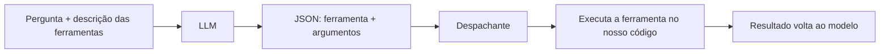

# Aula 2, Tool calling

> Esta aula coloca o LLM no comando do agente. Em vez de um controlador por regras, o
> próprio modelo decide qual ferramenta usar, pedindo a chamada em formato estruturado.
> Vamos montar um registro de ferramentas e fazer o agente despachar as chamadas do
> modelo.

No agente da aula anterior, quem decidia a ferramenta era uma regra escrita por nós. Isso
funciona para casos simples, mas não escala, teríamos que prever cada situação. O salto para um
agente de verdade é deixar o LLM decidir. Ele lê a pergunta e as ferramentas disponíveis, e
escolhe qual usar e com quais argumentos. Essa capacidade se chama tool calling, ou chamada de
ferramentas.

A peça que torna isso possível é a saída estruturada do Módulo 8. O modelo não executa a
ferramenta, ele pede a execução, devolvendo um JSON que diz qual ferramenta quer e com quais
argumentos. Nosso código então lê esse pedido, executa a ferramenta de verdade, e devolve o
resultado ao modelo. Nesta aula você vai montar esse mecanismo, um registro de ferramentas e um
despachante que conecta a decisão do modelo à ação real.

---

## Objetivos

Ao final desta aula, você deve ser capaz de:

- Explicar como o LLM decide e solicita uma chamada de ferramenta.
- Descrever uma ferramenta para o modelo, com nome, descrição e argumentos.
- Implementar um registro de ferramentas e um despachante.
- Conectar a chamada do modelo à execução real da ferramenta.

## Teoria

O tool calling tem três partes. Primeiro, descrevemos as ferramentas para o modelo, dizendo o
nome de cada uma, o que faz e quais argumentos espera. Segundo, instruímos o modelo a responder,
quando precisar de uma ferramenta, com um JSON contendo o nome da ferramenta e os argumentos.
Terceiro, o nosso código lê esse JSON, encontra a ferramenta no registro, a executa com os
argumentos, e devolve o resultado.

O ponto crucial é a separação de papéis. O modelo decide e pede, mas quem executa é o código.
Isso é o que mantém o sistema seguro e confiável, a ferramenta de calculadora roda o nosso código
seguro, não algo que o modelo inventou, e a busca consulta a nossa base, não a memória do
modelo. O modelo é o cérebro que escolhe, e as ferramentas são as mãos que agem, sob o nosso
controle. Essa ideia de modelos que aprendem a usar ferramentas foi explorada em trabalhos como o
Toolformer, de Schick e colegas.



Os provedores de LLM modernos oferecem suporte nativo a tool calling, com formatos próprios. Mas
entender o mecanismo na mão, com saída estruturada e um despachante, é o que permite usá-lo com
qualquer modelo, inclusive os locais, e depurar quando algo dá errado.

## Explicação Intuitiva

Pense em um gerente que coordena uma equipe de especialistas. O gerente não faz as contas nem
busca os documentos, ele decide quem deve fazer o quê e passa a tarefa para o especialista certo.
O LLM é esse gerente, e as ferramentas são os especialistas. O gerente diz preciso que a
calculadora resolva isto, e o código, como um assistente, leva a tarefa ao especialista e traz a
resposta de volta.

A descrição das ferramentas é como o organograma que o gerente consulta. Sem saber que existe uma
calculadora e o que ela faz, o gerente não a usaria. Por isso descrevemos cada ferramenta com
clareza, é assim que o modelo sabe o que tem à disposição e quando usar cada coisa. Quanto melhor
a descrição, melhores as decisões do agente.

## Explicação Matemática

A parte formal aqui é a do contrato de chamada. Definimos cada ferramenta como um nome associado
a uma função, e um esquema dos seus argumentos. O modelo produz um objeto $\{\text{nome},
\text{argumentos}\}$, e o despachante calcula $\text{ferramenta}[\text{nome}](\text{argumentos})$.

A robustez vem da validação, herdada da aula de saída estruturada. Antes de despachar,
verificamos que o JSON é válido, que o nome corresponde a uma ferramenta existente, e que os
argumentos estão presentes. Se algo falha, tratamos o erro, em vez de quebrar, por exemplo
devolvendo ao modelo uma mensagem dizendo que a chamada foi inválida, para que ele tente de novo.
Essa disciplina é o que torna o tool calling confiável na prática.

## Exemplo Prático

Vamos montar um registro de ferramentas, cada uma com nome, descrição e função, e um despachante
que recebe um pedido em JSON, valida e executa. Para testar sem depender do modelo, simulamos a
saída do LLM com pedidos em JSON, alguns válidos e um inválido, e vemos o despachante tratar cada
caso.

No notebook, fechamos o ciclo enviando a pergunta ao LLM via Ollama, com a instrução de pedir
ferramentas em JSON, e despachando o que ele decidir. O código está no notebook
[notebooks/modulo-10/02-tool-calling.ipynb](../../notebooks/modulo-10/02-tool-calling.ipynb),
então abra-o ao lado para acompanhar.

## Código Comentado

```python
import re
import json
import ast
import operator

OPS = {ast.Add: operator.add, ast.Sub: operator.sub, ast.Mult: operator.mul,
       ast.Div: operator.truediv, ast.Pow: operator.pow, ast.USub: operator.neg}


def calcular(expressao):
    def ev(no):
        if isinstance(no, ast.Constant):
            return no.value
        if isinstance(no, ast.BinOp):
            return OPS[type(no.op)](ev(no.left), ev(no.right))
        if isinstance(no, ast.UnaryOp):
            return OPS[type(no.op)](ev(no.operand))
        raise ValueError("expressão não permitida")
    return ev(ast.parse(str(expressao), mode="eval").body)


def buscar(consulta):
    base = {"derivada": "A derivada mede a taxa de variação de uma função."}
    for chave, texto in base.items():
        if chave in str(consulta).lower():
            return texto
    return "Não encontrei no material."


# Registro: nome -> (descrição, função, argumento esperado).
FERRAMENTAS = {
    "calcular": ("Resolve uma expressão aritmética.", calcular, "expressao"),
    "buscar": ("Busca um tema na base de notas de aula.", buscar, "consulta"),
}


def despachar(pedido_json):
    """Lê um pedido do modelo em JSON, valida e executa a ferramenta."""
    m = re.search(r"\{.*\}", pedido_json, re.DOTALL)
    if not m:
        return "Erro: não veio um JSON."
    try:
        pedido = json.loads(m.group(0))
    except json.JSONDecodeError:
        return "Erro: JSON inválido."
    nome = pedido.get("ferramenta")
    if nome not in FERRAMENTAS:
        return f"Erro: ferramenta '{nome}' não existe."
    _, funcao, arg_nome = FERRAMENTAS[nome]
    if arg_nome not in pedido:
        return f"Erro: falta o argumento '{arg_nome}'."
    try:
        return funcao(pedido[arg_nome])
    except Exception as erro:
        return f"Erro ao executar: {erro}"


# Simula pedidos do modelo, incluindo um inválido.
pedidos = [
    '{"ferramenta": "calcular", "expressao": "28*3/4"}',
    '{"ferramenta": "buscar", "consulta": "o que é a derivada?"}',
    '{"ferramenta": "voar", "destino": "lua"}',
]
for p in pedidos:
    print(p, "->", despachar(p))
```

Ao rodar, o despachante executa corretamente os dois primeiros pedidos, calculando 21.0 e trazendo
o trecho da derivada, e trata o terceiro com uma mensagem de erro clara, pois a ferramenta voar
não existe. Esse é o coração do tool calling, o modelo decide e pede em JSON, o nosso código
valida e executa. Note como reutilizamos a extração e a validação de JSON da aula de saída
estruturada, agora a serviço do agente.

## Exercícios

1) Conceitual: Por que o modelo pede a ferramenta em vez de executá-la, e por que isso é mais
   seguro?
2) Conceitual: Quais são as três partes do mecanismo de tool calling?
3) Prático: Acrescente uma nova ferramenta ao registro, com descrição e argumento, e teste um
   pedido para ela.
4) Prático: Envie ao despachante um pedido com o argumento errado e confirme que ele trata o
   erro.
5) Extensão: Pesquise o suporte nativo a tool calling de algum provedor de LLM e compare com o
   despachante feito à mão.

## Projeto da Aula

Construa um agente com tool calling pelo LLM. A entrega é um agente que descreve as ferramentas
ao modelo, recebe a decisão dele em JSON, valida e despacha, usando o Ollama. Inclua o tratamento
de erros para chamadas inválidas.

Considere o projeto pronto quando o modelo conseguir escolher a ferramenta certa para diferentes
perguntas e o despachante executar com segurança, tratando os erros. Esse agente, que já decide
sozinho qual ferramenta usar, é a base para o planejamento de várias etapas da próxima aula.

## Leituras Recomendadas

- O artigo Toolformer, de Schick e colegas, sobre modelos que aprendem a usar ferramentas.
- A documentação de tool calling ou function calling de provedores de LLM.
- Guias do LangChain e do LangGraph sobre a definição e o uso de ferramentas.

## Referências Científicas

As referências abaixo são reais e estão registradas em
[references/referencias.bib](../../references/referencias.bib). As chaves entre
parênteses são as do BibTeX.

- Schick, T., et al. (2023). Toolformer: Language Models Can Teach Themselves to Use Tools.
  NeurIPS. (`schick2023toolformer`)
- Yao, S., et al. (2023). ReAct: Synergizing Reasoning and Acting in Language Models. ICLR.
  (`yao2023react`)
- Liu, P., et al. (2023). Pre-train, Prompt, and Predict. ACM Computing Surveys.
  (`liu2023prompt`)
