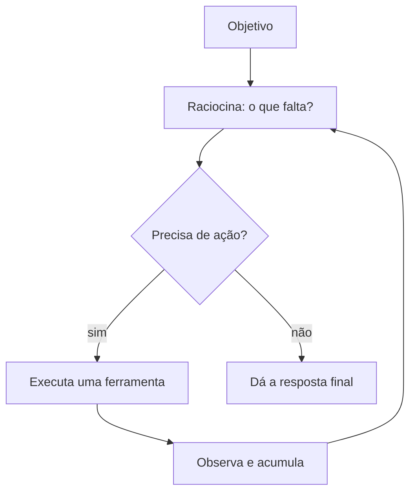

# Aula 3, Planning

> Esta aula dá ao agente a capacidade de planejar. Tarefas complexas não se resolvem
> em uma ação, exigem uma sequência de passos. Vamos ver como o agente decompõe um
> problema e executa um passo de cada vez, em um loop de raciocinar e agir.

O agente das aulas anteriores age em uma única etapa, escolhe uma ferramenta e responde. Mas
muitos problemas educacionais têm várias etapas. Resolver um problema de matemática pode exigir
uma conta, depois outra, depois juntar os resultados. Buscar uma resposta pode exigir primeiro
procurar no material e depois calcular algo com o que foi encontrado. Para isso, o agente precisa
planejar.

Planejar é decompor uma tarefa em passos e executá-los em ordem, usando o resultado de um passo no
seguinte. No agente, isso vira um loop de várias etapas, em que ele raciocina sobre o que falta,
escolhe a próxima ação, observa o resultado, e continua, até concluir. Essa intercalação de
pensar e agir é a essência do padrão ReAct, de Yao e colegas. Nesta aula você vai construir um
agente de múltiplas etapas que resolve um problema decompondo-o.

---

## Objetivos

Ao final desta aula, você deve ser capaz de:

- Explicar por que tarefas complexas exigem planejamento em etapas.
- Entender o loop de raciocinar e agir do padrão ReAct.
- Implementar um agente de múltiplas etapas que encadeia ações.
- Reconhecer quando o agente deve parar e dar a resposta final.

## Teoria

O planejamento transforma o agent loop de uma etapa em um loop de várias. A cada volta, o agente
olha o objetivo e o que já observou, decide a próxima ação, e a executa, acumulando observações.
Esse acúmulo é o que permite encadear, o resultado de uma conta vira a entrada da próxima, o
trecho recuperado vira o contexto da resposta. O agente continua até decidir que tem tudo para
responder.



Há duas estratégias de planejamento. Na planejada antecipada, o agente monta o plano inteiro de
uma vez, listando todos os passos, e depois executa. Na reativa, do estilo ReAct, ele decide um
passo de cada vez, à luz do que observou, o que é mais flexível diante de imprevistos. A reativa é
a mais comum em agentes com LLM, porque deixa o agente se adaptar conforme as observações chegam.

Um cuidado importante é o critério de parada. Sem ele, o agente poderia ficar em loop infinito,
agindo para sempre. Na prática, limitamos o número de etapas e damos ao agente a opção explícita
de responder, encerrando o loop quando ele julga ter a resposta ou quando o limite é atingido.

## Explicação Intuitiva

Pense em resolver um problema de prova com várias partes. Você não tenta acertar a resposta final
de uma vez, você resolve a primeira parte, anota o resultado, usa-o na segunda parte, e assim por
diante, até chegar ao fim. Cada passo se apoia no anterior. O agente que planeja faz exatamente
isso, quebra o problema e resolve por partes, carregando os resultados adiante.

O estilo reativo é como resolver sem um roteiro fixo, decidindo o próximo passo conforme o que
você descobre. Se uma conta dá um resultado inesperado, você ajusta o plano. Essa flexibilidade é
valiosa, porque problemas reais raramente seguem um roteiro perfeito. O agente reativo pensa,
age, vê o que deu, e replaneja, voltando a pensar, até terminar.

## Explicação Matemática

Retomando a formalização do loop, o agente repete, para $t = 1, 2, \dots$, a escolha de uma ação
$a_t = \pi(h_t)$ e a obtenção de uma observação $o_t$, atualizando o histórico $h_{t+1} = h_t \cup
\{a_t, o_t\}$. O planejamento aparece em $\pi$, que agora pode escolher ações intermediárias, não
só a resposta final.

O critério de parada é uma condição sobre $a_t$. Se $a_t$ for a ação responder, o loop termina e
emite a resposta. Caso contrário, executa a ferramenta e continua. Adicionamos também um limite
$T_{\max}$ de etapas, parando em $t = T_{\max}$ mesmo sem resposta, para garantir que o agente
sempre termina. Esse encadeamento de ações condicionadas às observações é o que dá ao agente a
capacidade de resolver tarefas de várias etapas.

## Exemplo Prático

Vamos construir um agente de múltiplas etapas que resolve um problema de palavra exigindo duas
contas. O agente decompõe o problema, executa a primeira conta com a calculadora, usa o resultado
na segunda, e então dá a resposta. Para o exemplo rodar sem depender do modelo, usamos um plano
determinístico que ilustra o encadeamento de passos.

Esse encadeamento, em que a observação de um passo alimenta o próximo, é o que diferencia o
planejamento da ação única. O código está no notebook
[notebooks/modulo-10/03-planning.ipynb](../../notebooks/modulo-10/03-planning.ipynb), então
abra-o ao lado para acompanhar.

## Código Comentado

```python
import ast
import operator

OPS = {ast.Add: operator.add, ast.Sub: operator.sub, ast.Mult: operator.mul,
       ast.Div: operator.truediv, ast.Pow: operator.pow, ast.USub: operator.neg}


def calcular(expressao):
    def ev(no):
        if isinstance(no, ast.Constant):
            return no.value
        if isinstance(no, ast.BinOp):
            return OPS[type(no.op)](ev(no.left), ev(no.right))
        raise ValueError("expressão não permitida")
    return ev(ast.parse(str(expressao), mode="eval").body)


def agente_multietapas(passos, limite=5):
    """Executa um plano passo a passo, encadeando os resultados.

    Cada passo é (descricao, expressao_template). O template pode usar {r}
    para inserir o resultado do passo anterior.
    """
    historico = []
    resultado = None
    for i, (descricao, template) in enumerate(passos):
        if i >= limite:
            break
        expressao = template.format(r=resultado) if resultado is not None else template
        resultado = calcular(expressao)
        historico.append((descricao, expressao, resultado))
    return historico, resultado


# Problema: 28 alunos, 3 cadernos cada, pacotes de 4. Quantos pacotes?
plano = [
    ("Total de cadernos: alunos x cadernos por aluno", "28*3"),
    ("Pacotes necessários: total / cadernos por pacote", "{r}/4"),
]

historico, resposta = agente_multietapas(plano)
for descricao, expr, res in historico:
    print(f"- {descricao}: {expr} = {res}")
print("Resposta final:", resposta, "pacotes")
```

Ao rodar, o agente executa o primeiro passo, 28 vezes 3 igual a 84 cadernos, e usa esse resultado
no segundo passo, 84 dividido por 4 igual a 21 pacotes. O encadeamento aparece no template do
segundo passo, que insere o resultado do primeiro. Esse é o planejamento em ação, decompor e
encadear. No agente de verdade, é o LLM que decide cada passo à luz das observações, no estilo
ReAct, e o critério de parada decide quando responder.

## Exercícios

1) Conceitual: Por que tarefas complexas exigem planejamento em vez de uma única ação?
2) Conceitual: Qual a diferença entre planejamento antecipado e planejamento reativo, no estilo
   ReAct?
3) Prático: Crie um problema de três etapas e escreva o plano que o resolve, encadeando os
   resultados.
4) Prático: Adicione um critério de parada que interrompa o agente se um resultado for negativo.
5) Extensão: Pesquise o padrão ReAct e descreva como o LLM gera o raciocínio e a ação a cada
   passo.

## Projeto da Aula

Construa um agente de planejamento para problemas de matemática. A entrega é um agente que recebe
um problema de várias etapas, decompõe em passos encadeados e os executa com a calculadora,
mostrando o raciocínio de cada passo até a resposta final.

Considere o projeto pronto quando o agente resolver corretamente alguns problemas de duas ou três
etapas, mostrando o encadeamento, e quando você comentar como o critério de parada evita loops
infinitos. Esse planejamento é o que faz o agente tutor resolver exercícios de verdade, e na
próxima aula damos a ele memória.

## Leituras Recomendadas

- O artigo ReAct, de Yao e colegas, sobre o loop de raciocinar e agir.
- O artigo do Chain-of-Thought, de Wei e colegas, base do raciocínio em etapas.
- Materiais sobre agentes planejadores e decomposição de tarefas com LLM.

## Referências Científicas

As referências abaixo são reais e estão registradas em
[references/referencias.bib](../../references/referencias.bib). As chaves entre
parênteses são as do BibTeX.

- Yao, S., et al. (2023). ReAct: Synergizing Reasoning and Acting in Language Models. ICLR.
  (`yao2023react`)
- Wei, J., et al. (2022). Chain-of-Thought Prompting Elicits Reasoning in Large Language Models.
  NeurIPS. (`wei2022cot`)
- Schick, T., et al. (2023). Toolformer: Language Models Can Teach Themselves to Use Tools.
  NeurIPS. (`schick2023toolformer`)
