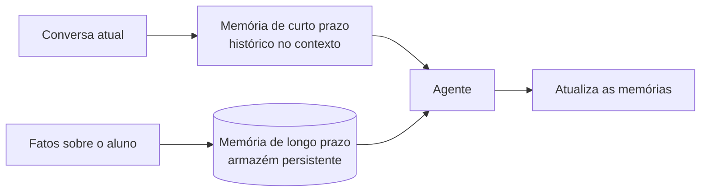

# Aula 4, Memory

> Esta aula dá memória ao agente. Sem memória, cada interação começa do zero, e o
> assistente esquece o aluno entre uma pergunta e outra. Vamos distinguir memória de
> curto e de longo prazo e construir um armazém de memória para o agente.

O agente que construímos até aqui é amnésico. A cada pergunta, ele recomeça do zero, sem lembrar
do que conversou antes. Para um assistente educacional, isso é um problema sério. Um bom tutor
lembra o nome do aluno, o nível dele, as dúvidas que já apareceram, e usa tudo isso para
personalizar a ajuda. Sem memória, não há acompanhamento, e cada interação é uma ilha.

A memória de um agente vem em duas formas. A de curto prazo é o histórico da conversa atual, que
cabe na janela de contexto do modelo e dá continuidade ao diálogo. A de longo prazo é o que
guardamos fora do modelo, em um armazém persistente, para lembrar de uma sessão para outra, como
o perfil do aluno. Nesta aula você vai entender essas duas memórias e construir um armazém que o
agente consulta e atualiza, base do acompanhamento de longo prazo que aprofundaremos no Módulo 13.

---

## Objetivos

Ao final desta aula, você deve ser capaz de:

- Diferenciar memória de curto prazo e de longo prazo em um agente.
- Entender como o histórico da conversa cabe na janela de contexto.
- Implementar um armazém de memória que guarda e recupera fatos.
- Reconhecer o papel da memória na personalização do assistente.

## Teoria

A memória de curto prazo é o histórico da interação corrente. Guardamos as mensagens trocadas e as
incluímos no prompt, para que o modelo tenha o contexto do diálogo. Como a janela de contexto é
limitada, conversas longas exigem cuidado, costuma-se manter as mensagens recentes na íntegra e
resumir as antigas, para não estourar o limite.

A memória de longo prazo vive fora do modelo, em um armazém que persiste entre as sessões. Nela
guardamos fatos duráveis sobre o aluno, como o nome, o nível, os temas em que ele tem dificuldade.
Quando o agente vai responder, ele recupera do armazém o que é relevante e o inclui no contexto.
Essa recuperação pode ser por chave, buscando um fato específico, ou semântica, com a busca
vetorial do Módulo 9, quando queremos recuperar memórias por similaridade.



A ideia de agentes com memória rica, que recordam e refletem sobre experiências, foi explorada em
trabalhos como os agentes generativos de Park e colegas. Para o nosso assistente, mesmo uma
memória simples já faz grande diferença, transformando interações isoladas em um acompanhamento
contínuo.

## Explicação Intuitiva

Pense na diferença entre um professor substituto que vê a turma uma vez e o professor titular que
acompanha os alunos o ano inteiro. O substituto trata todos igual, porque não conhece ninguém. O
titular lembra que um aluno tem dificuldade em frações, que outro vai bem em geometria, e adapta a
aula a isso. A memória de longo prazo é o que faz o agente ser o professor titular, e não o
substituto.

A memória de curto prazo é como prestar atenção na conversa que está acontecendo agora. Se o aluno
diz meu nome é Ana e logo depois pergunta e o meu exercício?, o agente precisa lembrar, dentro da
mesma conversa, que está falando com a Ana e qual exercício era. Sem isso, o diálogo fica sem pé
nem cabeça. As duas memórias juntas dão ao assistente continuidade e personalização.

## Explicação Matemática

A memória de curto prazo é uma sequência de mensagens $m_1, m_2, \dots, m_t$ que incluímos no
prompt. Como há um limite $L$ de tokens, mantemos um subconjunto que cabe, em geral as mais
recentes, possivelmente com um resumo das antigas. É um problema de orçamento parecido com o da
montagem de contexto do RAG, priorizando o que é mais útil ao diálogo atual.

A memória de longo prazo é um conjunto de itens, cada um com uma chave e um valor, ou com um vetor
para busca semântica. A operação de recuperar, dado um contexto, devolve os itens mais relevantes,
seja por correspondência exata de chave, seja pelos top-k por similaridade do cosseno, exatamente
a busca que já conhecemos. A operação de atualizar acrescenta ou modifica itens. Assim, o armazém
acumula conhecimento sobre o aluno ao longo do tempo.

## Exemplo Prático

Vamos construir um armazém de memória simples, com operações de lembrar um fato, recuperar fatos e
listar tudo, e demonstrar o agente usando-o para personalizar uma resposta. Guardamos fatos sobre
o aluno, como o nome e o nível, e o agente os recupera para adaptar o atendimento.

O armazém é determinístico e roda sem o modelo, deixando claro o mecanismo. O código está no
notebook
[notebooks/modulo-10/04-memory.ipynb](https://github.com/LucasSpinola/assistentes-educacionais-com-ia/blob/main/notebooks/modulo-10/04-memory.ipynb), então abra-o ao
lado para acompanhar.

## Código Comentado

```python
class MemoriaLongoPrazo:
    """Armazém simples de fatos sobre o aluno, por chave."""

    def __init__(self):
        self._fatos = {}

    def lembrar(self, chave, valor):
        """Guarda ou atualiza um fato."""
        self._fatos[chave] = valor

    def recuperar(self, chave, padrao=None):
        """Recupera um fato pela chave."""
        return self._fatos.get(chave, padrao)

    def contexto(self):
        """Resume os fatos conhecidos, para incluir no prompt do agente."""
        if not self._fatos:
            return "Nenhuma informação prévia sobre o aluno."
        return "; ".join(f"{c}: {v}" for c, v in self._fatos.items())


class MemoriaCurtoPrazo:
    """Histórico da conversa atual, com limite de mensagens."""

    def __init__(self, limite=6):
        self._mensagens = []
        self._limite = limite

    def adicionar(self, papel, texto):
        self._mensagens.append((papel, texto))
        # Mantém só as mensagens mais recentes, respeitando o limite.
        self._mensagens = self._mensagens[-self._limite:]

    def historico(self):
        return "\n".join(f"{papel}: {texto}" for papel, texto in self._mensagens)


# O agente usa as duas memórias para personalizar.
longo = MemoriaLongoPrazo()
curto = MemoriaCurtoPrazo()

# Primeira interação: o aluno se apresenta.
curto.adicionar("aluno", "Meu nome é Ana e estou começando em cálculo.")
longo.lembrar("nome", "Ana")
longo.lembrar("nivel", "iniciante em cálculo")

# Interação seguinte: o agente recupera o que sabe.
curto.adicionar("aluno", "Pode me explicar a derivada?")
print("Memória de longo prazo:", longo.contexto())
print("Nível recuperado:", longo.recuperar("nivel"))
print("\nHistórico recente:\n" + curto.historico())
```

Ao rodar, o agente recupera da memória de longo prazo que está falando com a Ana, iniciante em
cálculo, e tem no histórico de curto prazo a conversa recente. Com isso, ele pode adaptar a
explicação da derivada ao nível dela, em vez de dar uma resposta genérica. É essa combinação,
lembrar quem é o aluno e do que se falou agora, que transforma um agente amnésico em um tutor que
acompanha.

## Exercícios

1) Conceitual: Qual a diferença entre memória de curto prazo e de longo prazo em um agente?
2) Conceitual: Por que conversas longas exigem cuidado com a memória de curto prazo?
3) Prático: Acrescente novos fatos sobre o aluno ao armazém e veja como o contexto muda.
4) Prático: Reduza o limite da memória de curto prazo e observe mensagens antigas saírem do
   histórico.
5) Extensão: Pesquise a memória semântica em agentes, que recupera lembranças por similaridade, e
   relacione com a busca do Módulo 9.

## Projeto da Aula

Dê memória ao seu agente. A entrega é um agente que mantém um armazém de fatos sobre o aluno e o
histórico da conversa, e usa as duas memórias para personalizar as respostas ao longo de várias
interações.

Considere o projeto pronto quando o agente lembrar de informações do aluno entre perguntas e
adaptar o atendimento a elas, e quando você escrever um parágrafo sobre como a memória de longo
prazo permite o acompanhamento. Essa memória é a ponte para o Módulo 13, sobre modelagem de longo
prazo do aluno, e completa as peças do agente antes de orquestrá-lo na próxima aula.

## Leituras Recomendadas

- O artigo dos agentes generativos, de Park e colegas, sobre memória e reflexão em agentes.
- A documentação do LangGraph sobre o gerenciamento de estado e memória de agentes.
- Materiais sobre memória semântica e janelas de contexto em assistentes.

## Referências Científicas

As referências abaixo são reais e estão registradas em
[references/referencias.bib](../../references/referencias.bib). As chaves entre
parênteses são as do BibTeX.

- Park, J. S., et al. (2023). Generative Agents: Interactive Simulacra of Human Behavior. UIST.
  (`park2023generative`)
- Yao, S., et al. (2023). ReAct: Synergizing Reasoning and Acting in Language Models. ICLR.
  (`yao2023react`)
- Lewis, P., et al. (2020). Retrieval-Augmented Generation for Knowledge-Intensive NLP Tasks.
  NeurIPS. (`lewis2020rag`)
