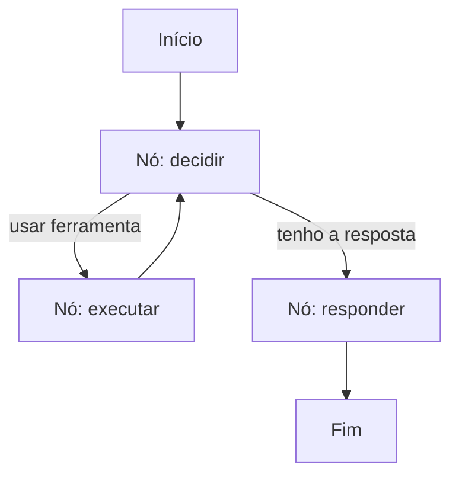

# Aula 5, Orquestração com LangGraph

> Esta aula junta as peças do agente em uma estrutura clara e fecha o módulo com o
> projeto do agente tutor. Vamos modelar o agente como um grafo de estados, primeiro
> do zero e depois com o LangGraph, a ferramenta que organiza agentes complexos.

Temos todas as peças do agente, o loop, o tool calling, o planejamento e a memória. Construídas
separadamente, elas precisam agora ser orquestradas, ligadas em um fluxo coeso. Quando o agente
fica complexo, com vários caminhos possíveis, condições e repetições, o código de orquestração
vira um emaranhado difícil de manter. É aí que ajuda pensar o agente como um grafo.

Um grafo de estados representa o agente como nós, cada um uma etapa, ligados por arestas que dizem
para onde ir a seguir, possivelmente dependendo de uma condição. O LangGraph é uma biblioteca
feita para isso, descrever agentes como grafos, com estado compartilhado, nós e transições, o que
torna agentes complexos organizados e fáceis de modificar. Nesta aula você vai modelar um agente
como grafo, do zero e com o LangGraph, e construir o agente tutor que fecha o módulo.

---

## Objetivos

Ao final desta aula, você deve ser capaz de:

- Explicar por que modelar um agente como grafo de estados ajuda.
- Descrever nós, arestas e estado compartilhado em um grafo de agente.
- Implementar um agente como máquina de estados, do zero.
- Reconhecer o que o LangGraph acrescenta a essa orquestração.

## Teoria

Modelar um agente como grafo torna explícito o fluxo de execução. Cada nó é uma etapa, por
exemplo decidir a ferramenta, executar a ferramenta, ou responder. As arestas dizem qual é o
próximo nó, e podem ser condicionais, levando a caminhos diferentes conforme o estado. Um estado
compartilhado, que todos os nós leem e atualizam, carrega a pergunta, as observações e a memória
ao longo do percurso.



A vantagem do grafo é a clareza. Em vez de um emaranhado de condicionais, vemos o agente como um
diagrama de nós e transições, fácil de entender, depurar e estender. Adicionar uma nova
capacidade vira acrescentar um nó e ligá-lo, sem reescrever o resto. O LangGraph oferece
exatamente essa estrutura, com recursos para estado tipado, persistência e ciclos, que tornam
agentes de produção gerenciáveis.

## Explicação Intuitiva

Pense na diferença entre uma receita escrita como um parágrafo corrido e a mesma receita como um
fluxograma. No parágrafo, é fácil se perder nas condições, se a massa estiver mole, faça isto,
senão aquilo. No fluxograma, cada passo é uma caixa, e as setas mostram para onde ir, inclusive
os laços, como bata até ficar firme. O grafo de estados é o fluxograma do agente, e torna o seu
comportamento legível de relance.

O LangGraph é como ter um software de fluxogramas que também executa o fluxograma. Você desenha os
nós e as setas, define o que cada nó faz, e a ferramenta cuida de rodar o fluxo, manter o estado e
repetir os ciclos. Para agentes simples, dá para orquestrar à mão. Para agentes complexos, com
muitos caminhos, essa organização economiza muito esforço e evita erros.

## Explicação Matemática

Um grafo de agente é uma máquina de estados. Há um conjunto de nós $V$, um estado compartilhado
$s$, e uma função de transição que, dado o nó atual e o estado, decide o próximo nó. Cada nó é uma
função que transforma o estado, $s' = \text{no}(s)$, por exemplo executando uma ferramenta e
acrescentando a observação. As arestas condicionais escolhem o próximo nó com base em $s'$.

O agent loop das aulas anteriores é um caso particular desse grafo, com um nó de decisão que se
liga a si mesmo, via o nó de execução, até a condição de parada levar ao nó de resposta. Modelar
explicitamente como grafo apenas deixa essa estrutura visível e manipulável, sem mudar a essência,
ações condicionadas ao estado, repetidas até concluir.

## Exemplo Prático

Vamos implementar um agente como máquina de estados do zero, com nós de decidir, executar e
responder, e um estado compartilhado que carrega a pergunta e as observações. O agente decide
usar a calculadora ou a busca, executa, e responde, tudo orquestrado pelo grafo. Depois, o
notebook mostra o mesmo agente com o LangGraph, como caminho opcional.

Ver a orquestração explícita deixa claro como as peças do módulo se encaixam. O código está no
notebook
[notebooks/modulo-10/05-orquestracao-langgraph.ipynb](https://github.com/LucasSpinola/assistentes-educacionais-com-ia/blob/main/notebooks/modulo-10/05-orquestracao-langgraph.ipynb),
então abra-o ao lado para acompanhar.

## Código Comentado

```python
import re
import ast
import operator

OPS = {ast.Add: operator.add, ast.Sub: operator.sub, ast.Mult: operator.mul,
       ast.Div: operator.truediv, ast.Pow: operator.pow}


def calcular(expr):
    def ev(no):
        if isinstance(no, ast.Constant):
            return no.value
        if isinstance(no, ast.BinOp):
            return OPS[type(no.op)](ev(no.left), ev(no.right))
        raise ValueError("expressão não permitida")
    return ev(ast.parse(str(expr), mode="eval").body)


def buscar(consulta):
    base = {"derivada": "A derivada mede a taxa de variação de uma função."}
    for chave, texto in base.items():
        if chave in consulta.lower():
            return texto
    return "Não encontrei no material."


# Nós do grafo: cada um transforma o estado compartilhado.
def no_decidir(estado):
    p = estado["pergunta"]
    if re.search(r"\d", p) and re.search(r"[+\-*/]", p):
        estado["acao"] = "calcular"
    else:
        estado["acao"] = "buscar"
    return estado


def no_executar(estado):
    if estado["acao"] == "calcular":
        expr = "".join(re.findall(r"\d+\.?\d*|[+\-*/()]", estado["pergunta"]))
        estado["observacao"] = calcular(expr)
    else:
        estado["observacao"] = buscar(estado["pergunta"])
    return estado


def no_responder(estado):
    estado["resposta"] = f"Resultado: {estado['observacao']}"
    return estado


def executar_grafo(pergunta):
    """Orquestra os nós: decidir -> executar -> responder."""
    estado = {"pergunta": pergunta}
    for no in (no_decidir, no_executar, no_responder):   # arestas do grafo
        estado = no(estado)
    return estado


for p in ["quanto é 28*3/4 ?", "o que é a derivada?"]:
    print(p, "->", executar_grafo(p)["resposta"])
```

Ao rodar, o agente percorre o grafo, decide a ação, executa a ferramenta e responde, para os dois
tipos de pergunta. Cada nó é uma função pequena que transforma o estado, e a orquestração apenas
liga os nós na ordem certa. Para agentes com muitos caminhos e ciclos, é exatamente essa estrutura
que o LangGraph organiza, deixando o fluxo claro e fácil de estender. No notebook, a versão com
LangGraph mostra a mesma ideia com a ferramenta de verdade.

## Exercícios

1) Conceitual: O que são nós, arestas e estado compartilhado em um grafo de agente?
2) Conceitual: Por que modelar um agente complexo como grafo é melhor do que um emaranhado de
   condicionais?
3) Prático: Acrescente um nó de validação entre decidir e executar, que confira se a ação é
   suportada.
4) Prático: Faça o grafo voltar ao nó de decidir após executar, criando um ciclo de várias
   etapas.
5) Extensão: Instale o LangGraph e reescreva o agente desta aula usando a API dele.

## Projeto da Aula e Projeto do Módulo

Este é o projeto que fecha o módulo, o agente tutor, na pasta `projects/m10-tutor-agent/`. A
entrega reúne tudo, um agente que usa ferramentas, uma calculadora segura e uma busca no material
via RAG do Módulo 9, decide qual usar, planeja quando o problema tem várias etapas, mantém memória
sobre o aluno, e é orquestrado de forma clara.

O roteiro sugerido é o seguinte. Defina as ferramentas, calculadora e busca. Implemente o
controlador, por regras para rodar sem o modelo e com o LLM como opção. Adicione o loop de várias
etapas e a memória do aluno. Teste com perguntas de conteúdo, contas, e problemas de várias
etapas.

Considere o projeto pronto quando o agente tutor resolver corretamente diferentes tipos de pedido,
escolhendo e encadeando ferramentas, e lembrando do aluno entre interações, e quando você escrever
um parágrafo sobre como as peças do módulo se combinaram. Com isso, você terá construído o seu
primeiro agente de verdade, e estará pronto para o Módulo 11, em que vários agentes passam a
cooperar.

## Leituras Recomendadas

- A documentação do LangGraph, com exemplos de grafos de agentes e estado.
- O artigo ReAct, de Yao e colegas, para a lógica do loop orquestrado.
- Materiais sobre arquiteturas de agentes e padrões de orquestração.

## Referências Científicas

As referências abaixo são reais e estão registradas em
[references/referencias.bib](../../references/referencias.bib). As chaves entre
parênteses são as do BibTeX.

- Yao, S., et al. (2023). ReAct: Synergizing Reasoning and Acting in Language Models. ICLR.
  (`yao2023react`)
- Schick, T., et al. (2023). Toolformer: Language Models Can Teach Themselves to Use Tools.
  NeurIPS. (`schick2023toolformer`)
- Park, J. S., et al. (2023). Generative Agents: Interactive Simulacra of Human Behavior. UIST.
  (`park2023generative`)
