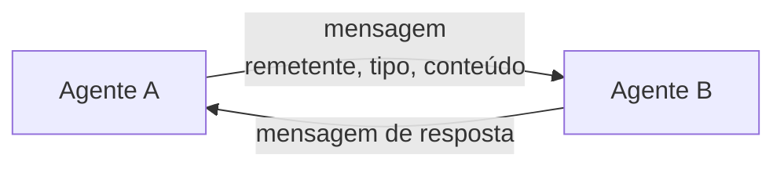

# Aula 1, Comunicação entre agentes

> Esta aula abre os sistemas multi-agentes. Em vez de um agente fazendo tudo, vários
> agentes especializados cooperam, e para isso precisam conversar. Vamos definir um
> protocolo de mensagens e construir agentes que trocam informação entre si.

No módulo anterior, construímos um agente que usa ferramentas e resolve tarefas sozinho. Mas
muitas tarefas se beneficiam de divisão de trabalho. Um assistente educacional completo precisa
ensinar, avaliar respostas, orientar o percurso e analisar o progresso, e tentar fazer tudo isso
em um único agente vira um emaranhado. A alternativa é ter vários agentes especializados, cada um
bom em uma coisa, trabalhando juntos.

Para trabalhar juntos, os agentes precisam se comunicar. Um precisa pedir algo ao outro, passar um
resultado, avisar de um evento. Essa comunicação acontece por mensagens, com um formato combinado
que todos entendem. Nesta aula você vai definir um protocolo de mensagens simples e construir
agentes que se comunicam, a base de qualquer sistema multi-agente, ideia que remonta à visão de
Minsky sobre a mente como uma sociedade de agentes.

---

## Objetivos

Ao final desta aula, você deve ser capaz de:

- Explicar por que dividir o trabalho entre agentes especializados ajuda.
- Definir um protocolo de mensagens para a comunicação entre agentes.
- Implementar agentes que enviam e recebem mensagens.
- Reconhecer os papéis de remetente, destinatário, tipo e conteúdo.

## Teoria

Um sistema multi-agente é um conjunto de agentes que cooperam para uma meta comum. Cada agente tem
uma especialidade e um papel, e a inteligência do sistema emerge da interação entre eles. Essa
ideia é estudada há décadas na área de sistemas multi-agentes, como sintetiza o livro de
Wooldridge, e ganhou nova vida com os LLMs, em frameworks como o AutoGen, de Wu e colegas.

O alicerce da cooperação é a comunicação. Definimos um protocolo de mensagens, um formato comum
que todos os agentes entendem. Uma mensagem costuma ter um remetente, quem envia, um destinatário,
quem deve receber, um tipo, que diz a intenção, como dúvida ou resposta, e um conteúdo, os dados
em si. Com esse contrato, qualquer agente pode falar com qualquer outro de forma previsível.



A forma de organizar a comunicação varia. Pode ser direta, um agente fala com outro
especificamente, ou mediada por um quadro compartilhado, em que os agentes publicam e leem
mensagens de um espaço comum. Nesta aula ficamos na comunicação direta por mensagens, que já
basta para os nossos agentes educacionais cooperarem.

## Explicação Intuitiva

Pense em uma equipe de uma escola. O professor ensina, o monitor corrige exercícios, o orientador
sugere o que estudar, a secretaria acompanha as notas. Cada um faz a sua parte, e o aluno é bem
atendido porque eles se falam. O professor avisa o orientador que o aluno tem dificuldade, o
monitor passa as notas para a secretaria. Sem essa conversa, cada um trabalharia no escuro.

O protocolo de mensagens é como o jeito combinado de a equipe se comunicar, com bilhetes que
sempre dizem de quem é, para quem é, do que se trata e o conteúdo. Esse formato padronizado evita
mal-entendidos, qualquer membro sabe ler qualquer bilhete. Nos sistemas multi-agentes, esse
padrão é o que permite trocar agentes e adicionar novos sem quebrar a comunicação.

## Explicação Matemática

Esta aula é mais de arquitetura do que de matemática. O que vale formalizar é a mensagem como uma
estrutura. Uma mensagem é uma tupla $(r, d, t, c)$, em que $r$ é o remetente, $d$ o destinatário,
$t$ o tipo e $c$ o conteúdo. Um agente é uma função que recebe uma mensagem e produz uma resposta,
$\text{agente}: \text{Mensagem} \to \text{Mensagem}$.

A cooperação é a composição dessas funções pela troca de mensagens. A saída de um agente vira a
entrada de outro, e o sistema avança por essa cadeia de mensagens. Essa visão, de agentes como
funções que se comunicam por mensagens tipadas, é o que torna o sistema modular, cada agente é uma
caixa preta com um contrato claro de entrada e saída.

## Exemplo Prático

Vamos definir uma mensagem com remetente, tipo e conteúdo, e construir dois agentes que se
comunicam, um aluno que envia uma dúvida e um tutor que responde. É o menor sistema multi-agente
possível, mas já mostra o protocolo de comunicação funcionando.

A troca de mensagens é determinística e roda sem o modelo. O código está no notebook
[notebooks/modulo-11/01-comunicacao-entre-agentes.ipynb](../../notebooks/modulo-11/01-comunicacao-entre-agentes.ipynb),
então abra-o ao lado para acompanhar.

## Código Comentado

```python
from dataclasses import dataclass


@dataclass
class Mensagem:
    """O protocolo de comunicação entre os agentes."""
    remetente: str
    tipo: str          # a intenção, por exemplo "duvida" ou "resposta"
    conteudo: dict


class Agente:
    """Agente base: tem um nome e processa mensagens."""

    def __init__(self, nome):
        self.nome = nome

    def processar(self, mensagem):
        raise NotImplementedError


class Tutor(Agente):
    def processar(self, mensagem):
        if mensagem.tipo == "duvida":
            tema = mensagem.conteudo.get("tema", "")
            explicacao = f"Vamos lá. {tema} é um conceito importante, deixa eu explicar."
            return Mensagem(self.nome, "resposta", {"explicacao": explicacao})
        return Mensagem(self.nome, "erro", {"motivo": "não sei tratar este tipo"})


# O aluno envia uma dúvida; o tutor responde.
tutor = Tutor("tutor")
pergunta = Mensagem("aluno", "duvida", {"tema": "a derivada"})
resposta = tutor.processar(pergunta)

print("Mensagem do aluno:", pergunta)
print("Resposta do tutor:", resposta)
```

Ao rodar, o aluno envia uma mensagem do tipo dúvida, com o tema no conteúdo, e o tutor a processa,
devolvendo uma mensagem do tipo resposta com a explicação. Os dois agentes se entenderam porque
seguem o mesmo protocolo, ambos sabem ler remetente, tipo e conteúdo. Esse contrato simples é o
que vai permitir, nas próximas aulas, coordenar vários agentes especializados sem que um precise
conhecer os detalhes internos do outro.

## Exercícios

1) Conceitual: Por que dividir o trabalho entre agentes especializados pode ser melhor que um
   agente único?
2) Conceitual: Quais são os elementos de uma mensagem no protocolo, e para que serve cada um?
3) Prático: Crie um segundo tipo de agente, por exemplo um que responde elogios, e faça o aluno se
   comunicar com ele.
4) Prático: Adicione um campo de destinatário à mensagem e use-o para direcionar a quem se fala.
5) Extensão: Pesquise a comunicação mediada por quadro compartilhado, o blackboard, e compare com
   a comunicação direta.

## Projeto da Aula

Monte um mini sistema de dois agentes que conversam. A entrega é um par de agentes, por exemplo um
aluno e um tutor, que trocam mensagens seguindo o protocolo, com pelo menos dois tipos de mensagem
diferentes.

Considere o projeto pronto quando os agentes conseguirem manter uma pequena troca de mensagens
coerente, e quando você escrever um parágrafo sobre como o protocolo comum permite que eles se
entendam. Essa base de comunicação é o que vamos coordenar na próxima aula, quando um maestro passa
a reger vários agentes.

## Leituras Recomendadas

- O livro de Wooldridge, An Introduction to MultiAgent Systems, para a fundamentação clássica.
- O artigo do AutoGen, de Wu e colegas, sobre aplicações multi-agente com LLMs.
- O livro The Society of Mind, de Minsky, sobre a mente como uma sociedade de agentes.

## Referências Científicas

As referências abaixo são reais e estão registradas em
[references/referencias.bib](../../references/referencias.bib). As chaves entre
parênteses são as do BibTeX.

- Minsky, M. (1986). The Society of Mind. Simon & Schuster. (`minsky1986society`)
- Wooldridge, M. (2009). An Introduction to MultiAgent Systems, 2ª edição. Wiley.
  (`wooldridge2009multiagent`)
- Wu, Q., et al. (2023). AutoGen: Enabling Next-Gen LLM Applications via Multi-Agent Conversation.
  (`wu2023autogen`)
