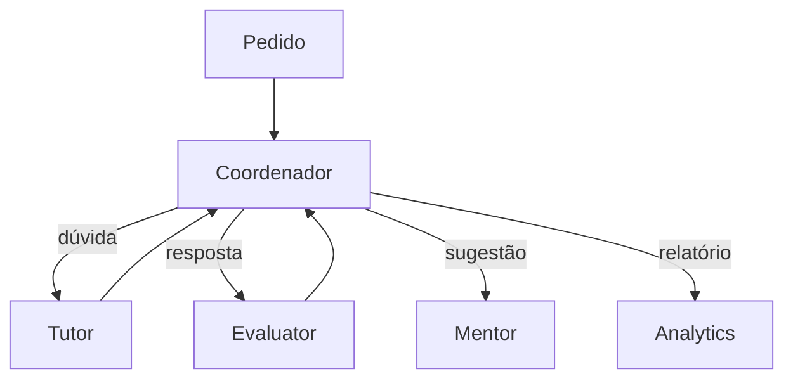

# Aula 2, Coordenação

> Esta aula coloca um maestro para reger os agentes. Quando há vários agentes, alguém
> precisa decidir quem faz o quê e em que ordem. Vamos construir um coordenador que
> roteia as tarefas para o agente certo, com os principais padrões de coordenação.

Na aula anterior, fizemos agentes se comunicarem. Mas comunicação não é o mesmo que organização.
Com dois agentes, dá para deixá-los conversar livremente. Com quatro ou mais, cada um com o seu
papel, surge a pergunta, quem decide qual agente atende cada pedido, e em que sequência? Sem uma
resposta, o sistema vira uma bagunça, com agentes se atropelando ou tarefas caindo no vazio.

A coordenação é o que organiza o trabalho dos agentes. A forma mais comum é ter um coordenador,
também chamado de orquestrador ou supervisor, que recebe os pedidos e os encaminha ao agente
adequado, possivelmente combinando os resultados de vários. Nesta aula você vai construir um
coordenador que roteia as mensagens pelo tipo, e vai conhecer os padrões de coordenação que
estruturam os sistemas multi-agentes.

---

## Objetivos

Ao final desta aula, você deve ser capaz de:

- Explicar por que vários agentes precisam de coordenação.
- Descrever o padrão de coordenador, ou supervisor.
- Implementar um coordenador que roteia tarefas ao agente certo.
- Distinguir coordenação sequencial, paralela e hierárquica.

## Teoria

O coordenador é um agente especial cujo papel é decidir o fluxo. Ele recebe um pedido, identifica
o que precisa ser feito, e encaminha ao agente competente, reunindo as respostas quando
necessário. É o padrão mais usado, porque centraliza a decisão de roteamento em um único lugar,
mantendo os agentes especializados focados nas suas tarefas.

Há padrões de coordenação que vale conhecer. Na coordenação sequencial, os agentes atuam em
cadeia, a saída de um vira a entrada do próximo, como em uma linha de montagem. Na paralela,
vários agentes trabalham ao mesmo tempo em partes independentes, e os resultados são combinados.
Na hierárquica, um coordenador pode comandar subcoordenadores, formando uma árvore, útil quando o
sistema cresce. Frameworks como o AutoGen e o MetaGPT, de Hong e colegas, oferecem estruturas para
esses padrões.



O roteamento pode ser por regras, em que o tipo do pedido determina o agente, ou pelo LLM, que lê
o pedido e decide o destino, no estilo do tool calling, agora escolhendo agentes em vez de
ferramentas. Começamos pelo roteamento por regras, claro e testável, e o LLM como coordenador
aparece como evolução natural.

## Explicação Intuitiva

Pense na recepção de uma clínica. Você chega com um problema, e a recepcionista decide para qual
especialista te encaminhar, o clínico, o cardiologista, o laboratório. Você não precisa saber
quem faz o quê, a recepcionista coordena. Se o seu caso exige vários especialistas, ela organiza a
ordem das consultas e junta os laudos. O coordenador do nosso sistema é essa recepcionista.

Os padrões de coordenação são os jeitos de organizar esse encaminhamento. Sequencial é como um
mutirão de saúde em que você passa por uma fila de postos, um após o outro. Paralela é como
coletar exames em laboratórios diferentes ao mesmo tempo. Hierárquica é como um hospital grande,
com coordenadores de cada ala respondendo a uma direção geral. O padrão certo depende do problema.

## Explicação Matemática

A coordenação é uma função de roteamento. Dado um pedido com tipo $t$, o coordenador escolhe um
agente, $\text{rota}(t) = \text{agente}$. No caso por regras, a rota é uma tabela que mapeia tipos
a agentes. No caso por LLM, a rota é a decisão do modelo, condicionada à descrição dos agentes
disponíveis.

Os padrões correspondem a formas de compor as chamadas. A sequencial é a composição
$\text{agente}_n \circ \dots \circ \text{agente}_1$, aplicada à entrada. A paralela aplica vários
agentes à mesma entrada e combina os resultados com uma função de agregação. A hierárquica aninha
coordenadores, em que um nó superior roteia para coordenadores que, por sua vez, roteiam para
agentes. Toda essa estrutura se apoia no protocolo de mensagens da aula anterior.

## Exemplo Prático

Vamos construir um coordenador que roteia mensagens pelo tipo para o agente certo, um Tutor para
dúvidas, um Evaluator para respostas, um Mentor para sugestões. Cada agente tem um papel, e o
coordenador apenas decide o destino, mostrando o padrão de supervisor em ação.

O roteamento é determinístico e roda sem o modelo. O código está no notebook
[notebooks/modulo-11/02-coordenacao.ipynb](https://github.com/LucasSpinola/assistentes-educacionais-com-ia/blob/main/notebooks/modulo-11/02-coordenacao.ipynb), então
abra-o ao lado para acompanhar.

## Código Comentado

```python
from dataclasses import dataclass


@dataclass
class Mensagem:
    remetente: str
    tipo: str
    conteudo: dict


class Tutor:
    nome = "tutor"
    def processar(self, m):
        return f"[Tutor] Explicando: {m.conteudo.get('tema', '')}"


class Evaluator:
    nome = "evaluator"
    def processar(self, m):
        correto = m.conteudo.get("resposta") == m.conteudo.get("esperado")
        return f"[Evaluator] {'Correto!' if correto else 'Incorreto.'}"


class Mentor:
    nome = "mentor"
    def processar(self, m):
        return "[Mentor] Sugiro praticar mais este tema."


class Coordenador:
    """Roteia cada mensagem para o agente certo, pelo tipo."""

    def __init__(self, agentes):
        # Mapa de tipo de mensagem -> agente responsável.
        self.rota = {
            "duvida": agentes["tutor"],
            "resposta": agentes["evaluator"],
            "pedir_sugestao": agentes["mentor"],
        }

    def coordenar(self, mensagem):
        agente = self.rota.get(mensagem.tipo)
        if agente is None:
            return f"[Coordenador] Não sei tratar '{mensagem.tipo}'."
        return agente.processar(mensagem)


coordenador = Coordenador({"tutor": Tutor(), "evaluator": Evaluator(), "mentor": Mentor()})

pedidos = [
    Mensagem("aluno", "duvida", {"tema": "a derivada"}),
    Mensagem("aluno", "resposta", {"resposta": "21", "esperado": "21"}),
    Mensagem("aluno", "pedir_sugestao", {}),
    Mensagem("aluno", "outro", {}),
]
for p in pedidos:
    print(p.tipo, "->", coordenador.coordenar(p))
```

Ao rodar, o coordenador encaminha a dúvida ao Tutor, a resposta ao Evaluator, o pedido de sugestão
ao Mentor, e trata com elegância um tipo desconhecido. Cada agente faz só a sua parte, e o
coordenador cuida do fluxo. Esse padrão de supervisor é o esqueleto do nosso sistema educacional,
e na próxima aula damos a cada agente uma especialidade rica, montando o time completo.

## Exercícios

1) Conceitual: Por que centralizar o roteamento em um coordenador ajuda quando há muitos agentes?
2) Conceitual: Explique a diferença entre coordenação sequencial, paralela e hierárquica.
3) Prático: Acrescente um quarto agente ao coordenador, com o seu tipo de mensagem, e teste o
   roteamento.
4) Prático: Implemente uma coordenação sequencial, em que a resposta de um agente é enviada a
   outro.
5) Extensão: Pesquise como o LLM pode atuar como coordenador, decidindo o agente de destino, e
   compare com o roteamento por regras.

## Projeto da Aula

Construa um coordenador para três agentes. A entrega é um coordenador que roteia diferentes tipos
de pedido para o Tutor, o Evaluator e o Mentor, tratando tipos desconhecidos, com uma pequena
sequência de pedidos de teste.

Considere o projeto pronto quando o coordenador encaminhar cada pedido ao agente certo e você
conseguir descrever qual padrão de coordenação usou. Esse coordenador é o maestro do time de
agentes que montamos no projeto do módulo, faltando apenas dar a cada agente a sua especialidade,
tema da próxima aula.

## Leituras Recomendadas

- O artigo do MetaGPT, de Hong e colegas, sobre coordenação de agentes em um fluxo de trabalho.
- A documentação do LangGraph sobre supervisores e roteamento entre agentes.
- O livro de Wooldridge, sobre coordenação em sistemas multi-agentes.

## Referências Científicas

As referências abaixo são reais e estão registradas em
[references/referencias.bib](../../references/referencias.bib). As chaves entre
parênteses são as do BibTeX.

- Hong, S., et al. (2024). MetaGPT: Meta Programming for a Multi-Agent Collaborative Framework.
  ICLR. (`hong2023metagpt`)
- Wu, Q., et al. (2023). AutoGen: Enabling Next-Gen LLM Applications via Multi-Agent Conversation.
  (`wu2023autogen`)
- Wooldridge, M. (2009). An Introduction to MultiAgent Systems, 2ª edição. Wiley.
  (`wooldridge2009multiagent`)
