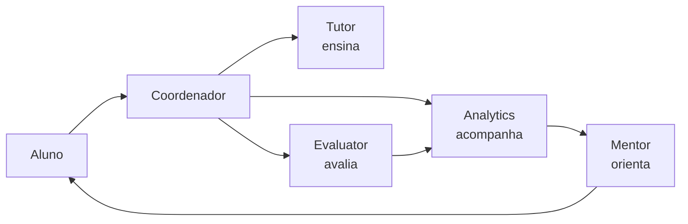

# Aula 3, Especialização

> Esta aula fecha o módulo dando a cada agente uma especialidade e montando o time
> completo. Tutor, Evaluator, Mentor e Analytics, cada um bom em uma coisa, cooperam
> para acompanhar o estudo de um aluno. É o projeto que encerra o módulo.

Já sabemos fazer agentes se comunicarem e coordenarem. Falta a peça que dá sentido a tudo, a
especialização. A força de um sistema multi-agente vem de cada agente ser realmente bom em uma
tarefa específica, e não um faz-tudo medíocre. Um especialista profundo em um papel supera um
generalista raso, e a soma dos especialistas, bem coordenada, supera qualquer agente único.

Nesta aula montamos o time educacional completo. O Tutor ensina, o Evaluator avalia respostas, o
Mentor orienta o percurso, e o Analytics acompanha o progresso. Cada um tem um papel claro, e
juntos formam um assistente que faz o que um sozinho não faria bem. Esse princípio, de uma
inteligência que emerge de muitos especialistas simples, é a velha intuição da sociedade da mente
de Minsky, agora concretizada com agentes de LLM.

---

## Objetivos

Ao final desta aula, você deve ser capaz de:

- Explicar por que a especialização melhora um sistema multi-agente.
- Definir os papéis do Tutor, Evaluator, Mentor e Analytics.
- Implementar agentes especializados que cooperam.
- Montar um fluxo de acompanhamento do aluno com o time completo.

## Teoria

Cada agente especializado tem um papel bem delimitado, uma entrada e uma saída claras, e um
comportamento focado. No nosso time educacional, os papéis são quatro. O Tutor recebe dúvidas e
produz explicações, apoiando-se na busca no material, como no RAG do Módulo 9. O Evaluator recebe a
resposta do aluno a um exercício e a julga, dando feedback. O Mentor olha o desempenho e sugere o
próximo passo, revisar ou avançar. O Analytics acumula os eventos da sessão e produz um panorama do
progresso.



A cooperação acontece pelo fluxo de mensagens, coordenado. O Evaluator informa ao Analytics se o
aluno acertou, o Analytics calcula a acurácia, e o Mentor usa essa acurácia para decidir a
sugestão. Repare que nenhum agente precisa conhecer os detalhes internos do outro, eles se ligam
pelo protocolo de mensagens e pela coordenação das aulas anteriores. Adicionar um novo
especialista é só dar a ele um papel e ligá-lo ao coordenador.

## Explicação Intuitiva

Pense na equipe ideal em torno de um aluno. Um bom professor explica a matéria. Um bom monitor
corrige os exercícios e aponta os erros. Um bom orientador olha o histórico e diz o que estudar a
seguir. Uma boa secretaria registra as notas e mostra a evolução. Cada um é insubstituível no seu
papel, e o aluno floresce quando todos trabalham juntos. O nosso time de agentes reproduz essa
equipe.

A vantagem da especialização é a profundidade. Um único assistente tentando ser professor, monitor,
orientador e secretaria ao mesmo tempo faria tudo pela metade. Quatro especialistas focados fazem
cada parte bem, e a coordenação garante que eles atuem na hora certa. É a diferença entre um
canivete suíço e uma caixa de ferramentas profissional, cada ferramenta certa para o seu uso.

## Explicação Matemática

Cada agente especializado é uma função com um contrato próprio. O Evaluator é uma função
$\text{avaliar}(\text{resposta}, \text{esperado}) \to (\text{correto}, \text{feedback})$. O
Analytics mantém um estado, a lista de eventos, e oferece $\text{acuracia} = \frac{\text{acertos}}
{\text{total}}$. O Mentor é uma função da acurácia, $\text{sugerir}(\text{acuracia})$, que decide
entre revisar e avançar segundo um limiar.

A inteligência do sistema é a composição coordenada dessas funções. Um evento do aluno dispara uma
cadeia, avaliar leva a registrar, registrar atualiza a acurácia, a acurácia alimenta a sugestão. O
resultado é um comportamento de acompanhamento que nenhuma das funções tem isoladamente, ele emerge
da interação. É a especialização mais a coordenação produzindo algo maior que a soma das partes.

## Exemplo Prático

Vamos implementar os quatro agentes especializados e simular uma sessão de estudo. O aluno tira uma
dúvida com o Tutor, responde a um exercício que o Evaluator avalia e o Analytics registra, e ao
final o Mentor olha o desempenho e sugere o próximo passo. É o time completo cooperando.

Todo o fluxo é determinístico e roda sem o modelo. O código está no notebook
[notebooks/modulo-11/03-especializacao.ipynb](https://github.com/LucasSpinola/assistentes-educacionais-com-ia/blob/main/notebooks/modulo-11/03-especializacao.ipynb),
então abra-o ao lado para acompanhar.

## Código Comentado

```python
class Tutor:
    def explicar(self, tema):
        base = {"derivada": "A derivada mede a taxa de variação de uma função."}
        return base.get(tema, "Deixa eu explicar esse tema com calma.")


class Evaluator:
    def avaliar(self, resposta, esperado):
        correto = str(resposta).strip() == str(esperado).strip()
        feedback = "Correto, muito bem!" if correto else f"Ainda não, era {esperado}."
        return correto, feedback


class Analytics:
    def __init__(self):
        self.eventos = []

    def registrar(self, tema, correto):
        self.eventos.append((tema, correto))

    def acuracia(self):
        return sum(c for _, c in self.eventos) / len(self.eventos) if self.eventos else 0.0


class Mentor:
    def sugerir(self, acuracia):
        if acuracia < 0.6:
            return "Sugiro revisar o tema antes de avançar."
        return "Bom desempenho, pode avançar para o próximo tema."


# Simulação de uma sessão de estudo com o time completo.
tutor, evaluator, analytics, mentor = Tutor(), Evaluator(), Analytics(), Mentor()

print("Tutor:", tutor.explicar("derivada"))

exercicios = [("derivada", "21", "21"), ("derivada", "10", "12")]
for tema, resposta, esperado in exercicios:
    correto, feedback = evaluator.avaliar(resposta, esperado)
    analytics.registrar(tema, correto)
    print("Evaluator:", feedback)

print(f"Analytics: acurácia = {analytics.acuracia():.0%}")
print("Mentor:", mentor.sugerir(analytics.acuracia()))
```

Ao rodar, o time atua em sequência. O Tutor explica a derivada. O Evaluator avalia os dois
exercícios, um certo e um errado, e o Analytics registra cada resultado. A acurácia fica em 50 por
cento, e o Mentor, vendo o desempenho abaixo do limiar, sugere revisar antes de avançar. Esse
acompanhamento, em que a avaliação alimenta a análise e a análise orienta a recomendação, é o
comportamento que emerge da cooperação entre especialistas. É exatamente o que o projeto do módulo
consolida.

## Exercícios

1) Conceitual: Por que um especialista profundo costuma superar um generalista raso em um sistema
   multi-agente?
2) Conceitual: Descreva o papel de cada um dos quatro agentes do time educacional.
3) Prático: Adicione mais exercícios à sessão e veja a sugestão do Mentor mudar conforme a
   acurácia.
4) Prático: Crie um quinto agente especializado, por exemplo um Motivador, e ligue-o ao fluxo.
5) Extensão: Pesquise como frameworks como o AutoGen orquestram agentes especializados em uma
   conversa.

## Projeto da Aula e Projeto do Módulo

Este é o projeto que fecha o módulo, o time de agentes educacionais, na pasta
`projects/m11-multi-agent/`. A entrega reúne o Tutor, o Evaluator, o Mentor e o Analytics,
coordenados por um supervisor, cooperando para acompanhar o estudo de um aluno em uma sessão.

O roteiro sugerido é o seguinte. Implemente os quatro agentes especializados, cada um com o seu
papel. Implemente o coordenador que roteia as mensagens. Simule uma sessão em que o aluno tira
dúvidas, resolve exercícios que são avaliados e registrados, e recebe ao final uma sugestão do
Mentor baseada no desempenho. Mostre o relatório do Analytics.

Considere o projeto pronto quando a sessão fluir entre os agentes de forma coerente, com a
avaliação alimentando a análise e a análise orientando a recomendação, e quando você escrever um
parágrafo sobre como a especialização e a coordenação produziram um acompanhamento que nenhum
agente faria sozinho. Com isso, você terá construído um sistema multi-agente de verdade, pronto
para o Módulo 12, sobre Learning Analytics, que aprofunda a análise do progresso.

## Leituras Recomendadas

- O livro The Society of Mind, de Minsky, sobre inteligência a partir de muitos agentes.
- O artigo do AutoGen, de Wu e colegas, sobre times de agentes com LLM.
- O artigo do MetaGPT, de Hong e colegas, sobre papéis especializados em um fluxo.

## Referências Científicas

As referências abaixo são reais e estão registradas em
[references/referencias.bib](../../references/referencias.bib). As chaves entre
parênteses são as do BibTeX.

- Minsky, M. (1986). The Society of Mind. Simon & Schuster. (`minsky1986society`)
- Wu, Q., et al. (2023). AutoGen: Enabling Next-Gen LLM Applications via Multi-Agent Conversation.
  (`wu2023autogen`)
- Hong, S., et al. (2024). MetaGPT: Meta Programming for a Multi-Agent Collaborative Framework.
  ICLR. (`hong2023metagpt`)
