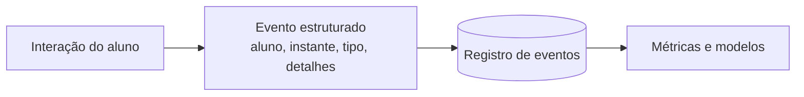

# Aula 1, Coleta de dados

> Esta aula abre o módulo de Learning Analytics, a área que usa dados sobre os alunos
> para entender e melhorar a aprendizagem. Tudo começa pela coleta. Vamos ver o que
> coletar, como estruturar os eventos, e os cuidados éticos que isso exige.

Os módulos anteriores construíram um assistente que ensina, avalia e acompanha. Cada interação do
aluno com esse assistente gera dados, perguntas feitas, exercícios respondidos, tempo gasto,
acertos e erros. Esses dados, bem usados, contam uma história sobre como o aluno aprende, e podem
guiar intervenções que ajudam de verdade. Essa é a promessa do Learning Analytics, uma disciplina
que, como descreve Siemens, emergiu justamente para transformar dados educacionais em entendimento.

Mas dado bruto não serve de nada. Antes de medir ou prever qualquer coisa, é preciso coletar de
forma estruturada, decidindo o que registrar e em que formato. E, por se tratar de dados sobre
pessoas, em geral menores de idade, a coleta vem com responsabilidades éticas sérias. Nesta aula
você vai aprender a estruturar a coleta de eventos de aprendizagem e a tratar esses dados com o
cuidado que eles exigem.

---

## Objetivos

Ao final desta aula, você deve ser capaz de:

- Explicar o que é Learning Analytics e o papel da coleta de dados.
- Decidir quais eventos de aprendizagem coletar e em que formato.
- Estruturar eventos de interação de forma consistente.
- Reconhecer os cuidados éticos e de privacidade na coleta.

## Teoria

O Learning Analytics trabalha com dados gerados pela interação dos alunos com um ambiente de
aprendizagem. A unidade básica é o evento, um registro de algo que aconteceu, como o aluno
respondeu a um exercício ou o aluno acessou um material. Um bom evento tem alguns campos
essenciais, quem, o aluno envolvido, quando, o instante do evento, o quê, o tipo de ação, e os
detalhes, dados específicos daquela ação, como o tema e o resultado.



A consistência da estrutura é o que torna os dados utilizáveis. Se cada evento for registrado de um
jeito, será impossível agregá-los. Definir um esquema claro desde o início, com os campos sempre
nos mesmos lugares, é o que permite, mais adiante, calcular métricas e treinar modelos sem
retrabalho. Esse cuidado conecta o Learning Analytics com a mineração de dados educacionais,
revisada por Romero e Ventura.

Por fim, há a dimensão ética, que não é opcional. Dados de alunos são sensíveis. Coletar só o
necessário, anonimizar quando possível, ser transparente sobre o que se coleta e para quê, e
respeitar as leis de proteção de dados são obrigações, não escolhas. Como lembram Baker e
Inventado, o poder de analisar dados educacionais vem acompanhado da responsabilidade de usá-los
para o bem do aluno.

## Explicação Intuitiva

Pense em um diário de bordo de uma viagem de estudo. Cada anotação registra o que aconteceu, quando
e onde. Se as anotações forem padronizadas, com sempre a mesma estrutura, no fim da viagem você
consegue resumir o percurso, contar quantos lugares visitou, quanto tempo ficou em cada um. Se cada
anotação for de um jeito, vira um amontoado ilegível. A coleta de eventos é esse diário de bordo da
aprendizagem.

A parte ética é como o cuidado com um diário que contém informações sobre outras pessoas. Você não
anota mais do que precisa, não deixa o diário exposto, e usa o que anotou para ajudar, nunca para
prejudicar. Em educação, esse cuidado é ainda maior, porque os dados são de alunos, muitas vezes
crianças, e o objetivo de tudo é apoiar a aprendizagem deles, com respeito e transparência.

## Explicação Matemática

A coleta em si é mais de modelagem de dados do que de matemática. O que vale formalizar é o evento
como uma tupla estruturada. Um evento é $(a, t, \tau, d)$, em que $a$ identifica o aluno, $t$ é o
instante, $\tau$ é o tipo de ação e $d$ são os detalhes. Um conjunto de eventos é uma sequência
desses registros, ordenável pelo tempo.

A partir dessa estrutura, as métricas das próximas aulas são funções de agregação sobre os
eventos. Por exemplo, o número de exercícios de um aluno é a contagem dos eventos do tipo resposta
com aquele aluno. A acurácia é a média dos acertos entre esses eventos. Toda a análise posterior se
apoia nessa coleção bem estruturada, o que mostra por que a coleta consistente é o alicerce de
tudo.

## Exemplo Prático

Vamos estruturar eventos de interação de alunos com o assistente e montar uma pequena coleção. Cada
evento registra o aluno, o instante, o tipo e os detalhes, seguindo um esquema fixo. Sobre essa
coleção, faremos uma consulta simples, contar os eventos de um aluno, antecipando as métricas das
próximas aulas.

A estruturação é determinística e roda sem o modelo. O código está no notebook
[notebooks/modulo-12/01-coleta-de-dados.ipynb](https://github.com/LucasSpinola/assistentes-educacionais-com-ia/blob/main/notebooks/modulo-12/01-coleta-de-dados.ipynb),
então abra-o ao lado para acompanhar.

## Código Comentado

```python
from dataclasses import dataclass
from collections import Counter


@dataclass
class Evento:
    """Um evento de aprendizagem, com esquema fixo."""
    aluno: str
    instante: int          # passo no tempo, simplificado
    tipo: str              # "resposta", "acesso_material", "duvida"
    detalhes: dict


# Coleta de eventos de uma turma pequena.
eventos = [
    Evento("ana", 1, "duvida", {"tema": "derivada"}),
    Evento("ana", 2, "resposta", {"tema": "derivada", "correto": True}),
    Evento("ana", 3, "resposta", {"tema": "derivada", "correto": False}),
    Evento("bruno", 1, "acesso_material", {"tema": "matriz"}),
    Evento("bruno", 2, "resposta", {"tema": "matriz", "correto": True}),
]


def eventos_do_aluno(eventos, aluno):
    return [e for e in eventos if e.aluno == aluno]


def resumo_tipos(eventos, aluno):
    return Counter(e.tipo for e in eventos_do_aluno(eventos, aluno))


print("Eventos da Ana:", len(eventos_do_aluno(eventos, "ana")))
print("Tipos de evento da Ana:", dict(resumo_tipos(eventos, "ana")))
print("Tipos de evento do Bruno:", dict(resumo_tipos(eventos, "bruno")))
```

Ao rodar, a coleção estruturada permite consultar facilmente os eventos de cada aluno e resumir os
tipos de ação. A Ana teve três eventos, uma dúvida e duas respostas, enquanto o Bruno acessou um
material e respondeu um exercício. Esse esquema simples, com campos sempre nos mesmos lugares, é o
que vai sustentar todas as métricas e modelos do módulo. Sem ele, cada análise seria um quebra-
cabeça.

## Exercícios

1) Conceitual: Quais campos um evento de aprendizagem deve ter, e por que a consistência do esquema
   importa?
2) Conceitual: Cite três cuidados éticos na coleta de dados de alunos e explique cada um.
3) Prático: Acrescente novos tipos de evento, como tempo gasto em um exercício, e registre alguns.
4) Prático: Escreva uma função que conte quantos alunos distintos aparecem na coleção de eventos.
5) Extensão: Pesquise um padrão de dados de aprendizagem, como o xAPI, e descreva como ele estrutura
   os eventos.

## Projeto da Aula

Monte um coletor de eventos de aprendizagem. A entrega é uma estrutura de evento com esquema fixo e
um conjunto de funções para registrar eventos e consultá-los por aluno e por tipo, simulando a
coleta de uma turma.

Considere o projeto pronto quando você conseguir registrar uma sessão de eventos de vários alunos e
consultá-los de forma estruturada, e quando escrever um parágrafo sobre quais dados você coletaria,
e quais não coletaria, por questões éticas. Essa coleção de eventos é a matéria-prima das métricas
da próxima aula.

## Leituras Recomendadas

- O artigo de Siemens sobre a emergência do Learning Analytics como disciplina.
- O capítulo de Baker e Inventado sobre mineração de dados educacionais e ética.
- A especificação do xAPI, um padrão para registrar experiências de aprendizagem.

## Referências Científicas

As referências abaixo são reais e estão registradas em
[references/referencias.bib](../../references/referencias.bib). As chaves entre
parênteses são as do BibTeX.

- Siemens, G. (2013). Learning Analytics: The Emergence of a Discipline. American Behavioral
  Scientist, 57(10), 1380-1400. (`siemens2013learning`)
- Romero, C., e Ventura, S. (2010). Educational Data Mining: A Review of the State of the Art. IEEE
  TSMC, 40(6), 601-618. (`romero2010educational`)
- Baker, R. S. J. d., e Inventado, P. S. (2014). Educational Data Mining and Learning Analytics.
  Springer. (`baker2014educational`)
