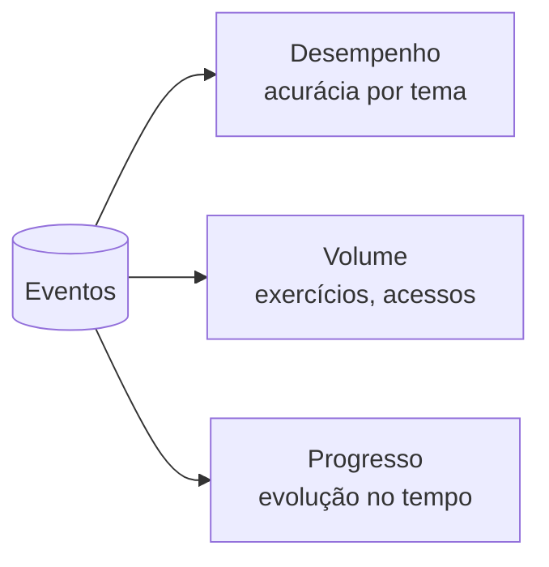

# Aula 2, Métricas

> Esta aula transforma os eventos coletados em números que dizem algo. As métricas
> resumem a aprendizagem em indicadores como acurácia, volume e progresso. Vamos
> calcular as principais a partir dos eventos da aula anterior.

Na aula anterior, coletamos eventos de forma estruturada. Mas uma pilha de eventos, por si só, não
responde às perguntas que importam. O aluno está indo bem? Ele pratica o suficiente? Está
progredindo? Para responder, precisamos resumir os eventos em métricas, indicadores numéricos que
condensam a aprendizagem em algo que se pode acompanhar e comparar.

As métricas são a ponte entre os dados brutos e a decisão. Uma acurácia baixa em um tema sinaliza
dificuldade. Um volume pequeno de prática sugere pouco esforço. Um progresso estagnado pede
atenção. Nesta aula você vai aprender a calcular as métricas mais úteis a partir dos eventos, e a
escolher as métricas certas, porque medir a coisa errada leva a conclusões erradas.

---

## Objetivos

Ao final desta aula, você deve ser capaz de:

- Explicar o papel das métricas em Learning Analytics.
- Calcular métricas de desempenho, como acurácia por tema.
- Calcular métricas de volume e de progresso.
- Reconhecer os limites de cada métrica e o risco de medir a coisa errada.

## Teoria

Uma métrica é uma função de agregação sobre os eventos. As mais comuns se dividem em algumas
famílias. As de desempenho medem a qualidade, como a acurácia, a fração de respostas corretas, em
geral calculada por tema, para localizar dificuldades. As de volume medem a quantidade, como o
número de exercícios feitos ou de materiais acessados, que indicam esforço. As de progresso medem a
evolução ao longo do tempo, como a melhora da acurácia entre o começo e o fim de um período.



A escolha das métricas é tão importante quanto o cálculo. Uma métrica deve refletir o que de fato
importa para a aprendizagem, não apenas o que é fácil de medir. Contar logins, por exemplo, mede
presença, mas não aprendizado, um aluno pode acessar muito e aprender pouco. Boas métricas se ligam
a objetivos pedagógicos claros, e é prudente olhar várias juntas, porque cada uma sozinha conta só
parte da história.

## Explicação Intuitiva

Pense nas métricas como os indicadores do painel de um carro. A velocidade, o nível de combustível,
a temperatura do motor, cada um resume um aspecto do que está acontecendo, e juntos te dão uma
visão útil sem que você precise abrir o capô. As métricas de aprendizagem fazem isso com os
eventos, resumem o que importa em poucos números que o professor consegue ler de relance.

O cuidado é não confundir o indicador com o que ele mede. O velocímetro mostra a velocidade, mas
acelerar para enganá-lo não te leva mais longe. Em educação, medir só o número de exercícios pode
incentivar fazer muitos sem entender. Por isso escolhemos métricas que se ligam ao aprendizado real
e as interpretamos com bom senso, lembrando que são um resumo, não a história completa.

## Explicação Matemática

As métricas são agregações simples sobre os eventos. Seja $E_a$ o conjunto de eventos de resposta do
aluno $a$. A acurácia geral é a média dos acertos,

$$
\text{acuracia}(a) = \frac{1}{|E_a|} \sum_{e \in E_a} \mathbb{1}[\text{correto}(e)],
$$

em que $\mathbb{1}$ vale 1 quando a resposta foi correta. A acurácia por tema restringe a soma aos
eventos daquele tema. O volume é simplesmente a contagem, $\text{volume}(a) = |E_a|$.

O progresso compara a métrica em dois períodos. Dividindo os eventos em uma primeira e uma segunda
metade no tempo, o progresso de acurácia é $\text{acuracia}(\text{segunda metade}) -
\text{acuracia}(\text{primeira metade})$. Um valor positivo indica melhora. Essas operações,
contar, somar e tirar média sobre subconjuntos de eventos, são a base de toda a análise.

## Exemplo Prático

Vamos calcular as principais métricas a partir de uma coleção de eventos de respostas, a acurácia
geral e por tema, o volume de exercícios, e o progresso entre a primeira e a segunda metade da
sessão. O resultado é um pequeno painel numérico de cada aluno.

Os cálculos são determinísticos e rodam sem o modelo. O código está no notebook
[notebooks/modulo-12/02-metricas.ipynb](../../notebooks/modulo-12/02-metricas.ipynb), então abra-o
ao lado para acompanhar.

## Código Comentado

```python
# Eventos de resposta: (aluno, instante, tema, correto)
eventos = [
    ("ana", 1, "derivada", True),
    ("ana", 2, "derivada", False),
    ("ana", 3, "derivada", True),
    ("ana", 4, "matriz", True),
    ("ana", 5, "matriz", True),
    ("ana", 6, "matriz", True),
]


def respostas_do_aluno(eventos, aluno):
    return [e for e in eventos if e[0] == aluno]


def acuracia(respostas):
    if not respostas:
        return 0.0
    return sum(1 for *_, correto in respostas if correto) / len(respostas)


def acuracia_por_tema(respostas):
    temas = {}
    for _, _, tema, correto in respostas:
        temas.setdefault(tema, []).append(correto)
    return {t: round(sum(cs) / len(cs), 2) for t, cs in temas.items()}


def progresso(respostas):
    """Diferença de acurácia entre a segunda e a primeira metade."""
    meio = len(respostas) // 2
    primeira = respostas[:meio]
    segunda = respostas[meio:]
    return round(acuracia(segunda) - acuracia(primeira), 2)


r = respostas_do_aluno(eventos, "ana")
print("Volume de exercícios:", len(r))
print("Acurácia geral:", round(acuracia(r), 2))
print("Acurácia por tema:", acuracia_por_tema(r))
print("Progresso (2ª - 1ª metade):", progresso(r))
```

Ao rodar, vemos o painel da Ana, seis exercícios, acurácia geral de cerca de 0,83, e por tema uma
diferença reveladora, mais baixa em derivada e perfeita em matriz, o que aponta onde está a
dificuldade. O progresso positivo mostra que ela melhorou da primeira para a segunda metade da
sessão. Cada métrica acrescenta uma peça ao quadro, e juntas elas orientam a próxima ação, no caso,
reforçar derivada. Na próxima aula, combinamos métricas em um índice de engajamento.

## Exercícios

1) Conceitual: O que diferencia uma métrica de desempenho de uma de volume? Dê um exemplo de cada.
2) Conceitual: Por que medir só o número de logins pode levar a conclusões erradas?
3) Prático: Acrescente um segundo aluno aos eventos e compare as métricas dos dois.
4) Prático: Crie uma métrica de tema mais difícil, que identifique o tema de menor acurácia do
   aluno.
5) Extensão: Pesquise a diferença entre métricas formativas e somativas na avaliação educacional.

## Projeto da Aula

Construa um calculador de métricas de aprendizagem. A entrega é um conjunto de funções que, a partir
dos eventos de um aluno, calcula a acurácia geral e por tema, o volume e o progresso, montando um
pequeno painel numérico.

Considere o projeto pronto quando você conseguir gerar o painel de métricas de alguns alunos e
identificar, a partir delas, quem precisa de atenção em qual tema, e quando escrever um parágrafo
sobre quais métricas considerou mais informativas e por quê. Essas métricas alimentam o índice de
engajamento e o modelo de evasão das próximas aulas.

## Leituras Recomendadas

- O artigo de Romero e Ventura, com um panorama das métricas em mineração de dados educacionais.
- Materiais sobre indicadores de aprendizagem e a escolha de boas métricas.
- Capítulos sobre avaliação formativa, para entender o que vale a pena medir.

## Referências Científicas

As referências abaixo são reais e estão registradas em
[references/referencias.bib](../../references/referencias.bib). As chaves entre
parênteses são as do BibTeX.

- Romero, C., e Ventura, S. (2010). Educational Data Mining: A Review of the State of the Art. IEEE
  TSMC, 40(6), 601-618. (`romero2010educational`)
- Siemens, G. (2013). Learning Analytics: The Emergence of a Discipline. American Behavioral
  Scientist, 57(10), 1380-1400. (`siemens2013learning`)
- Baker, R. S. J. d., e Inventado, P. S. (2014). Educational Data Mining and Learning Analytics.
  Springer. (`baker2014educational`)
